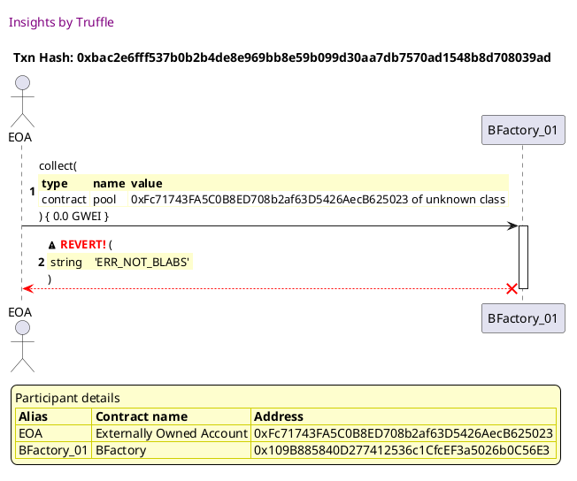
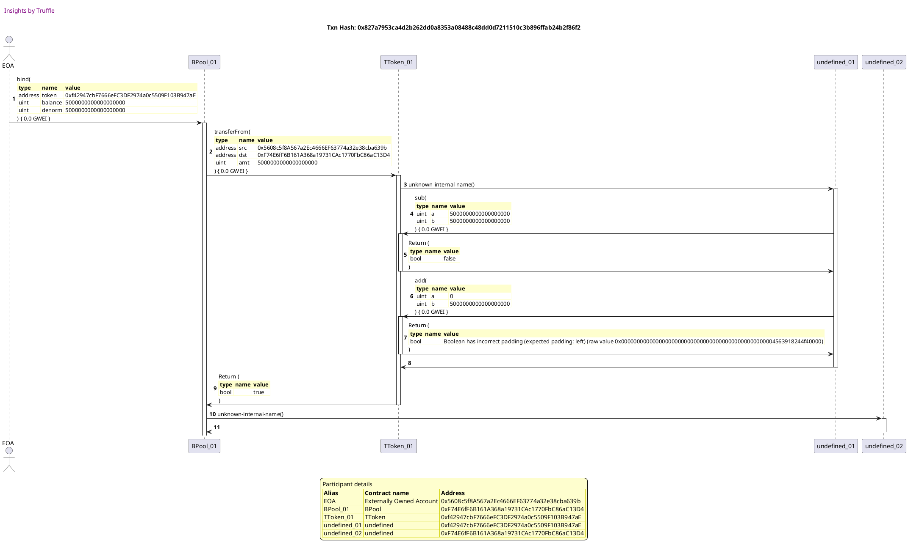
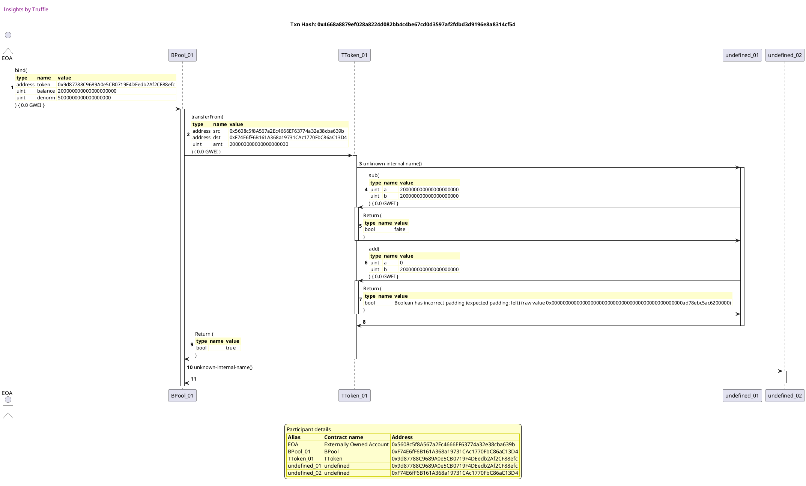
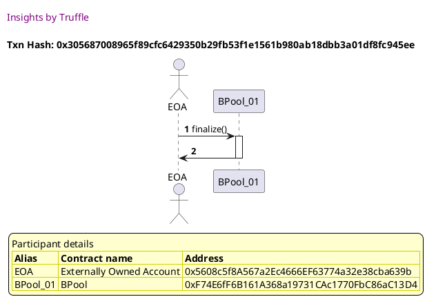
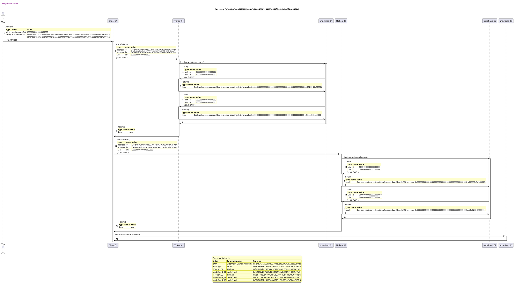
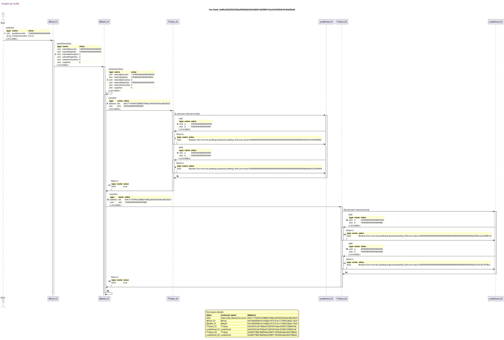
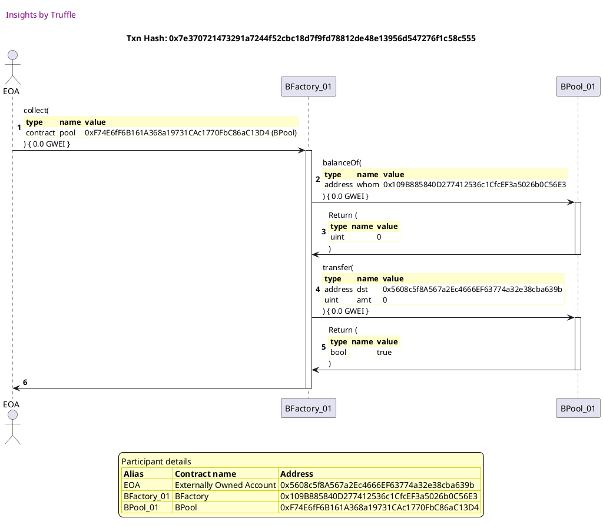
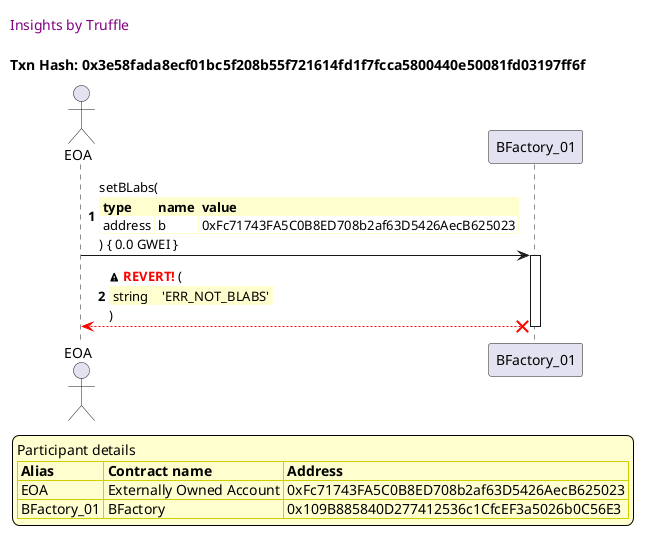
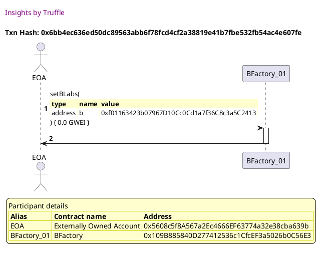

Test date: 2021 Feb 22

## BFactory is bronze release
[link to test...](http://github.com/balancer-labs/balancer-core/blob/f4ed5d65362a8d6cec21662fb6eae233b0babc1f/test/factory.js#L52)

## isBPool on non pool returns false
[link to test...](http://github.com/balancer-labs/balancer-core/blob/f4ed5d65362a8d6cec21662fb6eae233b0babc1f/test/factory.js#L57)

## isBPool on pool returns true
[link to test...](http://github.com/balancer-labs/balancer-core/blob/f4ed5d65362a8d6cec21662fb6eae233b0babc1f/test/factory.js#L62)

## fails nonAdmin calls collect
[link to test...](http://github.com/balancer-labs/balancer-core/blob/f4ed5d65362a8d6cec21662fb6eae233b0babc1f/test/factory.js#L67)

##### d1, tx: 0xbac2e6fff537b0b2b4de8e969bb8e59b099d30aa7db7570ad1548b8d708039ad

[SVG :telescope:](https://www.planttext.com/api/plantuml/svg/bLDjJzim4FxkNt43QMnb3ESzHLr5qoO3QHgeLDk7CI4dTag4wrIEGrle_lkkQM3jf7rO5Fdiy_dnFS-T2Jcl3DEcdab2M6rALSzIeKdrKAWvqsm6Kao5uX7B7gQwh1KVbhBKS9Z4IJoC2UbLPYL5dq3ptGl6XORdTWbmKUhYgLI6oO4ifcecb474tBm69BYvXPpNUYx5tiPDyIJ0SbzzruppGat1egthLsDxfsqIfBt_KbN5zDvKaAvWekiyHrnY2YC5J9OABbXrVmPqcRBC5dwUvvuJf3IrKvUBK7JzRfg6mkkcjDlb3cKiu6dW1PHnotF3DEG13QdJPPoWP9d1rEEh0R0A3j0U49JD55anPqWrIfg0rHsrce2TzG4XJJoSzFVzS7ny1baffSZCkrjrItgjs1zQsrz_0hEQ2q2hsAonZqpMEDc4h_6mCXe1OGtpifHew3B90YjmdMJW3MaKnYFaaDeizvsHvzh-G6IHRtlKTg3CeLOFgbmeo2IhgYteUtW6-f72v-_n9Qg-d_3ovCUX5lpdXicMqiaPzDukc5POhJxqictFO4o_qnd7t-Bnv4sdqpjj_7tu1qkeZDvKUmtu7yNZyTtNgybTz6KGtHorMH4kC8_YaHdnjxZRlYNNEzNWmh12LZjNZUY8KheH5DiJ2uIJuOjuBz8EEDTYeyFhEKnjKt4SbqPenQHSmTL22Gw3BCCtOlvFyJtWtOxvise0BTgDmj0BNJgoWy2rRC_nCskOPt7YC4JoKphq_7W3YCnR_kGSHtpTlm40)

## admin collects fees
[link to test...](http://github.com/balancer-labs/balancer-core/blob/f4ed5d65362a8d6cec21662fb6eae233b0babc1f/test/factory.js#L71)

##### d1, tx: 0x827a7953ca4d2b262dd0a8353a08488c48dd0d7211510c3b896ffab24b2f86f2

[SVG :telescope:](https://www.planttext.com/api/plantuml/svg/rLPDRzD04BtlhnYLIoi8hDUVgKf5ajh0YGegSQc4nkjrQjLPH-irJKluxqnS9tNQWXhe1IloxCVuvSsRzOmPUrTRDBQPbOnXOolTp59bM7rPw3aQd46ffafdOvINKrCrEfjKPMNWHH8dyIHcxAYsrwKwPj1U5mepPU17DmNuK9dYfj8Mor5PJFLCQKk8kTqu9BHv2pblpBnKMnjVYXi5ZhTPEyKiA_GK7Duj_MpjqPkE1El-_wEkY-c5hI6zXZFJv3dXCblOKi7PGiC7h2yEWIyY4M8uz5s9NYPI4OWiunYvleiyyg98UX4jPA5m7D_XqasZOP3dc0el5NaKv8AHPD8IzVZJ2B26FR9xZ6IpXIpcIA6EJwkg_CQTTdSzsNOvEwikbLxxR6RRJgIxoWkjihLVV-6thkA-gzXZh2K9W-CU7tZvyX3IGcVxv_gS7NMvVTNPu-LRiDTp1MGrpbhx7Sk61Ylt9L1IZAfhM89TaIVB5xadXbueqoGCWa0b4_Sa4SFGGovzdmyJXxjZsiTuZT4KH7q9APQe9I63pnzSztmpfIip-vFh0Vm0_fh3-w_nHpeglO1NuTz9tSPl3UewLoOnrUnVTQYDR5Nm0nv9Fuz6VX2YYAL7OiH9u8QaX2kK6yaK0tUOFaJ8QjiY9A4N1taIZ9t06Rb1XCumT9t9I3fXo9Dq4WKuSTmJxvusEBEx2DEJOgNCrk5gnMdqfQwkz83GbT5O3bO2x1-mUwwFo5etwT-fkOxaIMSXVRPe1uD3-AniOpJy7U-KpXYneL-EPTqjFqKfIlu_A_LVw3AcaK8D5rIT2YqhOvIqCEzg-xvQp6ckilNAOTim3c3Vu5K7oHTynylpwJrp8k5vkRUQ7pmjBwke7mZJAoFF9uerpTrPsIvKMmNyoQ-ZU8miOxVjd9tsEaQcB1PbtMD_maz8enLxwjgK9HfCg1qRwdQRE4RhMhLvxdZPDaAwBsvfbTVmwOh8m4XA-dImEzR4Fl2caNR37OjZ7-gkuQx7EtQiFjXMO-vDdmTIF83S8MHASvTizexkz8Nt2m00)

##### d2, tx: 0x4668a8879ef028a8224d082bb4c4be67cd0d3597af2fdbd3d9196e8a8314cf54

[SVG :telescope:](https://www.planttext.com/api/plantuml/svg/rLRVRzCm47xtNt4QBvsWuFneVanZ8iqIu6aJLE9b4d9ifukMEfNZi0xA_yurIxkqsz0wze9LnMVx-lMxpzUx4FAXDaoRPbOImXfJgMQMIKtggqBDcMOpAELKAZ5c_6gggqQ9k2eh3Q_I94tYX93ZsjoKyeH0Eoub4rB3hsu9yAdInSzA6LP6PJ5LCwaC8kPcuv3YuItalD7pKcuTV2r-Ih3SpTuv4w9GKx1ej_MxdO_VTIH8z_kVLLrCBqqDsGrCT9FdY4jCOKe9auM2Jwo-F0AwS3qlO47WXpAdDbgsxGeQs5dcSZUJdiy55Suez5bkvo8JZWYjq9Few5WkpqSkGScuGUh9MGIiXWES3mZAPWfUp1c6EZwlgl8xjThJzMBRPJAfhgHQ-snMsqwekymB9SNQhx_ngAkzwseV4DAIXE59Zm-yVdq4MQ74u49TaEFkRjzqyydoFPYRkGIS5PkrymzMDcYit9U0bw9bNSCIp8eypdGHYi3tWo0ElI2Cg1p5O-fROUgU9b9aTfJRSHe4CkThZAP0wal8MCaKHsImwGDZnrj8LUaP6gF7N0_X5z2t53v-IpvZilH2NWbm9tQhWD5CrRdKgQvc_wf4hNchmyYZ0H_bGJJoV6Od75FEIrBFyNsNERPq0funpmcp-mYYDYr2whk9bwVUsFAioC64jKBViUA8MxvFqomEF1PRpgcxemsRcR-hk2jDJuoLDbi9rihJg2jLNQiXuakjM3bSIJ0u93kk3mXRDzdpz5p7yiHyo5umuk7m2Bv8qsW5p-EUOQOX7_pahAoxxQUeXIdmpshz9ygCqP9CmINMgKBnIcl93SoxAZ-GYpckfLZl7BMjun06cbrta7H1znjC-87C-8XnxrQGmwVTp2hgUyBqoidBYM9qSvSjsmLhgvG_-KzfFqIMaDl6JivxlKD8mugoxh4_fQUeqOezzc-y9JHYRCmQ-zucZcXTipRVErcsBH6VYrjQvGsSNICPY3Z7bmYpPsti0szQQcVkMIJxK7UjTstlsRlwO5ijkhTy6KZx7kGU8UCrTvTDFk0Jt_N-0000)

##### d3, tx: 0x305687008965f89cfc6429350b29fb53f1e1561b980ab18dbb3a01df8fc945ee

[SVG :telescope:](https://www.planttext.com/api/plantuml/svg/LLBBRjim4BppAnREfKKQbBGaIZ9S8x8i8Jt5G7ClA9AoYT2KGL6eaoR_tesi6euEVEmiPtTcHSXz7uGFmy4I8eRGkU7GQ4_wP-EEmei3MBtJJgs5VDxvRd2gx6pduQQkwggi25dsuSNg5O7nsskXj8U_qnNWeVFcjND1sCAQdJje5v2n3PU46i4pvN7mHwi_0R_CgmOMNs9RePHnEs1q2hsF-_Bxr0IPwlzqlTdjGm_D2ppveMsHbmGJh8QdauC7qUyNG4yHJNYMKfhbF6cpNBQIn_CyIcWppzicYLgcMS9PasTKD2nJJHC9obIRjJAF4usSHCY0hLUF1OWUPhZF2DeMZ3H7WLBNswwploaRqV-N6I5Z9jojhe9mUxk0rZXXKVINh-GA-SWxFxXR027dYP3jLHsbWp2s9yjfBjzkDdH3ALsz_G0q7glZeKH7FJOCJXpqHw1GokiUiSkxrTke1TTJq1vxiI_m-CTf1OMKEFs043qbd6OI7IiIdefv9MFEULNpA4rZ4SrrbCb6y2XlFXDVl9YE8rMTnXLlQxvcd1KHpmJBquYLXMHfIkkcpBWeMRI9aGerJyh9FQxun_u3)

##### d4, tx: 0x3088aa7cc06120f162ca9a6c288e49083244177a561f5adfc2daa9f4d6556142

[SVG :telescope:](https://www.planttext.com/api/plantuml/svg/xLVRRkCs47tNLn3fIuBTj1GfKcIm3LQ-g9kd16s0lYnGK1ILg94fWv8QPpVzzuvasV4LY3S6YXPBsBoEZcRE3CSUp_jOrShLpQJmFDNKfMqcYN5UzP3RgN9gWWfpPsmwKFhXpfMDJOTbKJhqGpoEnyEnvtsewgV2N7geQ_T6fSQXh_qIeK-box-KjbP5LEHtTc9i3OXPlHI8uN0EEMtSj31h1x_bNmpoW-NUZKhJtDuX7_TRVtVZXvzw9Rp-_LUsok_kwmebJ-ZMDLa6k5wTruL1jpEBFgdg_WBX6SL2A1LgZRbFSEPpefLKN1CXJ22ne2G8_31KZFiPKsccIQgKp8AKCzWAY0UKwHfK7rz7I5Ne1COJ3sYhSvrF5PWwk2dBuW_iTwUBnRh8xMtvOEn2PhbQ5mBUJPPRaoxaLZTsuv4rFB8NZspYxHUbcwBqnFCwez7vvOfzwDsx2_HdcTjsu_Ip_UnzwEFbVJzUFl-CwgUfGJ1QDUd6lrJHmAGLVqPD3gz-HbC0Y2OGTlLrqwvzlDqMZoZdr1F8JDHi_aXrPTj7V1PAWeKaDAG-zoKB26KXbe9XBBW89Gu5euHBAGBE6Gzm-wKoO24J0SQXzAbF9ATIKlP-yJRKVOuBFiS-GryH_X6ZNtuVNq60hz3QalmI81tBjLEsoeoBNJdvDgRXIZbJLM1CvJJqU1Rhq0y36aTiY0TYF0gnI8ZAE1s1TJmoUi09muHk8wHLFKS8Wp7FOZu0IYBAXV8bq3ECDDmc72T3mTNGfwDWmzjgqlPiZuStULbXeYLcxKPqt3JsmPQFzXp0ZREgE6_jFptpDaHti5eroPl2LkqErGsfv5Z6dfzVe5zDtJYBlatj129i7j03c1bbqJtSzDpgqZcZQpJjy-wfcKrXRTB5paMNpC_GgLEFFIIUuKCRpp1Bc4nfGjhbMK_1Anm5MhpPKUoxerxP0iseqQdsXU87EAgrUekObQnsF59gjzWzsvStoVysRvAzlutxOfHinIXvVUOaEtazHkPa-5KtyaZs_hVlfAym_1ULE9Lf8lRUoTs-EaRotEM4xyxQqnAJ-YacdAOommSuQps1adydWQxzxNzrbg2xbFMyUL7ftQpK6QcfLLvKAzgFy0WuQhM7sX6y19CX58KEQgwb7T4YXowVktpkoZ7ePtErYYTq_GZAe4ZhjYmuC5Ul0Y_BkNvwOD9UXNef-nRp3YmBY0n2dSGXvzp4GpgAYGm3XJLZMCO-fWCuL-DriBNoS6Nv1iYNCd9DFvcAC1HYABcG4JPiEC2XB-DWD3PfGgAC36CedZEzLp-ofT-R8UaMv04kWJ3iWz7x27qpAVu1)

##### d5, tx: 0x8fa33d25f2cf526e29f383653361b5051d53f00174c2341f2df281019e65fa92

[SVG :telescope:](https://www.planttext.com/api/plantuml/svg/xLVVRzis47xNNq5qBmbQRoGbKLAG1PLbgyt3aA0Bq8Tr62YAJ8J8b45HZTrc_tjFikpOZjCaJRPrG0b3_7NyUFVTwUHpdDUrvSOsaz9nU6ChtKmoQPpwij1JRlW4bV9Swdp8nUMvgHgT9rLP6VHJEax7oTXn3cixB-MHWxfs8Nak3VhSJn5wMvdYKwKjB-EoEDSJgIqWAhiII65p0JbjpBIK6nk_5vya8jvgxPJdUQ7F4S7zqjzTV_XBhuJJtt-iw-BymjOecwCpqoW5k8ujR2dHsKoZjxo-E41u5YhkkZdr5HNAfqpIIBcXotpNPIJpiKzotrKOay0JrFM8ehcY8S4aainNFA8EK2Oig3u-YH6lqGleNpX0cor4CULWwl2qgig_CEbsbvCjaT-ulLY9z9DDaREpwbBgfSngjYa4hf6gq39VogqlxCQZ6tZqJZowZGUYJcSi6XojsOLUlZn0SbROTc7lW_xW7FPnyghlZwv_HNO-bGXwpITT_v6N3GnQyMlK573rDPe2G3o1SBF76gO4tsxB4zmOFWUPIQ4N9-gJfeNu0-5N2AC_5tBxw3F2FsFqvltu6A9cJUVEWYNjdGM2b-9Oloa-IWrGJxB3jjGEUScraFTQidxclMm3-557-ciMrdy5z2i22m9t2zHNV9fAURDpYz8LYVyofTyDfxjG_scURx91HxGrNDTAcc-Z6DAhaNKDT-Trfzii5G6aFpUD_GGFm_4em656kMBkoFSeYwKOCkfZwcuPmIVjqx-3Z6sBrcneJTf8N9rLZRxKrPKU0BWqcfU3LlkzVMTBT0SVTPCzATfuQuP_drEpvp9sC3X0xwHjZ4RVfdO6QGsKWTyGHf9hT06vkz2YCaOAYwRz5tHFpgOmb_bovQ3xBE-ZFSElUaWymuzidi_SY8JKyvJNplTx2XxWAD3YwOxwuQS7jbpYZ6Kk3zXZ_DHQVOkOjNJqVAHOirpTlolXqUymuP5ekuNtH1Uz5LtquIcFxcJaEL8UfVT_oRBdC_Z__JhnF0Xb9dmkM4iRyNQ-JhkTzHnfp_tXgmStcldIvOgmZ8I1Kb8yq5URgO_-Dwblypx7MPJcpkbQrPPBoukoNbDWX4TWTwi0LE10D0mIAAqDLAuhLU9b6boTExhkYbfupXRvfvoZaoiW1yL2j7zU7vairu5NHN4_N405tfYfb0q98x7BGawYm2L9B4WGu3HBGiOJuewyBQXbyTmFdm1rKsGlnnsOycZa1I9B0yQOJ1DtbD8ey3WMyBSmIWbsXx3FnvjW6yNuslG9a3T5-uP-KHu6GHWc4GkZ64i_6UA0HAat6iiyex6YIHg6KeaxzQEtz7i498HV7uJEQtWsa_8B)

##### d6, tx: 0x7e370721473291a7244f52cbc18d7f9fd78812de48e13956d547276f1c58c555

[SVG :telescope:](https://www.planttext.com/api/plantuml/svg/lLNVJzim47xtNs6n5n1Zi_F3JX6hQDDay5Iq8Uq5QN8SfurmdSfnHWlT_xvhcdOjspJ1f4LHpcUVxpv_lhiWT5axOLqpqmY9nbMccMNAelg-D7DXnGnhDL4c7mfvFx5LO_AuqfN5Rz8aJU84eOlQBRNg8zm-KoLoPV5Jfs9yLTdoiJ9Ew84k9sQcZ0EFXTiPfB2uSJblx5ohWuNFvQF2DDZDtOWyByq4Kz9DVM_bnViE1EhYNvkwd4nTZRCblhLDKO1Vv4gd5RvT67mbwkav9WkkV4wuHmFkUpqgk1S4HUZ9JD8evqMlo7aKKIzNGQIetmjP7WRSuwoWCena68O8A9CEe2VZ0HOrFW9vX80sLyfoBk2emxGrM7ubj3NOqvyPtbILtbbroX52hKjyrZ_SYazFpx6ij5RI7T-PEtJHtSVRJlPN7x1RpXK6QSIibT-4Rc2mDb_1PkCiECGhF8TW8CWYvK72YfGDAQC3dqM2zhXFuu6ad9CqYoCcOkgF0dpS0ZpP-3h1JvYy8_ZZb-GQxkCGPmjyUveMTIQqC5ADYzVXXWImggu1xyEqchMmAUaDeoYC0ZBoE0-e5_fCqhYGIUgBa7Wi8t784lyFS7VeVY7vxEmSVrAkiGQ_3cnJcZN1QvHTyB_I0vTYwaBPVsKdhrrBJiW8f6eH3KB6XPV8W36MfCm7eeJlAJ-IcM1-Bti6MSpS7kh_I5csIKPudTtE_ewrJLb0D8Gs3GhTx5LJhfmeTRqNVaH6X91rUEX3K6CmYBSbi0KosBAtszTVjQKDtuLJrWYjbtZyO5IE1r92Ctmfn_kEzrl3J-s56NtWSDj2kk7BQdg5WCIEIdG9N_WZ_000)

## nonadmin cant set blabs address
[link to test...](http://github.com/balancer-labs/balancer-core/blob/f4ed5d65362a8d6cec21662fb6eae233b0babc1f/test/factory.js#L87)

##### d1, tx: 0x3e58fada8ecf01bc5f208b55f721614fd1f7fcca5800440e50081fd03197ff6f

[SVG :telescope:](https://www.planttext.com/api/plantuml/svg/bLDjJzim4FxkNt43QMnb3ESzL5r5qYO32GrKgkt3c2h7iKj4wbQE0orq_ttNDElAf7rObFZiy_dnSyzT23cl3DEcdfM4iDhCLJtBX2RLGw4MJBCPb68gL1up_Z3LyrhbWtavrt2O9caoI0ZfLMPLYZw1vhaNB1SQNjebmCLS5yzpPLWPbSLKpOGoY2ZDBY35pItaejQBKhpQk2sU1LZkpdV3yhnGKx1ew_hPsDvfIuAqzr-ggfZUcmgo5OnrBINY4bEOKi1ugU22LVTTe4j7UA5aEGi5bzJAk2Tj6cQU9mFRyYrNvfOC9EVC2obrNIeyIaDBvjInpW8fVKbGCcwGUd8T0QlW0Eq1GTbCmOi5mrJZj0bOJQZL1Eoj3mXfuk6a_zeFnyTTg8I9hrXMlRjJTwJNglsXjVtr9p2hXG2qYiqQ-yZA6YURy3MWJ5fK5QmXmuykKnvOWUkaaJUWSPWC0qpJPj9tXfvh-v7WiMzxr7Qsvz_32z2F53v_IovHuTVabYVV3xN8VsnOR-cVTA7tzebfXPNfGuzl-mDZ-ftEAFcQZCPlEftUQUFlmpyIWiheJMNNWEzHCXfDlboF9_5L5DyUjQn8Bf17ySYC-5l8RO-IcptbSs5OKLPxLmtfa5AwqGvR4Ok1am7sc4QWdOhHR-5svv3QfheuBetGYfNb2gwVbCWXuXp_1_EV0ky3xtV7drK3QD6pE0ozqAL3EmXSo_OSdri3oPFKOOZaPtJW-Sa643DlyoVdEEAV_0i0)

## admin changes blabs address
[link to test...](http://github.com/balancer-labs/balancer-core/blob/f4ed5d65362a8d6cec21662fb6eae233b0babc1f/test/factory.js#L91)

##### d1, tx: 0x6bb4ec636ed50dc89563abb6f78fcd4cf2a38819e41b7fbe532fb54ac4e607fe

[SVG :telescope:](https://www.planttext.com/api/plantuml/svg/LLDHQzim47xNhpYwbuskcsJPibEwqCHnriAWXHNsKXWdMKfD7INOyfQqsN_VrV6oH62TxdJwzDsdCsFNRS0cTCkQCUp2odTBRHlMFbT-ZGqkeROBwyifckT5i-fycQ_gLGFlviMyo0l6hjgmhUsOGJ-UB9QsWTV11RXPDTNBoWUi9tMry4lh0o6wS4YOq-OUSjqrwzgUR7olNYo8-12xnxAi_0847q9_UdlrUI31XljlVLijda8BUWiFJUSSuR9GXTh2myR33RPFby0tIklO6YMLBHDUccoKA8bQAvTcpfInSH7AB1CZ6mkTEcqJ6JcTn6XYgtZg29EX2KIzk9i0jd16zeoHRA4orHgfrEcyJzZ-vA9FEFBF6ElpuM9y6eVpyqjeRPX-Gzs-V_IFx6fG--DWnxil4BPh2sGzBdlx2-kE5c_fEo2P6jksi0DD7zyuBeIISIGrJqSgdGcU6vwN0bCdLPuPYKaUnKBkpt-0L-2VE7pzKToImgVatjZkQLzS0cFxxc3tHpMNDc1LjqUiPtp6ENzZJKr0Cj0YfzTj2FR0V_AFyk7SUDVhIlCcsCPZNM_XxhUt9KoCeKuCVMc9ufb9N3P9L8fHOMAbL35NCarZb96LcT6ev4YV0X-_ot-l1nHyDCso98lvB28G4ILI6P4xKyn99XufpVD45QGLeyg7-jarpVGF_GK0)

