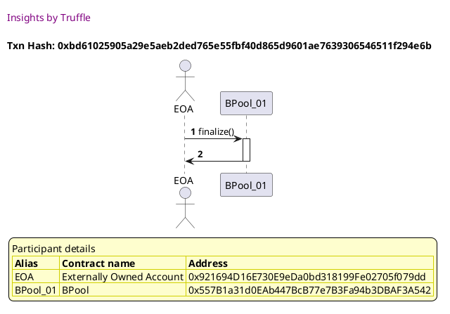
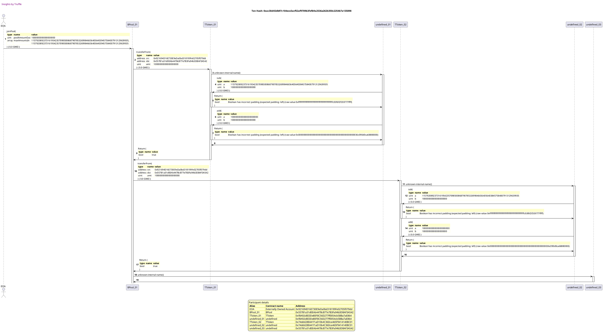
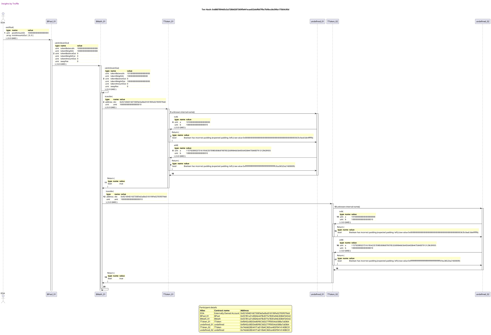
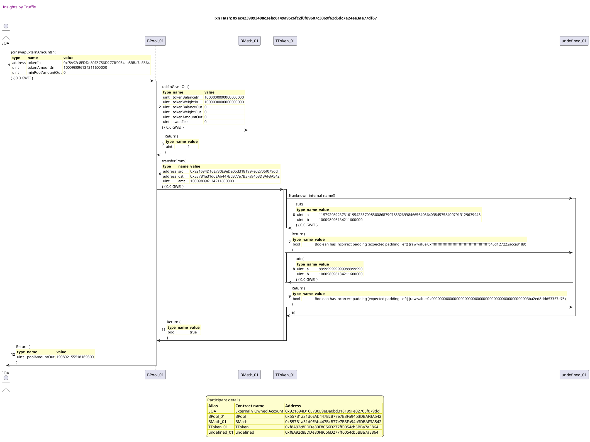
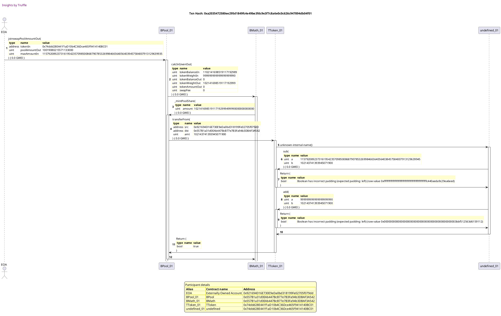
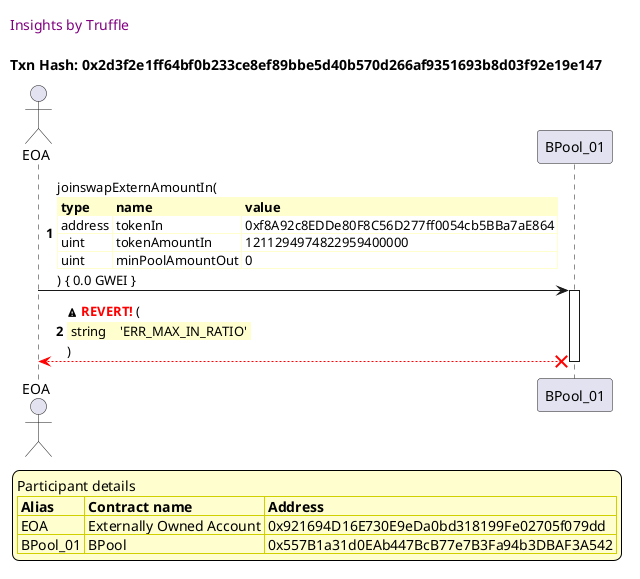
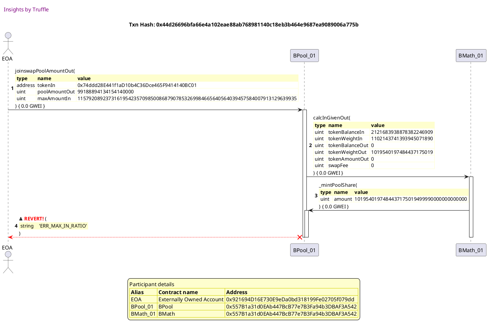
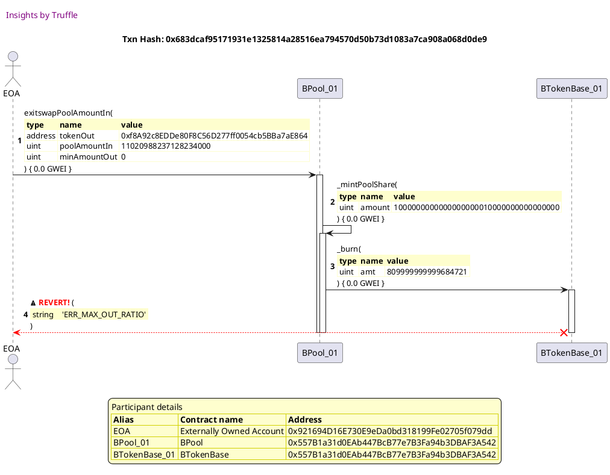
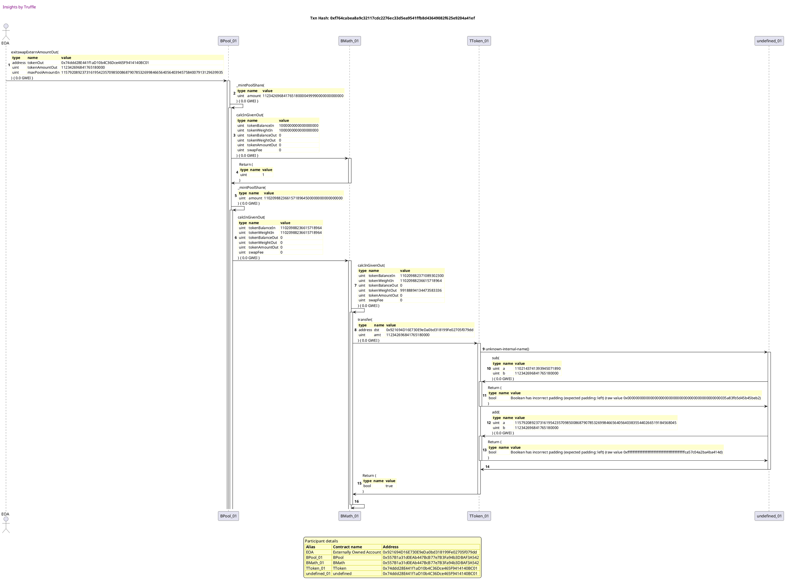

Test date: 2021 Feb 22

## swapExactAmountIn
[link to test...](http://github.com/balancer-labs/balancer-core/blob/f4ed5d65362a8d6cec21662fb6eae233b0babc1f/test/pool_max_tokens.js#L122)

## swapExactAmountOut
[link to test...](http://github.com/balancer-labs/balancer-core/blob/f4ed5d65362a8d6cec21662fb6eae233b0babc1f/test/math_extreme_weights.js#L155)

## joinPool
[link to test...](http://github.com/balancer-labs/balancer-core/blob/f4ed5d65362a8d6cec21662fb6eae233b0babc1f/test/math_extreme_weights.js#L194)

##### d1, tx: 0xbd61025905a29e5aeb2ded765e55fbf40d865d9601ae7639306546511f294e6b

[SVG :telescope:](https://www.planttext.com/api/plantuml/svg/LLBBRjim4BppAmZdqY8DIagY51gk4ScMa9vYeBaNbBYoYT2KGL6edIR_tesi6euEVEmiPtTcHSX37vGFmzuIeeRGkM5VWoVzYt47vTMUMjY2quLgNhQ-6vnUTRRpzAOggt9L4hBemyd2aj3nsu7IuEdVwKhfO-VDQ-U2iharMxS75v2n3PU42i4pvM7m1mkVW5_c5IXFBh6DqjguBULi2hsF--Bxr0IPwlzqlTdkGa_h4ttsGziYBmacMA3FHqSVLR-RKtQiTSfP92GJAf8W5DIH1fsb0eHewpPX-ZuLMgQCAyZIMCOi5KagE6yZcK1Q4xIi2TXw-PHJrTCPxZE2jWNJc8D2gSMcw-nlnaVq_sL6o9X9xvPNGNfxEwUjSSgYw2zVoHNoaNT-S3UdX9mdGZPNTJG4PMnF5jDSljsisPenjdpxGT5uh8w75JhgiM7gr1u-0hdM7dh4Bk-MRwCMN8y1FFPYJ_JfZmDDywR1wGU4s556F9N9cgTb5hDImbgnMiVydajP0Oio9bgMIQq_4r-yc8uZbH1PmLNCDIlpEacoeYco3B8YhfHCwdXTv5MSYoH2AjGyAISFkE8V-my0)

##### d2, tx: 0xac3bb92db97c104ece3acf52af9709b3fefb9a2536a262b350c2254b7a135898

[SVG :telescope:](https://www.planttext.com/api/plantuml/svg/xLTRSwCs57xdLsZIbtXstUg24CgacJKsxkOfcTtCz6LdEWA4GmF28w2nTzF_Ne6n0xvqudKwRRV5Dhfmz77qdQFFSophNL4ANLPPQbcYAdDLPO7KLl6GgBdG8WEfd4aLUI9ycEcyKj4uJtCDlflwKt_iMzPbKIvJUMM1vhgN8f8QV6c70BpFTV8vLwL8HsaoKvbKfK6Cout1r3nSGSuhFKzbxy77vBC4oDxCtOeeIjGC8DXE_Twqbp-qJbZj-wzLaSpkom84It2dgpWsk5QPbAa4Tmi5telY_WB0XGX9470S1Po52Deob4I4CSKYvWpoWCGo3hZ0b3W2EpWW58OOKpjW0X7gSjSob8MbSTs_6G5HW3FJdbc6jZ89axamM_Lkyppz1QBcwNhGDxcxon-aMjjiHdqZmxkC4oMZjLrtOZyUxk7XWtXu6--mATas9MUMrMmQ3Ayw-mDltbo0N_D4rHFddzGdwxBDbxTjU_Nq8oYNSmbCgqJMjB-9j3ATslm9L8bvzHEO6u1HPjAklAdgCO8xrtg5q5eiZKac5giLnRMgLo3AE8OknuGHv21ERKoe2QzB8NGTbt78N4gmmxbhEmvrR5Z_2BSfewuD8UE88CmTmZcXRzTl0yttTS5Ns0Fm1S3l8VZfP__Qv7U7rPhZv_neI2wrK4KizLJdsTSHRKwKbaLXDbFeqDpXWcFaS7k279yHw7Cv4J28278HvrC9COCqDdv7qIv2L9GD0gNCGuAW2FgZmBQP5tgCIUQHgU1sG2RUQ4f6XggjO8liG8ZXVcOwNDJKz8v4mqwb7bJ-g8O6Ncebqc7DmFd0sZBTmsjH1IVbhJWXETm_IOxD2uBNOseul00VP5bf1Rvkpu59qDLvy4nF2WNkZKuaAiorbc49vgrgdyl5t8nbj9wvQFuA1k1SYySM4YxYewwGazY9SKmePupLCuEMWXT4sNXnUfGXX8T5wPkF5Zpg8au8EOnWA1pNTUkP5qQhtlKECHrbV3rIIhsU7HpINlo_zdQvsCfH_7BjnNjv_KQrTozJ_mNjtH_bVxZs_XkYzPTexswq-jgB_nxjxHKTBnOOiizPorgLjDPjfyg9P2cIjEXuFu4Jmr7jlQbSJPHCPsnAKcqgliq-HclvtQoxUcgAGNDVhDnAb-3cqJW3Hc5OLoL7odmNU5DCjjqZzRuBzLnqhliDMEoEE0vTVpAHBfowO-fCS7so8QHs653F4qpuhcFtmNh5QMTu0kHp4TlpZzbH567NjsqK8p51CB37n9c4qdRebDl8VA0thhquu1_UyUzaIB83UKH8J1gsoMYzC_SgI_y0)

## exitPool
[link to test...](http://github.com/balancer-labs/balancer-core/blob/f4ed5d65362a8d6cec21662fb6eae233b0babc1f/test/math_extreme_weights.js#L218)

##### d1, tx: 0x8807894d5c5a728b8287369fb441eaa632ebf0d7f9a7b9bcc8e390a175b9c95d

[SVG :telescope:](https://www.planttext.com/api/plantuml/svg/vLXRRzis57xNho2wbmHjDbv4KGooe9OjjtaO4cm1-h0E0qLHYH2PCYIgSThil-z8bXtVqYLDktKjVU55Xn_F-NZyoPJdlQoTgbmpAJnFDQwqpIGnbLTVvNQgAZL1XRamDesKlhgeoiQcmx8eA_J3E1x7mzZpZcftKvXZ3tNbqgZKLEX3tqNeTLdbxqlhL34eyWixCTO1OkQM1cEuE8USDjMqC6iNVilV6qJyvTYPIjFSNY22-w6_klhefzu9hr__nDRvnQMhKNA3pgicom3NSxah33gVMVHQrPU72C_248jG-YdNN0aQ9Y4D1GjablW-CKe5Z9eamwd8f1A9JBGE3PDO4S4JgILFFQ1CEt0zFXqWLQDdK3_pW3QNwtog8DJeh2oBFp7fhYuw6oQ_A7UvDEaxwoRdv-MLiGkRPM_T2BR6PBarwS9kTM0t7bt3e_VYqKqyCFMwOD71yKfSwFdpGsHckMi7zjxQjzvHdoSl-lhuzcVaRgO6GMtLfAlVgQA1Hcj-YveSbhv5Km0OJ23Tt8c5Bi5RPJ51LPMw0PD9RkSJwjEcHVWTuHS8ep_cTlle0y8_OlJgJNm2IRFYSXV0WlKk0AqAVM9VvU-C1QWdXU5QPYDLAAlDFmMoEkMDQTFtCJFwHUQnVmJp8mPp-dORrDTgEZRcxieMeKiA_sr2ln9ATu3YBqtpdH9qFBjAsJeprQSn3D9QcRg6jTEwysqcAGcaFo91B1YEfHafdAICX4JAiS5KO9vX8TDq8mWrsSq7kIUcbIZQeDPagukhiLUslBO706yggug3rl-zVM_3T0SZTPCyATtKVHcskN79vuluuE0G_MfSKrdqQRud86tW3hmZQ1bbqIN8TsvrMLL6EpJjRw9xPZQ5laaN8uVTdNaVxLNgkeV4C_oemWB6jLIfvgcH6PHWlwVW0Ri5NZnzjmWNak9GKYOO2OZaFcLSO1boZCCW519k-PpHGChG3m8U-BZziD3t1Gzz30bD6A4oO58o_jtiSlQeegLMBE2KAL28bWBvm5rkezuYPaNJFXyfhbgCxj-dclIRK4swbLtquQf9TpBobQlcpeY_1zNSlLlVg6h-7tRvYwZczYwlgoRzRrHpVJtFcpyMyCvMJeofSIelwXK7HdW4SROEmEaVY8R648xr5PoQbwuC5Wgwd7TysnseuNisbwxY1frU0pbee7Nxv_cHEhiAl3oGzyqEYdCH4SL8YkC1dFr5f2CXZ8ZOM4a_OQDeC6O3-4biG2qExdtp2L1t1_n5kmFBme6aEen78nFYSJZamOWAaMKOSrydF8gKK74O-EjWQmy2LhfFWBnxOB3cd_3JDALXxFia8sf4SE8FMJ3InW_uMFe4NZWQjbxSun_TykyHa91-VH9wB-6xcHH_0m00)

## joinswapExternAmountIn
[link to test...](http://github.com/balancer-labs/balancer-core/blob/f4ed5d65362a8d6cec21662fb6eae233b0babc1f/test/math_with_fees.js#L283)

##### d1, tx: 0xec4239093408c3ebc6149a95c6fc2f0f89607c3069f62d6dc7a24ee3ae77df67

[SVG :telescope:](https://www.planttext.com/api/plantuml/svg/vLVVRzis47xNNq5aBmcwRAGeacAG1RLYkSr3aM0Bq9S20qLHYHQPCYIgSThiV-z9bXJR2R9vpji8MFoXu_7k-qx7i-UzhvsgN3ClF4yrhhJDF36LLz_bTg4gDKU5kJ4sZPI-kwdAngRdPL5MwATPF8lFOyyxhTr3OSuyrBLRer9JeU_z5A6FPPL_AwrJnQJ8R-pSM0SQCpSApE3bIkMYgHQ5sNZnH_xD81ACQrSgJNDxWmZkb_xk-jDVUoEy_lmBM-Stjwv6oGEwhfei0xsUorrXqFNIee-glZr1U6bqu5E99GrmgAb9D2U1L99fdca_mraeEHQQOYupxgSyrKBvWJ5K6I7IZ0iF8DCEJ8yl9qZLw03w0mzWSxdE5mfSZQxAilWJa-xjCDaI-QJSxIZIJpP5hg_BEsC7cN6sAGJKc2ot9XtarXSEFAyp3XsVhTc1thqxGN-LkQtlrI9UEbFPoHmuTXVsy8lzuftsBF_SzsUFlo7ti308UglcNVzL5GqCMl571FHKfgxH8tAjZHSMHdYPXHFfwp2UJas8P-4vurDVY2p3c0KwOL6aX8f37WnQcXpSwLKCzi2SO8nbY2KdDF09uRXjMtlckMsTM-swRDgbNkG8VKVu5um-V8ul86pMGEWW6N3l8D6gq1VsG_xLMD3ntw1OTo9IXRBQZ5vijPUsV3Pj0E-oepzam-cNTBuYy09ieq0R8ZDZNW5qX70pnewFJz3lnZMLHNiXsIBHdxpDtjCNqT7dAcNhp5Ipgfpl6yTrfRiObZxXCfWI7WkAOscc2YSf9I6HScQmBp3Bi91f-bn3MdTmBXaJ4L6Kf3YU944W8Xq9OKH4Pqe62Pr6ancTiC3VSblDtUknlyt36XWjDXjPe8EdiNUslBV7e1y-U5KSjn0S0gYReYy0MpV9NXIgrXF2XFHnA7qgAE54WikK2V2EOHpoK4WiGaPzBcKOSCvuWDiV3GCcM1XWG9bGuajEfGpOrW796qArTzmc4AAhk8rWP9H5jv2MSwlBgZBQeKL_cHsQvGBc9XrMJheRyWWTLkg-Lmb9TAUc0vOIN_Y-hxHM8GdbqVZj_2FDOCNUDCiN6lx_i8LtQZHHlad3D4qPXM_12FulsMgzVWRC6wRU9r1SDQm-oxwhkkADilnYw_Oc4eVO9umnoBLSqZ4uF6zLc7fNQpLGQfpAYthjz2cU0i3jwL1_0g4mE8V2ieAwRRHZCkJgST_POrVImNEvof750xgy1nBGHElMk1tlX7N5OqdO3tUy73PK3QLZFzn3rLE9EOntBDtMbMsKeclJNLK2lJt9tdjumd-K7m00)

## joinswapPoolAmountOut
[link to test...](http://github.com/balancer-labs/balancer-core/blob/f4ed5d65362a8d6cec21662fb6eae233b0babc1f/test/math_with_fees.js#L317)

##### d1, tx: 0xa2035472580ee295d1849fc4e49be3fdc9e3f7c8a6e0c0c626c947894db04f01

[SVG :telescope:](https://www.planttext.com/api/plantuml/svg/tLTBRziu4BxhLn3PIunkTacHUZ381hLZkysXIB0Dq4k1WY8fMnkPCYYgSThiV-z8bXmvJXPntTFIjlZGSFZDD-Hmx7blIoUignQvvudA5QPQ9DfwvMrcbiAA1ShrJ1ir4l9sPelAg8iYBopwRJgPJYucddTMkljSdtkeANCjbBReUzj5w7rXis-5SI8VvjdCBBHne35r6u4fl5ohN5PscUkj5n-pRneHjXcx5afbPeO8ReV-RUgpFriGNhl-fIcpsToLABb7DxPAKz3hkSpb6jsi37elolafmYlXOngmo0zYhBNF0qLYnbF9DEE9fgcI79wHZ4MeiSGoz4F9MHHpfXBCKamye4mwW3wv6Y9HeYEeZpoWpMKoMmemTNHT5FaNJ9gtNUU9o0VXvXkHjhCjSdDJt6hJoMnwsqBW6frcHgjEhZzmv7aDE7HotiE1thmvHVyKcIdlnB8U72x0m-wgSiUVpMVlh7Noxsrz_l0NSlTBZQ0sOj7KNqLUGQCMVq3W7QlB4ZqWLqEyDD32guWffVnumXX9YHWJdB0B6ewbPc4mvOp01uyk07IhfSh0cWUqxEE1Fi6OS1nZdmH1H0Yb6ECdKnPYjPxHh4n8474Vnzod4IKXuG7pQH1X7WSOns4SSHp50VL3pcCMXa78SFsZd0LH43EC8queyNb8EQV1Uga1-exm7nYz-pIvXCtNex8XjlDUGwmKkRmqxxAlslmqewrX3PqZaGiZTMiRyC182BOGJaX4kCzZ_joiJxe-2Sqa_ap1_x7IcdVyijRECJjG-BDG-jvyghNUWLEj7z_iCBtXTdSBVrc0adhaurnOVH3Jei7uabMieQnVNhCj7WziWzPPOSfKswaj5eUUizBAvenn7w2oCGad4SKJhiS29ugIc70-rTYFS932TbPgLuCg6tUiu52DYA14uSamOImQoL4KwMX4fuApX8v7moaTmWdQuMj35eqOeRm-FXZeUecQ7XarDrj1gg6dChUck3Cde5zR8_AJceBZWVT4z1bYooevpFS718tucQ31WYSB9B-GgfEJK_ItTfKrwEUCJc2B0XxuZg2bXK5pk3Ko8mjhjNHesTwrntgrXBvMtSXfSu4FqB4LTwrAl4htAf8nBBGINFfSm-sgrQ2bu1Lk1XG7k_areV1_x2syLw59aWR43qAgGX90DFHVwQtQwXrYUh7nrv7YR3SwUFbIRk1uwtpMk-wbJaexaULb3y0OZy7m6W2ahK0qD2uW7xMGxcsW3BiOkfbt_j1aWl1ShMDNVe-kxe0SD9IolLVsYTLznPjCictk6RItL7KPPziyGDLZPjgrzqpv-igsCjXUTr-LuDxMoTvRUC9Vcny0)

## joinswapExternAmountIn should revert
[link to test...](http://github.com/balancer-labs/balancer-core/blob/f4ed5d65362a8d6cec21662fb6eae233b0babc1f/test/math_extreme_weights.js#L276)

##### d1, tx: 0x2d3f2e1ff64bf0b233ce8ef89bbe5d40b570d266af9351693b8d03f92e19e147

[SVG :telescope:](https://www.planttext.com/api/plantuml/svg/TLHjRvim4FxkNt5hfRsawshU0gwog92GDH-sL5cqJLgdo62JiX8JWMcJDlllEmY9qacp46UVpu_ldkU0aAjIyq9NoumGNkbSLSj85gIyJzMA5tm9cLn89G8Uto-Al59Ya6Tv0QUZS1GEGa9wfTvaia-W6NUI2rd0Sxi4kCwBz2bNccT-bYxKKYgDY8a-18nmSmUvgefL9bziV4sV91ZsmNV3XKZL0WpQkluqjdVH9a7Q-yUgJ1TtkeHe0xEYIXB49JhLcOJPMi4rB-ykWQvDOIMcD9AaQqS9ZKpBYgKd4uz5aNI4JIF7fSBiTdd2BCVeCYlo1BKIXcUOD6oN86MnnjJ3YG-yX1Eq9mHfqscShZYM6jpaUJQdHhExNvmGqaJ2UV_82MTdb_0xJrNvo5VXMij2-KiaN8_LsrjrItejvUzRszz-1BrPIK2h-BAn3pohS5A7Rm6vAcHPmXPqVY_LME6ChXFFPsRiXSEXzEZ86pZTeUcwIKAfOyUH4mJSvQ7NjVSeLOfbj13xV71jc8PXCfkvjcUQp64shSS_XvQfgglR7PjKjQiDUGVFG3zG-FGz7AE8Hooipt-U5bByghdPaNH-2RtNZxnGg7mVUl6k_p2ct-bCms_XTFQgq-bTDFu-_8ShA7LHTyuMy7aJJgVpp_wF-VZBVEhFnfCtRLP4I1GqVU1Qlf1hzmsGcoDbXTGypSgZguPqY1JKic2hezuu6M0F5uXu4CZVQt8uXwdLtOFlHdAUPHkOF2efm8_ZchT6DMPY-zb3enkw5WsP778Q2Slm3CP6afekTHBgCY5U0X-whvqsK8xZ1WQt3453Fx9jDuW3rvLkO8quioDh6FWZotTi4w6mvhPoSeLl_4Vy1G00)

## joinswapPoolAmountOut should revert
[link to test...](http://github.com/balancer-labs/balancer-core/blob/f4ed5d65362a8d6cec21662fb6eae233b0babc1f/test/math_extreme_weights.js#L286)

##### d1, tx: 0x44d26696bfa66e4a102eae88ab768981140c18eb3b464e9687ea9089006a775b

[SVG :telescope:](https://www.planttext.com/api/plantuml/svg/fLLjRzis4FxENy6bmDgboqgA55y2pwXiowq_j0dSO1sm3WObqOuMcJ8aEd5Qxx_t92kUaoORjj6s-7RtyExXwJ52hsjlAhzU5WYPjI_TUfdO2jLNkLkPoYnnOHVMPGEJNYsgSksoOLcK5NusZiVnC4QeL_lRmlOHRjkbDPcjy9TkYl7Riie_bywR8YhoXLjQvm5nxlS6OzZSGQxMrQgmzpO-v9yjfdo_TcwoB7SBJ4ctz6VRzrvrGQ3k_8chyyMbht5oYo-gzNmEkCZdlh3uOkFmMrDVdcAouJmBXD0YcHiXB3UK1DPOfKmYXTAAKavIgcp24YwurK99QpHHcX1Xf0mJ19Ib7aAFpo9iQdm4_H42sdoUvYi3gGxEoxAO4ThktaqUcBmp_d9lqasE46h1y4d_m0-_V7cA_oXpLz-OLRCOBU56_DdQl_ZaFg5UToa_Tdr_-pFsjokBeNTcsVRNfbZ3e37VOc2pidMDjzYNLzPD78p8Hl8iom8LSqxdr8meIVYGYL5gkGZ7cbFuaC4G0kvGrZbaiSMhmtXWhZLLIe4zupHiVA0zS5cQpSwZFPdIKEe0w0sOP5HG7VA0XP9e5HAYW7nDf0fP8BHMN8XGSDBycEQX31NWIqqP3RHWMhDmTzGF-0icFn7yvcCyWM8veB8bzexjbjZK5Ed4lSclhVlFZ7Q9jNGEJ65SQjlS0XfGePXcIad5L11meOb-pEkZRIgt8uG4b3C95EecIo8frDxV7BKZdZmDkpEWfE4M7f8h3lXKXZ1vpElmFX_2DZKujlQldM-uthFxRH7FbW3Ih7ouD9NzNroRDiOdq-8Q6Zbi_rGPcvFVdbKs-xs9UlSEdfpYtlStfdAWFNtSItSA23Rzu-Df_4iylVZk-BZtgbtluoUomRMl6ktQOlW-ZwVJsRlerzda_MmQNKpEddTHeSo2fEJNnjj3mRYtkjU8nstHJh7H-O78PDQRlAWFmXgH4N3Ha0p23D83Wo4eRWM8UxgZEttO-q4QZTR1S-DjvKnHtEAp6sSp7ALfTmzaew7ODHzH4Kj6Ocr7XYGPeufgFROaa2ISmykQPVU1zrhP3LkeC9G3QXZDI1mbdCj1Ef3IoW4R6yqJDXf4OnQ1K3o0kjFKRlXleO2-ZaJq6fxmv_WL)

## exitswapExternAmountOut should revert
[link to test...](http://github.com/balancer-labs/balancer-core/blob/f4ed5d65362a8d6cec21662fb6eae233b0babc1f/test/math_extreme_weights.js#L296)

## exitswapPoolAmountIn should revert
[link to test...](http://github.com/balancer-labs/balancer-core/blob/f4ed5d65362a8d6cec21662fb6eae233b0babc1f/test/math_extreme_weights.js#L307)

##### d1, tx: 0x683dcaf95171931e1325814a28516ea794570d50b73d1083a7ca908a068d0de9

[SVG :telescope:](https://www.planttext.com/api/plantuml/svg/fLLjRzem4FxkNt5hfNMZwshd1ISLGqqWh7oOg2XxaTO9cTZGgC51ZjD2o_xx74WHb5NQYnNvxFFvyUCxtmMXyrmpfOjfYX0hT2QBwKWebDycSiOKcq8g9aBoaCMt4vKLahUoD5Dms8awKIj2g97hHIgQ25RjHZ0k53nMKu2BJ2KFcTGi3T9a8gT2QeCurXk3ZbbSGyuADKl5pi9LyY20E1lT9UCyaHCWk5BzNCd6QKK2LUTtPPvCRdGEemKCL34U6roa4vqA6CmbNB3yvWpmlExPF6PZtoMK-3OHnBPSZpZCybnI5upwZainT_68sfnWpsOqPZxs6Avx77FX8-EoM1lgKIy0biE1aGV8k4qdSJ9ZvghXPPQbGqnMgq-JPoQ3x5R8aELYOxUjEK1e1GidpIq4E3u-0p5FT7xFPgKoc9hOwAvySoslKQEAphjADfSVG2zc0eoKRBgITomjpA0qNu9ngn9v3alGvT6zGfiXde-zmBTYBsgtXOSxNikjjorAnsECNISUkM78A8kyklC4KoIot3ZRucEcX60B-vvdsPHOfdSmnizsJ1Evtb2Tl5v-2u-0tsFu-3NgcaXltNxV5qC3eKlDrGrJuj-yK95XAoObSRpVzdH_H7Kde6k-eqB9_wHPzXxsDwtkETGYBn3QfJ0_-Nwe1FzHibk_hfCpQBo-PqgQ_6f28rvdkR5frchzw4lK7xogrHgdAtqJNc0EkLPbVYx1V4THlp_y57mRzZuFXlrWqEqTLTmG5oPlaZkcnTvhtrdQ9CpljMXTcz3bLZfneLcIvblashXjubIwrPGWarzcq3ArHHd4ZOE3fmJOx3ENARFQz7Cjb6Hfke3UlHGSWZYk7WYU-nQf-qwRr2DguyWNROP7t2OUyVsEm1R5xXXJd_DTu4rLg8OhADUb8M4suJWAHev3mpYaLD3GxZ3V6TdjCEZOWUjOpw1sgiVs_6z1ZIChTw9pqviVmYy0)

## exitswapExternAmountOut
[link to test...](http://github.com/balancer-labs/balancer-core/blob/f4ed5d65362a8d6cec21662fb6eae233b0babc1f/test/math_extreme_weights.js#L296)

##### d1, tx: 0xf764cabea8a9c32117cdc2276ec33d5ea9541ffb8d43649082f625e9204a41ef

[SVG :telescope:](https://www.planttext.com/api/plantuml/svg/vLTBRziu4BxhLn3TIu9kTadn7MI3sh7Tvh18i0tGIu62agXOY4mR4jKuRVhVToJBZkmacxXEqG9BF_ZGS3Gptt264mHlIcyANqto832Ldxfg4jaYAAyoDpE5cQ3SNbgNz4ryTLbCAvUSJFDfWNuR3KV3as4G79N-9hV70MhQs9h45kXhEqNetRJ8laoTDtalpoxTn3eF75E_8XZ1mmNBMLNCShlsu7tsnIB2Lcld9aaoTua8RfU-DVtHdwqGGVl-KrTcbsDVekW6NHHLcWBVm6S-j-XYxj0xKuuF4PwdKh3OHDOeesCQ4YBZ90v3AMnCQSAjqPoHD8rKmgXW6gim5I6tEiJCC6BJ04mMUn1zUDP3faIle7yLWDby5cSp0whspwVJ_1CcpTFbP8FaR-F7Av9siavoSJ6zicv9ivgj4m4qDisSJPPqtOLNGT08XmwEEtAWrwyFaPrdlhmsi-7SsyBr9e2nFwlytaVtCJXgOVwzxOzl_qB-PcOHzCvCclwpoIiOrEIt2F0fR5cYM-Hh8O4F3F5SiYH9GZLaO4vY1WH7x8IAGMoPu2FD27nm_mJaRjbKcVDB7Yk9O86GaB9GQA4OaO8JXQ5jR9gOUQtVOjkfQtPn2PWf7L99YI20QaYvn5fnZ9LGKcEfE0M-MZ4Xk62u_b7DkEIAOImreIJKWcfD-U9r--WhmdzWzFR3y1Iyi6FJ-nR-D079wfNtOrFOxpDigvnfj7hC4an3mztsB66NFjS86viyFdLliyyDUZi9sy3NDxbniLq0WU-rXxPyiFNXtMP7-vBMtHxd-Hy4NJVR9AYFnyZQkoVt3BeouJhw1mU7w1_hgyAXdInPMw9zyyzmDHp2ML4X5G9E4b5QCFu8BB-CfpqWyrEkzimjlvYl_GIJIWAnbEAGFdryVuXDjIPAAKWRb359kQAKYXzivhkSszZP5yQLgIrsJP99kSYFEYH2im4HGqdnKDk1mL52YI9QZomE9UOf9A4akNT4dqYAcqfrrAYrMhiXD8fLxifDhzq1y8VBWCaFQWNs8EYiapvWahAATWithRiGHYKWg-liYskFsKGkUa6LTuxF4OItHNpkmyWQXyPmzSfSF2qA6tiqQo-iUtO-WxbDbYk7pIru7-qLvhfbYUTugqQvKJIDUC9u15yRXVkh7F4aN2352y3rVVSgHJbd38UmHE0eCouKPlp_0tEwLOiDbp4K765a67m9Ivu9SwtrFSDqmjhB6SKNozNzn_DJ8qwmg2Q3yqxXabXlihpi23300m2w5W2AHZ0q34wW6YoWs5g9qbi6qTM-uzkc3eF_-I9uvJVex1gCWtfntDvbjWcrNSQhEguTDgmubtrYA4dmi1T1Akh7VIcjxDEHqIoYWtvlH7jm9ZPOBUkzThW3gxkwS3dUijhgCbkh7plJRLa2l2t8mHluhoRvlm00)

## poolAmountOut = joinswapExternAmountIn(joinswapPoolAmountOut(poolAmountOut))
[link to test...](http://github.com/balancer-labs/balancer-core/blob/f4ed5d65362a8d6cec21662fb6eae233b0babc1f/test/math_extreme_weights.js#L296)

## tokenAmountIn = joinswapPoolAmountOut(joinswapExternAmountIn(tokenAmountIn))
[link to test...](http://github.com/balancer-labs/balancer-core/blob/f4ed5d65362a8d6cec21662fb6eae233b0babc1f/test/math_extreme_weights.js#L296)

## poolAmountIn = exitswapExternAmountOut(exitswapPoolAmountIn(poolAmountIn))
[link to test...](http://github.com/balancer-labs/balancer-core/blob/f4ed5d65362a8d6cec21662fb6eae233b0babc1f/test/math_extreme_weights.js#L296)

## tokenAmountOut = exitswapPoolAmountIn(exitswapExternAmountOut(tokenAmountOut))
[link to test...](http://github.com/balancer-labs/balancer-core/blob/f4ed5d65362a8d6cec21662fb6eae233b0babc1f/test/math_extreme_weights.js#L296)

