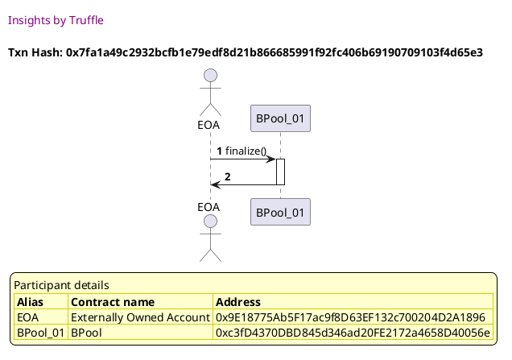
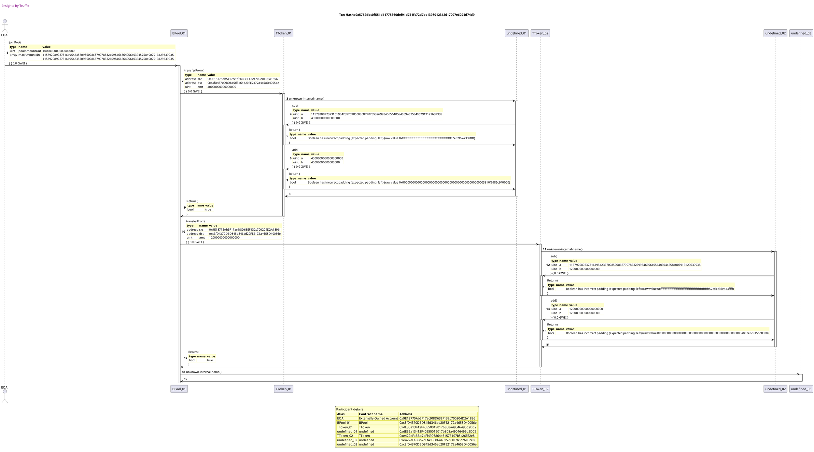
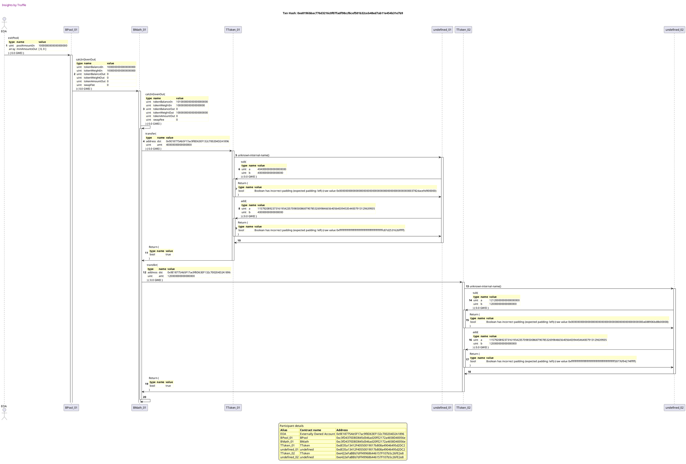
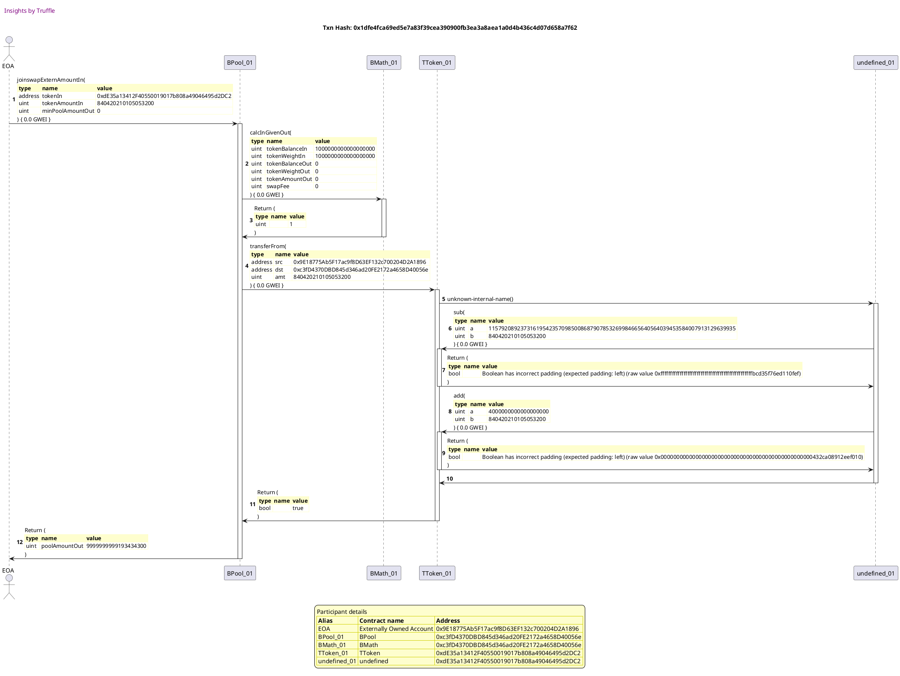
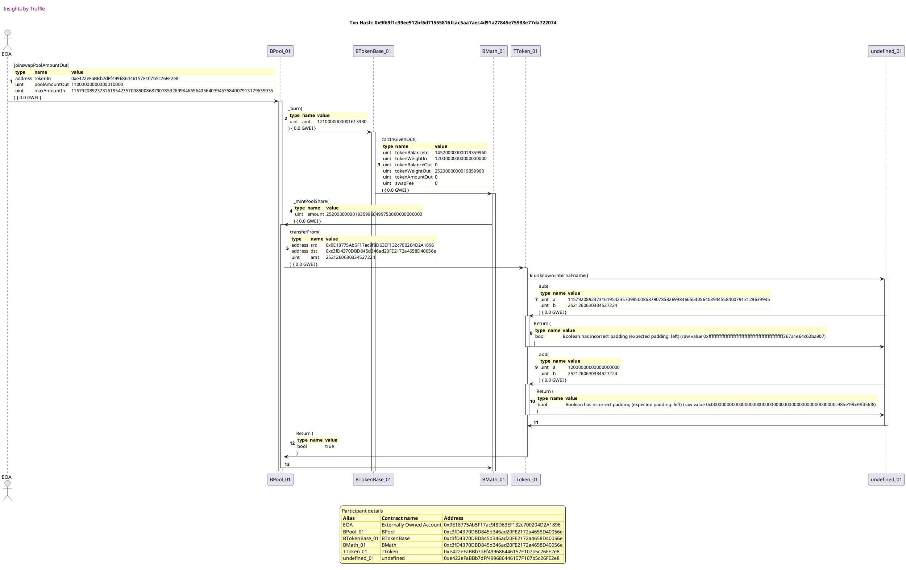
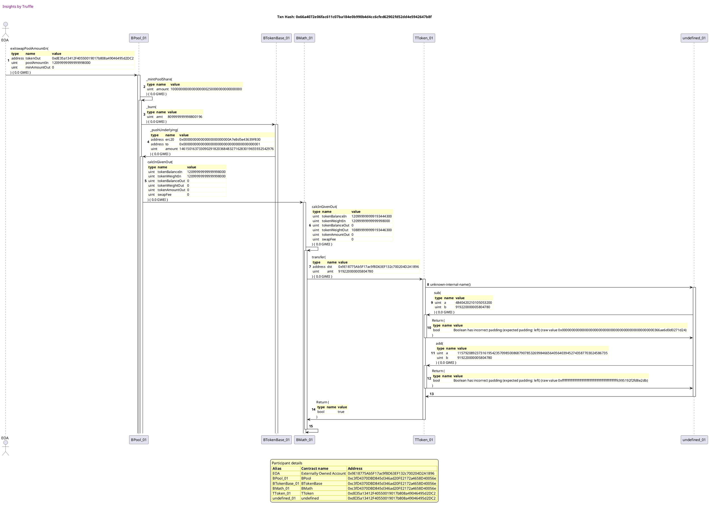
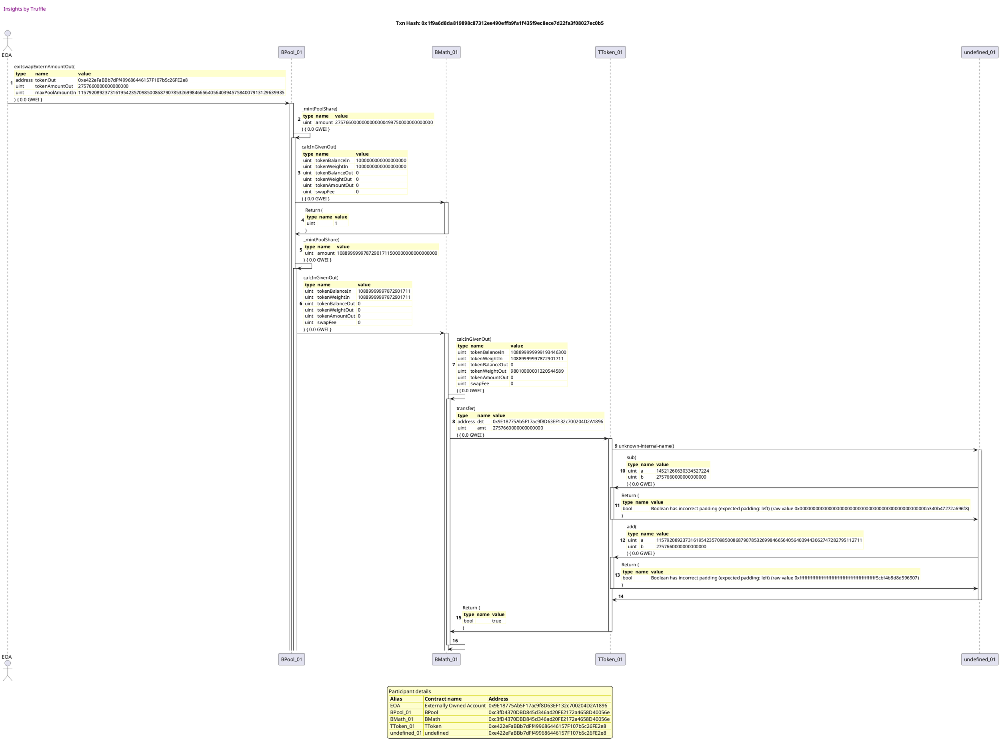

Test date: 2021 Feb 22

## swapExactAmountIn
[link to test...](http://github.com/balancer-labs/balancer-core/blob/f4ed5d65362a8d6cec21662fb6eae233b0babc1f/test/math_extreme_weights.js#L115)

## swapExactAmountOut
[link to test...](http://github.com/balancer-labs/balancer-core/blob/f4ed5d65362a8d6cec21662fb6eae233b0babc1f/test/pool_max_tokens.js#L156)

## joinPool
[link to test...](http://github.com/balancer-labs/balancer-core/blob/f4ed5d65362a8d6cec21662fb6eae233b0babc1f/test/math_extreme_weights.js#L194)

##### d1, tx: 0x7fa1a49c2932bcfb1e79edf8d21b866685991f92fc406b69190709103f4d65e3

[SVG :telescope:](https://www.planttext.com/api/plantuml/svg/LLBBRjim4BppAnREfKKQXDIRXcD4jYIafnXexWKbahOGcZ8e2hNJvD-xaLN3qO6FdUNixAm8UUozS7xO6qB4u3ixx6lbIF_QseDmOWz6RPMLAz6yRbqtMBdkJEVWfYghSbqIikZzoQWbWV7RAI6LWx_J5U2fS-rRPxqmkMctTg-iHqRjBmaLWcVAm-0EHdq1VhLl2bXqYMs4bAtT0gDJw6FS5_UJ23BL_sdxThlpFTGdU763riXBVEkDWfUZXIVHx-P0ZwaMJ4Iy2NWOr8skcKgvaZgJ0Qkp94coc7EcUQ2RY2PrmXcdAUMCXZgIIQn2WfOr7gMNppc87cQupmZQvjkcFGXiTRNfElERiX7zVvaHCcR2tV8g2BUtSz2j5GQR_lQTN26VUUS7TtCWv3mHihcg8vKNhUd9OfhBZvk25fJIvVi3eF5O7GzhTDIXOB1Yhpu3kPHEzOXTtYtVnrvmFNhbK8ivmVCVgoJaJOFJzmZH8ozPbgPnNiSLIqN3TLOaOLcnC6XIIWCQ5K7ECfvy9RvuCHr7gYRKHHIcj5WLMHJBC4g436XL1YmDH9J4MH5H6YSebs3FK-Va4LVyO_y1)

##### d2, tx: 0x5752dbc0f551d11775360def91d751fc72d7bc1398012312617007e6294d74d9

[SVG :telescope:](https://www.planttext.com/api/plantuml/svg/tLTTJ-D657tthnZH5z0kxNoF1r6q2OcxF85QfBwiL8tjCRWuusXibx1B_tkl7ISa9978WhGg5dW-V7ryxxbtJdI3u5DL6rytao88J5ENhfd4rWVLNUwcnfi9AkoDTUdG97StlcnSUbuMfKS_HUDeV3uEWjEgVYZiMO2wwzQQr7hqhLyYzBdq-TVIrQOO5FcDcrXN0s9MBmqYU3Y7d3P-MjYr1t_aNoqYVBbtPT8qTpU8u7xhtsuy_QLt8kY_V-6g_EQshb3yWAvzasM06zHvNLXqFNFeiwbkJn2U2ILe6YSu4uAaX2WbcCIfpJH9bI1PecYgueGm7M926Q6IA8oLbLJpLF5K1q1PKeFhuyi1CXKwWF4W0DhgFCcd1a8TNfLbyHSctTF5Ojta-hgyisvXiroj6m7lDikTJHTsgnlRyUWQ7js9Hv_ZxJPbpqtPGH1qGQFZivNuq8SF9-ZlCdVjnk4NzoKuxUlbOp-UFVwAweUfHJ0wC-d6VqpHmAGrVqHD3fz-H5C064oWxEhBfbqJl74jtZ3UcmSmcPZP_8tgmhLl4A4qnQ6cJ34YYHQSCg6m3WN6eGoLnYeKZ4gjGowba1ot_qnpg8wGGxurWTHhoRHcukFYQwZxUrlmEVOH-eRmpnZzzkVu0kfxXTMMuwVww4YklN5LPdtaoydt4GqdojkgWc0gdy0Tp_IOX70K1h68Y3A9piAHPEE8C9f0-LFCHtH0GYqt4TAgxX0IbequKtWq78LSf8nBar8SZIbHr70fmX64BkJpP9j9U-VR4_oSbXKYMbxMpaD7JUFkN7dlZW7RUcUAupRymwFWcUaMKgicVbNHcjTL1jjL6SiFn6z4q_7n2VhTrertwFi2Zg4qvoTX23Dh7Be5XSXTKdflanfDUxq-jBCfh6sws3dfVWIEqA4tzpqadcLxNeco6TPI6IRZTdtKK_2258CNhquntwr5xpjFUC-BXGHd4Ye_qHqRBynJ6_K6CIjg-7Qar7wnUxHBR-cxrLj2zwjGkb6XzEM2IxUo-cC5buiN2UwRyFG_LroXafGaJ5h3sKx5tPxZjr3SpHHibTptcAbzDTU4Z5gMQ2AWlzcbkPkPMjTS-cCqTwt1UB6qi6tE1i6yVGskLZgQrDOcBweLxqTu11ortaEN2bc2oJcqdnwwksKSWuNiBjyxU-mQFxZFvcuL3-Zo7fn1WoHfEv0zvNqLUDauzjCzTNuLwgd1NCmxi7JCX26C4ng158984es9YaCS6gunbroBb8xEwJhOMYEwidm5v5F3kkQVvPJQo0o7iKgZZ6ijGycv19cF25QnIAY4o6suqp-wuT-h8Ta6v1ufWJBiYp7u1FTcKlm7)

## exitPool
[link to test...](http://github.com/balancer-labs/balancer-core/blob/f4ed5d65362a8d6cec21662fb6eae233b0babc1f/test/math_extreme_weights.js#L218)

##### d1, tx: 0xe8196bbac776d3216c0f07fadf98ccf6cef581b32ceb48ed7ab11e454b31e7b9

[SVG :telescope:](https://www.planttext.com/api/plantuml/svg/vLXRRzis57xNho2wbmHjDfAYU0coe7PijNaO4gm1-j0E0oLHYH2PDYIgSThql-z8bXtBbpPkihNRX4IywF3ZET-XFllOyrwMJXUk6kMUfoitjjKeCeLNNcTseWizGhcvD3Rfw_ZwiXXNDZaPv-C2_HGEm-79qFEEIdURcsCFDTULqOafqATsYD3hSP5z75kdyrwUNTgHiGuGKxSm2E7X379I5PFST1wyoJuQHDXYxbmdIMOl4S7jrEUcFVgbTS9hzp-rPNPvvKeKtQABeafJmFLSvdA3BgOMlTRbrI72KoE9ub6aOo5uubF2OvnYaUeaLJAEKnwRD90aycbi8YPD8dH4Y641YtnYHAGye2nsuFhmh8TqYPv1-ym3sbmMPnCDeVRFn-FyJqoQf_F1YiblsbqjJDf1r-JYOdnjxDncCUeQGMfCcbcJpEsM9pRZqGuUtOf7L_70r6k2HGV7It6XvyyFaPbchfxOUs_VUqVjENdHjiTtlo9tEp48Mgj7JVj1vnLqQlCxL6MmzHsQ041l1CVDdLeO4hnspHVeej2tO3BAx6n1ULRL2EyGVe4m-cDcjuy-8VmpHg_U3a_Xq2ovt0GmPxq98DPvV6fVPH-C1QX7XU5gPliwrpOsNmjaUSbRKn_VNLQqcynY_mBc5mncz6qsA6_q93Jc_iaQeGiA_sb2Vn1ADu3YlvlcUoLeU7Q5jcLgYczZ6AIrC6K9UoTbuzjK3OaK8kX5GKY4ZbKg1zmVXWJqK61CCHlG7f6AhmIXH_MTRUPYDQ2b4Eg8EfhL15NPQpk-iGU0RGghyuFQ-RrzRyLq0nrb5JtghEac2lQLd4PF5El1mI7wtRYgiEZRl8v0qS0N-Ej3psYBha2rCnkFYyB43atQpyuzCvt0s2JpcSFc0taVxHNwfeN4KxpZvGj94nqRbQXclDzIy80yWHUFpXCXWL0KIqLzuHDELC2e7mYiP82nv58eB6JWKwwKP9m7dE7wtrSiy0C6-HEA-8GgxYlb1_-F5ASxNh4K2Gs0NSgRyGDJN4UzHioIZZqTAQwOp-vlKqhw0oebeRkTBRfsjkZ3fP9kvECff9BGRO5qNgGdYVPVBfQQIwamZn8PRHVBpPdwlc89fGz_W5Z-5tEygre62ehAL34gs7QrNCznLotfzr7BxdwUD_i9m3jVgWuJutIMbqiE3F004bqx09K-40sT4oZX2wYG5wxqvigvM7TyrnJFS9_EH2k_HMStG0xgnN7zHNb7VLq6NXJVRRU1Ylrqm7o11_s1P47YCwuJYiCX9O9gnWCvW0CUSBC2DI_Is-uZeEwB-Nc_0Kk6Vg29pmWDuNM35v4eJ4GaiTHCONZjL93GmGdjWdMA_gNX8o3lVnpe-6SOfIRK_NuaaZ1bId796UCW9I718WfYoY5o8xVwHzVysm4IZbzx2BsNSAz6-Ly0)

## joinswapExternAmountIn
[link to test...](http://github.com/balancer-labs/balancer-core/blob/f4ed5d65362a8d6cec21662fb6eae233b0babc1f/test/math_extreme_weights.js#L242)

##### d1, tx: 0x1dfe4fca69ed5e7a83f39cea390900fb3ea3a8aea1a0d4b436c4d07d658a7f62

[SVG :telescope:](https://www.planttext.com/api/plantuml/svg/tLVVRzis47xNNq5aBmbQRwH8IcAG1RLZkVN3a60Bq9S20oLHjXQPCYYgSThiVzz9bXJP2T9vpjDasFoXu_7k-ux7i-DyAAqqjbhbZYChM-Xg5IdZb7UPNaiZLoXN2wMJYOpl5gQeT79Lv8L1Fyt2MNWLEiv5QHzoTUcWvbagcIY3lhT3X3uL9ljMQ2lpSPujz4ff2nfJsmlCuELMvReowrpjlFWZ-wOGOVtSZKoIJ2yGmUtKtqrxyKjhXDFkFzTbjbZQ4aKFwDPKQGfw7PlPNA7RZKQVPBayHtX3abInD9QUK0bNlWneIaMi91LOO9n65Beoa4eIYHCMCUh5BC5-ul50-gddEW1PRC7qy7gCP8bEe3rn03QRnTbQWgkJcwB8_yIaUTiDzaH-atRPYxI3NP7Rs-9EwKwc7-qA0JKgpRHAEhdXn8dZDCQXqUN03lJktJdwgyXqUI_NuSOgeyShuDZEzUaN_SMvQ5b-txQNZxyY-x1M25ejLqtxLUOLT6hnHmJq65MMw17PsiQvXXxU927bab16t1d3d6DC12P-5E10Ce6PnmHFtEcLsscfCd2dLT7P0-E0OUPYbs22EURKnNXlmIhJjMVR9TTLFTMAdA7l2F-CqSVFuHnYPe10WqS7UeD7BFDuhZzcNvK67VyDXw474vbB7Ql61OAVFIyj-Qpgw3raHRl9ZjClwNn5u0NOUe4wFcPAlG9e3-5kW8r6v-XtPIkZqL58raYqE--pztGS6lgiaRfCbPcPOdLi49ScRW9OX2JmVJwE-8puCXPfCFLeE2FKZNsCNSocxfW4mdkk8IaRE3SnJQUC-dWwcGQC9vHvCd7nB7I9xqe6-MJACERUljjoPLy9_7qI1aZKmEoS_mQRIj_fubwFG3aSTPcFQlzF0T5TqHTGBQleAFvaJI3Xld1n85pgK-8HmPbBkOz502aXy09VO3y0zpmX0kPvt8Da0Lyg6ASSCC2-89IumgD2KBwtGVHME1qTiH44vpPY9z1JKgCbPEDCnuKnAhPetTvXfsgpXh5Akfdpvc8yGwT6thSgyIOzy8dYXFBKzrH224vLUjQVcXzo35OSpJ7xORhwlnA53tmO90y9Xu6uIgK0nByaglRw6J1lc6-VGB6cctsMShULn1kbzlNUbItwXmZAuDD7X-DiQr7dPb3s9ChAB2y7sq_n5F2jjuUI4nY5pXNKaWPAjTwGSPUX-tMNZqqL1x-RRNBC7z3rFR20nd5SMtVWJJ1Kt5U1RVV0As57LLSjjjqZL3rLbLt_m6fjg6od-XmC3rK9zBOaEn_W5_wM_0C0)

## joinswapPoolAmountOut
[link to test...](http://github.com/balancer-labs/balancer-core/blob/f4ed5d65362a8d6cec21662fb6eae233b0babc1f/test/math_extreme_weights.js#L259)

##### d1, tx: 0x9f69f1c39ee912bf6d71555816fcac5aa7aec4d91a27845e75983e77da722074

[SVG :telescope:](https://www.planttext.com/api/plantuml/svg/tLVTRzis47_NNq5aBmcwRFmGIJ78WjgnrUPXIB06w4k1W9AeM8jC6HBLE6tsl-yaouuSkraSzsc4RNxeUFpTxuwdi-UzhvmkNJtDFK_Nhh3rD3AbLzrbTgPBFKMvkJKs6UhuxhOiQfkS5tbHeb_2SJW-7tlUQUKUSdFceRPDZ4vCYRvtKuG-5cNshR1EvuCykxLJOnreJDrA88I72vMpkfpbPkt1f-oRGSHVhLtf9CdiBIAuM_gdxKz_xq1utVaNjifk9wv2qGEwBkiq1RsUornkqFNSee-wcfmWF5UfK2c9cJ964Hgb8f64SnuGaSOwvbfBRM8_KKHJ6VZSIAu2PgHCjAGKIzy3oc87qCUN0wGhT03zWGUqkIpEPXfC7LuLHNw3IVjqENacSbtS6JlKbLd9zLUU2V-ftMGbrqtMHQxRtKkPrMnT2FneqioQP2dNNpZmlDOIT7pM0utUlJj1VnUPhUxrh5aSJ24St6Nj3h_OBzvf5n6_TltPun_8FSmCWjxgQTj_rNaDWqRy4O4hIrDLw16v1kA5XH6U6vzI4-hXC999cFfAYK3ulY1SXWJBYCTKX6DgWgMMEWDh7j6iZmVcXE1-QsVFjaprVB6ZFPd02OhYG54c6H54SPyoBh4AECQ12AJ2Ck2C2gK2NmWkVDnycVAvv86FiLI44Qe4KuhnnL57w3l2ls7quVFu0YArHsLBx9gNMtPlehgqRsEpCqfFM-lfa_bW2sCC_m3HEeOMrZAeMaInpkCB-o7xQkoR7Tr1SukZScrZiw3SvtI54aW3N-DjUpwRvYuljb2yqLuuPX4BBoXT2D3NuUZ7rtE1vaw4nZmzsM1wHUlcfRgPWf9cvTD4bsPF_pSOjzi4bqdoBTIz7APF2QJ5wafjgzIKOLbCzxttLHctTrwDII0b7qGy95B7AWr6Wer3mcWiCQRO7z412PJOr91KhJFcCKj7FfDuD1n1dawOBtH2CIGA8gds1Gz6S4Evs7vRW2f21HOCCmOX2QdTtqvCZug6cRMKsP9JspjRtDjZq6vAg_FZXe338--Pw1PQgphQp-zxfJ2V_oY5hGw8VXfHnySdw2_Z8DEXjvaSGNW26lWCOMIqHHDuWsKsBihIn0xDkYBXqCndC3V9SkMahJoEq66fxpkLU9xks9YGcXZXnm976XWzwYXuXPC1nVvE_kyC-Bzr5TwnnH3vXgY8gTJd8WrUwQh6wWrYUadnvv7YokNgqKPryFI-QE1uYohSk-hLS8bnEikh7e0H7e7P3G0eje5e69n35Lr2aRg2CbWcpzM-iyUsVeNV-I9jvG_eyXx8GOCuxbudkoJflk9L_TiDTypMQwhMwkJ-V1-botgw6-wXwgdkNevtB6ZxojRgyzvqLvKGCrtaUE_X5_xb_Gi0)

## exitswapPoolAmountIn
[link to test...](http://github.com/balancer-labs/balancer-core/blob/f4ed5d65362a8d6cec21662fb6eae233b0babc1f/test/math_with_fees.js#L352)

##### d1, tx: 0x66a4072e06fac611c07ba184e0b990b4d4cc6cfed62902fd52dd4e5942647b8f

[SVG :telescope:](https://www.planttext.com/api/plantuml/svg/vLTBRziu4BxhLn3TIu8sktoB2h91xTXkSrWas6RHIu624gbOY4mR4jKuRVQ_xqYM7Tc90wSEqCCIjlZGSFJnc-6G4mJlIwyBNqto8D2Ldxfg4jiYA6yoDzE5dg3SNbjd-ZgvkIwcbJDdqtnQeDz6mz7mR1W49wM_o-rfW9eojjhO0lrekmXzd1RPzwdpEk_bsRMRMET1O-fN0YDukL0vgufPRjTUVCg-MqJuQknI6vEvQqHmE_HlKv_yqO88sk-VkpAx7liInNVeggZI5FG6FlEvHLTpXpxgSdoCy5nApN58BPQfJYGX2GvZJHItE8uY77F3aqGcgJMIHfYcHb1Zk1KHfvA7iKe3e2pn07ruqKEwH6-WVXC0RJvBifc6fVOlfzFyAoRDssLdG-HgUcDTNvTs9TSTsH3-I_lnIgxjh8jSDRENCglUkX3OqQQPisOfrnru4mJDIj3HQGSqUlls6DbvvijRFQi7UnDm1t_k3hwuBy59wn3lslhq_a_axsOMGUtqfAc_wRo2HYr-Zy2IXIrBT8zyZV2Yyj34SpDaGXF62HrnB0J69C84kCPAymXpoIDXwE2CBjLKcQidpZfue4ieZhf5OOmtPamojvZGVddn-X3zGFXtZ3vy7fw3StLM_vYBhw32roEVnhgmFyT22qOtI6hW-56XOdDa9wXhFhJ06rU5snDc_LGFt2fL6qXk0RGEuGa2PrKv_WSShyZlO5VlwqUsI2Xkd0XlARtGzesmd4aMZHJ3J_dYimes2jbgHYw9m4Ioa34CeICYYc8c5LUCXaHI-3RG9aJ4gE0q2kLE9brkzuQyHEV9kVkGVMlspbvczGixvTebTjVjqypvREie-w8fxMVMDjrJIfyHU6BRhWJgs3IozfaDlIBnrr5A8iOvPx-8KuALMaCYjo1vHPuVJg66Q5zeLwQss7V7ct9nQ4H3ei9Gz68n8g5EebGD91kE2AD9204Kym7j4RMCKnlX34YWTB6VXS8yL5jMr5b3lQIr0xDPLULktFJM7O5oMpYT7zNe3mw33T4d-2YhUB-u37-kEEOKKu895bWm-iYeyMijzkZe6FrjFPmcwETWnn3M00py-j2osg4nt44obqoBmYOUpTfhte6Tpw1lpNBakBax7gA3Gj-sAdSErgl2uDfdfS46Gomsb1-s5EnWA42njw484M54iOeed0v4aWXE02P272auw9LKOOH31VQJiE6vb4B2FGZ-BEA2Xfm9y7JCCEL2oP29_ucDqnUM98e4q932fLrPQk8TRLol-X4ndL3sUgJuOZbwkFrGQk04YmGikEnStutrEilB3e017e2zQm2GPm7Hq3Y31Ag0_6G5fRSCdAjvf_TDwWBF-I9cvNVeuXR8GRqaQUyoBmclNSMhrATjDgeIbWuu2_6WFr1S6CQbDXIFXfI4L7Cfr823rqgxeMejHUhszr6wJANQvXwg7bAkPVk5kKnNsLfgrkc-L2NuJEivmNjuGeB_7m00)

## exitswapExternAmountOut
[link to test...](http://github.com/balancer-labs/balancer-core/blob/f4ed5d65362a8d6cec21662fb6eae233b0babc1f/test/math_extreme_weights.js#L296)

##### d1, tx: 0x1f9a6d8da819898c87312ee490effb9fa1f435f9ec8ece7d22fa3f08027ec0b5

[SVG :telescope:](https://www.planttext.com/api/plantuml/svg/tLTVRzis47_Nfo2obmHTDfBYto0BQiTscuSXmHgWBmKAIg8I8J9jI5JZjDbttqcM7TbEchXkjs84R1wfu_7kTySZBmXUbzuKlXhdGM0gFt7LEB95KDvaRceACqQvlR8kwPluvggOL2uvdUIJ0lqo6ew6fyCWE2xzNMvF0jIqQsiIMw0lxH2XjvCY-pnntkIzFBjoO-iyI4pzac447-SYfrKnpUtAXtVPPui8MyvTc2J9t1KYk9twk-cFVs-L2DhzproPNLtx4aLtwBAeqXJa1ZxpkKMNCuVUclBw2E4PIRKHYKgC8bff5IiP4cejqzYcQQHJGr8MybJRMDdOoeJIr8GfLfXA6-E81m1Px47ruNaFcHBjGRyN06m-YxEf0LFx5vD9_X6JvkjYiCRof_7NIvPsiCfoUJcviMx1inojCe5hR9evcopukXDxGT0eXmvFEdgWLw-Ea9rblhmrq-7CsyBrnk1ZVrxv_G_kGt3SkldNjZ-v_mFvkwb5q3ipRlfF9g-0gDdl4VYdi6M9xf6lbGGvGEAPPPJQaUdt8vcCKgQrK88nGRWS4ImZ7bCn6bAh5cAgpFc5ZAL6C44bbqBWRbjRCZQpshhveZC7CmHsqHGhJKDmho2QCnfoYRNY62kXfCPIyP0AhHKJWWk6wr-e6PTSCOob9X0MMeHQXto-tG7wWl1l6BrvFpo36EmWkedlnp5eLi-ykpQ5_JPOM-DCOzNZE02eaZ-2p3EgBkAjKJKsUNpctcIV6i_jf6hZkhx9ZOljt0ruepssvBsj3-usAzfDsb1xMkPN6BeXjivG7usHjGzVDW1TGhZg-yF38_INzLNXq4v8raYqE__xWKQmKhffKacgCP5md9vmoyyJQPiwFnjgBrloayNQVm2fraI7aBh35npV7u6fLhZD2oIac3F6bVx1C3_SjmtElZ2kJ6snwmMPbFExKG-9afBt8ZuYqiGwLGCH3aTWNYmnffWDQ8yeBJQEw5Sln7MJEaRKDgsy3HgpAdVZ9hVk4AJ3Cy3aXxNw-v1oLbaV0QIiejsIJHqiZ5D21OQu2aEW9QLiZItwRkRkd9aZI6pppDm7oXg7hk71bRbuKXGszcZQFbFtxMmAOviiPewQj-y1sY_CRIiIp_2MpOGCHqm2HaPeaQg3vUtmhAj0YzrTzStlAHPYGILehgZKd12wcH7-jqvEjsmyZb8MAIXEk1Q0w0kTN5kz0KmddNq_K7onc3ru-bvgr0dc5MHmqIbM4kjDbfST1GPu08wk5O124O06uXGgm08AhAKglKNoNAuxkMzgB_YVpTDMVeVERm4Sr8lZzWspJOhj2bxMRYtPY8h3TC12YGVzWM8y2Pam2SLGl10uZanmDO2AWGkx9cfHuxNa3g8UQi45lMM5rHMsKZDsXjkA1FUsJWvUmtyrply1)

## pAo = joinswapExternAmountIn(joinswapPoolAmountOut(pAo))
[link to test...](http://github.com/balancer-labs/balancer-core/blob/f4ed5d65362a8d6cec21662fb6eae233b0babc1f/test/math_extreme_weights.js#L296)

## tAi = joinswapPoolAmountOut(joinswapExternAmountIn(tAi))
[link to test...](http://github.com/balancer-labs/balancer-core/blob/f4ed5d65362a8d6cec21662fb6eae233b0babc1f/test/math_extreme_weights.js#L296)

## pAi = exitswapExternAmountOut(exitswapPoolAmountIn(pAi))
[link to test...](http://github.com/balancer-labs/balancer-core/blob/f4ed5d65362a8d6cec21662fb6eae233b0babc1f/test/math_extreme_weights.js#L296)

## tAo = exitswapPoolAmountIn(exitswapExternAmountOut(tAo))
[link to test...](http://github.com/balancer-labs/balancer-core/blob/f4ed5d65362a8d6cec21662fb6eae233b0babc1f/test/math_extreme_weights.js#L296)

