Test date: 2021 Feb 22


## Controller is msg.sender
[link to test...](http://github.com/balancer-labs/balancer-core/blob/f4ed5d65362a8d6cec21662fb6eae233b0babc1f/test/pool.js#L71)


## Pool starts with no bound tokens
[link to test...](http://github.com/balancer-labs/balancer-core/blob/f4ed5d65362a8d6cec21662fb6eae233b0babc1f/test/pool.js#L76)


## Fails binding tokens that are not approved
[link to test...](http://github.com/balancer-labs/balancer-core/blob/f4ed5d65362a8d6cec21662fb6eae233b0babc1f/test/pool.js#L83)

##### d1, tx: 0x235e76ace3a7e9cdcb607bb70b3e57883518ab1b3257c56ad0484be1ada9433c

[SVG :telescope:](https://www.planttext.com/api/plantuml/svg/fLHjRzCm4FxkNt4CYPV186dUfrAHjYaW49jA1Hy0JHVxsaLBdSfneOFotxbcQTSDWJIHLhcpVNbyVixF2V6ojcZiSbuAWKjRwUKy9oFgYq8lqE0SIfgHLdsK5pDJBRKQL6LbuFue6sM3J8XkRIzBwWbeddD2HGP-jaE0rvKfVbJQOfcMnKpFILj6dDfTm8WNho0NIxCewSR2X-87WUllvavHgKBFm7NQgL-DxJvlan3j_czqNSpERGtv9KpCSZfbN64BMn9CLXfUOtr-3CwgumKKXIZ9muWIgMGUEb6UHqxkKH35iHUuCUPkxdM2I0OXAiUF_PnSL9ZudYS5KoOjfvwTf80r7B0z44oRBMInG3vg_xIgoZF7RLQtWviXaqbrGNeRiniT2D70mL5lxqjuykGOyaAhHr_q5z5jg_2qjRtr2x2N2mAs6kUD_ORbafrD-1gOFaDr3MkmcstOEglHCFNYqEc7qy1raZW8IGMU3DrEA9EK_3ZXtp09l2t6ik2arv1ZYLeoCXVZp-TMi29TcJaxdU0leO_X9pZF77ZrANl3LTqxyURyrwmq15Y3kfwI6Pbg_hz4r4OsDBWU9HskTqITBCOqnZvcVa013bJYkR6V3YCtpsF_JmHLsmOXa87dfNxiaeodIP27NiVnKtI3FWrTrq7Um8awkN-B6vpRVv9ucvazBbP7d-yRKbyt55tTbQDZw3xuZaQpIdhGbLTQvPZUuU4u-vYD9_SE3xlFc_aU_8KxgAtPg6mD_7-OZSTd_Sd9s-pzMJyTdWtIT--oySCsDw685L1yGqitxkx-zFMr5rUzH9pkNNz55ekotajZw0pvy9iISijWJR0pu5vW675Np7JB_kuxJdkZGdwlB1cDPNa99zyrAKYbvBvbxrZbVU2TYbltZkNUXxfM-zQ_emW54zZIA5xocnltRm00)


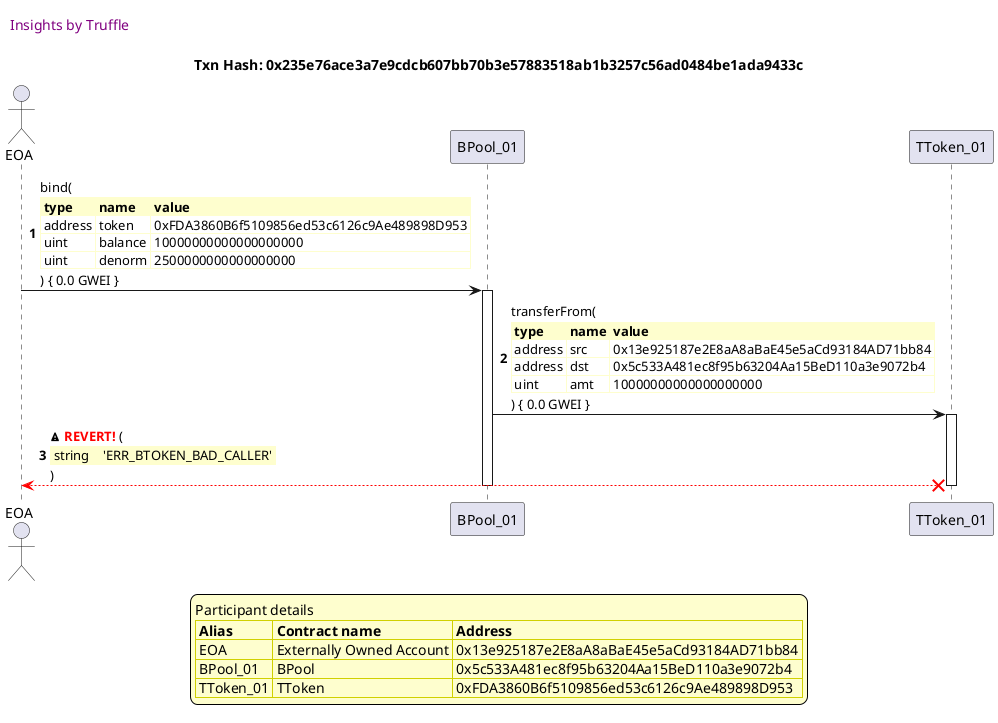


## Admin approves tokens
[link to test...](http://github.com/balancer-labs/balancer-core/blob/f4ed5d65362a8d6cec21662fb6eae233b0babc1f/test/pool_max_tokens.js#L65)

##### d1, tx: 0x7b59281f2ba8ecfdad0d8450acf9e6e58d7da351a26f714993bfe23d373605aa

[SVG :telescope:](https://www.planttext.com/api/plantuml/svg/dLDBRzmW4BxpAr1wQPIc1GC6edGLxwl9AL6xKY-Hgh716ojUR66SxYRR_rxssSsr5fw16VY6-MP0wAOBu4E_g162FZIkN-JMe-wvSYruME3QpgqpGoYUvxxfdHarTUFnX-baEXbD4Bhkmggs0uIttvC5Opr-soynlcryzTgu07LMLtEti2v4n38SDqoZSmVPzhwjxJl7Z-hLOigFjWSmfd9pJCdUz6Uhhx_iBu7syUzSLysVGeVp5PxvlYmZBWfLg2sUBHs-XUxf2fEbp8LE52sJ79GjIWE66CK5WQBKDhL26Mc02Gf9MahAjMPvQHDcc6Gf4G0eKbQ4UFN9VOQXmsTHdw58MwYAgeMOwcpMF5ltYz2j-xWwGsYx5ryEJgtuuk8AGzlwviL-V7IFw7fFywUz7go_uh1gBOxQmMAhNw3kusIpVOqZFzvs7LvZquKeoL8KWh6CAseBLMgHfomXF0CgXdPCAG5cDP59pWy8VUKs1s6naPGAgHEYT19JfYdLWYTCIAAL84IbIiQpIh0arLhnD1Kf9vkVQIwaK9mGgIcZYKvPv4xiGfpZDqm-4_pjv-Gkrkyq_GqRErekh_1t6thlyF_na3TD7UyVH_07wpb2krv63oSLCZP0LNSd8SPaJ0ZPX8Wj6yiM9wFOYpwM-XWiE_1yF3TORxiWocMmta5Th_3zRsSDpeeYlfjTDMYaEn5KIPjC56GAXZ3XmWeO6SseujbOqZnN_3tmlouwpBTWe2ca0kn8Gpec9HDYADHO4I5IoQOZPGWrAPSoWiMizxcZcoZZQ_yB)


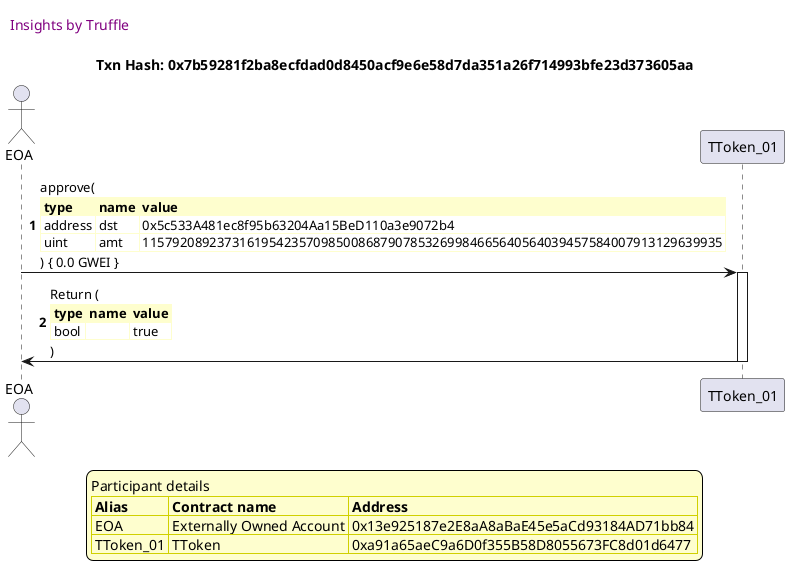

##### d2, tx: 0xbc57beb3ed9c4a77d16cbe5bb3017df9da1271f9e1678745394c7ff3d533cf07

[SVG :telescope:](https://www.planttext.com/api/plantuml/svg/dLDBRzim3BxhLmZTPKNNJRBUHHVKUQqzjTW2x59Wa6qvDUh8WIntIPlzzp7EO-brVf0I9NqaFr88tRJHXjWjQeHi5nlVBJ8NKFjS-QKDTe5hDtU-6DhyUHwQpXUZfcu2_Z2TJ2UZ2KBNRLpNRe1m_pmvMxY0t_PJZ6-RKBqsFjewhQkvNpWV0R6CnmrJMDn1BhkmhDsxXH_LgyEK7sqFjYWgFyUKx4r_UdtzPHy4slk_ysqrVuejpjPu5hgo15mKgrWxF5jvV6lRfojCLbakLEOovWgJSwjKGMMUEP5bZ51LbAQmD56qD8vAfHKNpF1SbIKh16DvIHG2ol88eK_kKsnRV0Rw305jiSghfOLKPxFcsVbVXFRBnzaPGlrUV3aujUABYojibylGlBYFZ_uHNUzf_hJNWyrN7DTBXq5xk-ZrYwqx66otRp3m4rpRuWqksWYIh4GEmQPSKvVhqeXCieJmr58nT6DAYMNE49La_83GLNvxq2wsabAXJ4AqIPXYL58ZUCA48aOBGhJK2ivgmH9fZEPI2id9zWUUX1AQ4w8CPJGnaXd3nCx5ENx3v3F1ttvExg1-f-blsTZHSdc5lxlO1O__ZuUiQMg87xuO3jPpX7QzZ1vEAbIuQAkwFN4n9cD2oDO5j2oK3GOZwCK0fJuwImyy7yyDDdqNW5n55xojwpM-_-rTWTCyXtkpgmO5kXD1jNB9HDjKsw6TSE647HM6KStJiQ9Pflbxu7zTT1ZtODDnohGaGraAkYs9TD2OkQI9p4tgk3RmZerW00PPxtD7Do3Xjly5)


##### d3, tx: 0x9c0c37a926a38cf597c34d683d3002e72b2fbfd1fe7002d8f639c9f068674241

[SVG :telescope:](https://www.planttext.com/api/plantuml/svg/dLDBRzim3BxhLmZTPKNNJKzBAhgWJkAiFRNO0knIO91jEJNgo84iTqcR_VSnpwNN6J8faT97yIE5q4qNROZzl478zh7r_Jnt0NNFjL_OOEUuSJFdow4jdcUXxNqvQfisu0-JR9ADCeIkkxXgt03XxVVaREa2VjilCRvjG_tQ-cYRjAbdVkvy1CGg7ZTCmBc3NFHXqRXtZX_rgyDK76qFjYnhFyEKx4r_jlhwo_uIQ1__pdVrx2bsE5_XQUYh2d1Hh6FZy7JfyQtjdgumMPg255nPmnBBTL59emekoaJpaXF2d68vg_Agf9LJi2vrbN1Jc8eaEb622Og0iYB2rRFx5DiEdu4-Gq1Rh8jwOI7LwRHzTluNeLltSNM6q7OllXoSMl75nHMsYqLeNzp7H_-8hlSqVzhhmVehZgk5mw2zdM_rYsrwc6oshp7m4rpNuJKkkmYIB6KXEK-5fgxGbP5vmXaHgQLowCQK4ikT8P2eE23qjTySjFEDf5GgmuWsZ2jE4sgaO5mgOhGaH2TQmLajEKkCqI99P2B8vkT6I2Mr84GPoYapm9lXSXVY7BzXyfdWRp-pEwZVQVeRDdQqN5xXxoxsmUF_uo5lsmRk3oE6W_KSeLqleuUJ2fKkshhfJaACoPWGiWa1BGjbWya8UZ50gO_1qWFFntE3zROBG2wZ2zuspGhV__Qkn6bHmBlPLOC2tKnIhHpBj4sr7TfCI2Vjg3ISQf6E5SrpBTu3_-kYmtmBbgXa8WisSTgbcO1shKep6ezDgdJAYHg9YghXa140WwptkQCRaF3Q_m80)


##### d4, tx: 0x32bca4fe7693ab900c8aabec3e2e45d56ba230eb629e87f36b36f71e13822be6

[SVG :telescope:](https://www.planttext.com/api/plantuml/svg/dLDBRzim3BxhLmZTPKNNJKzRAhgWJkAiFRNO0knIO91iEZNgo84iTqcR_VSfpwNN6J8faT97yIE5q4qNZ0_zl478zA5r_To2HzrpxHR6cpbkO0Qk79hYUURRtfMZjcaz_Z399_aeH-Yw2wi61WXlloSm9NZyjbzYVDlw-hLrmJHPKy_S75o8Y5KuRfX4vmvoqVj50-ySF-fNm5GSRG-cB6itmvJiJN-s-lhB_X9e7__ETVNiANJOhl3KzrKLSL6eGmDukdJurdHFLvWiERE54HMaYUR6Qa8APOo5WWC38KkPMCCu0Pim3IgjU69vKgKKA5UCMKXGfAm8yUhvVOPDXy-YFaEHjb0NzSB4LAVJzXdSBqAtxkFg3A7jNdmvEBNYYuihR1OBtxx0nqVtYAxtD7_Qwy7wAmwh1U2edPblzOjf-ZZPR5_Zo8-7hiDhN7OXIhAKXUGy4uf2eIejRS8P4PcXSWXZIedXe4dAh3WWzBNR73JpZQHKffeHfHbFEKsebe9ncHAj924gKMaygoHdYTPA98bC1DdyN0kPIYK8IJNbbEc4QytbBiGvViFaCy7VVkPtiNwdwM_OsD5oUOM_G-Yzm__7WstR9ju_Zk0FrdE4ThsC7augL48mTTETX1YJCI5a4oAsR2nRd8nYB_fOwcEmxC3pyTnWlUs2A9S1l3DDiyBtlnsKE2kA-6vsrQ2HRYQfIe7bocJA34qk94WpAZMdIcJZb5ghn7lWVrrqc6_1B5N3dEg2bANC1TNfM5L3mMr22MCJMKa34yQfZM0nwttkw2RA-Dh_0W00)


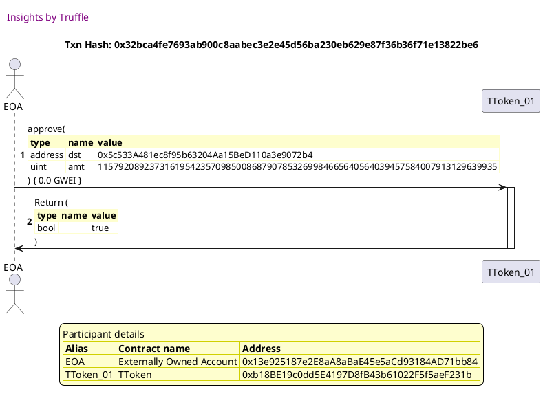


## Fails binding weights and balances outside MIX MAX
[link to test...](http://github.com/balancer-labs/balancer-core/blob/f4ed5d65362a8d6cec21662fb6eae233b0babc1f/test/pool.js#L97)

##### d1, tx: 0x1fc1c66cbcc8c54131fcbff3d4996bd2e65eb29626331a44e97ce69155c010d9

[SVG :telescope:](https://www.planttext.com/api/plantuml/svg/fLLHRziu37xNh-1rm6thBZShjXoxo0Lp4kSMODYABjiUReT2bkJKg2C7ihocM-w_ZtQSrCcm0SKPWKbHp2Vo4qaJyggqtDXgbHF2ArleQfKeGyhRJA-vuIl8rL9fEURYTccAIij9aHS6dipYMJo92HcMzZvN8mBDSwEuL0Q-jKk0ruN9lXRQyZpAiwLUAMqHCRK7XnbkxY3NbLddwcZZVVPL0VKEjaikPQQNG9tMz5yZXo_R84Xx_boNsVB6bf3Smy9KQOgun6OsLx3OQ7ZDoviBS3Oq5LJulaY420Jpg8k694rTwOMXdyY-yfbA-g7VzrsNSizJuK0eFwIC2OSwCYH8cR0OUlmk0bx26SepWhJPJ6HhZgcEBuiYltPeixjV7Bii5iMjqdkVm-hO2NbNQQQLtFjr3MU4D2T3RzGv15wyk80aq_BPP_sP3DiB-wELe-rVOE_N2b1glcha5vvNgDJkMq2cZIfBs8Aj8qBfR7X8kS-uceJSdpgfozYO1TF0OSmVkBD981qgVMyms6DK6OQ-XOJdN0j41aQT7vuJPwbqOLQe_DJrENm3vqy7_luKpx40EXdN-JyGs11W3TTbgipC5Al_IqHfH4C3TLNOPpGOg7uSy2ZWOnvxJ34-aQ5B0o-Q3cYI1DwF2BAq3G8Jp7KZBw1A16d84j_jErx4AHkhAQKEnmESGJ_nJhZXA_jB4a-PwN1HKtDKCmqxbRxLnPtk8RmockUzce5dpyc9wwRtpnEZvByroAxGUXSm_FsE6utTE8AXsCq4z1cTdr_57-EhnM_dvyENZNq4Fo4UIclgRju2_fx6LrVNyxVlFyncyyayVhku7aTldhPv4QcmqR8ltAhJqk_kT9gdQtxeEx8RPkIoqrfIMPxbPIU-gJD5Ikl2m9c5pORA18UHGSH3YKJxEpty3_Efnm2-DpioytjuTuTXGYG43axxoDhf0X_6IAi-ieYwK0_ZPgy_ihMxO4TZgRDyB2JUINipv1M-yMFq7G00)


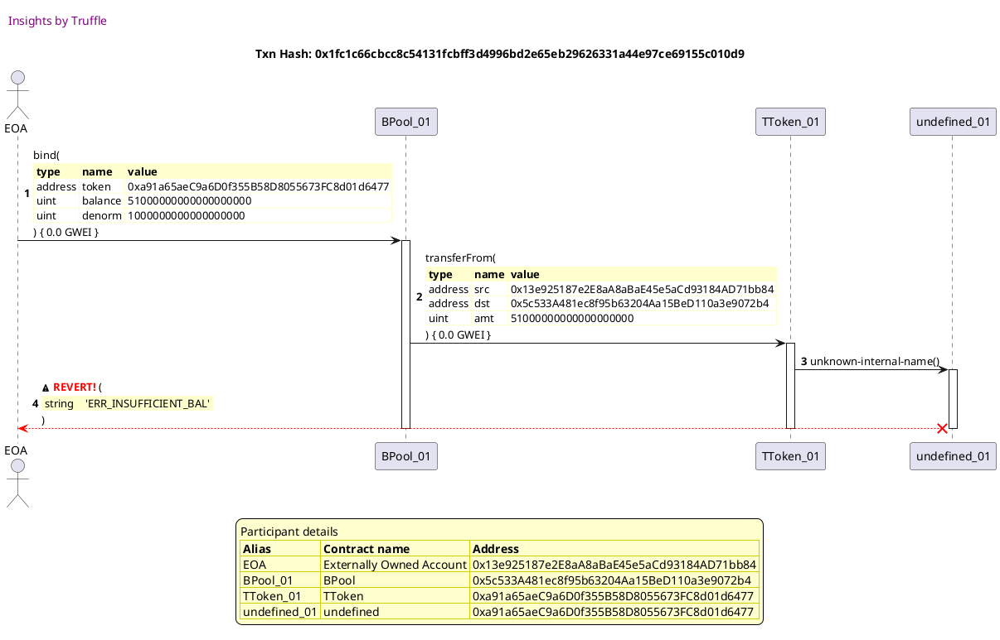

##### d2, tx: 0xa8ec078eb1e282fd74cef1cb1079c89a5a641e050b718dfa4c19478392362321

[SVG :telescope:](https://www.planttext.com/api/plantuml/svg/TLHjJzim4FxkNt43QMnbR7PU7THLf6qwa3P07Te-Z0avZbCYKgToN6YX---xfg5g9ys9VFRTvV7TFUSGSbPROUnyMX8YvhRIyscg3AaV2ZqJHaoXL1EbixwG3nDJpNKsgChAmE4e6IM3X91kRPUbwX5enhqIcJBmqcu1pYjJF5VQYZ8kYucUAcqHCRTRXn4QDv2pkPcLQi_mlNXMmBojxbfaMQ4dm6Yh-jF8xgSs2DAUVw7hOd9lQqYNS6FcUOwun1QsL72pq70kwljJe0l1bQGXLobJ3dVoBFIaofbC6GqZoIFXYy1ZYleq3HdFSk595daXToF73HpNOGHB9Ys6dbp586euG7b0i6osaCLCOAhzwwegxoXhhA-R0q8QJpZfxIZX-FWKqa9dxsxrBUcs1VxGojxgCzZbJ05ABQQDV1Jb71ThznLWPOogQrY1hHwKHaaNes7iye3sWzndDE9-e3BVbG5p0Xd5okCHFiF8TrynvWM6l89Kb49BHCOwhyS_vapfoaotrhsnSNqFBq0_KlZoCxb0YdPoN9pyEZGg-xtEV5E2arFeldqIHYElFUZAJNUXJw_J6IS_al7Dcqwd-wdHz-0_jO7QcdLVh03VesGylljsSNdNZx_6buFag0sAP0hPAXw5LNjSR1gSNE_GbYahYhBUEMb8XvZUcWNiOoGJ5mDiK8E8MpxYLmgsts5awzR0UM6LqQ8ibt3rf5K6iPHucMn34tDLvFYCXyf9k8Yvw8l4yvKl1bdaCkx5mv2bAVVsWRUjrIuRA5_whXjxd2d9yyXF0zUXNYoOtrT3ngZ0asZef6iepBdDd9pXZ3-0lm00)


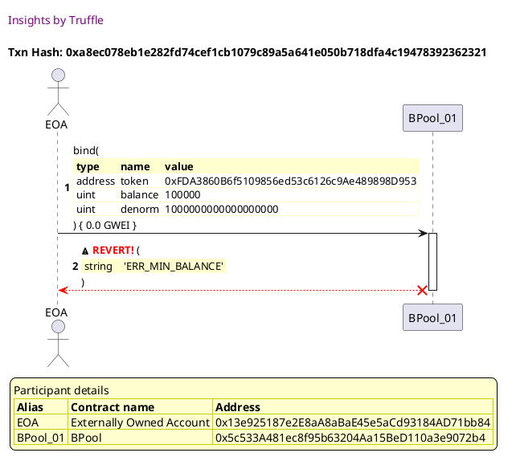

##### d3, tx: 0x889671afac2d9af709895f8d5d7cf05e371f4586e7aa181845c80c379318524d

[SVG :telescope:](https://www.planttext.com/api/plantuml/svg/TLHjJzim4FxkNt43QMnb33ilZOEwYhHDWGyRY5NRXp4X9tPAHEfKZWCjTFzzrpHKPM9Mv3kVBy-zF9SGSbfPOMmzAmWHjIrrFKkK8TLzhkV2Y1aKQggq78ZqVchAMijXMPG6ziVnE1x6XFGgkonKdq2pxfIGoi1pUmGuBqt-L6ehYgZ8ftgcj4N4p6uTndYvWPpNPbweLnVVyoS5pDlQheIKkPu2ewtfJoDxnsqIf8r_eQjyUcShI9OmCNMM8IwnkIqKJ1OQpaLrTm9qmNdO3PZ8HEh8K6G13NdePrpwCaWpwYitO9ddywuAX62SSSzFEKtT87GPznrF4cnPQZ7r-382KS4UoZs2RRDvciy5bZguAilYbhBczkMmHqZZ2KVz7ICS7fv0aclvuKRVa5xRu4-jxA--W5tE5Q3KOjR81r7KgApTLu2TCQggO0Msl5SQ9LrqW-xOJvsnuYgAFHKucGo7er4O1JnoQJ3qCXOC1WvzmQXpJ7a5YIY4JX4P-_pM-iTTAbsQ6IfX-BRdHtW6-fd2sS_u0XdRANbnz6lVAFbxtOXDHuvEeFV-KHYDDFUXbsw63NtwdSvr_2E-dhphT7h7ZRqF_saLLDQinsG5-1p4rzUtNo--tMBqi_F9GPiJaGgvon-4LQ-OsOmxkTeXKIehygBQ2JIY8wnkpGbEDLABoX37rI3YbfteXP3jUvZOUb1mNrXbj2YA9Lm-QYKXIbFyj6n36dDLwFYC1yg9kOYu68ZOyvKlXd8zTruq2bYISEyry7RGMhM1ybFVTIEFCvNoBFIJhkjGBnBC7wWHOrHW91euoHeAQsuh9wUuu-_WBm00)


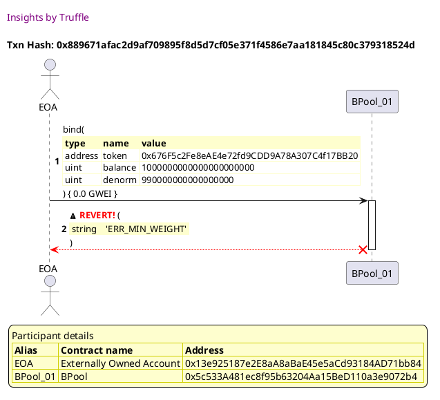

##### d4, tx: 0x8e5e655ceec66491b00e174219aa9274810bdfa020e65f93a3d0bba2d424b2ca

[SVG :telescope:](https://www.planttext.com/api/plantuml/svg/TLHhJzim5FtkNt47qjZA67OIfmdgAj8s1JvCe0vjayQ4RcAtHAHEbRZGGlVVTvk6gknXHRv-d9pxE3TXxBIoMDhvD6SCvxOmyscYIrRTPsQ69KuXrnDjL0_J-qbPp8tg5tbHmlum7iRzcB5EPPUvxZAenvr6fKjuRhO0vqMPFHN6OXxbsSHCjR74EBPRm90kDvIpUJdBzQkBBzcJ1k5jpwvGgSnCGF3cw5TjEyTD4ApnVs6gR79dAqYMS5tEnsFYPJQpkORhXO5phEvEW2y2BRKlPQfrwljUA1BEjMXxZWWHGwVj1O8dQepSuGGRXowwYYS9EifplCH9aL79KakXnvSHO0LxPFSObSrcQJP3IhLtLHJvBHVrxSjcZx4Q2KVTdKCuF3o193FgtOsvOPscm1yQsrrz0hkSQI1hS5hR1ypdj5Z3Lq2LANLLmGfiSQyDMRx0KA0lKVT3z0Tyx4hPay4Wu5BwRNVO3nGNolVQxHUEUKOXho3174rAp23vN-CFhDAcAASRgFWtzZqy0__8uUnRV462xMIyEFgnNshrSrs7JK6EJg3pzX5BGoftePDkUeqmtLPh57-DHzTlMgtESNtUXVzK2YfRhhja1VGSnAFHxUVe-orvFpk_FcXYOagJTDa3MlrAc4stiwiT3PMscENLZgC17r1sQqcegKbPMlIfMqjYt8eJlUYnVOy2M_S9pGkhIuDvleJBHwCLH6bANvQjDHEk3XqfWhPsuW2Z07iOUr9BxAlG5O4N3TeYIGBlDV6spvfbJILJwReHTR5EWt4e4zzrk1UXa3qz488ZUU9j9rbJKSvDvkoKPleR_0O0)


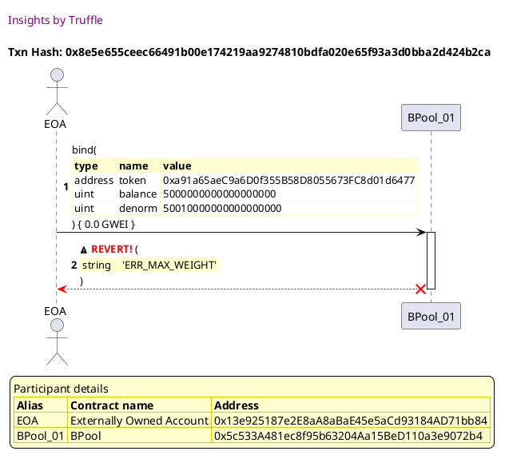


## Fails finalizing pool without 2 tokens
[link to test...](http://github.com/balancer-labs/balancer-core/blob/f4ed5d65362a8d6cec21662fb6eae233b0babc1f/test/pool.js#L116)

##### d1, tx: 0x3c6944a2486b1e1e3358376a6c1cda7651e2fa3a78035f2aef59899855f13455

[SVG :telescope:](https://www.planttext.com/api/plantuml/svg/LLDjJzim4FxkNt43QK0P8axYDa5THDe6WQO1AjM-Z0bTaak9I9tASKTXtN_VjSsg4aL-kJi_TyzpjX2NZKLZ5xDA25pOMYzcAHdHl9HwZWPdKD6KT3x0x6LgweNEXtLL6pYyIgwIOI94lx5l5KK2DjypOKu6_hHRWElQbE-rjbZ5LJdLCzAM4Gkx2xXYvnPolZ3pYZuu7ift0kdlRFUOvwMUWdHQqz_Dt3zlYn1j_XlTbDDdsq3w1XEpA0h65RQq5S5agU4Qc-SBS9PUrWrz7rq_wAQI97cU2hnU5xkPp7BiTPKajq0FUu7ZgS95AbGOX66WL24zNod1acMMIq_kOi063dW-42oRBRDoZanrS5_NrPCZDzx_cmCXDf5m5kqPuVJq0efIOyMaZq_4dcTvzlFGKFvh7RyzU7O1_S-lQ3Ih4K4_s_Q4Ow9EPvpyICQJJvrE_tnZZ-3uKJ-AVjkoB-qShQ2nPgtc2lW_IiRZf-ytjq-Jks_9xSCHhDQ7JaHEJB7yZPO-4DZU2d6_npKdYsNLx2KQEIF7SQBLL-3cimAy679N3IE2nXcj3N6U6shOjpl7XQtrv75foR0UrHlSlMhA8Suole6MNSvIUXIwIWOzSfC0um07cFYA50xpq9E17uzwCaq3_oFmhX_jSWEbCkLviHz8oe8YL6dNSnq_Hga6D9BIGSxazDnq3SMSM-RYaaT-DVy0)


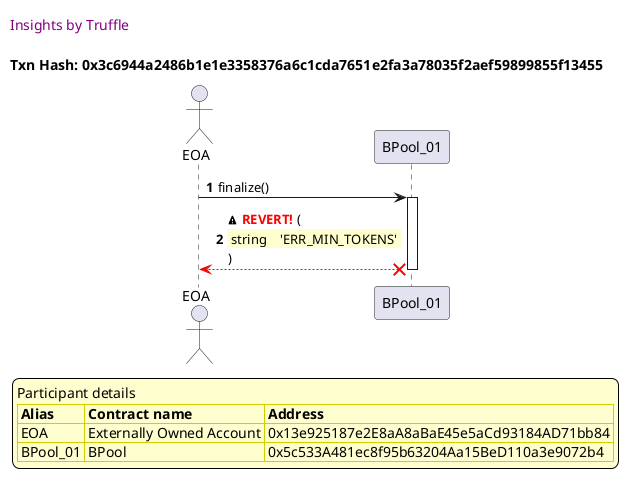


## Admin binds tokens
[link to test...](http://github.com/balancer-labs/balancer-core/blob/f4ed5d65362a8d6cec21662fb6eae233b0babc1f/test/pool_max_tokens.js#L77)

##### d1, tx: 0x22f7fe7199627d0b6c690e82e85f624324606df5caaeede0492343e13e437094

[SVG :telescope:](https://www.planttext.com/api/plantuml/svg/rLRRRjj647tVhnYuBpPIDSlByc8uHdHjyXIZDT2N0CMG7Cg4gQMmNCPoelvxHpGbKx9RM8bVGWZSs-Zmp9dX38LuNriqjbcKGc1ZAzqi4ZAYlYtq4WqkeAGvwMo4wUtSL8tEnbLP6VXbDfrDnrCXBcfxNzAbWFQw8Sp8mBTk2V2XCiNNIbiiXsKnrmlIbX5pkpEOyU43vB8novBs3luilX8u_cxl2hEiq7DmPBVrJpjUlEr8YExv7tLTp6zi3SazN9icpnbNsCAM1DSh3H-mlZa7kNBTFCmfTE8uSCDC9a4Qn98YboAL1wxlkNuWWonNAI9HHjAFNS_toF78zq8P-u8bIorJdtuQ0jPmmkE9ODbiaHPBP5T7LrLL_YsTzdIxs3UvlgvkIMzjTgjz8zQTya9JjhNhR_odgNjewfu8qPA4mMMF3xnvSmv9eRFJp_gpkEXY-sitNgxVWRrV4l2eST6ENx1iUB8nNmC7nL1TmnhiXZoFSeMnWu526iSOJ6JkAJLIqIIIIWMXDnj7cNIom0_3BKPJCFKr95YYJXaPb7nw7HXdf2kpUDxsmVGCle7yJSBlVqq_SgxqFDxu_wXrAu0rgEkSpCnKYnyLeZPfAmEdIkmg9mh9dKOuZ724Kr-Hmd4MUqxa3oUXaoIH_nGXgssBe5BbUKC_SYYDybWbWUTAVuYE6j74SIJo0sJe9lw1DhYm_olYeJ8zBJRIxALNgqwZRtLrfmSCJqPZETWeS7ec3aoVqRLkak-JS-lAox8XUJr_1uDp-8DiOpHy7_E4qupfy2_7ikwsNw8Ln_-7jVevX1dnZ5333PUeGgULCPHQM7O5_fHMIrvJjjqvRxl66PmQlEiWvKeUTxc98Wzp9qYSADfidBqiC1kldmZJAoMl9uerpMEox1UhlIh-uZVIVOwi40yzNLprsaP65ekoxh6Vo0bhj67FhPkZn9CnzsJ3BM_dnt1RhtR_krottP3lgmTQvJrykcCoC4nJ_dwmHzR5Fl2kctRJ8mja7-gnwsxdHxQjFjXUT-ujNmVIVG9vXCiSvYxOuZtV-JFlNm00)


##### d2, tx: 0xe2fae83e17bb16fd1dfcf8b94e5ca9cd08f620d779875c3abb36cc3c94567c9a

[SVG :telescope:](https://www.planttext.com/api/plantuml/svg/rLPDRziu4BtpLmpIIuBMkwI-B0NPe79ijpqrQ0FifS228aUE49aoA6hZfEv_xrYH7Tbf5t6Royg6I0x7Js_Uq3DYx6tjf7NDl6HCDguopJn3o-gRmYoabNCeSOP6ZwIwcTcgCVgYAYiBhwQJwUHYmjXPxUvAF6VGNjSeDLhusYq1tbUskA-CasLQ5ZCpH-C8CNTRXobjFa0k6hieSMVZSt6F88AjxL9gNPWP2DwPlhNZsPyT2TOz_uEfYzcrgo6xWolRv3dXCbUu4k5gQU2zhAzFWI_HooN6FefXbeaerqBdAe-p9C1GoKHf7kUHn_LmcCJ3KFaoo_n8ALybGHWDLI8PIQOSKPzyJ47MS4JZ4IFPNA6AXQHGHvTLLVx3HRkxMUowN5rLDsWsFjlLhXFfZdbXK6_y-eQVkdhxhjuHOor969pt-C3hrwUG5KOVVp5Vs5cNspVTUBxw2zpT0e568-Vj-Ayi6vgitLT0IR5Orx02joPF8rzEnwaVHtmKvQ7WIHn6g4DVHSABL99Y42Vq6IUXly5e2gA-WaoMqYX21ey_lVQSDPhApcaI_ipr1Bu2_uF3kxyd7-Yiz29Un_-eTIk0izBKETgfhUQ_AqHjLIk3y37nGX4FqPl4CetbI4w244DveHDVn44w7eeiYuEd2BfsBKAeGjzFWrYWYlCap2BVuq4gHJZ2iH1SqWFuqCk2FMtatFsdYFlAzBHOIxDpl5fr6dDZgbip87YqHfQ3jGB79spFzGUwratsQt9kGddUQSXUBjx1u1G-eMkiWLzZdj4n8phqpMLPT-RdQ4Nv_ssj_X_2Z6Y6qi0rbQZ2gCfQL0uMNO4_nkM2rgWtbjEsQvp0iPMt7IHVyiCk8S8OWuWdmjUjuUHvYLb7_KIONYbvEL6SRHuFoswnsgdYp_v7UZyYozX3JsUNlRQXqScYh7lintnC6gtPK-kcBD7aWdgofPQtZIFTrAljxyvNRJUa-_A1Lda77s-93AHAqVk3Ex0kze6ttRIR7bWW-r2FNNSpFx1jzS5skdDl-JAGtXF80qAcD7V9Pc_fJgzvtm40)


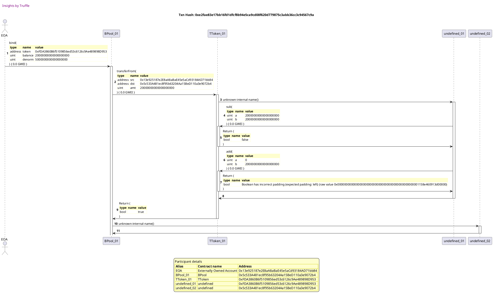

##### d3, tx: 0xf994061458e0cd5fe17e173817668d9bb3e4a8bbe3b6eafd1c3caf99da6062ce

[SVG :telescope:](https://www.planttext.com/api/plantuml/svg/rLRRRjiu47tdLn3fIuBMkwBk2h91vLlRfmHjWBuKM0p5aID4fWoAsZYjzzzthCYEx2HetEPb2K6yZOxEdA5cnDZxseAnpRna31fRwMOkqR3wfj0BC33d9SvGgo5aDpDJDLgDgh8o_CrqCfsC9eoTrVQkn7F6stQDeD3m7zsKyu-LARvNsaAPbiLCpr5RGipjrc1Ac_UGYyOiIjpP-59yHoxyxTebA5Ne6HTEj_Hlsv_zsP5WtVi_wRgONTkQopj-PPey9rnc2riYlrfg_X7gwrFkBFCayPrG-46CJgQ274L4bnUBA0nZbKZfeG-nbEZ9425N8lCoe8SKX4xePeJ98BD4VNAHSgZv4VL7Z6IpHLOiW5mTNbPL-RSZsjtDPDVawggwGRsnsSvsZKXtp0kDQcFNNtZMrDqtTOyOQqdomNcF3t_xzfJBGglZR_eRE-jY-wxhprT_SNktG4wzXddR_mDbGuEr-OfJK0pMDLznkoPFlRCCet0QPEuKOqmdFaPkhfBHU9oaKPnwJZJoSn4DXwwpmMWAehxY4ahG6I5JY9ziU_OATMNcD0YUCptXFxZpXyC_V9ryekFIStejmOFShGRMWAvpD5DJpNzNYzfahHB2myGDH1oXEuaXZM484p_004OgyKJif-D8I1dxZn5KRLk480iyB_LZWLcS9u4CFTVnKn314CT2E40lS29N-dlQmDp-JCTzSNfohDNPEMIjG8s-qTMj7j0Rq6We1siHZa_OdkaJqjQD_3L5Dzwy-4p8L_LwC3Zbdz4sHlDVuo_fl14Zkd8ewsxv9OhHGVXjnVutsWnfXA3vDMMiGcULCPXPlkZo_J4k5pH7jLavROl82JysSDj1EaldaEOA50cb_KI2TFrswUHbiLbx_KYONbfvFL6iQHxEosxYsadgB_uqtQV8CdPVujbbhueej52KTO_zs1cJHclsLCafIZGOKOasL06tVgIRtBLzxdpL5aUwB-zfbNVyufR8y3JBw7V27fWZ-y3RujeD3qoMVQY78hmP7rZ5-c0xnRetVHr8zn7a0IvJcBjWi_Tqfx--_m00)


## Admin unbinds token
[link to test...](http://github.com/balancer-labs/balancer-core/blob/f4ed5d65362a8d6cec21662fb6eae233b0babc1f/test/pool.js#L140)

##### d1, tx: 0x787e572ac39fb87f0557f5c8bdc01a97e13e0cb72ff67e85cea7112328735739

[SVG :telescope:](https://www.planttext.com/api/plantuml/svg/rLPDRziu4BtpLmpIIuBMNL8VaHIaGUrORdDAq0ROIu62f4QE49aoAAfnMkz_tx4YExBJBk8sbnKCyMlyzERDQ4QClQ-TjAwPbOp9nbMccIcqhBujp5nQEOCIfsYoaTItKrir9Zkloih2gqawISzJnavhTr_Y6OFska6PeOKVtHBWOsMBxvLniXoMnTJCq3X2pDt6O4A73v3pnivBt3huN7n74C5cxqfcMM6c87YtzKyxdlxLaM3TyozCNKnlN0tg7gvja-U4orpXIeJhXO6Fihuv0Rw8uWZ3o9FQJt8LHpaFmoWFTQmopOLC8XG-SgqYBy-F8un3ZJ8ImlEzEFB3o4yOIQOTKKylXo1hEA3nW95ihj35N9AhewkgAhzoqPwk5zicrzVLBPgrpMQrRKIwOruOpDPs_OrVcdgxfju1Oor969pr-C3hroUW2fCTVZ5Vs6aNspVTUBPy1-v-Za2ZaRDs_2RBXYOhyoLGK2pMDIp1hSZJo1TAnADK99fdMPW68ed6SJuAV7KikETDmZoKEF5yeTOOJK7Kbw1aAOqcP0hnqsl7E4DJsHbDmb-P7i4Fu6yvVFWxlQ1SwNcyylzHwrO0PwMfSxGJMyt-L8ZQwbO6Ig342mNbcPV6SXZBaKo344DvdYM-Y8FXE19AnS5JXAnsBKAeGzyV1h507UT9g8vzZmT3AS8HZeNWaXx08qy5Ezh8cVjF4NULwMcnacOhlLfr6dDhgZip87YqHfQ3bGA7Hsp7z2UwretwFJdNhZml6zJB-JiOdC0dT8qry7lC5QKPqQ5VBikwstwELXJ_FzRg_o7CY6Oe3TnGYIgChgn5xM3U5VX3NCnfZTbwvwJj6aTmQELT1yaNVCyhbZhoV1x42SQhzT7p0hFo-eamlLBoSg8uspmcotQnsghYptuZlP-HPUoXfxEhNjl8qCcYh7lintnC6gtOK-kcAD7ad7gofPQtyMEuhbUR_vqjssv8zyK3hV8UBk-830orfky7jsTTx0DlkcattRD0zg4Uk-vwlcVRweDjTUVUycKWlIUGUxXCOUw2pTxJdJxp_WK0)


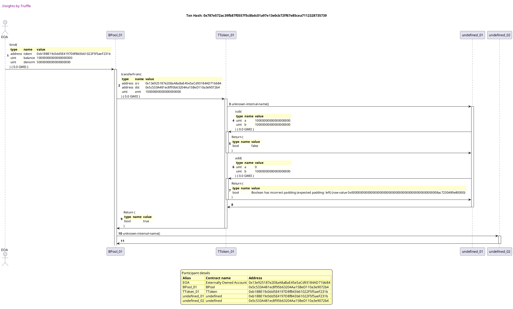

##### d2, tx: 0x2073892f45fe049232915c222d9ac6323f60ab6fdfcc408fe62e1a8e8297065a

[SVG :telescope:](https://www.planttext.com/api/plantuml/svg/xLVVRzis47xdNq5aBmbQRoGbMLIG1PLjUUrJWpR0NWeCb7XoXCYKGL6BqsR_Uq-AxCY9DoHjK3J014F77wTFtzrHXy-4lAcTigvPbeIenbMcMQPWINrPc9MoQabBM83H4vLTBcpL63sjoihIN-R9F9acX9pKxhg4KqAxwmAK1ak_z5DAtrQs-5mPfyguB1Pc2SOXOkws3dFSl8LSDNPLmix6n-8pKEvlrywKreLPKCxwfNywU_9RJuBqxtzdwc9nuMgQNjDps-GvuX9Nk1Be-ThGjwg-EAPiBLZeoKZaVf03yoFXYOW7cH12HoeRUyBBnqoburpdMUOpcSDO05SIf8X2DWuKmPHb3gadxsEgQdg0ze1WsboH5Ik5eKxEgghyY_5kTpFPTJa_hox1R7osirqdp3laXG6zyHik_AkhkEyg3WZfIDBHwO0FVVNg69zB2wCFFvbFvAIlxklUdjxyJjtr2YXQevQT_LkL3GvQznkAPR5Gr_I6kfO-MhPEkPmaFCgOra7YyoYSoNpYU-cOCo7cGHuec0kFfxSOH_GBPRyo-iUVoJkiwe1Ro_GkAnrLPvMfSx3VIrRNhgFAFOX4m6K88f4gbcgY4Z-0G4rrv77fnxEGfwdqDmXDOTe7rRAzS_RmsX_J88esg9qIzYMuDDML6I4yMAFAKSl_y8ZSSzsJaRf9loqPcr3-Cv2jM_fyyOv6n_G3kCOQ-ctCKpmWI0T_kIhhVlankSBwVtUkNaPY9ZW2PUW5je72P9Mra3cwwfle8QnNE0UzMJdkElCHFRJggeTaQ_R4Iwei51xpPGIodHyzhZ1jr0yICsW2pvSKPvkxm_93suoVHp9Cn7IQXnDW4EOw7a-YQHY4dew2SIQbbd8wutlRpCliAVk-a_-xnSlAma_nQUw8c4SVRB6FB26tafQS3LIJ1gUAiXwmdx4Pjg-MFIfNRA0ucA8ajQZujd74cszy-zpfJIS6yRw-fLLUq_TNI8R6MORo-Qc2OmYy5PFzi8CAii3pObzoo6GU1IdALkR7YWSJc77E5Bw9XIAz1tKdEZVZ9sgs8TYEE1rCdmTIF81yGiXOvhxOv0tUyL_ELm00)


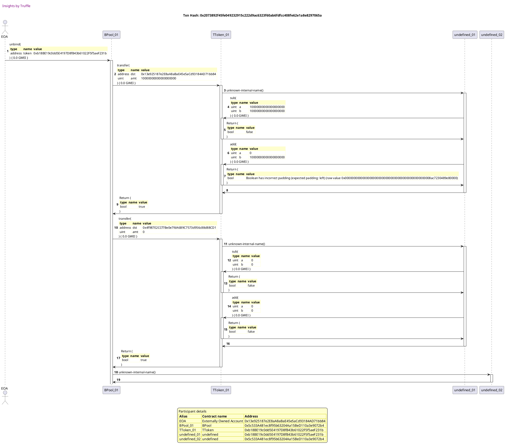


## Fails binding above MAX TOTAL WEIGHT
[link to test...](http://github.com/balancer-labs/balancer-core/blob/f4ed5d65362a8d6cec21662fb6eae233b0babc1f/test/pool.js#L153)

##### d1, tx: 0x78f9c40729a66235462331c91a500b3ecf16258a02a6fea32ac0c2d6a6ec7a7b

[SVG :telescope:](https://www.planttext.com/api/plantuml/svg/TLH_Rzem4FtVd-BMIkj6rzNEBqB5K0E4jjAcLWnjazO9NHA7HWqESfmMMlRTTuGKqKsp8j_5lZpVlNSEO-UbGMsgUSuOLgPGrJoIcfNtcLgWnZdaSYPLqiVuVgQBIYM38Yyq78x2KJW86UkMPfNB7eDwt4bCf8RdvXNWij3PKw4Cva6UpTHSAaE8gTa5Z6Xp2xcez2ANhpQ-PayIXBDRky4aoTGC16-MVjUsUzeamPhphrIPpUvC2T4A9hfAKy9b9ZEvXCbImIMMTsV0bsq_xSGERriTz3pBTXsQR15t1BgSHxQCK-5Phe_SGY-LQ5iOyzXAFFHatCPsn8Yos53guNK0MC81sGD6j9aipXP8fVPlYYAVSb7llhmSC5P7mablRn6EZyyWobJoxbRTicv3y8V6zjQVmAmM4iWgdDVs0VEAd4tu6eWPBSiIrc2AUwd8ycKa_7ueEZ5F4ZTqHASzzDE-OqUUu9OrSbCNvSYoHVI2KMMKyXeYp575X4my_pF-YasaAlIS78V_B_OzF0F_oE7YUtX5WkrLl3pvUQXbycl3mvQGapFeldr4hKZb7dJZRQzHJA_L6eVVml7aJQlLFQtNU_0Vfg0qUjCbQw3dA1oFfr-27zF9zIJuFAKSBYudHqrcB94aOFQ0HhwIPzlpx6PFoKGQpF9oxxWX7rAD6s6ejKbVSWRKiveGTn85BwhilgFqDjr2yz98hJ3FLt3zg6G2GHpJ_JArSiAM7SiLVbjQeO-1ZtqC7LUwE4Wwjl2TODWMKUGxhu5ttTQuDPGRkxOTEBwGCRMx6tcsnPq0XTkNGo4uqabq0w8D5DNSLCxEQQP_mXy0)


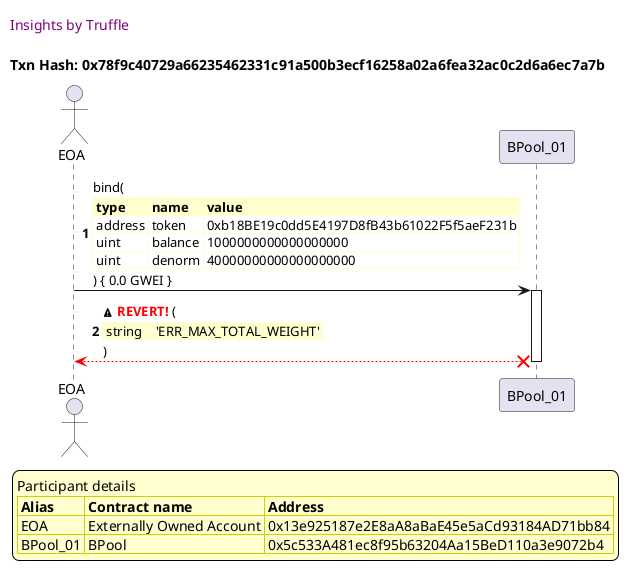


## Fails rebinding token or unbinding random token
[link to test...](http://github.com/balancer-labs/balancer-core/blob/f4ed5d65362a8d6cec21662fb6eae233b0babc1f/test/pool.js#L160)

##### d1, tx: 0x74c646a446bc8261c9231bc049f3036815467ca4d63eac59260a9e9f751b1d67

[SVG :telescope:](https://www.planttext.com/api/plantuml/svg/TLDjJzim4FxkNt43QMnbR7OJvmLr5McR3huCLDZsOKpeahWb8dKgnu4Mkl--Qnegs3GhyftlBe_lkJipTb9PDBQU5unXRKjTpnDbM7MNwmKQd4EXPafd0qplPgQiTJOiYzB0_ZWUnyEOiLvbLuNgCsZMhS9C6NXgZm2dfSaVIssnY8fyfkTAMqASsbt0c9nRo4Lj5eLwvRZC7nK8TsUxm2pBzGm4Rqs_6zdxr2R1sllFT9NFRcq5oGgkJ3sT4YwpkIqKN2qrd69rUmnywRkfvthekbwI1brFf67N4KdAtN3gSCSBX7GzFqKtyno5gGox7iTGXLDVYaHadi-ePAcbrEFp2B22FP9xZCfcypHV854TN9HbSSD5utq-x37MHC9H_uKH3W-F8SbrzkvQNxDUM-0FhUolFuDTBHIGr3Xlv3qMDIcRy3LGPOogAbY3BU-K9icN60hq9AfXYDw8Jnqf1p8O1LnAptV6mo3ZnCBr_MUCEgUKrv1WWJfL6uY_F9dIfPcJ8lW_Qnlw7fw0V-JmvKTyHjrvGMzvz7FVgEpNXlIM_T4nzDu-eD7KqZxqqkrWKKo_qvd4t-F9rPjEf_UfiVVXFsM1ofhDIAo1leDuChavkxmPd7_xEZfeCs8PDS_czsZLgnvi1vjTl6XNfYpcHVNYcX4V4RTDzMb-gOca36am3I7k-X0zbtxt7wMr6GdQbrOPZKMnWlC7hJA8qfGUaMtQ8nmLTgK8VDMD0um2763iIYLnc8ME2Dnev8ia2TpNmBkHQjK6IgRISI8t42eDfg5CFAVBtGY57AYH41pf9kvtamqKSMwPinFQwU7_0G00)


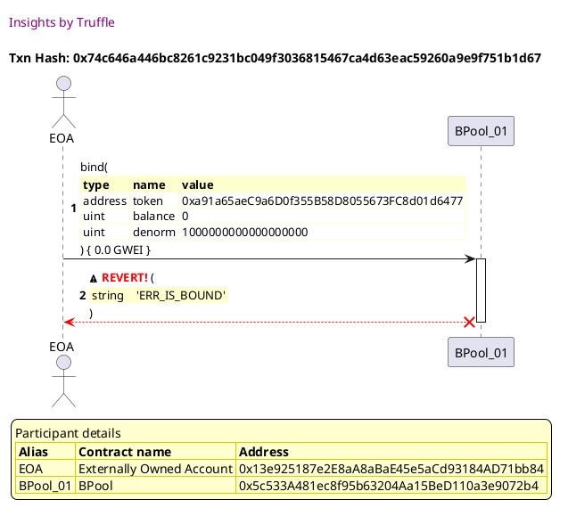

##### d2, tx: 0x3c368e145e79ec2f7bf40b6d23437195a3d482b372bac5761fbb53e90a181a15

[SVG :telescope:](https://www.planttext.com/api/plantuml/svg/TLDjJzim4FxkNt43QR0oHfoN9aLTHTAcWoyKTTtsOKp8ZfqIaJgLuq0BtN_V9GrLsJGhyftlBe_lvJ4X5wLXsbIBd11McK9L2ourAHyojMIQBI2NSwb4n9A7kIug9OP5NcWu7CVZU1WJqY_DEfS30iswbqn83I_j4U2oqDbpeGpBmpoRguLK1X5JimiOetCBkQpqCfTl75-pPmdKtTbkc12PcWErMjFlHlRFsYH8U_-LAhFvlIc1hs6cgpH5N68oaqkOhHHSilB-7AoLapZTG5BNatvF9dRgyzIrU5VOZklujESnHxY1pHtVvYpn_2vDEVSSsRCO3IYZ7i6M9GPJZoSXi18EK1uGR9l9acp9iDJefYZoEuistjV30I5D99mEzenmSd8EMl9CYUDRTKlwROi_jdAm-GnclPI0Kh558nzPNg5IXsy0UwDbMS86JF4W5KfhnMaGnRINM49uiKjx_YX88zVXNMhPzjXBFIR7jaFvAqQLOT8Ru2ndAf4rn5yU8LMX5wXGwv-r3Vq0Bs1zik3BZ_WAvxDNuEhqvw6MubTTzhR-qtFeltzYMk5G1z1FjjJ2c46dCus_nzFPkqwdVzRO1_2Vja1fT4sA3U1t54-dTzUJsLqq-NOzEcfJ8aBYeB97PkIRCMovJMxs9YQaOLbUxjqpiaPONDr-f33E4PKXSbCZucuGuMllT_zXNZKhS5yPgHNBypLCdfGK42O9lYFJp8SYcsoF1hwquu250OjOZ7Jqs53q71guuSYdd0VkM-0TgrgrWV8Ipt52Dw0o2TAUnxkERRaXiZII8qejLlCMYLn3OSrjvUG2TtpxVm00)


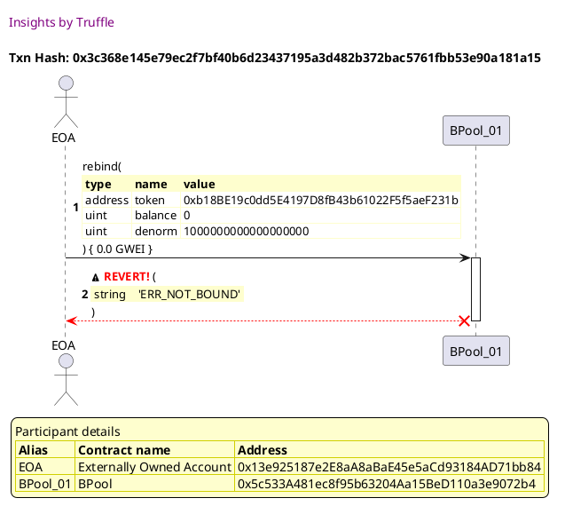

##### d3, tx: 0xe3cc31fdfd83d718cc06fb543e913110ad9a5d3f7aa5fbd7367f62c8b1005812

[SVG :telescope:](https://www.planttext.com/api/plantuml/svg/TLFVJzim47xtNt43QMnbR7P-D2dgAf8s7RnGr7NRmvYGOpib8dKgnu4MklzzrpHKvM5HvBFFvyztttqcvAAotDXwKH32QrlgUf4gGwg7N2-vuGier5nf6NFnC3TbhUMmB4e3n-Dad0mJGlgLNHTgGA3vxXMNoi1BkmIuB4t-N6hBYwZ8vtgXj4N4pEu3nhYvWrpMPbceDnlVysS5pDlxRhYKkPu3ewthRsFxNzeaI7l_bQxo-Rsj85t3pDHPXhZ4vhPGC5jfkEJL_JdGbNA5S5acCncwCc2X4BIRfRxdgXvp6QDSzhWltIpWtCzI6RZT8Eiw8amPfNx878AK2Okf9vC8U0L7Q8y8qcPpaIyvbXhVb6LnHrcp-xeu8gI9XBF1WHDEJy-XrcckvOTRVKlwBSMVMZlOV0MxNYf0g_cYiO-yg76o3Ty0ScDKLS46RFcWD5gwIbaO9wmdg9H-uh5UC0gps7FJBgEEC_Opdwknux9qX_4HNe1-fl3jLtA5r1xajZhxVMoK_BFDU9VwsJdqtpznex4V0-YBdIemPj3fJ9EVoNJshjFfVsdy0_XFHL1Pi-td1l0_IQRJk-l9x2wU_BWUdRGf4QcGu_oHM_M6mPqioSq1sL9PdXVLmJqZEgAKRfb3zM4BS394MHb4t7COlTAsFuTvRHkAuyegetbHh67of9M4I0Xy0hQXbg5A79-5WNAIa4SXZtdY-ShdGzbpMUX5eu2bQUYz1TuBefqsKBxmNJVoGgP4cFNyjEiwr8iuysCrsieGRwA1aswXiEQsSdA18pxRVm00)


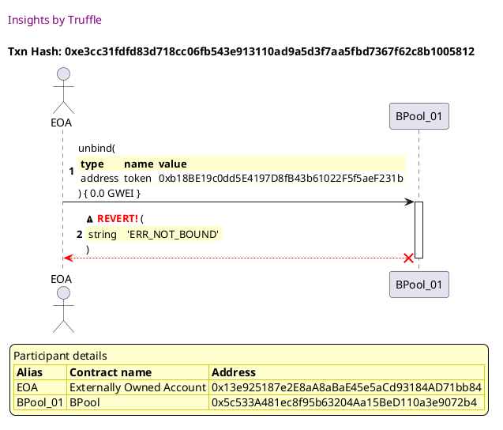


## Get current tokens
[link to test...](http://github.com/balancer-labs/balancer-core/blob/f4ed5d65362a8d6cec21662fb6eae233b0babc1f/test/pool.js#L175)


## Fails getting final tokens before finalized
[link to test...](http://github.com/balancer-labs/balancer-core/blob/f4ed5d65362a8d6cec21662fb6eae233b0babc1f/test/pool.js#L180)


## Fails when other users interact before finalizing
[link to test...](http://github.com/balancer-labs/balancer-core/blob/f4ed5d65362a8d6cec21662fb6eae233b0babc1f/test/pool.js#L190)

##### d1, tx: 0xa173715cb7677fc65d9edb07c25007cffd6960b8abdda0e70f510d8382fcf7bd

[SVG :telescope:](https://www.planttext.com/api/plantuml/svg/VLHjJzim4FxkNt43QMnbR7PIvmLr5McQ3YH4KLTj7yQ4dDWf4QbJ9GwqqFttNTDG5QJDYdps-VBuxdak8UIiCg8qzJmdHDIcqFKyLYMfxZEz4AMOGwvcIik1IEvdPL5h6HPvKSBXA1f5OKH8hpAhNFK9DEDE2QbAU6wt0ET5cJqLseWyoBEPdYjj434rku0H7cuX5tMvoDMhW-_PamBMtVckXPIPdW6ZhUjFOtjVsYH8U_-5hhBPdQaWNi6qhDCKSOd9JAvWkjHmBggxKw1BmLpRPJo9NSTrqyJXqbSofcvYSOfpcah7TsZiYLXAGPLBKywez6pFIfFKZIL1oXA3gKVZ04G51sWF2D9ciYHR22nrS5qK-IrbpUdBve2G9X9E-djEE3u-XJZJyiEDlY6zbk1FhUsllu9PBHIWrMBUs0UHrxZOXAy1cIbLLS4QJ76lD5gipsV2uKA5ld26DBKv7t1lw57E7TSUXPwaJ3fTrtt1g3DCUGsno8LE41cGXhVZJQnKkYZd_mlz2Cz0FrFuzZEwGBts2bwU_3eibVozeM7BnyafzDu_YbAZo7te9TjMmvX-fpE9VaIJwRjEf_UbyVVX7qH1PSfDawm1dwDeChcz6azlm_7LT3A-l8mcHsrUH2fKBtiGHhtIPjlmv7fFHgcCoF9gxx8X7MA56rMmhr5SN8JOi2KYxlG9NYJPlOV9RLe5vwLHfHPvleBnerOIWYJ1Zyiqibd1CELHI2aJzj3d5hEvO77N6Z1h48LMm3nc-OxjlmRUjLgxRA1umcqxw7fC9LxgyzYnBTeD1EC3DMIC2blvrBNYBa9XpMtbv0nd_27y1G00)


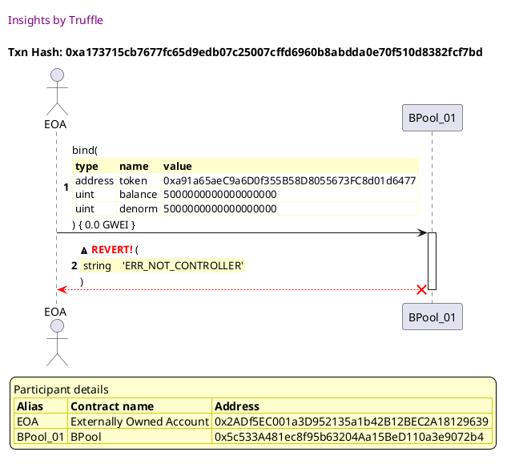

##### d2, tx: 0x9da69bc5e766dfc9d6b35d662e17dd03052884061a3dcd77089a024401070f02

[SVG :telescope:](https://www.planttext.com/api/plantuml/svg/VLHjJzim4FxkNt43QMnbR7OIvmLr5Nr91nAYgAks3sD2JkoKYDIf71TQwFxxhcceogRDYdps-VBuxfud8UIiiiBOnQmWH2nigHUpH1bItUTwBeoOGQ6cIikUIE-dfbnesI-Bqi3XC1x6_PYGTcLNXUeGgCUT4b8PU6ws0EUboPzARKNHBVAfdYbj4J6pku0X7cuXvmipBzIhWw_vamBcxNpNGifSJu7HnlMhjkrFJHAakVz2L_dqpbQGh61Y5bc6kCJcjb0mMMeu5zNTAT1b98KV9IbNWU_BB8sadxXS-hwZM20bTIbtmj2ZFXEkJ6KGq30IrF4yocX0C-eGR5bgCVLur0LHmG7Q0u9jitcQpmMMshiko-AMilhqPND0I1q99vqz9nmVdu9HIQxbknjzGzfDYpyqjhF-37OrLu1MYrbj7qInmCKcV0tO6wEg2jPWotkbqTAbY9ZmkL3zIFW3chcSztWu22ddVk0E-w6aJFfU4BnWB79CUWs9A8HE4Hau_Mly4IkLBitiVw7luHdeHmfVliSNoDXUoSkJ7uT6oP-RHcmxSd8AxRUFmcYakGFjT2isZEcqMkFuMpoUl6crsfzgVmV-qIYehDd8P0tu7CNZyUtLQ7BR7rrDngFBotXyrEH5f4B-yWTXrIjsjf8drtj4IcL5NbHxbmte02lSi8BAHdfnqKV96aJSyTDzeMJt7YQt4GlEIwkC5aMnWj6ZLXAwQOgVbwrfSxg3ZCTzIb5vWuWxpEM29PxJOqulxZjT5Z8dyjteDV1ERCsoXk8fTzsk5pALXbd44zzrgDSLZFVKW34gN1NHm4ayXCAQcyh96SxuI_WD)


```plantuml


@startuml

autonumber
skinparam legendBackgroundColor #FEFECE

<style>
      header {
        HorizontalAlignment left
        FontColor purple
        FontSize 14
        Padding 10
      }
    </style>

header Insights by Truffle

title Txn Hash: 0x9da69bc5e766dfc9d6b35d662e17dd03052884061a3dcd77089a024401070f02


actor EOA as "EOA"
participant BPool_01 as "BPool_01"

"EOA" -> "BPool_01" ++: rebind(\n\
<#FEFECE,#FEFECE>|= type |= name |= value |\n\
| address | token | 0xa91a65aeC9a6D0f355B58D8055673FC8d01d6477 |\n\
| uint | balance | 5000000000000000000 |\n\
| uint | denorm | 5000000000000000000 |\n\
) { 0.0 GWEI }
"BPool_01" x-[#red]-> "EOA" --: <&warning> <color #red>**REVERT!**</color> (\n\
<#FEFECE,#FEFECE>| string |  | 'ERR_NOT_CONTROLLER' |\n\
)
deactivate "BPool_01"

legend
Participant details
<#FEFECE,#D0D000>|= Alias |= Contract name |= Address |
<#FEFECE>| EOA | Externally Owned Account | 0x2ADf5EC001a3D952135a1b42B12BEC2A18129639 |
<#FEFECE>| BPool_01 | BPool | 0x5c533A481ec8f95b63204Aa15BeD110a3e9072b4 |
endlegend

@enduml
```

##### d3, tx: 0x7bb84d643d5298f17422eda0b4b13934404760d70e1054db954e4dd76d68416a

[SVG :telescope:](https://www.planttext.com/api/plantuml/svg/hLHjJzim4FxkN-61D3PUXXtRUK5THTgcez944KERj34XftPBHkfKZWCjiF--InggecdV5YK--ruU--uU1w7JqadhgdcEaAnSOQfvgYqgxpApa5RESQvdsgYUdDpDR54PrI_omkBTOJ9C-Wb2dTAjSjr5k7bkjLJQugTsYV5PORF7mZYPntasCtDj721EtSPX2COrvAAoYro_Cdp97ZMcVAExa4fbPeOfQLM_6zavRW-1slr7fincjwx4wGfVsMew1LpaCfThVBKq-4oMjoUOB8Cq3RdoELF2Yy8f3RZdQIL9obFA8iOvuO5FL40q9OAhD19SSwK2N_aXfxv4KBA9WwCdunZB4k-0t45GDfTDieM4L7iNHP7V4DfONnOx23MU-AYxfSG71oVuLv6PMl7ksboZJblamrPsdpzYjrfe3DB8UIFlPLx1f7P_nbK6MpxZ1G34S-YL6rVrcfA_dfS8QQrSWSjSBjSHvSZK4LG4aKV2o6C1epw5n3qc0XA5Wf3G3uE81A5WdXz58VTzuNDIVopY8X0X9oI8AADUvBCeOkBmPJVSlFyNV8tz7ZzXye7WJz-I4P1YgwhBen-xLgkVTQtNHJywmPst3z8QO58NToPhFeDFTt__ClcQN5wzsT_l73VwBlv79t3fRCt49gEzvFBovdnyTJCSdSUVHz-JmLvxBAGqC2Ixbqw_wl_wKg6BBQeexMIMbrjx3SW0MbLt7UuE40WcVRWK5X0t_O-Lihe4soOEpbRJ4SQbqzR8F5_XyOFH2iUJITrYC96b5m-c8kaJGYKRHCAZJ4YQSgz7lLxIzs8QhYly6dX3vtRQG8c9O2pc8TMJS1g9r6SUuR6aegS7b1B9D3JKIpb0GSvjvkWKHlZf_040)


```plantuml


@startuml

autonumber
skinparam legendBackgroundColor #FEFECE

<style>
      header {
        HorizontalAlignment left
        FontColor purple
        FontSize 14
        Padding 10
      }
    </style>

header Insights by Truffle

title Txn Hash: 0x7bb84d643d5298f17422eda0b4b13934404760d70e1054db954e4dd76d68416a


actor EOA as "EOA"
participant BPool_01 as "BPool_01"

"EOA" -> "BPool_01" ++: joinPool(\n\
<#FEFECE,#FEFECE>|= type |= name |= value |\n\
| uint | poolAmountOut | 1000000000000000000 |\n\
| array | maxAmountsIn | 115792089237316195423570985008687907853269984665640564039457584007913129639935, |\n\
|  |  | 115792089237316195423570985008687907853269984665640564039457584007913129639935 |\n\
) { 0.0 GWEI }
"BPool_01" x-[#red]-> "EOA" --: <&warning> <color #red>**REVERT!**</color> (\n\
<#FEFECE,#FEFECE>| string |  | 'ERR_NOT_FINALIZED' |\n\
)
deactivate "BPool_01"

legend
Participant details
<#FEFECE,#D0D000>|= Alias |= Contract name |= Address |
<#FEFECE>| EOA | Externally Owned Account | 0x2ADf5EC001a3D952135a1b42B12BEC2A18129639 |
<#FEFECE>| BPool_01 | BPool | 0x5c533A481ec8f95b63204Aa15BeD110a3e9072b4 |
endlegend

@enduml
```

##### d4, tx: 0x84ab334ee437e394494c25b66ba14d420a95bf4dcfef80fa1f84ed66c6d8bded

[SVG :telescope:](https://www.planttext.com/api/plantuml/svg/TLDjJzim4FxkNt4hqjWA33jnIekwYhHDHwM9egxQf052JkoKYCIf70TQwFxxBcseYgPPaS--byTtprq8kIYiCBRCKa94QNDTPg4of7XCz48OaK6gvahBleWUvoOljHpaQMxWO1ICWa50IBUmgrJr26pMWn9I6NYjhm2NkKbUScr5wgV9N6TAMqICxSvXXCOjvA8qYrIzC_n8NXGmljDT2oaJFGT6QzMVZUoUracG-lsnBfBvWoqWNC7Cb76CkCGcDbKmMsgu5CN3ET1bculGTRbIt3rJReVp3eySBsorGi6uv0uL7I-CkOnY5RTfB5ZSvagsMb5BjaEf947A8ekf1nCVH04Db0s2jDaaIXO2I-rVvtbwJzd6-dPf4BBnX9FUdXAEZiv1BHDRAJxTwblIhKa-hcLl_HNiQg40fHRPHZw9jCH3vRw6Ci4drx1003_3NjcnnYkZ_wot066CMA5BbkXjG34fAuGReCT0uMxhznbUWNwXyErNC4R6zr9UdjmS62NlgaAs5PsSG_VZip0QszI3RhGT5lJfDPlJu6SmdNreDhkd6tqF_bCc5DPKRLu3VeV1T7f_DPdTZyPN_lVnxs1uMAT5f4BwaoTXrJjojnDBhlVw89KLILhilJMaGoIYeXG74xk3Xm5Ed4747Rc-b4OLQDl5OMvLht5VMcMqIDCLJ9wrak17KKKWckZIyOUn5mmePS8TTZo7kPvW8NVwpEa70yTdRUPqMcxdFV1kLkhZ1igBFDVrUPkfg1tZDBPSXt9VCA-lXenHuQeEFND2Zb1OSrqvkS0T_-Y_)


```plantuml


@startuml

autonumber
skinparam legendBackgroundColor #FEFECE

<style>
      header {
        HorizontalAlignment left
        FontColor purple
        FontSize 14
        Padding 10
      }
    </style>

header Insights by Truffle

title Txn Hash: 0x84ab334ee437e394494c25b66ba14d420a95bf4dcfef80fa1f84ed66c6d8bded


actor EOA as "EOA"
participant BPool_01 as "BPool_01"

"EOA" -> "BPool_01" ++: exitPool(\n\
<#FEFECE,#FEFECE>|= type |= name |= value |\n\
| uint | poolAmountIn | 1000000000000000000 |\n\
| array | minAmountsOut | [ 0, 0 ] |\n\
) { 0.0 GWEI }
"BPool_01" x-[#red]-> "EOA" --: <&warning> <color #red>**REVERT!**</color> (\n\
<#FEFECE,#FEFECE>| string |  | 'ERR_NOT_FINALIZED' |\n\
)
deactivate "BPool_01"

legend
Participant details
<#FEFECE,#D0D000>|= Alias |= Contract name |= Address |
<#FEFECE>| EOA | Externally Owned Account | 0x2ADf5EC001a3D952135a1b42B12BEC2A18129639 |
<#FEFECE>| BPool_01 | BPool | 0x5c533A481ec8f95b63204Aa15BeD110a3e9072b4 |
endlegend

@enduml
```

##### d5, tx: 0x564824bd2f8222c6791510f3233a004861e56f309afafdbfe715d0585ac1c1a4

[SVG :telescope:](https://www.planttext.com/api/plantuml/svg/TLDjJzim4FxkNt43QMnb3DjvHrr5cgO32L7KLTk7CI4dSKf4wbIE0orq_ttND5JmOL7aiy_dnyyzToRal3P2csPH4Y8QKwbcaKXDweT2BOKM2oZbNAfiADA7kQuQbKLLMMau7CVZE8e9wTTcNSe1WVQxboAJ6bww9S15fOldIXbHXcKnLmkf32BcPXymniqTvBBHorA-s_XHF4jWzjvt8xAiK7DWj7FzRMt_j2D1klilLLtCxqqDoHfckibpn2McCAM4sKh1XQZlpu2k7DVskPraFFSvvwdh1SnXDBUuPGbARTzbqd5pYmOY5tcMvD9ZJaOTtn4fIvcm2KgM6gGUJq8GDHoWFI0ecodIOYamrU5DLPLtbBMxhui3Gjf8E1cySSBnyHaqAYbKzkbMtP9-9_6NpWusty2ibnBGAh5exQCe6vnimpU0scXPrx01Kpr8XPQkNCyTEoaVIr-6iIqzdcT1D1e5eUU75lKYEsVUSCZf3kCpl03zIk7xh_WIfNt3RNNo-r3BxC-MyOxwoHdqFpu9hR0U0-Ydkwx0c46lDur_njFPXrwlVzhw1_2VZA0sUblF3U1_54-dTzUJsLqqkPvD9rTNyVIeuqKoYK8NZyB8TpBkUfFSl54yaqOKPVtciX4TKKgtyc4BOXrm4c5lQKJS2nc-QhS_X-IsLSLnPQHMeYpNC7bICeCmJV4Tc5PV7evo9uuePS8Q1GvdbYDOOlCXuyCuuY7p6GzSAtWFlE-ARjf2EQbZMQ7jCvdwUU0ahiMf7Ghc3EM8CIei6L2F9pP2OSvTvkGSHtox_m00)


```plantuml


@startuml

autonumber
skinparam legendBackgroundColor #FEFECE

<style>
      header {
        HorizontalAlignment left
        FontColor purple
        FontSize 14
        Padding 10
      }
    </style>

header Insights by Truffle

title Txn Hash: 0x564824bd2f8222c6791510f3233a004861e56f309afafdbfe715d0585ac1c1a4


actor EOA as "EOA"
participant BPool_01 as "BPool_01"

"EOA" -> "BPool_01" ++: unbind(\n\
<#FEFECE,#FEFECE>|= type |= name |= value |\n\
| address | token | 0x676F5c2Fe8eAE4e72fd9CDD9A78A307C4f17BB20 |\n\
) { 0.0 GWEI }
"BPool_01" x-[#red]-> "EOA" --: <&warning> <color #red>**REVERT!**</color> (\n\
<#FEFECE,#FEFECE>| string |  | 'ERR_NOT_CONTROLLER' |\n\
)
deactivate "BPool_01"

legend
Participant details
<#FEFECE,#D0D000>|= Alias |= Contract name |= Address |
<#FEFECE>| EOA | Externally Owned Account | 0x2ADf5EC001a3D952135a1b42B12BEC2A18129639 |
<#FEFECE>| BPool_01 | BPool | 0x5c533A481ec8f95b63204Aa15BeD110a3e9072b4 |
endlegend

@enduml
```


## Fails calling any swap before finalizing
[link to test...](http://github.com/balancer-labs/balancer-core/blob/f4ed5d65362a8d6cec21662fb6eae233b0babc1f/test/pool.js#L213)

##### d1, tx: 0xf7ff6595a3a6e75be565eb7f0313dd09ef53ea73139613816344128d0de83e4e

[SVG :telescope:](https://www.planttext.com/api/plantuml/svg/TLHjRzD84Fw-ls8eqW7b2hksrozLBi9n78Y4hb7f7H-EKpMnnwbLPntPQvf2-UzC73TgGLrPExExiy-yFMiXthKM6zkjAo6mixNfrajgH7jTcWqsk8QALcJo2MRNgwRkJ9xKLTt0yrawIvDKY55hRoiQ2-Z75M5E3NmVbW0VwgRyLXkBLLoLAxCcOncni0U36H_k8JTTiwdeqS6dyXk1yWvx2yppqgn0oM7hHoz7RuSWnE1_RjfoTMLRMDx2HTCL1UCAMzgAu69hu0EsLwSWjqLG5BwEDBheKw2Nf7rDow2GhdBpN4PKQ9Smu5NaApTKlkjvoWbpcLFeaiUO0ZFBeQTdCM0BHooF19VDbbcvGKvrigZhwbAg_lH-SIH4RmadumURyFhrARGtk4ct31glkTPsRbv-CL_4QAZsduCSt_q5zdP3mDBWkfTViUfOsPdV0PUfeRQ5Ex3rDPcvOKrkCLBeQwGaGdyg2rVhYGwdeTJQ3znPmdcftFU2u1wbApc30U8-7buxMluwdl1xrjdUiH_uCvqvCmefJZqAd2AFakaqYeCmTcMGU8KA9XD7_k9uNGvkzpXUyBlZtwxWTj6K6Ut2bF8fyrVm7UGR2Uy_ftEcq8CUR4_-UzvG_l-kC_iMdPp2w8yRR0ppRWoZRCz-jXaV7v-d_wRd5y-EZqTl-_qnFD4kQ6spu-qTyFSYFJ-__FGvNbp-VNPnkVXdyd6Ul1W24pbnyyklQEaHN_QFK2mUK2idYsNLFl0sbLDESKSEVcjCE5OIVaGD8nve4jztw72FezlHb-UjfSPWLTt2sOsX7E8isrM_Rw5oANAq2WDoqX3Z42UOUfeq9ddagj2Bfu5QBaFlCV21_eFQG-bCksxiXOgoi8ZqqdSTwSMez8IcIabaJp9mbZiepdd8NBpZcNzIFm40)


```plantuml


@startuml

autonumber
skinparam legendBackgroundColor #FEFECE

<style>
      header {
        HorizontalAlignment left
        FontColor purple
        FontSize 14
        Padding 10
      }
    </style>

header Insights by Truffle

title Txn Hash: 0xf7ff6595a3a6e75be565eb7f0313dd09ef53ea73139613816344128d0de83e4e


actor EOA as "EOA"
participant BPool_01 as "BPool_01"

"EOA" -> "BPool_01" ++: swapExactAmountIn(\n\
<#FEFECE,#FEFECE>|= type |= name |= value |\n\
| address | tokenIn | 0xa91a65aeC9a6D0f355B58D8055673FC8d01d6477 |\n\
| uint | tokenAmountIn | 2500000000000000000 |\n\
| address | tokenOut | 0x676F5c2Fe8eAE4e72fd9CDD9A78A307C4f17BB20 |\n\
| uint | minAmountOut | 475000000000000000000 |\n\
| uint | maxPrice | 200000000000000000000 |\n\
) { 0.0 GWEI }
"BPool_01" x-[#red]-> "EOA" --: <&warning> <color #red>**REVERT!**</color> (\n\
<#FEFECE,#FEFECE>| string |  | 'ERR_SWAP_NOT_PUBLIC' |\n\
)
deactivate "BPool_01"

legend
Participant details
<#FEFECE,#D0D000>|= Alias |= Contract name |= Address |
<#FEFECE>| EOA | Externally Owned Account | 0x13e925187e2E8aA8aBaE45e5aCd93184AD71bb84 |
<#FEFECE>| BPool_01 | BPool | 0x5c533A481ec8f95b63204Aa15BeD110a3e9072b4 |
endlegend

@enduml
```

##### d2, tx: 0xfe865055f9aa68cc7e4427ac2808993fb196106ad2f1d59bfebfbea77c00c000

[SVG :telescope:](https://www.planttext.com/api/plantuml/svg/TLHjJzim4FxkNt5ZqjZOsEmapWlgAj8q7PMcKG7RFcmJkYHEYKYTAd6WlEo_xvg62fYmBD_PlZptzZYC7JO6QzCkIiQmDPLk5ucgMNDPw2NMk81IpPNEHfXUpkkgrLbKbLKDhoVn98vYnWQDkIdLa44tBXHcgeQxVWjmLDN5RQKDbc5PpFL2QKE8kTaQJEXo0xbiwsMfdboS5hSAXBCzcs6M5NeEWlT7Vpiv-DG7mNh_KzqKymlJG783PtMRvuJBJ65A1MSh3KVON1m0N-NAToMNCWyGNJzDFUKubeUfvNC_2Emy4O4hk8kPbOjC1ackaZnHw7afvpGvevAbXaAFZqF01dP8xZ0gcodIOecKwcXMLUKv5ztjmsQ7iSuIzeUF3k7z-mDehd4PhmWqN52jpLI__Qr_iq5VxG-z7Dv_1dEpL41IuwAJLrYsfApDxu7ALAkcWNimrQNIKqqQNxcUEv6fDL6-2cD7ULQU1T5u78IU7zhSYvnSUAEHnHzGse8ow24Uug6z9VdpyOBVuzPqZZ4Gw4fKKO3kcEUsb2FfZtsglElPayZFkCXSn_EUELuKlTiDZkFzx_Xvh0jSpUeYLUimEN_9_1tS0V_8uSlFU4eKUjI3rVwlrxNA_gmxisdH_W4CtbnZhObtGnYa6_QJpN1lxoJ-4P-SlThR6tpgpeVmGhkWCVMQj_T0SpS-EJa__HdEphyTdvtFle--JgFTFZ2MAMf-SOL6FU7BvX6osIDgPSfWKJQFl8tvc59SauFU6X6Eb8WUKKs8Mvg43ntQVaVHhUbBwygeMcDPti3njLOPX6cwhdxNGc6hm9B2zvGL-nZwECBOaKfYb0Msy9rmx8aayPsdm5lwzse79LDfsw7Z2vNwUI0JrxQu4wAG8pKMWYDvufwLhA4evpvpTaWh_QJ-0G00)


```plantuml


@startuml

autonumber
skinparam legendBackgroundColor #FEFECE

<style>
      header {
        HorizontalAlignment left
        FontColor purple
        FontSize 14
        Padding 10
      }
    </style>

header Insights by Truffle

title Txn Hash: 0xfe865055f9aa68cc7e4427ac2808993fb196106ad2f1d59bfebfbea77c00c000


actor EOA as "EOA"
participant BPool_01 as "BPool_01"

"EOA" -> "BPool_01" ++: swapExactAmountIn(\n\
<#FEFECE,#FEFECE>|= type |= name |= value |\n\
| address | tokenIn | 0x676F5c2Fe8eAE4e72fd9CDD9A78A307C4f17BB20 |\n\
| uint | tokenAmountIn | 2500000000000000000 |\n\
| address | tokenOut | 0xa91a65aeC9a6D0f355B58D8055673FC8d01d6477 |\n\
| uint | minAmountOut | 475000000000000000000 |\n\
| uint | maxPrice | 200000000000000000000 |\n\
) { 0.0 GWEI }
"BPool_01" x-[#red]-> "EOA" --: <&warning> <color #red>**REVERT!**</color> (\n\
<#FEFECE,#FEFECE>| string |  | 'ERR_SWAP_NOT_PUBLIC' |\n\
)
deactivate "BPool_01"

legend
Participant details
<#FEFECE,#D0D000>|= Alias |= Contract name |= Address |
<#FEFECE>| EOA | Externally Owned Account | 0x13e925187e2E8aA8aBaE45e5aCd93184AD71bb84 |
<#FEFECE>| BPool_01 | BPool | 0x5c533A481ec8f95b63204Aa15BeD110a3e9072b4 |
endlegend

@enduml
```

##### d3, tx: 0x20e8a3c1180cfaeeb2d99be5b54ebafbe650e1099f64bbbc17834a7380f739c3

[SVG :telescope:](https://www.planttext.com/api/plantuml/svg/TLHjRzis4FxENt5BWNLBbvMKHBq4db5PbjS0msAasVfX7OAJT7A4o9GXKOtJUlzzPranaXOX1DtnU7hkxQ64UDTPR6s_heN0tZQcNsVKYkwkCXjiSGqrhSWKCyplLctJco9fwgQ5LujqaIQf49FEFjGq5J2iMyA2MlWwRW7UDstrfJ4MwxYkLcPDnZ9YQOyE2puyG6xwTbFJiuCFrHS2vHrjIooAogn0oT7qto0dRySan1Z_mdJLwjPsa3t0TTkN9UCAMzcQu7fhu3rsj-SWjuwa4DrSgL3c9H9bJX556UbCUvHXcP6l9IaPHQNlPLcMgo1qFGpSK9Q16-Mku9RbbbDFBsF03avOdWXkcwtoQeDSwcpPDFMDLCFfu-P4YC4JpgPFZF3cpJbqzxX9jmmQhxdNzhAtFtqodyHaRFSlevpkVWFxi25WQN0zoCzOzwpitNV0VMgfws07jhaZSs5OarkC5FeQAOdGdylIrNgcmtaejVO3Tv64XLI5xmN18qfVSGaxMEFsaCu0usZvxNeXAcS_XFK3Vw5pPq4XnQb7WLCMKJAVHt4GnguC4gzKmMpco6_23XZ7Fh312xuFBR_FTTbMEUqJbV8bzv_XAyXV9Vp-CRrW3ZqPmlRidrSj5V_kHtEOqTavJ7wynzOmyQOmoG_qPv_fwUbL-dTwTVt3wUdaxM2VmWlZWiwsU-BkW9_NwTNLpOUFyVBcpylhc-LVipykajTZOg8Wddxr6Iqz8ypX5ehb4suLPB6gkoVHvdBE9Ux9mPUD6STAmhUePSGZJUB76Hs_u-ps_ENtrb9hiAuVuFBUK05ndk-xFmnHkHGvMeK1EMc8SOWpJ3rD6fCYSbNenVD0PLdeFGS-ydzK1oYTQzUDlL1H7fQHpdpNaLwCIizehfH4ZYG39zj3SSrZvU8Tl_alzJy0)


```plantuml


@startuml

autonumber
skinparam legendBackgroundColor #FEFECE

<style>
      header {
        HorizontalAlignment left
        FontColor purple
        FontSize 14
        Padding 10
      }
    </style>

header Insights by Truffle

title Txn Hash: 0x20e8a3c1180cfaeeb2d99be5b54ebafbe650e1099f64bbbc17834a7380f739c3


actor EOA as "EOA"
participant BPool_01 as "BPool_01"

"EOA" -> "BPool_01" ++: swapExactAmountOut(\n\
<#FEFECE,#FEFECE>|= type |= name |= value |\n\
| address | tokenIn | 0xa91a65aeC9a6D0f355B58D8055673FC8d01d6477 |\n\
| uint | maxAmountIn | 2500000000000000000 |\n\
| address | tokenOut | 0x676F5c2Fe8eAE4e72fd9CDD9A78A307C4f17BB20 |\n\
| uint | tokenAmountOut | 475000000000000000000 |\n\
| uint | maxPrice | 200000000000000000000 |\n\
) { 0.0 GWEI }
"BPool_01" x-[#red]-> "EOA" --: <&warning> <color #red>**REVERT!**</color> (\n\
<#FEFECE,#FEFECE>| string |  | 'ERR_SWAP_NOT_PUBLIC' |\n\
)
deactivate "BPool_01"

legend
Participant details
<#FEFECE,#D0D000>|= Alias |= Contract name |= Address |
<#FEFECE>| EOA | Externally Owned Account | 0x13e925187e2E8aA8aBaE45e5aCd93184AD71bb84 |
<#FEFECE>| BPool_01 | BPool | 0x5c533A481ec8f95b63204Aa15BeD110a3e9072b4 |
endlegend

@enduml
```

##### d4, tx: 0x673dd66c9ae99eb094367f36b6358c5987c0575a4aae0288e455bfeb2f360977

[SVG :telescope:](https://www.planttext.com/api/plantuml/svg/TLHjRvj84Fw-lsAQIjTUshJBo_8I-QnYZDj8fukLvguVhbKqmE2WuCM29N5Qtt-_0HChwLrMYDcT7PvvUmOXFhG66zEjAo6mCxNkrYarehqfzGORN4D5AzBv3BERLLDtEe_hgcxWvI9P974YnAGrznLD1GphcZ2d1dwCHu1FTLD-hxN1AghAbLwJDenOc8F1WY_ta9kksLJqvE9p-Pt0SW-w9UPvgLTWoL7rpo0dxySWnEZ_JBVbwjgqaDx3PTCL1UCAKvgAu7AhuHEsrwSWjvxlvBddPI5I658gGzVn_CBnKizHGQR2mC-ayXMwY2Jj821NgRIWr6OR6Vg-u99bXaDFpYF05evO7WakcocpSeESwcnPrzMLj8RRXyEH48Cbd4mVAU7DcrDext2JR1aqMdEjpNbdNd_LNyLaBFVRKKvtlu6vtn2mrBWUv2rM7MzwynrmdHfgMzY1gMz8dsdUzVbw2vNP2meeIbpoxI8Fu_ayZFmWSgGVkuNbpsQsV43fIavX1slSxiCPO6mbVrxFUENe1xSOMkWff3X4RouBHwcP2kQ1L8eRi8Y3N5gvv_h-Jsu7Z4CTME7w_tNzFx4kcpAZFb0fdpF_5Nw0V2VXuvVaZ3dqg0dRaxzVDfH_wrkpxz79AKn-kSD6C_6cCCdsz6URwV7nHV9NSd7vulXuydxGJ-6PTa5hcfwuE-3dLN9nSVNvIxIy-kFyychvv-pti_ZL69Z8YRjVtgAX9uJPJw5OFk9MJWRBgdtaRIxdd69F3XusPXnlOfwYXX4FD8aUUdJuZgFh-SllhQ56OrNTm_cTfXoYBEkhFpJHSYYqbHNuP2S1HW7EC74LAOppqB42DvhxLfe6xbFW0__7xG2bCkKuaHjOb0L5g7ZQREb6QAaPpIrB8dkIlftsK9ppcBdum6_-I_qB)


```plantuml


@startuml

autonumber
skinparam legendBackgroundColor #FEFECE

<style>
      header {
        HorizontalAlignment left
        FontColor purple
        FontSize 14
        Padding 10
      }
    </style>

header Insights by Truffle

title Txn Hash: 0x673dd66c9ae99eb094367f36b6358c5987c0575a4aae0288e455bfeb2f360977


actor EOA as "EOA"
participant BPool_01 as "BPool_01"

"EOA" -> "BPool_01" ++: swapExactAmountOut(\n\
<#FEFECE,#FEFECE>|= type |= name |= value |\n\
| address | tokenIn | 0x676F5c2Fe8eAE4e72fd9CDD9A78A307C4f17BB20 |\n\
| uint | maxAmountIn | 2500000000000000000 |\n\
| address | tokenOut | 0xa91a65aeC9a6D0f355B58D8055673FC8d01d6477 |\n\
| uint | tokenAmountOut | 475000000000000000000 |\n\
| uint | maxPrice | 200000000000000000000 |\n\
) { 0.0 GWEI }
"BPool_01" x-[#red]-> "EOA" --: <&warning> <color #red>**REVERT!**</color> (\n\
<#FEFECE,#FEFECE>| string |  | 'ERR_SWAP_NOT_PUBLIC' |\n\
)
deactivate "BPool_01"

legend
Participant details
<#FEFECE,#D0D000>|= Alias |= Contract name |= Address |
<#FEFECE>| EOA | Externally Owned Account | 0x13e925187e2E8aA8aBaE45e5aCd93184AD71bb84 |
<#FEFECE>| BPool_01 | BPool | 0x5c533A481ec8f95b63204Aa15BeD110a3e9072b4 |
endlegend

@enduml
```


## Fails calling any join exit swap before finalizing
[link to test...](http://github.com/balancer-labs/balancer-core/blob/f4ed5d65362a8d6cec21662fb6eae233b0babc1f/test/pool.js#L232)

##### d1, tx: 0x309b4d0c3f31ce573eaef62dadf1c50897b813f2a81769b23e79801f2d4b845a

[SVG :telescope:](https://www.planttext.com/api/plantuml/svg/TLHjRvim4FxkNt5hfRsawse33b1bKKb2raXJKsNH9csTAeDDoafC1APDN_RVTn0IfPLc8Su-dn_VFSy18MUb4OMfbXaXeZAvhfQHAaXvc-gLACGIChLGMWv4VBieyahBOPxb1HoEmt4u30dfbUOXKtq2pRXHGge2djebm7bUf8-vDY8BidIXbqeRH4pCBc2Ccnl8LLMiClLYurlwg80vEz-ba3BL2s2qTVrjRE-aJOAqzqzqcIvkJ0dH0yoBAaaGbvZKP0hcQmtdehmv1RgsgHyvaiPsOhDOSTTMGYLTImgPi9XJptSZZzc99JpcTlt8ifNhUvGbbdGYp-6286MnmTJ3QG2YX0Eq1mHfCscShWIMEhZCy-oQicPtkpWWf8c4u_wU4uwEJk5FdkhoNgp2jL653fP8k9dezrVwYlHQoZ-sjl_y6Sp3IW5QBPQDlHDPXPCw_1cGgqAL9Jo3oM-LdcYSqRNmcUXoeOQ-w8veOdC-uDx8evntNNiyz2HbikkuxXQbIh6C5cAR3wujJb-FLoUMgQvBsvoPLhMh3Va0Jq0_KVZo8voWWdiKh8z_7HPA_gw9sJ1qV0gzj_UYq2Xx7thnflamfj_fpCBluMp-fjFfdJJ-Flo7A2XDKRVDC-3pBfpDhY-cy-lnv2BuElaPZjwrQH6fKCxqJXZrGgpD5q0kztILoeWqA_Vk6j4HSb2BWesEQkDaY1rS8E9Edc2hoEuSvbRt3huRmKMMFS3qNYi9GHpNn3MQCLlv5cUUgwpG4u4d1Y9qkE9YA7sRUKumSbc47VaIUDTxxRI1uZ6txS3nc8gznETHrxQe4mZ61sh461Lu4tMjg8R2cjlAoHc-yG_n3m00)


```plantuml


@startuml

autonumber
skinparam legendBackgroundColor #FEFECE

<style>
      header {
        HorizontalAlignment left
        FontColor purple
        FontSize 14
        Padding 10
      }
    </style>

header Insights by Truffle

title Txn Hash: 0x309b4d0c3f31ce573eaef62dadf1c50897b813f2a81769b23e79801f2d4b845a


actor EOA as "EOA"
participant BPool_01 as "BPool_01"

"EOA" -> "BPool_01" ++: joinswapExternAmountIn(\n\
<#FEFECE,#FEFECE>|= type |= name |= value |\n\
| address | tokenIn | 0xa91a65aeC9a6D0f355B58D8055673FC8d01d6477 |\n\
| uint | tokenAmountIn | 2500000000000000000 |\n\
| uint | minPoolAmountOut | 0 |\n\
) { 0.0 GWEI }
"BPool_01" x-[#red]-> "EOA" --: <&warning> <color #red>**REVERT!**</color> (\n\
<#FEFECE,#FEFECE>| string |  | 'ERR_NOT_FINALIZED' |\n\
)
deactivate "BPool_01"

legend
Participant details
<#FEFECE,#D0D000>|= Alias |= Contract name |= Address |
<#FEFECE>| EOA | Externally Owned Account | 0x13e925187e2E8aA8aBaE45e5aCd93184AD71bb84 |
<#FEFECE>| BPool_01 | BPool | 0x5c533A481ec8f95b63204Aa15BeD110a3e9072b4 |
endlegend

@enduml
```

##### d2, tx: 0x03069c45cbda096d800573346b9c6f919885f2e15f1bfbcd34f97d30d93938b0

[SVG :telescope:](https://www.planttext.com/api/plantuml/svg/TLJnRviu5FxTVyLR9zrstRhP68DTPT58GcwHfhRgLJlfjbDbmAIin4HWsdJD_lTx41gbauR0ptwsl_VylSyGyh5nkdRjgYH4jwwoxIenDMbk2xlMjLv1QPR6PXETtYxhghNPj2gh6bxEutayZGaPDUwXD6C2_NDZT6PgU1o609-gklXHMQVBg2oMTcMiGyJSxHVCSN87kMxhTMcUJVnT_330_BtlGcTPOPV0wE3wsTlH-o49CiHVsAPOthW6aWUugjiyHrpY2bSQkDfO-AIRcrEW6yffe59Vf4ccgGeoIQa8EVU3HAL1hfYIKkIUOI9dIPwa6VTp5MQSPeehBXDAaBBKOUhnUGIwWIEqHmHfSqLQh3KUTN9HLUKrPVtiq-28a7ubd8mFdF3cpIbyhmhRtEjrvunMIBSxRzthR_OR6GsClntiUFi1tCFQ05ghLxszqsMBdMxv5f2gsZGDRC5LjyOkBFReHYkc0w7DLEbWHdCkn4J8cQH2126VJsL6MHRuOVY4qXPuYYsi3_F1iIVehyylErPwizlG1sPCXCgZKdayv2nWIlWU5o5L4e5a84D5Gocu5oWb_I0GWK-xZojVX4Bwb8QASUQfW2l5nIxKd_08z1s5l_w95oY40oOt9rzVrYRxh-DtH_J9AOp-kDUrHVMCOPJkD8nhniV7b_6N-FBgnV7nw7tl7yDl28V6rPtwje3lg_Zoylhi_EfwlZYBFY_-ZMUlXhH8Pb0LnPrsvbdDTnU9N1p88pDE5sLp46j6PyXbLroyBoWQx4pn8jI8k2zpz5JP_JxChPCWjXjdQglByW7Exwt984hJhWXzxHatoXDCXiQBfOwadkZO5qReAGgQIJ-QXIn9fFySU2_XeTj3YLHm7lcIcLJcIYG1zwWVQIOcPiOOrHY9XbxIGU6PXvEJZzZYZ-P_)


```plantuml


@startuml

autonumber
skinparam legendBackgroundColor #FEFECE

<style>
      header {
        HorizontalAlignment left
        FontColor purple
        FontSize 14
        Padding 10
      }
    </style>

header Insights by Truffle

title Txn Hash: 0x03069c45cbda096d800573346b9c6f919885f2e15f1bfbcd34f97d30d93938b0


actor EOA as "EOA"
participant BPool_01 as "BPool_01"

"EOA" -> "BPool_01" ++: joinswapPoolAmountOut(\n\
<#FEFECE,#FEFECE>|= type |= name |= value |\n\
| address | tokenIn | 0xa91a65aeC9a6D0f355B58D8055673FC8d01d6477 |\n\
| uint | poolAmountOut | 2500000000000000000 |\n\
| uint | maxAmountIn | 115792089237316195423570985008687907853269984665640564039457584007913129639935 |\n\
) { 0.0 GWEI }
"BPool_01" x-[#red]-> "EOA" --: <&warning> <color #red>**REVERT!**</color> (\n\
<#FEFECE,#FEFECE>| string |  | 'ERR_NOT_FINALIZED' |\n\
)
deactivate "BPool_01"

legend
Participant details
<#FEFECE,#D0D000>|= Alias |= Contract name |= Address |
<#FEFECE>| EOA | Externally Owned Account | 0x13e925187e2E8aA8aBaE45e5aCd93184AD71bb84 |
<#FEFECE>| BPool_01 | BPool | 0x5c533A481ec8f95b63204Aa15BeD110a3e9072b4 |
endlegend

@enduml
```

##### d3, tx: 0x52d0be0da898ff936ea677a0dc2d67cb976b186604148f619a12be863282a479

[SVG :telescope:](https://www.planttext.com/api/plantuml/svg/TLHjJzim4FxkNt43QMnb33kl3kegqZOTbIQAEhH96nEwn6w9I9qgSQ25xh_FIKDLa6P5llFT-NptFASGSbvgB7Iro0Z1IkUgMiIo8ELzgfPOu08oEPTAz36vdnTvfSGWp_823aVHA1f4X7HBlSvaZq2pxYGAMS1pUmIuo8lqALSQip1BvseXbJOPPteNC3BERSfbLImp-ShnFNsIm9oTxGg5IDKS66rDVnlPFMsB8EtxOrMcypjTGho6wwAQpKnUebETIRXUARZ0ykuCwCgr18qb5SW3Ffi5jYVHytsa8h64voTnu7inuvv77URmcSS2P5OikMTRt4B73uY1BD6cz6WI0fPmOEG1CR3fD4cNQ5hjN-LvTajPutqv713IHC99Ryy8nyTd85UfBXznMHl3XO5RZzM76tL3kYtWdrhPstm1lLvAC5BXef4Fc5L6gSCtO90gP5d21dH-BzMaqaQbAmmOUYxAGO3UaCvir-sxVCYfwtg-FHfmGPdm7Dz_ILEbghwutAl772sNlbrlBYnIjOrl7zwwFy8pqCyKllwCneQxlUPN9xyF2od-r91iiJavW-xxHooK8Rm7tMGxTYQcr-bCen_HzFfTfzCzRUmz-0z8KEgY7fWDcEyecavlBoVNjwFnPVXj_2iQ7hLb4I4DaUa3QlcAfktiawizHeNKc6Rbtbj3EZJzruIO4JSy6sLWPhSm6NVKX2zixEwPskgfCVjAoq9XbgrXygYaW319Qk0QkfWj0yjbt9TMn37asCV8SQMB0n7OZ3lXq6Tnp9tNYNTJrwfDAZTnRJjqE9C9dmLkRAQOEY4ojo-7Z54qBr7VYkjKfkUsSt9kTlDl-0S0)


```plantuml


@startuml

autonumber
skinparam legendBackgroundColor #FEFECE

<style>
      header {
        HorizontalAlignment left
        FontColor purple
        FontSize 14
        Padding 10
      }
    </style>

header Insights by Truffle

title Txn Hash: 0x52d0be0da898ff936ea677a0dc2d67cb976b186604148f619a12be863282a479


actor EOA as "EOA"
participant BPool_01 as "BPool_01"

"EOA" -> "BPool_01" ++: exitswapPoolAmountIn(\n\
<#FEFECE,#FEFECE>|= type |= name |= value |\n\
| address | tokenOut | 0xa91a65aeC9a6D0f355B58D8055673FC8d01d6477 |\n\
| uint | poolAmountIn | 2500000000000000000 |\n\
| uint | minAmountOut | 0 |\n\
) { 0.0 GWEI }
"BPool_01" x-[#red]-> "EOA" --: <&warning> <color #red>**REVERT!**</color> (\n\
<#FEFECE,#FEFECE>| string |  | 'ERR_NOT_FINALIZED' |\n\
)
deactivate "BPool_01"

legend
Participant details
<#FEFECE,#D0D000>|= Alias |= Contract name |= Address |
<#FEFECE>| EOA | Externally Owned Account | 0x13e925187e2E8aA8aBaE45e5aCd93184AD71bb84 |
<#FEFECE>| BPool_01 | BPool | 0x5c533A481ec8f95b63204Aa15BeD110a3e9072b4 |
endlegend

@enduml
```

##### d4, tx: 0xa067e736fa1cc89c50bda035d8d5370431f89b33ae1a14228bde8c57ff018685

[SVG :telescope:](https://www.planttext.com/api/plantuml/svg/TLH_Rvmu4FtVdsAQIjTUshGsnjYEzbPbTzbsfQg9Sj6Tr1-A39WD2cjMO9fDc_lk7LYoIYeT0eyzjfzdtZn3oBlMcyPtcueGq_dQTPlKDgIzATtMD6O3bLrRbyzCThDkwixbyxgg6tY-J9R9F25aqlgxoau93C-rDRbjuESu1FXGD-MFsdbJnLMvTXlhF28M_h1WYPDxo6tNR2lxPEBlyeS55XvyvoRFIxS6HaVNVuETl1s38EFvAzUMwslVGde7bqrN58XBVEah2vSx1nzCUtqAT6Te9AtaKM5ObYcT2PhcXdAHgrnmIKFE2gLJperbXeL1eDBSgap8eg1CHKeGf2pp67fo5eDfuGZj4K7QV9cLMuEfpixhkhgYR9Xz61mHCgo4a-aZ9xnwTGfsL_hsrcoJdRUDYpT8k3_h_CklxYkPZ9o_7ktq_Y_mTriBQ9tP3FQxgJhizCll0SbgRDl2FVZwnZh4mIvchPc9XB5pRQ85BRWGCw4MYWeHIRwSgvooF0gbV83fIkSVC0uHeICGzFVdjoqRi-kpsszQEVGm9gGEgD81bvn5J8imu49IhH0CAPMQIYLu46cjmYWIKKZxZ-jGIA52IgLcd0KwubfpiJ_kJ_W9z0s5z_ycAnJ48qPt9r-UDpR_rlEy9_pa52P_t9h6eOgcCCdsMiOrq-FZY-IVvEBosV7nvEtWdyB_q0wjRteLtWE-BvABYwjFPvTNozMd-EFgSx9uCOP5SelgAByRRv_KVd-XoFaZcUJMcx9g7vsre0laioyntXiK3tRcU24QH3mKEtwexs4VnjPB4Tj1FwQgxk3irjaSuYphYp08W76h0y6Kj46YJApCp2IXiCBCSysP2kE5P6cgmgV01ocFtG5AP8BpE5JCPghG8eruGCFOC36p2yQemPEe3D8U2dCUCoVliCKVpYy0)


```plantuml


@startuml

autonumber
skinparam legendBackgroundColor #FEFECE

<style>
      header {
        HorizontalAlignment left
        FontColor purple
        FontSize 14
        Padding 10
      }
    </style>

header Insights by Truffle

title Txn Hash: 0xa067e736fa1cc89c50bda035d8d5370431f89b33ae1a14228bde8c57ff018685


actor EOA as "EOA"
participant BPool_01 as "BPool_01"

"EOA" -> "BPool_01" ++: exitswapExternAmountOut(\n\
<#FEFECE,#FEFECE>|= type |= name |= value |\n\
| address | tokenOut | 0xa91a65aeC9a6D0f355B58D8055673FC8d01d6477 |\n\
| uint | tokenAmountOut | 2500000000000000000 |\n\
| uint | maxPoolAmountIn | 115792089237316195423570985008687907853269984665640564039457584007913129639935 |\n\
) { 0.0 GWEI }
"BPool_01" x-[#red]-> "EOA" --: <&warning> <color #red>**REVERT!**</color> (\n\
<#FEFECE,#FEFECE>| string |  | 'ERR_NOT_FINALIZED' |\n\
)
deactivate "BPool_01"

legend
Participant details
<#FEFECE,#D0D000>|= Alias |= Contract name |= Address |
<#FEFECE>| EOA | Externally Owned Account | 0x13e925187e2E8aA8aBaE45e5aCd93184AD71bb84 |
<#FEFECE>| BPool_01 | BPool | 0x5c533A481ec8f95b63204Aa15BeD110a3e9072b4 |
endlegend

@enduml
```


## Only controller can setPublicSwap
[link to test...](http://github.com/balancer-labs/balancer-core/blob/f4ed5d65362a8d6cec21662fb6eae233b0babc1f/test/pool.js#L251)

##### d1, tx: 0xc1bfcb80e3bc92bf49d3749343cbb488710ed9e5f18945503794cae66a31e744

[SVG :telescope:](https://www.planttext.com/api/plantuml/svg/LLDHJzim47xthpYnbqsCpMuSaY1MaRRfu8bA8Eq52TdEfKIuJkKueuNkl-yQGbNou3lVNRxxxhk4iQisA1-wbMLCTQ5ntKgZP-rpxTRAgnLONA8h9yeyBttJkNBQsCR3btanBwO5OvTjs5eSC-YV9rGbUdWRhW3NZQzV6nUKpMszT2jqWH2hS2YOK_8TSjtvjSLFYRlw5K78GsoXoh9sIn1y2FthxUNFWGGR-j-ujbu-XHRq5kvzLrM4oq8TBCBzni6rQfykW6-Cq9NHAST8csoaAvcLKIApI4P6QvccYU1OPXXN8ira7FCeoQHHU7wk8e69b8maCu6e5xSvg1PEo9umaYtKfbuh6dMoQ1hxo4MV_RYSCDPNmjduA0YdfnVGObXqsjRcxaMjlpwu1tOvAFrziEFTBmZRDG9PfrQz_QjiHyw-V0UQy617QkvX7iaB_YFv3Tw0_-3m-qznGz8TzTupUQTqTW6ClU-SBOucAJ6eshP7V6PynZdVyw7LqdpaJ6bddYGvCClBqcDBkSDxursl5fsRWDufQxTm--AmXDmO-hu2fVX6H9YDOf4cE2fIbQTgeWePOwocPHQ9LEQpH6YToi_01xK7juUAJHn5kKm5chJAOdqUZRZCbOWdE1E2A-h4av7UGz7Cm-JiYaxw9_u3)


```plantuml


@startuml

autonumber
skinparam legendBackgroundColor #FEFECE

<style>
      header {
        HorizontalAlignment left
        FontColor purple
        FontSize 14
        Padding 10
      }
    </style>

header Insights by Truffle

title Txn Hash: 0xc1bfcb80e3bc92bf49d3749343cbb488710ed9e5f18945503794cae66a31e744


actor EOA as "EOA"
participant BPool_01 as "BPool_01"

"EOA" -> "BPool_01" ++: setPublicSwap(\n\
<#FEFECE,#FEFECE>|= type |= name |= value |\n\
| bool | public_ | true |\n\
) { 0.0 GWEI }
"BPool_01" -> "EOA" --: 

legend
Participant details
<#FEFECE,#D0D000>|= Alias |= Contract name |= Address |
<#FEFECE>| EOA | Externally Owned Account | 0x13e925187e2E8aA8aBaE45e5aCd93184AD71bb84 |
<#FEFECE>| BPool_01 | BPool | 0x5c533A481ec8f95b63204Aa15BeD110a3e9072b4 |
endlegend

@enduml
```

##### d2, tx: 0x5b3d4613b0d4e28dd0f5372961f789e92b0886ad7634c346b987224174e7a151

[SVG :telescope:](https://www.planttext.com/api/plantuml/svg/TLDjRzem4FxkNt5hfNMZwsRdXIGLGmsGhfMgWYZQFgmJSc93ene7EKuBBVllEqAAw8T5aUzyTtdy-BaB8HUbvSPM2qK8hsoXgqKg3IaVSxtaXYz0oRdKeiUpnxafAYtwXIeC75ycbqa_8QHJshMINGBryo2va0PUcot0LM7obq9RhcALp_L2Qek8CxilkCJa3d9PcQMIxn9t-Oi4vkrZ8ov4hkV0Q1FwMzlEjuO4QSw_rcK-Vx0bf6kOc6esGrnYSwiaJ5OQhdZvS0vqvQUkyDhCJQdmf1CAGMU-6pXHcys2C9AHaz8mR7CHj5qlSxrs6eM1utWiy6J0cSy8IfPPf9uCO-0b7A4z8YYRpRDyoV6glL5Hg2bbTVPjSqH8NGbdtOCWd9wUGodjg4fLdjqzy-MdUtrFEetINnhRtNm7krvAGAlvehPFN5NeRCita28UR53DBSmKFMlUaf_X5UXN2Zz-9TSetS7PgxFVnqQAFrj6Esfdvz3v-CoDHhsxqCbsNSUQRgirJducuyc7LglphOvtuJzKeRHcswyDu7kIZCVJs-5asX_UJiR3cvjaVDBm8aAYaFaJj_ATJBlP8wC3HOMqF5VbmM43Eg2KRdN14KETqUdZx1X4t2iK2s5aYRdzTqXkspLSLrOQpPLQm_1PIm5nbk6SMqpHbHCFPdxIfvHnTn3v3dDzpbBFwJ6db_ITc8KCnyMDtWFlkzwuDPIV-QuRUo6JMJYB_BJjEjIBSOnwSi0OvQwCQE2a7aBXdPkRamjSyT_y1m00)


```plantuml


@startuml

autonumber
skinparam legendBackgroundColor #FEFECE

<style>
      header {
        HorizontalAlignment left
        FontColor purple
        FontSize 14
        Padding 10
      }
    </style>

header Insights by Truffle

title Txn Hash: 0x5b3d4613b0d4e28dd0f5372961f789e92b0886ad7634c346b987224174e7a151


actor EOA as "EOA"
participant BPool_01 as "BPool_01"

"EOA" -> "BPool_01" ++: setPublicSwap(\n\
<#FEFECE,#FEFECE>|= type |= name |= value |\n\
| bool | public_ | true |\n\
) { 0.0 GWEI }
"BPool_01" x-[#red]-> "EOA" --: <&warning> <color #red>**REVERT!**</color> (\n\
<#FEFECE,#FEFECE>| string |  | 'ERR_NOT_CONTROLLER' |\n\
)
deactivate "BPool_01"

legend
Participant details
<#FEFECE,#D0D000>|= Alias |= Contract name |= Address |
<#FEFECE>| EOA | Externally Owned Account | 0x2ADf5EC001a3D952135a1b42B12BEC2A18129639 |
<#FEFECE>| BPool_01 | BPool | 0x5c533A481ec8f95b63204Aa15BeD110a3e9072b4 |
endlegend

@enduml
```


## Fails setting low swap fees
[link to test...](http://github.com/balancer-labs/balancer-core/blob/f4ed5d65362a8d6cec21662fb6eae233b0babc1f/test/pool.js#L258)

##### d1, tx: 0x0cec785177e2403aa3c2f68ae3726f88fbbfd6427e9e110665b98d0db828af93

[SVG :telescope:](https://www.planttext.com/api/plantuml/svg/TLFVJzj037w_ly83QMnbR9TVpHLr5McR3XusK47RmvZG9UUKYFHINIxGGlU_pqsphZpi5CK-sx4_VtOOEwkiDBQU5up9sfQwdYTeMFMGwuKqSWu5pb2heKmVPgQijHgLHMdWS19Fub7CMB-ogm8739fpZrAXWPVs2d1Uclovr5OMKP7Fz1orfOoPtGLCoBbDkQZDei1NZkly6S7nTxOhgLIkP-3mrlIxaVrFBGZMrh_GLJwxjnKaAxWnTPPHNcPpMo3SB3MSo-h-5FYIfvY68d3245sVUr9wgPjrXKGlTBkP45cIPAhhko7sq75ujniaFQ6uIeGhPDRp656MMe8UNqOWApWWUS28Dfkd-K9IgyEhiYpkkDDu_ruE66iYuMImPuJZurEeq5u_oSK4yTsjlcNzbkOFhHoiFuDTBH18QZblvACiQb8suMkeSogwXcgRWpI7_plReFVm0lmZXoy_uWlYRm_0ykJdeK7rQmDhY-_a5FfldwJHHFe0-kbsz1Gpw7IcyVTuUlEcq-b_Qkm3-0zagApP36qDz1p5q-dTrujlTvCuFce1COL4O_ueBRuYQRjvx6gFJuLMvaMrLsNCnzJQXXXQC6APb15jZg6CEueYfGnMvDjzHwWsCwFtqgBHiYXMSFcaKK6KfhJb6nBvql6mvmQEeFM8XOo47ChO3p2G8zNp7E57uz194k6_JhoRUQisgO8qyBp85mwc8ki5ITTpkHz99nZYc5PBKYKUkiac5VNSTixEw4r_vXy0)


```plantuml


@startuml

autonumber
skinparam legendBackgroundColor #FEFECE

<style>
      header {
        HorizontalAlignment left
        FontColor purple
        FontSize 14
        Padding 10
      }
    </style>

header Insights by Truffle

title Txn Hash: 0x0cec785177e2403aa3c2f68ae3726f88fbbfd6427e9e110665b98d0db828af93


actor EOA as "EOA"
participant BPool_01 as "BPool_01"

"EOA" -> "BPool_01" ++: setSwapFee(\n\
<#FEFECE,#FEFECE>|= type |= name |= value |\n\
| uint | swapFee | 100000000000 |\n\
) { 0.0 GWEI }
"BPool_01" x-[#red]-> "EOA" --: <&warning> <color #red>**REVERT!**</color> (\n\
<#FEFECE,#FEFECE>| string |  | 'ERR_MIN_FEE' |\n\
)
deactivate "BPool_01"

legend
Participant details
<#FEFECE,#D0D000>|= Alias |= Contract name |= Address |
<#FEFECE>| EOA | Externally Owned Account | 0x13e925187e2E8aA8aBaE45e5aCd93184AD71bb84 |
<#FEFECE>| BPool_01 | BPool | 0x5c533A481ec8f95b63204Aa15BeD110a3e9072b4 |
endlegend

@enduml
```


## Fails setting high swap fees
[link to test...](http://github.com/balancer-labs/balancer-core/blob/f4ed5d65362a8d6cec21662fb6eae233b0babc1f/test/pool.js#L265)

##### d1, tx: 0x6616a72ec7d982e58679e306dc8fb6ce263e7bac8012a3afcc0276634773069f

[SVG :telescope:](https://www.planttext.com/api/plantuml/svg/TLDjJzj03Fv-ly83QMnbR7bFYhgAj4q77oPGGTkaCI4dvvQ8z59TBj12zz_dfbbL9kqKnJxRiHy_TeGugmngKyyB8R0sfQhdAMbHFUHgWHhdKD2Cb1nWzZ3JPQtai2nA3OVZP9mC4o5wbLaLr1VGd7j2IHfUsYl0UQdpvr8PBE8YdwavASCPfsONC6RdDkMYrek2NZckysS2szlPhb3ANCt0jbhJxqRsFhKWH5l_GbNvxDvKaAxWHjVJAUSL9ZS5mSrImJbMzwTWBOF03Z1qA0jbDtB8ZuAmIwuLo2oQfa56Jk1Ic68MMRQ3Bawpp7B2872zCEIexbGmPPbXwCbb35Z10Si3mRIPFCiNoAqEhigokBFinlltSY144mad_JqZ71-VGaNc-WaNOw9tj-fMz5gQFxIol_uCPhKWOAbmtiX7B6fMDk5hg7CkkePgcuCrsxR-ETlGz_02raSBldnFBfZ5FHZBav-7ckIl3RWjofDJwBrzGgsO-Zxqikq2S4o_qvaatvB9pPjEf_UfiVVXFy2XCdepkZNmSvHC9dTVunztuoGvQW49IKnc_eY6Nb6rtJznjSUg98DvKUrL6LaZRcr33wyPSytAaFT7SyOTKR6KcYhsxRvZL9l9yNjfI2iiYXLSFYcI46SPx_g6IcjfkzHrV3iAoKaYZ2CSOEBvvEDGTbqxyk9HQATfvBrEl9jygpQf_CnttTYBRE8Dw_ffu3gM5wFj3sZ4aqAkP8LEkad5FRUTYpD-y__v1m00)


```plantuml


@startuml

autonumber
skinparam legendBackgroundColor #FEFECE

<style>
      header {
        HorizontalAlignment left
        FontColor purple
        FontSize 14
        Padding 10
      }
    </style>

header Insights by Truffle

title Txn Hash: 0x6616a72ec7d982e58679e306dc8fb6ce263e7bac8012a3afcc0276634773069f


actor EOA as "EOA"
participant BPool_01 as "BPool_01"

"EOA" -> "BPool_01" ++: setSwapFee(\n\
<#FEFECE,#FEFECE>|= type |= name |= value |\n\
| uint | swapFee | 110000000000000000 |\n\
) { 0.0 GWEI }
"BPool_01" x-[#red]-> "EOA" --: <&warning> <color #red>**REVERT!**</color> (\n\
<#FEFECE,#FEFECE>| string |  | 'ERR_MAX_FEE' |\n\
)
deactivate "BPool_01"

legend
Participant details
<#FEFECE,#D0D000>|= Alias |= Contract name |= Address |
<#FEFECE>| EOA | Externally Owned Account | 0x13e925187e2E8aA8aBaE45e5aCd93184AD71bb84 |
<#FEFECE>| BPool_01 | BPool | 0x5c533A481ec8f95b63204Aa15BeD110a3e9072b4 |
endlegend

@enduml
```


## Fails nonadmin sets fees or controller
[link to test...](http://github.com/balancer-labs/balancer-core/blob/f4ed5d65362a8d6cec21662fb6eae233b0babc1f/test/pool.js#L272)

##### d1, tx: 0xdede36b26f3a8168eae79b6109c37ac466b99296ccfd8b15daac95beb7edec6f

[SVG :telescope:](https://www.planttext.com/api/plantuml/svg/TLDHRzem47xthxYrqhhHTOqJ4aZ5K0E4jL9LAegsXtMg7Fj2emO7EKuBBVllEo13y30hyftlpkVllhimTbbQOMmronaJbIrqDKlGiF8vqtDXn0nodA9MFI6VfwQejEeNUM7WU1WFutxCMAUqonox33Rh2OL20-_r4U2gCDbReQt8epoRwXbgInbJkmiOadERSbwPUOu7Zlli3O4tTxOxeLIcfy2TslHd8pldDGXMlt-jospwP4j8bZ0nLPfINcOpcoDC5XgkHFbq0Sv2eK8lIDmWzKIR1sqKs0gJW3kXz5f2DeCW2KCt3AHCLJlXlX92Xdw2IOikoY1bH9cq13qUHI1AE29vn8WscybiBgZKtbrHv8yEttZ_7OuOsqJ2MNVF2AUd5r2YlNyLyo7YfmVzm3erpLzgsLrz0xkS8v3KOhQHBoAlI5c7hw3AwD4LbDiSf7dEuTe6VePtSBuwyFrdV4qSxe5OdFqwDgX-hw5jCPvTGEVZgp2QYEz2HsxRJp7THcCS_uZ7am-DHkTyO-_2Vs13QSswSIkWxoGUZnzlHvF7_kXsCXxTtCJZaneNKqYCPY_2uW5Vso5aTtlKAhGYoykznmREW2fSSqIpHeIJqgSXCfHnnrQabC6IVBjx16xTFjeN5eqMURw4qQj61P6KDF1hFfs56mrIF-ux3XVU8FHTxlc29qstnzrUt7SZtkOqA5vuc7ZN_bhTfFAbxtbHiyrHjbCQfy1pdMOakD_30UUEy31qMcxIf5HKSrqvkwITVjA_)


```plantuml


@startuml

autonumber
skinparam legendBackgroundColor #FEFECE

<style>
      header {
        HorizontalAlignment left
        FontColor purple
        FontSize 14
        Padding 10
      }
    </style>

header Insights by Truffle

title Txn Hash: 0xdede36b26f3a8168eae79b6109c37ac466b99296ccfd8b15daac95beb7edec6f


actor EOA as "EOA"
participant BPool_01 as "BPool_01"

"EOA" -> "BPool_01" ++: setSwapFee(\n\
<#FEFECE,#FEFECE>|= type |= name |= value |\n\
| uint | swapFee | 3000000000000000 |\n\
) { 0.0 GWEI }
"BPool_01" x-[#red]-> "EOA" --: <&warning> <color #red>**REVERT!**</color> (\n\
<#FEFECE,#FEFECE>| string |  | 'ERR_NOT_CONTROLLER' |\n\
)
deactivate "BPool_01"

legend
Participant details
<#FEFECE,#D0D000>|= Alias |= Contract name |= Address |
<#FEFECE>| EOA | Externally Owned Account | 0x2ADf5EC001a3D952135a1b42B12BEC2A18129639 |
<#FEFECE>| BPool_01 | BPool | 0x5c533A481ec8f95b63204Aa15BeD110a3e9072b4 |
endlegend

@enduml
```

##### d2, tx: 0x2a38bb10ec3a350671cf8e16e9983754f86bc79a2ef74af6b8f2d793bd0fc1cf

[SVG :telescope:](https://www.planttext.com/api/plantuml/svg/bPFVJzim4CVV_LVSG1fR6PkTD6s2kegq3GC9KTHLsyEOa9DSIeJhL8u3BNJ_-wvfgCh37XP5EV-uV7ttkJDZPwMLnbPpnPYiRA6hUOo6bG-vNaWZvw1mXZeToEHXPefAfyD25GOEpwFpQ1WnrYljIc6VGVtSeqpHm4ip1RWeJFvSQ2jLgFAPdgEsf9ZPdSCvRMub5vLPA7opyJr_HX3jtTgDJDDSpq3mPkbFRNjVcY1OS_wbBlFPlIqXNi7KL5b6kipcLY5CbnekP7b_2dpfIDUFOy4nSQNhyKvN99cFeeD1uBjThvtvdJZf1jB1hDkMMIVsCoVj1cwSyYmXNqR84akXH-CGP0a7P0yOORDvaYyafJguAGfrnqMz-pevOApsX9F-tY8S7vz2YGH3MrCeXUR3hRvblORqfyRsrr_1hXO8PBMSr_PHgee66_Sr42A3PGbhc4ijPqHZlKar76LUDEHSI7SKU8vmFIdYjZCGpY0QEg7mXHDqt62hyX5UW7_cyErdT4cCzu9SdlmwD9Z-teI-pU7a57hldwJHL9W-z99jUv1FlzMQH3-YoVHTgzNxKg_tuHyvGMdDfh1heFSecapkhiVJk-7uUZePNrr5awCcBfOY4SyVfSKtFBTDocxsqATePQxAlSD6VCGvtm2aNgI2qA26JOexbE4hlTr_5DoclFHTMZHQAhM2yPF65C8aeGjX_vFlll2kFPfXBUKbdkk6RLzWucU15tTSXxT3ARm1ZeJWqiM0TvsuJLAKSvCvEwClNUA_)


```plantuml


@startuml

autonumber
skinparam legendBackgroundColor #FEFECE

<style>
      header {
        HorizontalAlignment left
        FontColor purple
        FontSize 14
        Padding 10
      }
    </style>

header Insights by Truffle

title Txn Hash: 0x2a38bb10ec3a350671cf8e16e9983754f86bc79a2ef74af6b8f2d793bd0fc1cf


actor EOA as "EOA"
participant BPool_01 as "BPool_01"

"EOA" -> "BPool_01" ++: setController(\n\
<#FEFECE,#FEFECE>|= type |= name |= value |\n\
| address | manager | 0x2ADf5EC001a3D952135a1b42B12BEC2A18129639 |\n\
) { 0.0 GWEI }
"BPool_01" x-[#red]-> "EOA" --: <&warning> <color #red>**REVERT!**</color> (\n\
<#FEFECE,#FEFECE>| string |  | 'ERR_NOT_CONTROLLER' |\n\
)
deactivate "BPool_01"

legend
Participant details
<#FEFECE,#D0D000>|= Alias |= Contract name |= Address |
<#FEFECE>| EOA | Externally Owned Account | 0x2ADf5EC001a3D952135a1b42B12BEC2A18129639 |
<#FEFECE>| BPool_01 | BPool | 0x5c533A481ec8f95b63204Aa15BeD110a3e9072b4 |
endlegend

@enduml
```


## Admin sets swap fees
[link to test...](http://github.com/balancer-labs/balancer-core/blob/f4ed5d65362a8d6cec21662fb6eae233b0babc1f/test/pool.js#L283)

##### d1, tx: 0x8bc778c0cfc0e2eeadae22d22ce3bf56bd5bd232be07e3ea901741f0da10f412

[SVG :telescope:](https://www.planttext.com/api/plantuml/svg/LLDDRzim3BthLn3TPKFNJV97xGHPK2TnrfuQe0LsAJ3G5fqOLUJ0bjUapVxx6CSB4Xr4YgGU7vzi8UuQXxLhrqO8R5rbstL6jMXUIxl16jTWQ4bMJp1_NTPLQ_MqCbKDd-RfF9scGemQjpCq5j2j5Q6c6Zxw8y1zLPVlbNLe4bCkxPgiOyJ2dGhcd3n2RjfwO-WYyLI-4wZW55kWrgLTWf9zw6zdHzzx4gBl_s2RShbo3MGxUAxRec1SuKfd29wt5kwnMGr1RkCiZw8ubtcHI_A8xo9vdlQydFoi26yp7MRQyxsCP4G-uK2gA525rAXa4IXFi6IvO-hfOmBOm1NRAy6okJ8lDyYZJXPLPNvBrMN_7ww4w2hXPdmMXElh8JJadjvmCoVw_69VnAYN-Mjln_iVu7OR0hOMrvtzWwPbvr2-XxRafdjeZXZi-V9o7Gk_m0V8Rn9-_aeVMCCp4WTAHsutGn3Y-FXYSJQI9eUbQSwupUICaG_S-8rvK7Qc_7WrQtDYcMXTKyEvqxtnlfEDzwsZsg8nEtXyiwGXoNF-q0vpoAtoQU25Aex8IsDCOfnW6eGKubGFV1K7oInIMHO7by0dsNktWmhpqFUJ85QKnyKWp6vzJmO9gd12CwKaSYSPUTa1YcVk9nTtlFFFyGy0)


```plantuml


@startuml

autonumber
skinparam legendBackgroundColor #FEFECE

<style>
      header {
        HorizontalAlignment left
        FontColor purple
        FontSize 14
        Padding 10
      }
    </style>

header Insights by Truffle

title Txn Hash: 0x8bc778c0cfc0e2eeadae22d22ce3bf56bd5bd232be07e3ea901741f0da10f412


actor EOA as "EOA"
participant BPool_01 as "BPool_01"

"EOA" -> "BPool_01" ++: setSwapFee(\n\
<#FEFECE,#FEFECE>|= type |= name |= value |\n\
| uint | swapFee | 3000000000000000 |\n\
) { 0.0 GWEI }
"BPool_01" -> "EOA" --: 

legend
Participant details
<#FEFECE,#D0D000>|= Alias |= Contract name |= Address |
<#FEFECE>| EOA | Externally Owned Account | 0x13e925187e2E8aA8aBaE45e5aCd93184AD71bb84 |
<#FEFECE>| BPool_01 | BPool | 0x5c533A481ec8f95b63204Aa15BeD110a3e9072b4 |
endlegend

@enduml
```


## Fails nonadmin finalizes pool
[link to test...](http://github.com/balancer-labs/balancer-core/blob/f4ed5d65362a8d6cec21662fb6eae233b0babc1f/test/pool.js#L289)

##### d1, tx: 0x3a72e81d380c48556d5e3d72a10e852d64c3c1cdf2364c743fd8b241ee4daadc

[SVG :telescope:](https://www.planttext.com/api/plantuml/svg/LLDjRzem4FxkNt5hfRMbgsh72OIAHGsGgfEgKZ6qB-jK6Vj2emO7EMQb7VllEo13D8hiyxqyzlESpTXrxPNpotd9c5hwoYxdKtIiVYdiGZarXn9dQ4rVwPUPgvRM3AgoSd1yazraWuonNktVIamORBzdL0OT_6cM0BULAzuhwrMPbiNCpj5wGipzFk66WZl8nT8jIlmG-5wy8uXmxtjGnXHs1e8thh_RkNVP788r-t-pTJ5xzZLCts3YbdbEkCmNlaIOh2pSglhv2lXAgaw0iJ0ovZgCewXj8fIc4oZ1COu2qmwrr4ARF91aTaAPctWQX08nD4ePpKWoxUdesIW5LSCHpKUCPFE5BXQAgFOVggfyuc8R_RyuOcoR2HV9WHFEpwyWBwmgYVJf6Jk8h2v-7ZiqlpRvkyABA-XzVbNEaXe9zFIk9vIJj5hZx4SsddngjNgNMty2fu_saVMQbdrfvcGDjNSRDTT0_qas7Z_TZoPFWz7zP3owkyl69x3U59unWqIp-AqyVY2nkndiuO2lGQ-AiZxORCY7dFDa_HNe0f0AP0oeiuuGmQevRXofCGvhYkthw70RJMbSUNIaIVa6erUB1bAjwHPw2l5La0xpA1jmBfGSTgD0o4Y9QHZqHT3F1a4gOX5qsxBx4NZVayRSGaKwaZ8DOu4wphlHj2q37gPAH7qS2i6Ln2xl1DEGe8XpmvnTqqWlvny0)


```plantuml


@startuml

autonumber
skinparam legendBackgroundColor #FEFECE

<style>
      header {
        HorizontalAlignment left
        FontColor purple
        FontSize 14
        Padding 10
      }
    </style>

header Insights by Truffle

title Txn Hash: 0x3a72e81d380c48556d5e3d72a10e852d64c3c1cdf2364c743fd8b241ee4daadc


actor EOA as "EOA"
participant BPool_01 as "BPool_01"

"EOA" -> "BPool_01" ++: finalize()
"BPool_01" x-[#red]-> "EOA" --: <&warning> <color #red>**REVERT!**</color> (\n\
<#FEFECE,#FEFECE>| string |  | 'ERR_NOT_CONTROLLER' |\n\
)
deactivate "BPool_01"

legend
Participant details
<#FEFECE,#D0D000>|= Alias |= Contract name |= Address |
<#FEFECE>| EOA | Externally Owned Account | 0x2ADf5EC001a3D952135a1b42B12BEC2A18129639 |
<#FEFECE>| BPool_01 | BPool | 0x5c533A481ec8f95b63204Aa15BeD110a3e9072b4 |
endlegend

@enduml
```


## Admin finalizes pool
[link to test...](http://github.com/balancer-labs/balancer-core/blob/f4ed5d65362a8d6cec21662fb6eae233b0babc1f/test/pool.js#L296)

##### d1, tx: 0x136a9b7ea13209dd26147b23036403d1c1c6803ed1e267f16dc4853d86037ad8

[SVG :telescope:](https://www.planttext.com/api/plantuml/svg/LL9DRzf04BtlhnYHIwiqwgw_GHJ5W55w2b9phyRUCLXPrcYzg90c_xs3SH7nOJ_cpRwPzyP2F7OUdJ_iZ11uyAqzx4foedjjx1uTxi3GXgoUO_MwSUt1waLhMWTtgs9LB0eXffq_6Pe9wByjeIO7VuShm5FhchVMUZIvQJPsHzOpO-sl2Ii6BvJxWziR-WJyQju8L7IDhL7hncv0oI7qqU_JxqCJOgZ_qtRDPkixA4_muWvrpRp2DzuGl1mjF66tdO0ygZ31SPaIgZ2GOws3H4Lf6OGoJ28PQbMfAibaI5fHaAIrIdGLPN6eiqI6AUfCi6MLvzQBvnomWn7l8y6s-QPgziXIv-ksDR-bwj7_bv4GVIOyp6w2S7y_WRgnQ5Zqbw_Y1ZddNHuyJ428oqJ4-gQE9e-DwSHqcCktkwLSIYbdxp-0ZUVgV5YmeuuR1eixEWTohHrrZ5tVpTvxBRmUFJdknPpW-Oyb3NbLyVGzGsVVQ1p4AaifA3BCCvnZ4SKKuqAFGvL5-J9LPPb5duclNWp7dYgkuZ3CeqnHbTNZk4nu4b6EAfxJKYc9N4ccGNccOis3Sl78A_-n_m00)


```plantuml


@startuml

autonumber
skinparam legendBackgroundColor #FEFECE

<style>
      header {
        HorizontalAlignment left
        FontColor purple
        FontSize 14
        Padding 10
      }
    </style>

header Insights by Truffle

title Txn Hash: 0x136a9b7ea13209dd26147b23036403d1c1c6803ed1e267f16dc4853d86037ad8


actor EOA as "EOA"
participant BPool_01 as "BPool_01"

"EOA" -> "BPool_01" ++: finalize()
"BPool_01" -> "EOA" --: 

legend
Participant details
<#FEFECE,#D0D000>|= Alias |= Contract name |= Address |
<#FEFECE>| EOA | Externally Owned Account | 0x13e925187e2E8aA8aBaE45e5aCd93184AD71bb84 |
<#FEFECE>| BPool_01 | BPool | 0x5c533A481ec8f95b63204Aa15BeD110a3e9072b4 |
endlegend

@enduml
```


## Fails finalizing pool after finalized
[link to test...](http://github.com/balancer-labs/balancer-core/blob/f4ed5d65362a8d6cec21662fb6eae233b0babc1f/test/pool.js#L305)

##### d1, tx: 0x633c08642ea0f65d2e9ccc4433026eb6ca092f2c485243cc3059e447b49998b2

[SVG :telescope:](https://www.planttext.com/api/plantuml/svg/LLDjJzim4FxkNt43QOCoX9CuROAwYBHDHQLfe8BsOMD2Zdqf4QbJEUuehFllkxPPLQB8BtVdv-vvpcRigd7IkkMyOamkNMsMynmjQvvBiv1Mpg726HezaEfvPkkbqSEwgYqSZxDnDimOwpVkjSA4mVPxGgdHmfzs2t1Ts_AjDavMQLNEp1oD8yJ2xGF6vDn1BfPsKU4xnrtvXk29lUrMQbsQ6NYyDVtTplsBjWZMvf-OffmzkGRoLxYtow8WNEPALo7ShmnSo-Rf4lYg6mIAHrtXe-H5DzG-naef8OA0-rtCkqhos2zy9QBG5u5I0GzZ5AANYpYEeznd99boL7fsau9iu8Zc8qQokLAL2qbK1xTrNJroR-lzlpbYR1i9vyc14SxEBg4eZQo8zCafE_2ipdyUMzI_Dl6xW-UNqF_u8gqXDHBegrrFA2RfTARPzsnw_w7JwLzixGcSF9W7rczRzhcTapKqpcxKN0FzdxBfz75ozpYUV4k_Jdvaeq-mtXmxPHg9PFbREdn7ONSlsEq1MurEbbLpa6h4HvppPFq5gFsa0Is6r5TBY63a73U6L6kB3VdsvwYqZQ8qhXnQKgHwXPiNWnfIfUWEEdBnbHTWx8TUr4C_YsGQoO7CH8YX7Eeuy2AHZdfUdaVYFV2-8-ro2nMgC0XI4NceeY8EysxWSv5ABnpWoFEuf4oyv-SRAEBSCcTNDDAx-GS0)


```plantuml


@startuml

autonumber
skinparam legendBackgroundColor #FEFECE

<style>
      header {
        HorizontalAlignment left
        FontColor purple
        FontSize 14
        Padding 10
      }
    </style>

header Insights by Truffle

title Txn Hash: 0x633c08642ea0f65d2e9ccc4433026eb6ca092f2c485243cc3059e447b49998b2


actor EOA as "EOA"
participant BPool_01 as "BPool_01"

"EOA" -> "BPool_01" ++: finalize()
"BPool_01" x-[#red]-> "EOA" --: <&warning> <color #red>**REVERT!**</color> (\n\
<#FEFECE,#FEFECE>| string |  | 'ERR_IS_FINALIZED' |\n\
)
deactivate "BPool_01"

legend
Participant details
<#FEFECE,#D0D000>|= Alias |= Contract name |= Address |
<#FEFECE>| EOA | Externally Owned Account | 0x13e925187e2E8aA8aBaE45e5aCd93184AD71bb84 |
<#FEFECE>| BPool_01 | BPool | 0x5c533A481ec8f95b63204Aa15BeD110a3e9072b4 |
endlegend

@enduml
```


## Cant setPublicSwap, setSwapFee when finalized
[link to test...](http://github.com/balancer-labs/balancer-core/blob/f4ed5d65362a8d6cec21662fb6eae233b0babc1f/test/pool.js#L312)

##### d1, tx: 0x939e502eb29f3dcbcce8925c751c8f75a9b31f919e5b280304cdb93107586339

[SVG :telescope:](https://www.planttext.com/api/plantuml/svg/TLDjRzem4FxkNt5hfNMZwsRdfIGLGmqGLgHfHRJQfAqJSXo7HZKESfmMMlRVTmaPeXyMHRxptUMvk-SkX5oMbXjRBHKXlBA5hfQ9DAHyoFMA6xu49HTIfmCk7XQcg7GwB5HXu7WSZ-DXJ4Ylj1ib-mIQvrxoL1fuQQy0LuN9dmjjkOfKlj1BgIqYPdOVC4Rd3d9LcPMIhnmt-RC4vkrjKvwckLu0ewtfJoDxdzeYI9j_eijySMzBI3PmQweiGrnYSwiatAurNF7o_WBeEdH3wLD79awOkQb8X911wFYYwpCHP5sVXudBif1XLE84rAMUI9FGPRJh1-Uk6nAaJ5WiFRwEW9TmXFA886qs5_cAOwk3QL6eEMMDzz_bY90c4ixw1qOuFRs0KjffbQXSt3pnrRixVKTwBTCVMjdVVWQxMKb0gVcoaOzSLQZKuLj840-so6ODCqSjuwfilU_X1UX72bz-n1FaxY3v-kpNiP7fxxgaNMrd5z1x-yIDHiBxq1ExiMDClzEPnT_ZsUsRJgVtgR7tuJ-rGcbDFR0ju7iIpsRpoSryFFaMVPtyZ4SdRLKabSXZ_iYjVCNIRlN8z83GL5gUg_8WrOYEAAKrBRXXI3CgGrmTWuXxWg8qDR94t_uxBAqU6fvhAutcIctW-adB528XSCqjkkYQkHBtWGLTwSG1Zm8-uB7dIvyFKro3m8j6NPOaWVSQU3_qLcsWVE6xRkG5JE9gXNvoxZhKYpZp1tB46EMOYNQTf8R2djlEoIMU-6l-1G00)


```plantuml


@startuml

autonumber
skinparam legendBackgroundColor #FEFECE

<style>
      header {
        HorizontalAlignment left
        FontColor purple
        FontSize 14
        Padding 10
      }
    </style>

header Insights by Truffle

title Txn Hash: 0x939e502eb29f3dcbcce8925c751c8f75a9b31f919e5b280304cdb93107586339


actor EOA as "EOA"
participant BPool_01 as "BPool_01"

"EOA" -> "BPool_01" ++: setPublicSwap(\n\
<#FEFECE,#FEFECE>|= type |= name |= value |\n\
| bool | public_ | false |\n\
) { 0.0 GWEI }
"BPool_01" x-[#red]-> "EOA" --: <&warning> <color #red>**REVERT!**</color> (\n\
<#FEFECE,#FEFECE>| string |  | 'ERR_IS_FINALIZED' |\n\
)
deactivate "BPool_01"

legend
Participant details
<#FEFECE,#D0D000>|= Alias |= Contract name |= Address |
<#FEFECE>| EOA | Externally Owned Account | 0x13e925187e2E8aA8aBaE45e5aCd93184AD71bb84 |
<#FEFECE>| BPool_01 | BPool | 0x5c533A481ec8f95b63204Aa15BeD110a3e9072b4 |
endlegend

@enduml
```

##### d2, tx: 0x644df42198a6447d9c1636915eff120d1df03da0af5d3aa0a17e7bd0cd350c99

[SVG :telescope:](https://www.planttext.com/api/plantuml/svg/TLDXRzf03Fr-ly9hfNMZwtf74aWgXXeWh4ZJMj5gaxPEbSbTQDHmGPTB2otxxtD2XkYadQBOPplsyxF3s7bXqTXoaJ66fSrrkPWfmug7L2_Hu08oDLTQ3Z1-c9kyr7AOPxc1mt4qZeOHOxt2hZFLPr2VUuLI6NXfhW0NkKcVSsqn2xDqhXTAMygOs5t0c9pRbClIB3Frod6TFYiGxivsXLAcUWw2DwRVjUoTDY1OKt-YYtH-RmkOhU76b4b2UPbDRQRWPgNX0elxC-2hZklAn6sBm4TIkpA8HSVf1C9JIIBQN0gPS4SYnyIJ3f8KNTMTIHvBn-Dn432YBBO4FReC0Giu87d0Y3QRnkaIgTN1LPvdTrpKth-N0yRgI3ZfxndX-FWC2cMldt0vLkhThRvblORc3utiRpw1NIyLaDIugEKZPYKfLVW6ofIARg3OvY1Dy7_EDl8zl03_oE7pzsX29EwXM9tyF3HA_ggmRK6Ud47lxHCQJSpteHTlvqyn_LPh6dsBfZTlMgtUQMtlmtzmGs5DDRaDq7CKJQTta-kxyUHh-6No8neTDQYOL4He-eXMlQ9hkuFiQezPgIocMR5NQiH7r5z54QqQyKtAa7R8KCOTMQ6KHXNastr7qAhfqNjbbT6OPMkuVD9AGXZ7jEyLdNmb71MqFU5tLJloCVHnW97hAG-7Cd24xuQZhfZDVFTrujtq6xLEvSMUuuIkBrJi9u4twpXjxeOel84Q2S6HAl5kUrQbefwRpjavlUaV_GC0)


```plantuml


@startuml

autonumber
skinparam legendBackgroundColor #FEFECE

<style>
      header {
        HorizontalAlignment left
        FontColor purple
        FontSize 14
        Padding 10
      }
    </style>

header Insights by Truffle

title Txn Hash: 0x644df42198a6447d9c1636915eff120d1df03da0af5d3aa0a17e7bd0cd350c99


actor EOA as "EOA"
participant BPool_01 as "BPool_01"

"EOA" -> "BPool_01" ++: setSwapFee(\n\
<#FEFECE,#FEFECE>|= type |= name |= value |\n\
| uint | swapFee | 10000000000000000 |\n\
) { 0.0 GWEI }
"BPool_01" x-[#red]-> "EOA" --: <&warning> <color #red>**REVERT!**</color> (\n\
<#FEFECE,#FEFECE>| string |  | 'ERR_IS_FINALIZED' |\n\
)
deactivate "BPool_01"

legend
Participant details
<#FEFECE,#D0D000>|= Alias |= Contract name |= Address |
<#FEFECE>| EOA | Externally Owned Account | 0x13e925187e2E8aA8aBaE45e5aCd93184AD71bb84 |
<#FEFECE>| BPool_01 | BPool | 0x5c533A481ec8f95b63204Aa15BeD110a3e9072b4 |
endlegend

@enduml
```


## Fails binding new token after finalized
[link to test...](http://github.com/balancer-labs/balancer-core/blob/f4ed5d65362a8d6cec21662fb6eae233b0babc1f/test/pool.js#L317)

##### d1, tx: 0xe008d7b61770d9e93aaf093dcbcdb7238541f5daf84363dc587844f21d733bbb

[SVG :telescope:](https://www.planttext.com/api/plantuml/svg/TLH_Jzim4FtVd-86qjZA67P-a0Hr5McRZahJG0LjqiQ4xDWf4QbJEGwqq7ttNTDGbKsp8fzzlZpVlNS98MULvSRMiu8GNjjIrpEX3AdkSptdXi-WK5EbPP-dzrDJrbeEog8qi3zAHiaW8QHRsMMXUWIQSQUuL0QUsot0UMdofr9RNiH5FjKpfIqYPdORCCB33UIyDlD2lJguofyKC6_hk-HIvdeAZBQktutj7hT9aFR-iQxowPsjG2pXsjHPXhZ4vhPGSBtGSCwhkrEW2qLfA0DnmeA0oaX5BkSPZLoPYbIAm753tsEPBtaMUku9klqm23qlSvWCN5S8GP2or6BgoKKCl88zj7i4QRDvciyvbjg_BClYbhBcz6MpHqWJ2KUz7ISS7fw2oBLyTwDlIBSb-4DhUwjFO9Tp1MWrdpNsWHSrBjRXAq1cZAegM84jxvL6InU2XVs4HIcLqayy5WN3CEjxBXPC7MVaPpvN8yTbuWMZpZ7b5GXUS9qYClByx_WhM2fTcXak_F-5leTde1yfVFwUZ56mdOeNHp_tZPA_rZni23awXUxRHsuqgjo3RhhfDOpfTJgJv5iokNxJwNIF6tyF_iCKLDQiksG5-1maaydj-EfsDFuQVnd_I8O7RLP4AXGlV-1MlP9cq-_aSaT5gIpFYshdgY4TOdrhKR2jKLjS3B1V3I9kvObV5Dc-XwcjEmNdXLL6yw9OmiMZLXBYDCLlopQgCLT5Zi_2G3b9oEEGztdY-Shd0ncvBFJYOS242BtNmDjEQvSDb9_whXjx8LDfc4M-E74TwiMS-NqrP8nol8a6ZbX3OSrjvUGCP_mV_040)


```plantuml


@startuml

autonumber
skinparam legendBackgroundColor #FEFECE

<style>
      header {
        HorizontalAlignment left
        FontColor purple
        FontSize 14
        Padding 10
      }
    </style>

header Insights by Truffle

title Txn Hash: 0xe008d7b61770d9e93aaf093dcbcdb7238541f5daf84363dc587844f21d733bbb


actor EOA as "EOA"
participant BPool_01 as "BPool_01"

"EOA" -> "BPool_01" ++: bind(\n\
<#FEFECE,#FEFECE>|= type |= name |= value |\n\
| address | token | 0xb18BE19c0dd5E4197D8fB43b61022F5f5aeF231b |\n\
| uint | balance | 10000000000000000000 |\n\
| uint | denorm | 5000000000000000000 |\n\
) { 0.0 GWEI }
"BPool_01" x-[#red]-> "EOA" --: <&warning> <color #red>**REVERT!**</color> (\n\
<#FEFECE,#FEFECE>| string |  | 'ERR_IS_FINALIZED' |\n\
)
deactivate "BPool_01"

legend
Participant details
<#FEFECE,#D0D000>|= Alias |= Contract name |= Address |
<#FEFECE>| EOA | Externally Owned Account | 0x13e925187e2E8aA8aBaE45e5aCd93184AD71bb84 |
<#FEFECE>| BPool_01 | BPool | 0x5c533A481ec8f95b63204Aa15BeD110a3e9072b4 |
endlegend

@enduml
```

##### d2, tx: 0x8a00c45b8541b7301c46df5200d03093b5041db2f7c5ea16facf64d06aeafac7

[SVG :telescope:](https://www.planttext.com/api/plantuml/svg/TLH_Jzim4FtVd-86qjZA67P-D2dgAj8s7PMcWGhQf8q9EV6bHAHEvJZGGlVTTsr31PjcHRwpVNc-U-yInauhAusjPmLZihQbhcS96bRTvNekZPn1WLFKgY_JkwafQwq6PL4Qs1_5etWGCzQjxBB07eFDk4MfqC1JimGuAqt-M6ehYwZ8ftg6sX9YPdS18phSGivhCo_mrS5b_eWWlDtUXLGgrrCGlDdwlR7TuoO9rjm_rbK-lRKL94kuCdMM4IwpkIqGhXOQpcHrUm9y4KhEKyzFGjyJIU1oaNfjbVaEvugxlECcFlU4IfmiI7sKeft9D6jxYhSbIl83HfIbbbAFpoEG5UoHtMD4cytJV2wfrFv5MHOtN6nEdnTxZ6qYuQZtOXCE3q_0O99hzUvQNxDkG_67nlPMdy0kvmXajPnjxBqiQdBMuIiWRWnM5Qp0bdUeoV95EsYF_DGPOOXHx67WPAep60uxKH16BWy6NYQ2Vj_XpnXrJacl8965r2aX4zF_Zh-25UhIpCZn_nVw7fw0V-Jm-Niy9ibUrBmu-hblKFrQCx6bvEW4kcyVfD6aSm-wwRRRAARNQatYR_7awashrJtUxFVWFqn1PSswJrP0pq4ycToCBsz6uw_Hb_6FU7ZGPCKKadpvlRJuIfnjnxEB5pegj38lgXTN3VcGwbkBGerDwf8pe8urXBYJ9tfMPFSUfRRk5PeN5esMHR64ymUD2g8qfQ_BRbGJBdOSNuG1Ed4eer3sPUpvwCk1whWYzA9X898az5u3xtgjSJTGVkgxRkI50jCmw_X9stMu5qdXzt4e19Tq4m-SP0r5DJULirEQwO_m1m00)


```plantuml


@startuml

autonumber
skinparam legendBackgroundColor #FEFECE

<style>
      header {
        HorizontalAlignment left
        FontColor purple
        FontSize 14
        Padding 10
      }
    </style>

header Insights by Truffle

title Txn Hash: 0x8a00c45b8541b7301c46df5200d03093b5041db2f7c5ea16facf64d06aeafac7


actor EOA as "EOA"
participant BPool_01 as "BPool_01"

"EOA" -> "BPool_01" ++: rebind(\n\
<#FEFECE,#FEFECE>|= type |= name |= value |\n\
| address | token | 0x676F5c2Fe8eAE4e72fd9CDD9A78A307C4f17BB20 |\n\
| uint | balance | 10000000000000000000 |\n\
| uint | denorm | 5000000000000000000 |\n\
) { 0.0 GWEI }
"BPool_01" x-[#red]-> "EOA" --: <&warning> <color #red>**REVERT!**</color> (\n\
<#FEFECE,#FEFECE>| string |  | 'ERR_IS_FINALIZED' |\n\
)
deactivate "BPool_01"

legend
Participant details
<#FEFECE,#D0D000>|= Alias |= Contract name |= Address |
<#FEFECE>| EOA | Externally Owned Account | 0x13e925187e2E8aA8aBaE45e5aCd93184AD71bb84 |
<#FEFECE>| BPool_01 | BPool | 0x5c533A481ec8f95b63204Aa15BeD110a3e9072b4 |
endlegend

@enduml
```


## Fails unbinding after finalized
[link to test...](http://github.com/balancer-labs/balancer-core/blob/f4ed5d65362a8d6cec21662fb6eae233b0babc1f/test/pool.js#L328)

##### d1, tx: 0x8e4c9b2248ed362948801f0ba4316808fe11d9ed8d8628d4e4ca31bf41498df0

[SVG :telescope:](https://www.planttext.com/api/plantuml/svg/TLDjJzim4FxkNt43QMnb33jlTL1NaRRfg3GDLD0cRKp8YPqIaJgLuq0BtN_VDGrL-R0eyjddy-FddZiJSbvPOMmzBmWHjIrrFK-K8TL3hXV2Y3aKQgQq78ZqOMRAMijXMPG63iVnE1x6XFGgkofKdq3ptIiXbO6NTWbmKPhykTHM556Hp_HSQOk8cTq5Z75p2xcepQ9GRpQkysS5pDlvheIKkPu1ewthRsDxfoq9qju_qLK-kxSL92kuCNMM8IwnkIqKt2mrN8Zg_WpeaYil3HF7yRYIRk247kUKPJGHdii2Jdcc69EXabpomE7Imt3XiYJpc1TocL62agKMgSUN4OWA3j0U49JDvcc-49ZguAeiYplAcjtNnG4XJIISzFUSS7ny1hLESYq_tEfRqcib_jJQ_leBsDL20Lejverz54MDaqtu6b0ReweArc3B1wNHqgK8cGXyeOQX24OqStr_uFCHfxuVTDtna4lAPE1rkrkCZ_02z3E5hp_Z2KgxnsrvyllGAFbdmtXB_UGCUk-VXD5OZpxqqcrNO4o_qvd6F-BfpRjEftVQ-FlmduoWicPJppNWVnHFftUJwxlnv7lqRV8h7Xsrh8XKA7F-AAnw8-AsCydLdjvIMP4NrTvL8pgYb6x4mmR4Ak1aY9rb474dO_IgtEuSKjlK5CUbLKQBebZ1vPDM4g8qnLTW6tMPgqB7Pxohd9YBY8k1Y3rV-M8eGvTnBnfrMP9mxotmhYVQQGFbfxxhHXvdAkLPw2U1wr0l4imVg15ZLE1DjEia6oZCkSsSdEE8B_SV)


```plantuml


@startuml

autonumber
skinparam legendBackgroundColor #FEFECE

<style>
      header {
        HorizontalAlignment left
        FontColor purple
        FontSize 14
        Padding 10
      }
    </style>

header Insights by Truffle

title Txn Hash: 0x8e4c9b2248ed362948801f0ba4316808fe11d9ed8d8628d4e4ca31bf41498df0


actor EOA as "EOA"
participant BPool_01 as "BPool_01"

"EOA" -> "BPool_01" ++: unbind(\n\
<#FEFECE,#FEFECE>|= type |= name |= value |\n\
| address | token | 0xa91a65aeC9a6D0f355B58D8055673FC8d01d6477 |\n\
) { 0.0 GWEI }
"BPool_01" x-[#red]-> "EOA" --: <&warning> <color #red>**REVERT!**</color> (\n\
<#FEFECE,#FEFECE>| string |  | 'ERR_IS_FINALIZED' |\n\
)
deactivate "BPool_01"

legend
Participant details
<#FEFECE,#D0D000>|= Alias |= Contract name |= Address |
<#FEFECE>| EOA | Externally Owned Account | 0x13e925187e2E8aA8aBaE45e5aCd93184AD71bb84 |
<#FEFECE>| BPool_01 | BPool | 0x5c533A481ec8f95b63204Aa15BeD110a3e9072b4 |
endlegend

@enduml
```


## Get final tokens
[link to test...](http://github.com/balancer-labs/balancer-core/blob/f4ed5d65362a8d6cec21662fb6eae233b0babc1f/test/pool.js#L335)


## Other users approve tokens
[link to test...](http://github.com/balancer-labs/balancer-core/blob/f4ed5d65362a8d6cec21662fb6eae233b0babc1f/test/pool.js#L342)

##### d1, tx: 0xfa2c65e88523e69ff6184d4065302e40ea2d515a157d4d80bf359efdf15f19b2

[SVG :telescope:](https://www.planttext.com/api/plantuml/svg/dLF9Rjim4BtpAuZqqY1Dorraa1gHjoQd1As1NW8Kb4GvGcHAeAZKJjn_xtYjSwqWpL13yWtdpID2Drsq8VQB6Y7RnyRtYym5r3rNlhN1Bd3jviuNGvi_pqFJ-sBKr4t07wQJwMGqGUYwYwlQ3H3UFa_E5YxWj_qlnhTDg5uR7ssTrjNSBvoFW5Z6uu8fJEuWspwqjNityQDwTPYAO-p15aNbvvYIVUZFrbz_sHy2xVFV-QwQFyKEPoiy2trP0YwALQmTdYqzlhNTqnKcozAoN4cdjMJSALEMYcfH2A8a9ym9uYmh99MMogGGXIPPoQLnPL5IMLAJCGIKvH6EFhbFiUtm6VWp1BJ5AgzQ2wNEPispyxy8tKuV_yuGsgx5buFJABwukCAsRKFpuZu--aTqlQVvqzuFrbznNBKEW_TsiVKljkvXi5c-ni1FS5s7rxZe8bYobBdaF1MQkboNHcQACo9IA6denfGIovqX2Sl40Q6l_6QZNMmiXSeD8zemdd2gg962SPaGeoKXMka4zch9cJ962wMa4cJpSIDa8hKW936KKsOKDuRBNOfp_8R9PuA__PpSGVzEoz-miQFbyWf_Tx4F7lyV3rdJr71-U6CuHCyHscaPFPnqg73HLdLtac9CneIGJGgGBBGD1YFGOe1M7vEb1vwF-mRhhGh0BgCBtjRr2j__zgx0QPx3lTbrWwNZKav6X53BnqOooa5TcM13oeQJ4Kkfth7r7lYVYWxZBPWrr2fftSXODIQWJJcKUgo9b2hXqv4k22sKI180WwhtjQCRi73R_m80)


```plantuml


@startuml

autonumber
skinparam legendBackgroundColor #FEFECE

<style>
      header {
        HorizontalAlignment left
        FontColor purple
        FontSize 14
        Padding 10
      }
    </style>

header Insights by Truffle

title Txn Hash: 0xfa2c65e88523e69ff6184d4065302e40ea2d515a157d4d80bf359efdf15f19b2


actor EOA as "EOA"
participant TToken_01 as "TToken_01"

"EOA" -> "TToken_01" ++: approve(\n\
<#FEFECE,#FEFECE>|= type |= name |= value |\n\
| address | dst | 0x5c533A481ec8f95b63204Aa15BeD110a3e9072b4 |\n\
| uint | amt | 115792089237316195423570985008687907853269984665640564039457584007913129639935 |\n\
) { 0.0 GWEI }
"TToken_01" -> "EOA" --: Return (\n\
<#FEFECE,#FEFECE>|= type |= name |= value |\n\
| bool |  | true |\n\
)

legend
Participant details
<#FEFECE,#D0D000>|= Alias |= Contract name |= Address |
<#FEFECE>| EOA | Externally Owned Account | 0x2ADf5EC001a3D952135a1b42B12BEC2A18129639 |
<#FEFECE>| TToken_01 | TToken | 0xa91a65aeC9a6D0f355B58D8055673FC8d01d6477 |
endlegend

@enduml
```

##### d2, tx: 0xe92cd3afc414427d6440a00ef69b59ef2432073a93ba0af35fcfdcd75283377b

[SVG :telescope:](https://www.planttext.com/api/plantuml/svg/dLDBRzim3BxhLn3TPKNNJK_RAhgWpcljgSKMO9S2WspBgL573cIvIzhiluzn7aklyuEKIEcZ-94YvAODneTkKHDYkj2uRf5PJzhdoYsDDmkexTowOcZovxblEbUCchhny64wcKv64qAksx2kxO10_pnPKrWFR_ifm6tZgzV61LEdTJLt2-i28fRXk62ApXtailFBshvp_AXUBJ1vj3sOegZS71ZTc_xq-lhB_X1a7__EjTNyARIGhM7ckx94N1AgK5kOhHpSclRf2kZAQfuNmfIvP5Bok8Yaf8PIMqOwKzgMN0fEOs6qo0mrfL1bNXPv4IkU21776K7Aye17dzodO5euGtr6aBPGvTNIOAgpMVDitI_AUlTnTaP8lnOk1wTMkBYu0hDS-kR5VdnqZ-HwJ_EdlHvila9OBosWTcRHwnTJTpZOBjy0ykDjsy86YZQWf2kLAo5IcJ2R9wLMMOGfoTGmDRHZngWHLjEOP_A0q5Lkkz4ijf8n5MjE4yr5B5Z4j99Sg9ZgH56QH4cCUnCbUAHr8gD8HP9kVw6bYbKYAOqr4uphI6Wjr2x4ERm1_KpXsy_97TRlDFqj6pjQBg_WkmsTT_1_F6HDK-FvyGl-O3qdPDVBvE6aGeKDfghRan1ZEgQKRaDWosBPS332NlHOwcEmzC3pSTzWqtS1obMmtfcwNiFzRsSBIFCSxysk6ZmTbseoefGPCTQACw4CooGVCZwSZ7ZAaXrRxu7_TT5Xt8DDnwb88ZgCIiMs9ObieKGUCHxbEhKoqVXY485WcFK-TtA34c_xNm00)


```plantuml


@startuml

autonumber
skinparam legendBackgroundColor #FEFECE

<style>
      header {
        HorizontalAlignment left
        FontColor purple
        FontSize 14
        Padding 10
      }
    </style>

header Insights by Truffle

title Txn Hash: 0xe92cd3afc414427d6440a00ef69b59ef2432073a93ba0af35fcfdcd75283377b


actor EOA as "EOA"
participant TToken_01 as "TToken_01"

"EOA" -> "TToken_01" ++: approve(\n\
<#FEFECE,#FEFECE>|= type |= name |= value |\n\
| address | dst | 0x5c533A481ec8f95b63204Aa15BeD110a3e9072b4 |\n\
| uint | amt | 115792089237316195423570985008687907853269984665640564039457584007913129639935 |\n\
) { 0.0 GWEI }
"TToken_01" -> "EOA" --: Return (\n\
<#FEFECE,#FEFECE>|= type |= name |= value |\n\
| bool |  | true |\n\
)

legend
Participant details
<#FEFECE,#D0D000>|= Alias |= Contract name |= Address |
<#FEFECE>| EOA | Externally Owned Account | 0x2ADf5EC001a3D952135a1b42B12BEC2A18129639 |
<#FEFECE>| TToken_01 | TToken | 0xFDA3860B6f5109856ed53c6126c9Ae489898D953 |
endlegend

@enduml
```

##### d3, tx: 0xbd933fe949a4d08b4d6d9ca1f9fe02c556fa39a2dde898a20a488e785d301855

[SVG :telescope:](https://www.planttext.com/api/plantuml/svg/dLDBRzim3BxhLn3TPKNNJKzRAhgWJkAiFRNO0knIO90jEJNgo84iTqcR_VSfpwNN6J8faT97yIE5q4qNj0_zl458zw5r_Rom7dNFjLjeh-VGs9brPgZBvvblUsT6RTDw-3399_aeH-Yw2wl63X1iloUhZVNmjby2tBQ-VcrTq4tMr3Ctjov4n2eSDqoYSmUvwFsYiUySF-fN2uGVRG_QcDhDWE2zwSzMNt_PNmBjuz-vhfuzXGwA5KnzNrKH5uKwD1QcImUtkdkw0hmiZ6AiieehpGsM1JU9KQKcbQeifgKGIQMPqjGOAvNK56ikfKsbC0mJAGIAb9KXNZs_pq1tS1Rr6OgqXRgi5pgcEfsspzRzmcJhFgxE4DhkXSl1gHKkBgv0BnQ-VR4V7zqZkjxJ_6cl1-kl45OB2r4xFT_g5ztqSRBPleR8ZxTT1simNOWIBqKf6Cku9BQKbH95mYZccIPYQCU4OCsimYaj-06Xhztce9vl924YLHHBHLdAI4AKu9I952ifC9Q9JEDPAHXDb98yIKJ2yUPdYejKI8vngWWZL2LCAIPs8SxX3V1d3Dz-vdUnVgVfRzZOqN9v1TzjwBs3_-EXQDictZ-Eu0_MSuHslOmUJYfaRD1rqvs46ECnndWJ8hPiB5kSZ68l-bZgOx3imFFnt62zxO8eby5wfvjc1VU_dJMGbMLyDxjgq6nSYNo4CT5ih0GbJ6XIS3eaT9YFQ4RaZgttmF-ww33VWYLfCX4bdLXfivpRb5P6ZSPZbQKoOpWTyOgamo754InclSyTtKGPN_jV)


```plantuml


@startuml

autonumber
skinparam legendBackgroundColor #FEFECE

<style>
      header {
        HorizontalAlignment left
        FontColor purple
        FontSize 14
        Padding 10
      }
    </style>

header Insights by Truffle

title Txn Hash: 0xbd933fe949a4d08b4d6d9ca1f9fe02c556fa39a2dde898a20a488e785d301855


actor EOA as "EOA"
participant TToken_01 as "TToken_01"

"EOA" -> "TToken_01" ++: approve(\n\
<#FEFECE,#FEFECE>|= type |= name |= value |\n\
| address | dst | 0x5c533A481ec8f95b63204Aa15BeD110a3e9072b4 |\n\
| uint | amt | 115792089237316195423570985008687907853269984665640564039457584007913129639935 |\n\
) { 0.0 GWEI }
"TToken_01" -> "EOA" --: Return (\n\
<#FEFECE,#FEFECE>|= type |= name |= value |\n\
| bool |  | true |\n\
)

legend
Participant details
<#FEFECE,#D0D000>|= Alias |= Contract name |= Address |
<#FEFECE>| EOA | Externally Owned Account | 0x2ADf5EC001a3D952135a1b42B12BEC2A18129639 |
<#FEFECE>| TToken_01 | TToken | 0x676F5c2Fe8eAE4e72fd9CDD9A78A307C4f17BB20 |
endlegend

@enduml
```

##### d4, tx: 0xf4245b831b3819244e477158931f1e7bfa8e99a17e720a20c74c1157d0dd86ed

[SVG :telescope:](https://www.planttext.com/api/plantuml/svg/dLFBRjim4BppAnRffK6Qba-9358ZiYqtEILe3VGIeA0aoX4YKm95fNRY_difl-fSAqYxr9ASvSuE4Rhfl7Q-NzO8wTutjbzcng7kkRAjTde9jLaOMunr_hnmJM-BILCt3ZxCqbawIH6wxlowDYC4s-V9wC8uUDl_0jmshdfjhDTrKbSBkpJM1yJI7nVCmkGEikrTMvjt4p-gLmE47sCFkYWgkm22zw4_Mt_zPNy8jCz_PxjgyUGxoDOmTtrP1bpaAryRcAyitEhkwGhmgkIKYqmoaZ595ENSy3WcGYf6IcBYhDJIAAL9R6AADSLvp7D2H5pWef2HAL2WBFVXwEbz0hg3i-3FKA3DLtdLwb3gVDuy6_iBa-tqyUyCeUrQk1oTHk7YuWfqsxhcnNnyj8_eUa_pfxqVRRw2NxS6WhTwkVKlkkx3O5Y-WS2FCrq76oWw7onUYLmmbd19J2vB9RA8KSmJJSJOJ0d1cXc5Ovhn0q9VsM6ZNWvsA5PHB1LbCICHKO9J9cAifC1OHZ8EUwLWD59AyYWI4SV3nnGNiP0SurWHHgYAc59Cx5ASmnlWpnY-_KplGlzEon_OsD5oUGNVZU-TXV_Z8MkQEfm_lDuTekS8xRIC7auwL1YlgxexIJ75Kupna298DhGj32P1Yowq-fWiEV1yt3VQR5KGxCeRPtLTh-7-jpK597aUxisk6pIPbYATO4mqcof12HEQP9oE2Hsd4veGkMFhFV0_5Ht6Mx2Co75AL1xKA59EL3oLvPYpB2AOqfaeXJOp6iGTm4BL-zhHJR3Xjly5)


```plantuml


@startuml

autonumber
skinparam legendBackgroundColor #FEFECE

<style>
      header {
        HorizontalAlignment left
        FontColor purple
        FontSize 14
        Padding 10
      }
    </style>

header Insights by Truffle

title Txn Hash: 0xf4245b831b3819244e477158931f1e7bfa8e99a17e720a20c74c1157d0dd86ed


actor EOA as "EOA"
participant TToken_01 as "TToken_01"

"EOA" -> "TToken_01" ++: approve(\n\
<#FEFECE,#FEFECE>|= type |= name |= value |\n\
| address | dst | 0x5c533A481ec8f95b63204Aa15BeD110a3e9072b4 |\n\
| uint | amt | 115792089237316195423570985008687907853269984665640564039457584007913129639935 |\n\
) { 0.0 GWEI }
"TToken_01" -> "EOA" --: Return (\n\
<#FEFECE,#FEFECE>|= type |= name |= value |\n\
| bool |  | true |\n\
)

legend
Participant details
<#FEFECE,#D0D000>|= Alias |= Contract name |= Address |
<#FEFECE>| EOA | Externally Owned Account | 0x2ADf5EC001a3D952135a1b42B12BEC2A18129639 |
<#FEFECE>| TToken_01 | TToken | 0xb18BE19c0dd5E4197D8fB43b61022F5f5aeF231b |
endlegend

@enduml
```

##### d5, tx: 0x9752530f6c7901503aa7ff045daefecaf29b1931d6f95c5d97f414c90587e05e

[SVG :telescope:](https://www.planttext.com/api/plantuml/svg/dLDBRzim3BxhLmZTPKNNZR8UbeekQ9vhJoss0BiK66HRJeqwSY3BNT9c_ttCS-brXanAbFIH_4WHSjD66s8thmcnNMnyDyzS8ErpvHSss3cjtSpvOc3pvrbeEbyCcxe9zCDaF1aFnuHSjt5LknwXs-_9sS85-hPVKdhRXEgryT7M_RgQ-Rdp4H7BU3mmmSqTvA8BYzgzs_XHlJhAnD7sO8kYyZFAO6_wizNNN_P1aBt_EzzMiwVOqcn5fw4hIyGbiOgrezEbfxUsVRgYi3IfJ2I7KkMf0IQ1MvkM9GXPM5Uwt9Q9oPZXh52baRaiJ5eA9d83KgSE968IcqSCVNpVfxQbPwZF2D8MgxnQM4nrEcsUdVy5RBjzN9qHiZrBBtkdLdfnSKNjOX6Q5_VnqJ-IwptDd_Qwj_vAushXA6flvrlzOkiE9vlZQuhy1DUsT4sBDgA49SRDULzevdADMMIA9o3wbic16p46bZi3QPA90q9N-Sr5Ezz8ncHg4j0cuIbdYXaf4YvJC5e2QAMHjbHBdYXZj51AAW6RdniXKwa5G6eOPubHt1WkToxEwHk5pq2__HpVOVrEqz-miQFbyef-Tx4BdluV3rdJr1W_ZXWErdD2ThrC7augLBXegxezSJ624G1iN63BOjbmCiHU35ZgexF-WUVZlTvwsmKebz45R-jwHUz_UrVGVfxZkzbLGqCfHxaQG959niraeBaOC2dLG3gbnubX821Zx3tmlouwpBTWrZ2hf7L3OzK8IYxbGEgH1eHB-MIe2y3E5McAO9ZrFdToWn9V-ry0)


```plantuml


@startuml

autonumber
skinparam legendBackgroundColor #FEFECE

<style>
      header {
        HorizontalAlignment left
        FontColor purple
        FontSize 14
        Padding 10
      }
    </style>

header Insights by Truffle

title Txn Hash: 0x9752530f6c7901503aa7ff045daefecaf29b1931d6f95c5d97f414c90587e05e


actor EOA as "EOA"
participant TToken_01 as "TToken_01"

"EOA" -> "TToken_01" ++: approve(\n\
<#FEFECE,#FEFECE>|= type |= name |= value |\n\
| address | dst | 0x5c533A481ec8f95b63204Aa15BeD110a3e9072b4 |\n\
| uint | amt | 115792089237316195423570985008687907853269984665640564039457584007913129639935 |\n\
) { 0.0 GWEI }
"TToken_01" -> "EOA" --: Return (\n\
<#FEFECE,#FEFECE>|= type |= name |= value |\n\
| bool |  | true |\n\
)

legend
Participant details
<#FEFECE,#D0D000>|= Alias |= Contract name |= Address |
<#FEFECE>| EOA | Externally Owned Account | 0x80f5Dc6B0db5139FB834B1556B5e68E291040b11 |
<#FEFECE>| TToken_01 | TToken | 0xa91a65aeC9a6D0f355B58D8055673FC8d01d6477 |
endlegend

@enduml
```

##### d6, tx: 0xe3e3fec0e8333deb6c9cd18038d873fcdf0a45ee7ddcd72e71c2624d34a60189

[SVG :telescope:](https://www.planttext.com/api/plantuml/svg/dLDBRzim3BxhLmZTPKNNJR8UbegkgDCaQqyjjW2x51XaYKwDEd8WortIPlzzodFfTNwG4Ybz53zI25rtqOJOpng4J1zRtyzA2AXxhltS13F33Kp1ku6npzFGzjxTj4qRy8VnQ3ow6I5qsSLb0rS8RvudC0u2VjjDCRvjG_tQ-cYQegcdVWO-9iGg7XQCatCBEU_3l85tZX_rAs3A3xO7urpjfvYIdUdFHbz-sHq2xUBV-QwUFiKEbqiy2NrL9LmKwzW0dYmylZNTqmKc2s30Ah0456FCGIcjjeugmfHJEQkiguZX0Y1tpheyWvpQJ6RSCMuaeKgZH9cDwUYZ-mAR3fyaVO8IRR6szToaL2UJzXdyBq8txiFi1A7DMdn-TMp5PsSNsCpdeNs1Zu_-4LtkQFwqqrUhhpWkvu2JzcQsqI-cwTDWlNo54py1kWwliEjYacGXh62iu8g2LPKMfMGPuOMXOW13IebXe4cUbNoFqDT-lT7Crf9IaUkCA9snd559jU0P4pdHIX2YfChJNYLO9hLMN4eXELd_J7EH2yK9oJLbDDEIQSt4DiGfViFaCy7VVexkKlsEqr-piQNb_09_XzW7Z_-FXx9jctJ-zCMmjvuYjErbz71K8GVHr4rt5698XeIGTOZKigbiQN2JUZ6aKX-25NkU3_kkLfikI78H8NZJD4jy_zk3muMrwTvigw589OPM3eWh1MLwF52C3wWGSY10gb6cAU6afFGzyBykseytOEDXmPGa0ra9kYw912UObJHBVLm0LpgzGorO0ajPxt97rqccs_uN)


```plantuml


@startuml

autonumber
skinparam legendBackgroundColor #FEFECE

<style>
      header {
        HorizontalAlignment left
        FontColor purple
        FontSize 14
        Padding 10
      }
    </style>

header Insights by Truffle

title Txn Hash: 0xe3e3fec0e8333deb6c9cd18038d873fcdf0a45ee7ddcd72e71c2624d34a60189


actor EOA as "EOA"
participant TToken_01 as "TToken_01"

"EOA" -> "TToken_01" ++: approve(\n\
<#FEFECE,#FEFECE>|= type |= name |= value |\n\
| address | dst | 0x5c533A481ec8f95b63204Aa15BeD110a3e9072b4 |\n\
| uint | amt | 115792089237316195423570985008687907853269984665640564039457584007913129639935 |\n\
) { 0.0 GWEI }
"TToken_01" -> "EOA" --: Return (\n\
<#FEFECE,#FEFECE>|= type |= name |= value |\n\
| bool |  | true |\n\
)

legend
Participant details
<#FEFECE,#D0D000>|= Alias |= Contract name |= Address |
<#FEFECE>| EOA | Externally Owned Account | 0x80f5Dc6B0db5139FB834B1556B5e68E291040b11 |
<#FEFECE>| TToken_01 | TToken | 0xFDA3860B6f5109856ed53c6126c9Ae489898D953 |
endlegend

@enduml
```

##### d7, tx: 0x30758d6aa0bb0863c0476f525ac8c6a015429e8f79b782fdf6d8fa84e88dc6c4

[SVG :telescope:](https://www.planttext.com/api/plantuml/svg/dLF9Rjim4BtpAmRffK6QbXGNaK5gHFBIv9IWDT1BW8AIA4U8J1aIbTg9--yThtMk5QGPQaY-uRnv9EIc2xOD_RmcnFQXyVqySotfdYk_iAsTG-rcpXUfpPzdRTFxOjZKJGiV9kF9U3WcvBeBgzeD26oV9sSBryBR_XVWjcchryO7MoTrDVDpvmCYbk6uO8AJEyX5tovgzsxYH_NgW8bZxC4MHULdmEW-z6Vhhx_i3q7s-UzyLysUGWVP2gPjNvQ8Iq8LQWVJfOTRsprT0Lro6ajTA6jfbb6jU4v5h4ePIPlhN5dAf8YCqsLiibX7PL6gGfTM2wTraQjS4AGi3tZqyNq2jeCpz6S4QGjLNYqibZgTDi_E_w9iEttyEoDaknOk1wTHkBYu0hjOjCsB-_Ze7ydrdkPFUpzOVuMmMZX0x-rywrzitUDWitmDo4_hkWxMK7G1BLtAN7AU2CrShaiZCyKZAXBBPEf6Z57BdQ5nb8a3Gb_vpKOxtrZ6P6mYgat4OyuKCqW8bp4rMb8aJCUuLqiUAMEqK4egGJSVDq8YiuBIs33E8gEuCLpkKfp36z3F5Bxz7DzX_qxBtx2ne-No2hwxqBSU_e-7h6bgF3--eJr4pmdPQPayd7IeSC5MTNUIOaH7bD9D2fGijWq7GzHYYwq-9aiEF1_t3TPR5Q1T1jTwMzShkF_jNG59dkEzsNL3qrAESfNI8fECcqcgkKYPb2gLJkbnP1WLD6FiFV0_5Ht6Mp0LgudCeudJBXaB5wD2pN0qCaci4vJsK9GiJjE88XXMlQ-TtA35s_uN)


```plantuml


@startuml

autonumber
skinparam legendBackgroundColor #FEFECE

<style>
      header {
        HorizontalAlignment left
        FontColor purple
        FontSize 14
        Padding 10
      }
    </style>

header Insights by Truffle

title Txn Hash: 0x30758d6aa0bb0863c0476f525ac8c6a015429e8f79b782fdf6d8fa84e88dc6c4


actor EOA as "EOA"
participant TToken_01 as "TToken_01"

"EOA" -> "TToken_01" ++: approve(\n\
<#FEFECE,#FEFECE>|= type |= name |= value |\n\
| address | dst | 0x5c533A481ec8f95b63204Aa15BeD110a3e9072b4 |\n\
| uint | amt | 115792089237316195423570985008687907853269984665640564039457584007913129639935 |\n\
) { 0.0 GWEI }
"TToken_01" -> "EOA" --: Return (\n\
<#FEFECE,#FEFECE>|= type |= name |= value |\n\
| bool |  | true |\n\
)

legend
Participant details
<#FEFECE,#D0D000>|= Alias |= Contract name |= Address |
<#FEFECE>| EOA | Externally Owned Account | 0x80f5Dc6B0db5139FB834B1556B5e68E291040b11 |
<#FEFECE>| TToken_01 | TToken | 0x676F5c2Fe8eAE4e72fd9CDD9A78A307C4f17BB20 |
endlegend

@enduml
```

##### d8, tx: 0x5429df77efd852e5b320686cba95007a9a32d1319ead332554b8d20201fab8c2

[SVG :telescope:](https://www.planttext.com/api/plantuml/svg/dLDBRzim3BxhLn3TPKNNJG_BbeekQDmuQqyjjW2x51XaMqwDEd8WortJPlzzZFDOUfqXan8fVHG_KeHSTS7uq2yQGamVMjSlSkj9zrIxfV5c0OsTMrUcfdYQ-xPtvNNRj1u-JBDfTfqHSjc5LMD718RlqPhIUdZRBG5kMb-_jYwOPjpKSxUmBY1Y5GuRfkZSGYvxlspiEyUF-jK2YmwsUrEMjPi3eplJdq5VVjbTWkpYtxgkdZ-63l8Lp7nVLOXBGXqQ2xCN1pUcUxm0-Y8ZhiigIMnLAicjp0MdiOgBt6X9QMAq4RnaWcb45O9B6UMgv9HJLfbS5PmWPKN0gsTtOp0TdA0-8KXRg8jwQJ3LsQnzikuNPOFxi3eXPDWBvwDZAvoTNO1PBdtxR3y-k0TokQFvqqwFrbyXh9OMK3kp6FIpQNgSRBQl0VdnjkjW3MKNK6AEXHHY72bc2rLfcSUOOpGsJAPsmXWrmcgQy3pQ8_IrsnmqYuraJ2QQKwMvI0IBcKR6X4oeLiYFYbM2PvKKFDPQHN4iuuXkVg4ZcKWL8OSQwUCw5beBkGrn2cz0FrFuzZExnVeTfxzXOqlB-GLyjw7t3lwFXxnj6xm_Zk3trbD2jhrCxeygLDfWwgOx2Z6X4qhf9WIsB9OD9zVOYnvBVGWstlDyE3TQ3rs0yYLOxqpJhE3kjxCbZ8i2tyss6efMSbB4AIrpoOIUfaf4APCoJgMDLSOren7D6NiF_A-BzlC1B6SgpPWkQ5dAB68wcQWgZKGUCyhvL5RIs2aNB4Smp7gNExb2YQ_zBm00)


```plantuml


@startuml

autonumber
skinparam legendBackgroundColor #FEFECE

<style>
      header {
        HorizontalAlignment left
        FontColor purple
        FontSize 14
        Padding 10
      }
    </style>

header Insights by Truffle

title Txn Hash: 0x5429df77efd852e5b320686cba95007a9a32d1319ead332554b8d20201fab8c2


actor EOA as "EOA"
participant TToken_01 as "TToken_01"

"EOA" -> "TToken_01" ++: approve(\n\
<#FEFECE,#FEFECE>|= type |= name |= value |\n\
| address | dst | 0x5c533A481ec8f95b63204Aa15BeD110a3e9072b4 |\n\
| uint | amt | 115792089237316195423570985008687907853269984665640564039457584007913129639935 |\n\
) { 0.0 GWEI }
"TToken_01" -> "EOA" --: Return (\n\
<#FEFECE,#FEFECE>|= type |= name |= value |\n\
| bool |  | true |\n\
)

legend
Participant details
<#FEFECE,#D0D000>|= Alias |= Contract name |= Address |
<#FEFECE>| EOA | Externally Owned Account | 0x80f5Dc6B0db5139FB834B1556B5e68E291040b11 |
<#FEFECE>| TToken_01 | TToken | 0xb18BE19c0dd5E4197D8fB43b61022F5f5aeF231b |
endlegend

@enduml
```


## User1 joins pool
[link to test...](http://github.com/balancer-labs/balancer-core/blob/f4ed5d65362a8d6cec21662fb6eae233b0babc1f/test/pool.js#L354)

##### d1, tx: 0x80cf95e115334ee13d5ff8e81ac884d8baa500247efe552ce3e048b86bfb0095

[SVG :telescope:](https://www.planttext.com/api/plantuml/svg/xLXTJ-Cu57tFhx2O5z0Ck_wEZLWqwTSEJw0Tf7qPQUKa3cH9dSf9XZB3_lTrqXQQDjMsqDM84G7YsBavkJxttXDqFUzZKIfRLkFCyrHLvgOQXzfwnMrg9iggCSZqjJPnJqMtrpQlJDpFizo2TwFXQDWVUjvfKTvd-im3pN6ZLQmj-3wV0l0fj-ctt9Gg2xBqseorAHrYKZuQZDpD6UIaifDCjsvyJhzfWEZZsgMAuzHS0mJdI_yqu-clSoUy-VlFJP5UtvG52E_1bQsInE5wPLfc6bnD3VYaYfiJ0AS2Heba6Y562DKQaPWbYT02gKW86ejGAGOXfhvED6CuqaH3AaB1moI4K3BFKHQLplNXHG1K0GxSUE0vsieqIYVARRLtcUVPNn0rTnUJjidLLNwhpSBcSTOsShph93KwNjWjBtJZuHOUteY7L_5mDnvfuP6DU6GLRxCfNJMb1vxNa0YEpvRu0k_Vdu2_yzJK2uTVp1VlT9v_7-RZsSDleBoVQE16eyRD-5LbbRkepHz0bRfNFu290mZ6BetBYwgUk_2k7eidbBNgtfcCrNJsH75ktDGbYoyn518Jdo2E9AEOC1zAuR045xw4lc04Soa5vPnn2ki_8YdpcQ0G-X8HX2KdKXBsOV4sqFo-8l0PzX7u3k0l4Fp-v_3S5UDIoEe0FYLp4y7IAbCaseviFdvU55tvMrqKRZE5ZTmPJd4mIDYm3o5IP20PHeGf55BSGxWtxEC0YPd7wmXnKJO8B7BL7r21T2IS6eISO4W3XLXF3n22YcZ72mxfIYQfSNt6R4F-h1ApH4NDJAjy6t8gSsloEtFiqBKrAZkk2JWyybPCEsWjgl15DQ6wzm5NpCAzRVVu-0JyeSlA6l0ynqENPBESxhahhGouSKAIcYYtLaSbcCm_4uTwEd5p7IzMJfflpn4ujEfk3WcdSBS3aReMTAG8fwfUE9fJi4Med1Sl3bL7fDv2rNtWM4Zc-x4VKuXt25MzwpLYbgHjVwIKTh5wj4ayyKyhdWZkcA9uBKNnzkA9EsdTXtZIhGfoFxjztGK9iLGOKwGIZgED1TaTgNre9uPleThsCuS9rqaKHc58w0wXQcid_h7QINvQxUpwB-0_afIi9IdPNZr99x7_atfkACjzxVar5wPWCOsaTbJuiGpXniBiZjS-D1IznMkN3nwHX4PCGHah97U9Lrj8oOyHqbPlPckne5tEUjwia-XTBZM3ObsgD2kMl1_0WUEezZx8KXSbTz7FZLDm5wV5FeA5bZu-T_RGzE3SUJfpAxi75tVE6H14KTsysL6pbu4VUtZpont5UndggTUtk6x0b4IACwNxKl41J0XZFIO60ZB6VJBgYnYYc5FVRuErUe9BqnT0FlKEM_wD1W4H7FPumb3TBk8wPYJY2FD81feAwNuSdsIZVtZDl-T1FlKYM_vnduzOX4TQw618jO-JMFO70ndu8Y3GxzC4-RqUXXlz8sl-lHYIha7ka3AkJER5udrqvsgS_Gi0)


```plantuml


@startuml

autonumber
skinparam legendBackgroundColor #FEFECE

<style>
      header {
        HorizontalAlignment left
        FontColor purple
        FontSize 14
        Padding 10
      }
    </style>

header Insights by Truffle

title Txn Hash: 0x80cf95e115334ee13d5ff8e81ac884d8baa500247efe552ce3e048b86bfb0095


actor EOA as "EOA"
participant BPool_01 as "BPool_01"
participant TToken_01 as "TToken_01"
participant undefined_01 as "undefined_01"
participant TToken_02 as "TToken_02"
participant undefined_02 as "undefined_02"
participant TToken_03 as "TToken_03"
participant undefined_03 as "undefined_03"
participant undefined_04 as "undefined_04"

"EOA" -> "BPool_01" ++: joinPool(\n\
<#FEFECE,#FEFECE>|= type |= name |= value |\n\
| uint | poolAmountOut | 5000000000000000000 |\n\
| array | maxAmountsIn | 115792089237316195423570985008687907853269984665640564039457584007913129639935, |\n\
|  |  | 115792089237316195423570985008687907853269984665640564039457584007913129639935, |\n\
|  |  | 115792089237316195423570985008687907853269984665640564039457584007913129639935 |\n\
) { 0.0 GWEI }
"BPool_01" -> "TToken_01" ++: transferFrom(\n\
<#FEFECE,#FEFECE>|= type |= name |= value |\n\
| address | src | 0x2ADf5EC001a3D952135a1b42B12BEC2A18129639 |\n\
| address | dst | 0x5c533A481ec8f95b63204Aa15BeD110a3e9072b4 |\n\
| uint | amt | 2500000000000000000 |\n\
) { 0.0 GWEI }
"TToken_01" -> "undefined_01" ++: unknown-internal-name()
"undefined_01" -> "TToken_01" ++: sub(\n\
<#FEFECE,#FEFECE>|= type |= name |= value |\n\
| uint | a | 25000000000000000000 |\n\
| uint | b | 2500000000000000000 |\n\
) { 0.0 GWEI }
"TToken_01" -> "undefined_01" --: Return (\n\
<#FEFECE,#FEFECE>|= type |= name |= value |\n\
| bool |  | Boolean has incorrect padding (expected padding: left) (raw value 0x00000000000000000000000000000000000000000000000138400eca364a0000) |\n\
)
"undefined_01" -> "TToken_01" ++: add(\n\
<#FEFECE,#FEFECE>|= type |= name |= value |\n\
| uint | a | 50000000000000000000 |\n\
| uint | b | 2500000000000000000 |\n\
) { 0.0 GWEI }
"TToken_01" -> "undefined_01" --: Return (\n\
<#FEFECE,#FEFECE>|= type |= name |= value |\n\
| bool |  | Boolean has incorrect padding (expected padding: left) (raw value 0x000000000000000000000000000000000000000000000002d89577d7d4020000) |\n\
)
"undefined_01" -> "TToken_01" --: 
"TToken_01" -> "BPool_01" --: Return (\n\
<#FEFECE,#FEFECE>|= type |= name |= value |\n\
| bool |  | true |\n\
)
"BPool_01" -> "TToken_02" ++: transferFrom(\n\
<#FEFECE,#FEFECE>|= type |= name |= value |\n\
| address | src | 0x2ADf5EC001a3D952135a1b42B12BEC2A18129639 |\n\
| address | dst | 0x5c533A481ec8f95b63204Aa15BeD110a3e9072b4 |\n\
| uint | amt | 1000000000000000000 |\n\
) { 0.0 GWEI }
"TToken_02" -> "undefined_02" ++: unknown-internal-name()
"undefined_02" -> "TToken_02" ++: sub(\n\
<#FEFECE,#FEFECE>|= type |= name |= value |\n\
| uint | a | 4000000000000000000 |\n\
| uint | b | 1000000000000000000 |\n\
) { 0.0 GWEI }
"TToken_02" -> "undefined_02" --: Return (\n\
<#FEFECE,#FEFECE>|= type |= name |= value |\n\
| bool |  | Boolean has incorrect padding (expected padding: left) (raw value 0x00000000000000000000000000000000000000000000000029a2241af62c0000) |\n\
)
"undefined_02" -> "TToken_02" ++: add(\n\
<#FEFECE,#FEFECE>|= type |= name |= value |\n\
| uint | a | 20000000000000000000 |\n\
| uint | b | 1000000000000000000 |\n\
) { 0.0 GWEI }
"TToken_02" -> "undefined_02" --: Return (\n\
<#FEFECE,#FEFECE>|= type |= name |= value |\n\
| bool |  | Boolean has incorrect padding (expected padding: left) (raw value 0x000000000000000000000000000000000000000000000001236efcbcbb340000) |\n\
)
"undefined_02" -> "TToken_02" --: 
"TToken_02" -> "BPool_01" --: Return (\n\
<#FEFECE,#FEFECE>|= type |= name |= value |\n\
| bool |  | true |\n\
)
"BPool_01" -> "TToken_03" ++: transferFrom(\n\
<#FEFECE,#FEFECE>|= type |= name |= value |\n\
| address | src | 0x2ADf5EC001a3D952135a1b42B12BEC2A18129639 |\n\
| address | dst | 0x5c533A481ec8f95b63204Aa15BeD110a3e9072b4 |\n\
| uint | amt | 500000000000000000000 |\n\
) { 0.0 GWEI }
"TToken_03" -> "undefined_03" ++: unknown-internal-name()
"undefined_03" -> "TToken_03" ++: sub(\n\
<#FEFECE,#FEFECE>|= type |= name |= value |\n\
| uint | a | 40000000000000000000000 |\n\
| uint | b | 500000000000000000000 |\n\
) { 0.0 GWEI }
"TToken_03" -> "undefined_03" --: Return (\n\
<#FEFECE,#FEFECE>|= type |= name |= value |\n\
| bool |  | Boolean has incorrect padding (expected padding: left) (raw value 0x00000000000000000000000000000000000000000000085d4c9e5007d9b00000) |\n\
)
"undefined_03" -> "TToken_03" ++: add(\n\
<#FEFECE,#FEFECE>|= type |= name |= value |\n\
| uint | a | 10000000000000000000000 |\n\
| uint | b | 500000000000000000000 |\n\
) { 0.0 GWEI }
"TToken_03" -> "undefined_03" --: Return (\n\
<#FEFECE,#FEFECE>|= type |= name |= value |\n\
| bool |  | Boolean has incorrect padding (expected padding: left) (raw value 0x00000000000000000000000000000000000000000000023934c5a09da1900000) |\n\
)
"undefined_03" -> "TToken_03" --: 
"TToken_03" -> "BPool_01" --: Return (\n\
<#FEFECE,#FEFECE>|= type |= name |= value |\n\
| bool |  | true |\n\
)
"BPool_01" -> "undefined_04" ++: unknown-internal-name()
"undefined_04" -> "BPool_01" --: 

legend
Participant details
<#FEFECE,#D0D000>|= Alias |= Contract name |= Address |
<#FEFECE>| EOA | Externally Owned Account | 0x2ADf5EC001a3D952135a1b42B12BEC2A18129639 |
<#FEFECE>| BPool_01 | BPool | 0x5c533A481ec8f95b63204Aa15BeD110a3e9072b4 |
<#FEFECE>| TToken_01 | TToken | 0xa91a65aeC9a6D0f355B58D8055673FC8d01d6477 |
<#FEFECE>| undefined_01 | undefined | 0xa91a65aeC9a6D0f355B58D8055673FC8d01d6477 |
<#FEFECE>| TToken_02 | TToken | 0xFDA3860B6f5109856ed53c6126c9Ae489898D953 |
<#FEFECE>| undefined_02 | undefined | 0xFDA3860B6f5109856ed53c6126c9Ae489898D953 |
<#FEFECE>| TToken_03 | TToken | 0x676F5c2Fe8eAE4e72fd9CDD9A78A307C4f17BB20 |
<#FEFECE>| undefined_03 | undefined | 0x676F5c2Fe8eAE4e72fd9CDD9A78A307C4f17BB20 |
<#FEFECE>| undefined_04 | undefined | 0x5c533A481ec8f95b63204Aa15BeD110a3e9072b4 |
endlegend

@enduml
```


## Fails admin unbinding token after finalized and others joined
[link to test...](http://github.com/balancer-labs/balancer-core/blob/f4ed5d65362a8d6cec21662fb6eae233b0babc1f/test/pool.js#L370)

##### d1, tx: 0xbda2820b8b162a8e073b2d5ff8c3bcbe43866022bb3456ae867e3e639921e942

[SVG :telescope:](https://www.planttext.com/api/plantuml/svg/TLDjJzim4FxkNt43QMnb3CTvSr1NaJRfg3GDLD0cRKp8IIub8dKgnu4Mkly-DmrL-R0eyjddy-FddZiJSbvheNGpBmaHZQvaCqzGaVgXa0kXn1nAdA7CXY9zcAcgaTceAYi5X-Du78zYGlgrNfKu8D1-zoWoLF3IBG4kAbKyLrABCYoBcPoZr0Onrxk0iTdSGYuQjIZnpSPryOnWEJlVbSYoGix0efthRslxfnq9qjq_aNKnkzSr92kuKKsU6roY2rqYt2mbN8Zw_WpeCia4uumcFB4y9ZXItqvOvkOvJ-qaJT2nkUTHnfB4TbnF8FTyjD6pWu1P63YC6CbIRQZ7bo686WwCFI16DbsanKAOL8TNLLNUKQlTVLqS4D96mibWpmd7nsVGoAIGsOTRUKlwdSIVEZjOVm6zMY0OAyMyjO-YRCna4xu6eut2keOrwEe1fR5qwVdUs4tP63c6iOC-oxDW54L1wFFGflx8oIr_E6HqY_4HNe1-fl3rPpmnqkvnMvxyFbIO_Tamtb8_EOF--oUXfAd70FhfjYjCpA3NcyO_ukdDkrwlVzhw1_2VZA3MQbFFDPZ_A9vExoRNT-F9z_3Rv5SS7NMiI8P6vk9HQ7mZuhOpoTMUtXbgKPJrtbKHZIYb6_5C0vegcCd8T9OoY3iPmrVbTkSCjKrDpRZKgAGeonLSFadC84nJymfqgwvbOy1SY_l8OYv2BeOYTbnqnIWBR8ixOUHRISATjy2xdkYcBPIRkhOTEjp2bEU1ctWsequeB7U8aMLHOMwYFaisK2RdBdDoRaRpSly1)


```plantuml


@startuml

autonumber
skinparam legendBackgroundColor #FEFECE

<style>
      header {
        HorizontalAlignment left
        FontColor purple
        FontSize 14
        Padding 10
      }
    </style>

header Insights by Truffle

title Txn Hash: 0xbda2820b8b162a8e073b2d5ff8c3bcbe43866022bb3456ae867e3e639921e942


actor EOA as "EOA"
participant BPool_01 as "BPool_01"

"EOA" -> "BPool_01" ++: unbind(\n\
<#FEFECE,#FEFECE>|= type |= name |= value |\n\
| address | token | 0x676F5c2Fe8eAE4e72fd9CDD9A78A307C4f17BB20 |\n\
) { 0.0 GWEI }
"BPool_01" x-[#red]-> "EOA" --: <&warning> <color #red>**REVERT!**</color> (\n\
<#FEFECE,#FEFECE>| string |  | 'ERR_IS_FINALIZED' |\n\
)
deactivate "BPool_01"

legend
Participant details
<#FEFECE,#D0D000>|= Alias |= Contract name |= Address |
<#FEFECE>| EOA | Externally Owned Account | 0x13e925187e2E8aA8aBaE45e5aCd93184AD71bb84 |
<#FEFECE>| BPool_01 | BPool | 0x5c533A481ec8f95b63204Aa15BeD110a3e9072b4 |
endlegend

@enduml
```


## getSpotPriceSansFee and getSpotPrice
[link to test...](http://github.com/balancer-labs/balancer-core/blob/f4ed5d65362a8d6cec21662fb6eae233b0babc1f/test/pool.js#L374)


## Fail swapExactAmountIn unbound or over min max ratios
[link to test...](http://github.com/balancer-labs/balancer-core/blob/f4ed5d65362a8d6cec21662fb6eae233b0babc1f/test/pool.js#L384)

##### d1, tx: 0xb1af6159a75d3e99630820e2af695b27bb70de2adceac0e9ed244e40756fc122

[SVG :telescope:](https://www.planttext.com/api/plantuml/svg/TLHjRvim4FxkNt5hfNLBryq6p4kLHGq9MVEbYR9k-x1EbS4cHIKc0jEcB_llkn0IfTLg8Su-7y-zFGSXPvKHfQaNEI6YDeMk5x4gINMRwQKenG9oDLTQXYAvdPT5hUMWo8iI3aVHA1f4X7Ghyv2h7e5ctIWXLGbFxH7Wl2Ypnq8RaVVpRAuNIXj4JCtEO8IN6yXbNIvpzUBYU_QeW3axtLH8cUavCDgg_ZQo-wKDWhJ-nxhAvZUcWlW1BiiwJH6NcCpa2YvN6iv5TNCAT1KpaRgC1yBZqbP1uDhKjwYoK1lmsFBYsACIZp9H8g4gKD9o7ELGZxjfmYoBOCaIWw57apw82WvG7X0icycIR2amrN1Q5FarPStjzd10I6C99xqz9HmVdq9rBvRH2a7x2wor6UiFL_gATDjgVsfbx_ahc8Ub0fHQB1fv9_8QDslpPy0obQggu1bCSQlqMEEEhaJ0XCk56WJ27TBKvZpa_j2ddBkUFHhuaZBfEfwtHQappA25sCQ3PulJr-iDlvFQD8vZveSH2n8g9OyS5dX3FmqTEtOPjQmHJp6caMMp-9NZHTQwtU0m-f_r-XEncfPPejPXlct-4Pw0VgRmxLSqHWhjzM1rylkmLFBFkZER5fsSGlVzlIWrygu7tMJ3VhJfTJgpw6SqktpNwNI_DFeUlD4kg4ovvkqpu7CKpMRN5vFBwt3ous9ur8P497BCP7V2g1TCsOmVcUwHIYeZihpQypEaGqnkJGkSCgGQRWOuFYKYxWZIt_Pcznt6jIOklbT6bLha-GDCxhMIq4-ITTsRvlaqvSF43QcCERE3KUZRJiYGCo5NhXzP0QCEZHbx2RmZVhjje7Z2RRll-4mbVeeJvjeMTVg2yL0D6QC2Pv1wLkmW5ERSPaxEy8s_fty0)


```plantuml


@startuml

autonumber
skinparam legendBackgroundColor #FEFECE

<style>
      header {
        HorizontalAlignment left
        FontColor purple
        FontSize 14
        Padding 10
      }
    </style>

header Insights by Truffle

title Txn Hash: 0xb1af6159a75d3e99630820e2af695b27bb70de2adceac0e9ed244e40756fc122


actor EOA as "EOA"
participant BPool_01 as "BPool_01"

"EOA" -> "BPool_01" ++: swapExactAmountIn(\n\
<#FEFECE,#FEFECE>|= type |= name |= value |\n\
| address | tokenIn | 0xa91a65aeC9a6D0f355B58D8055673FC8d01d6477 |\n\
| uint | tokenAmountIn | 2500000000000000000 |\n\
| address | tokenOut | 0xb18BE19c0dd5E4197D8fB43b61022F5f5aeF231b |\n\
| uint | minAmountOut | 100000000000000000000 |\n\
| uint | maxPrice | 200000000000000000000 |\n\
) { 0.0 GWEI }
"BPool_01" x-[#red]-> "EOA" --: <&warning> <color #red>**REVERT!**</color> (\n\
<#FEFECE,#FEFECE>| string |  | 'ERR_NOT_BOUND' |\n\
)
deactivate "BPool_01"

legend
Participant details
<#FEFECE,#D0D000>|= Alias |= Contract name |= Address |
<#FEFECE>| EOA | Externally Owned Account | 0x80f5Dc6B0db5139FB834B1556B5e68E291040b11 |
<#FEFECE>| BPool_01 | BPool | 0x5c533A481ec8f95b63204Aa15BeD110a3e9072b4 |
endlegend

@enduml
```

##### d2, tx: 0xa767aada481f0244eb718ca83bce1c334a7346b321e68da12db35ff43b5adc87

[SVG :telescope:](https://www.planttext.com/api/plantuml/svg/TLHjJzim4FxkNt43QMmmDZk9anHr5KcRZdxOMdLecpGcvCHEYKYTAd6W1VRVTqtJgZ1XHJw_d9zxUow4d5T6bAQUvuI8sXIwdiUg9DLjfXUY57F8rKnf6OhaTbOMjPRz8YzAE1n6mwWV4TAjp2fNFGBDk552gX8Usot0HL5c3uKs8W_oRARdIXj4JCrEOOYN6yX5NIvozUpYU_QWW3cxiucGCjCpOBGz-jl8xgVM2TBQ7-agczsO2k8LN9PrcY8kCPd95LmkDLo8wkOCw59uhYU458xFKcevZeezvYV2j-D4iSIs7U7PZXlR5bEkBmMpP6ppD7Nic0kP-1x1b2K6NO_60OWA3b0U44oRoP9i8J3KS58K-JLbpUrsSq18emcdlRr3E3avW-fUBA8bWWPppBKPwNTN-efqssn_Q6NlwJEOrK81IYtcZRmJUOsBjVeJO9fALLNm1AQuLNgaSONXTfXmkL3zZd07DBKv3xa_y2ddhcSF-xwaJBgEvsrHwWmZQ26s_k3USZbzELunFAvDOzdrt25FhA7oLH0vohDIsUaF1ft0ymERUdqdPLuOMlI5vNdMsjtW_6zst_JsZLXEoYnHQqTVLtyFZq0_KlZoCneXYVQgi3pzVLWg-MTTcqsHJi-W-_PUb1gPruDkik4_wlIEZwVHZsXw-URukFkfEU_1AmM3ofHhvZu1VaVHT7hzDVXrFVfsFGqkH-EZrYiY5TO-knD6FQFBfWV9P8zPKXcHvTMUgG4TO7nhRc2h8TzmqSSUAX5nnv9WMv_TEtHjpLwSbqQLMkJv2iRtMaa8acIT-wQ0Fatv8753AcFExCumz6qdP4YSa6DhH5Q7KOV6Z3q7th6_NJPGFE6s7M3BgSHFEpnsROiwWM0yL0F6gB1LXtfMx20Knjn6Jivnnd_KFm00)


```plantuml


@startuml

autonumber
skinparam legendBackgroundColor #FEFECE

<style>
      header {
        HorizontalAlignment left
        FontColor purple
        FontSize 14
        Padding 10
      }
    </style>

header Insights by Truffle

title Txn Hash: 0xa767aada481f0244eb718ca83bce1c334a7346b321e68da12db35ff43b5adc87


actor EOA as "EOA"
participant BPool_01 as "BPool_01"

"EOA" -> "BPool_01" ++: swapExactAmountIn(\n\
<#FEFECE,#FEFECE>|= type |= name |= value |\n\
| address | tokenIn | 0xa91a65aeC9a6D0f355B58D8055673FC8d01d6477 |\n\
| uint | tokenAmountIn | 26500000000000000000 |\n\
| address | tokenOut | 0x676F5c2Fe8eAE4e72fd9CDD9A78A307C4f17BB20 |\n\
| uint | minAmountOut | 5000000000000000000000 |\n\
| uint | maxPrice | 200000000000000000000 |\n\
) { 0.0 GWEI }
"BPool_01" x-[#red]-> "EOA" --: <&warning> <color #red>**REVERT!**</color> (\n\
<#FEFECE,#FEFECE>| string |  | 'ERR_MAX_IN_RATIO' |\n\
)
deactivate "BPool_01"

legend
Participant details
<#FEFECE,#D0D000>|= Alias |= Contract name |= Address |
<#FEFECE>| EOA | Externally Owned Account | 0x80f5Dc6B0db5139FB834B1556B5e68E291040b11 |
<#FEFECE>| BPool_01 | BPool | 0x5c533A481ec8f95b63204Aa15BeD110a3e9072b4 |
endlegend

@enduml
```


## swapExactAmountIn
[link to test...](http://github.com/balancer-labs/balancer-core/blob/f4ed5d65362a8d6cec21662fb6eae233b0babc1f/test/pool_max_tokens.js#L122)

##### d1, tx: 0x7e1dd4865a6043d5d4bd92c4b366605fc7faba675f50da0627a670b392bad2cf

[SVG :telescope:](https://www.planttext.com/api/plantuml/svg/xLVRRjiu47tNLn3jIu9kTacAfAGW6zJoPPkd16s0VIbGK2AL294fWw8sJflzznqhiYFPSJQk0-m59Gppej7mp0pdYEDvxoidhQkdXUV9sfMcdYRQUjLDRcRIoYagz9KsAfRfpPKjQwE6PL5Qz7Oodeo7OyyxgTnTeKyzrBHhBPMsw5ixHUX3QVElfN6o61JvbPbguq1ZvbO24tZue79MsrcXUmy-vLyr8corTY6LoiqL8hXT-hFfJtvfGNZj_cUcog-kNOMIEtHfwom3lPxBNQ7HvToW3xAwFaPu7cYY50i5bm8pNt754XNHb2M-40BpB0qocKWHy8nZ9R6W0KnmuaSqaOgccGSkInr07vyFaApG6-ZVUE0sbwVvJ8AfyKLP5bymQPuk9tsHoyloHfkbp6hM5mA_womtMYtbkWjFwwCzVNIhFhgk3qIznX9qTDe1ZTwzEqRLhPoDvs3qO0fdmPsPWy_citVIdeQVslxq_bVaxcOQGM_ajEd_a4KDWuNuFO8mMbrLw1wv1Rmp0oCybn6H40izZAGOuSpdFERXACISYy2V34E5YH8i29PQwXmiQLKiyS2SShpUjknxNhjcOn682K_fH8TwC6Owe9cAXgDHD0Z2WO-38Sj84CSKhsqypTjj7_ImO7FZZLVa_CBcgLx0n7YR-27wXl3F6Fts-_WCZdWd1fiH-G8et6BbqxMq-ll2qOAJZJ4m89l0M1JoVoDKlX5j6h18hAt-pzpwI18DLcUbgJ9j9xQSxfkFbKsRb0XnnaUfYB5AEF6ZIHpwB2QGYJ7N8XpJY6264q8sDQZg8Qbuodr_m4AYqp2BU29yYjb04Xxh4I5O-Zh20KtOXhVSSpcyxfYEAnQUwT5YuvpQt9ZorXo1TcsDB8uM3ZWuzDP4dt1hLIVxnNqHShfepr92ychc7XqTeu_QrTQWxmEUm243DF2BOQIbGTVmRSXDMbghKuTcxUVtGCzdCDTgkNBSVDCFqO6LjwrAFCSxjb3er2V2JnAcGfWVjYvuGQW0nTwXuizyDtw4ga-nMS82XgCm4q6ANnwgXTKRZkbGs-ivnTdbwk4sygHzyjoNE9UqjojnzcWFhX0Hvd3ZyVq0HuHH_s-F5zquNlJbn4UVTCch41_cs-ytlOHwBPl_oob5IIP2I2XCjA0uO4o7JwRKq_5w3VRx4PajZKHf6dA2WypFmZ19o4iZqoSx-i-GNNy_ptievhsBJYcej9DvKNK0ZF0835y0W9eT70s38HJZ5ig-5PJ1alXMxvtUDsKm_CyV2AUuG-Utu1mqIDFs1hmBFNOLhyheThZZ1REhwh7SNevth3sxodfbUMUwXyh7yhs7x-KbwXPyT0FV3YhXpBGdntiF__Mq-0i0)


```plantuml


@startuml

autonumber
skinparam legendBackgroundColor #FEFECE

<style>
      header {
        HorizontalAlignment left
        FontColor purple
        FontSize 14
        Padding 10
      }
    </style>

header Insights by Truffle

title Txn Hash: 0x7e1dd4865a6043d5d4bd92c4b366605fc7faba675f50da0627a670b392bad2cf


actor EOA as "EOA"
participant BPool_01 as "BPool_01"
participant TToken_01 as "TToken_01"
participant undefined_01 as "undefined_01"
participant TToken_02 as "TToken_02"
participant undefined_02 as "undefined_02"

"EOA" -> "BPool_01" ++: swapExactAmountIn(\n\
<#FEFECE,#FEFECE>|= type |= name |= value |\n\
| address | tokenIn | 0xa91a65aeC9a6D0f355B58D8055673FC8d01d6477 |\n\
| uint | tokenAmountIn | 2500000000000000000 |\n\
| address | tokenOut | 0x676F5c2Fe8eAE4e72fd9CDD9A78A307C4f17BB20 |\n\
| uint | minAmountOut | 475000000000000000000 |\n\
| uint | maxPrice | 200000000000000000000 |\n\
) { 0.0 GWEI }
"BPool_01" -> "BPool_01" ++: _mintPoolShare(\n\
<#FEFECE,#FEFECE>|= type |= name |= value |\n\
| uint | amount | 1000000000000000000498500000000000000 |\n\
) { 0.0 GWEI }
"BPool_01" -> "BPool_01" ++: _mintPoolShare(\n\
<#FEFECE,#FEFECE>|= type |= name |= value |\n\
| uint | amount | 52500000000000000027496250000000000000 |\n\
) { 0.0 GWEI }
"BPool_01" -> "BPool_01" ++: _mintPoolShare(\n\
<#FEFECE,#FEFECE>|= type |= name |= value |\n\
| uint | amount | 1000000000000000000498500000000000000 |\n\
) { 0.0 GWEI }
"BPool_01" -> "TToken_01" ++: transferFrom(\n\
<#FEFECE,#FEFECE>|= type |= name |= value |\n\
| address | src | 0x80f5Dc6B0db5139FB834B1556B5e68E291040b11 |\n\
| address | dst | 0x5c533A481ec8f95b63204Aa15BeD110a3e9072b4 |\n\
| uint | amt | 2500000000000000000 |\n\
) { 0.0 GWEI }
"TToken_01" -> "undefined_01" ++: unknown-internal-name()
"undefined_01" -> "TToken_01" ++: sub(\n\
<#FEFECE,#FEFECE>|= type |= name |= value |\n\
| uint | a | 12222200000000000000 |\n\
| uint | b | 2500000000000000000 |\n\
) { 0.0 GWEI }
"TToken_01" -> "undefined_01" --: Return (\n\
<#FEFECE,#FEFECE>|= type |= name |= value |\n\
| bool |  | Boolean has incorrect padding (expected padding: left) (raw value 0x00000000000000000000000000000000000000000000000086ec3163bb4d8000) |\n\
)
"undefined_01" -> "TToken_01" ++: add(\n\
<#FEFECE,#FEFECE>|= type |= name |= value |\n\
| uint | a | 52500000000000000000 |\n\
| uint | b | 2500000000000000000 |\n\
) { 0.0 GWEI }
"TToken_01" -> "undefined_01" --: Return (\n\
<#FEFECE,#FEFECE>|= type |= name |= value |\n\
| bool |  | Boolean has incorrect padding (expected padding: left) (raw value 0x000000000000000000000000000000000000000000000002fb474098f67c0000) |\n\
)
"undefined_01" -> "TToken_01" --: 
"TToken_01" -> "BPool_01" --: Return (\n\
<#FEFECE,#FEFECE>|= type |= name |= value |\n\
| bool |  | true |\n\
)
"BPool_01" -> "TToken_02" ++: transfer(\n\
<#FEFECE,#FEFECE>|= type |= name |= value |\n\
| address | dst | 0x80f5Dc6B0db5139FB834B1556B5e68E291040b11 |\n\
| uint | amt | 475905805337091423000 |\n\
) { 0.0 GWEI }
"TToken_02" -> "undefined_02" ++: unknown-internal-name()
"undefined_02" -> "TToken_02" ++: sub(\n\
<#FEFECE,#FEFECE>|= type |= name |= value |\n\
| uint | a | 10500000000000000000000 |\n\
| uint | b | 475905805337091423000 |\n\
) { 0.0 GWEI }
"TToken_02" -> "undefined_02" --: Return (\n\
<#FEFECE,#FEFECE>|= type |= name |= value |\n\
| bool |  | Boolean has incorrect padding (expected padding: left) (raw value 0x00000000000000000000000000000000000000000000021f6840901e620744e8) |\n\
)
"undefined_02" -> "TToken_02" ++: add(\n\
<#FEFECE,#FEFECE>|= type |= name |= value |\n\
| uint | a | 0 |\n\
| uint | b | 475905805337091423000 |\n\
) { 0.0 GWEI }
"TToken_02" -> "undefined_02" --: Return (\n\
<#FEFECE,#FEFECE>|= type |= name |= value |\n\
| bool |  | Boolean has incorrect padding (expected padding: left) (raw value 0x000000000000000000000000000000000000000000000019cc85107f3f88bb18) |\n\
)
"undefined_02" -> "TToken_02" --: 
"TToken_02" -> "BPool_01" --: Return (\n\
<#FEFECE,#FEFECE>|= type |= name |= value |\n\
| bool |  | true |\n\
)
"BPool_01" -> "BPool_01" --: 

legend
Participant details
<#FEFECE,#D0D000>|= Alias |= Contract name |= Address |
<#FEFECE>| EOA | Externally Owned Account | 0x80f5Dc6B0db5139FB834B1556B5e68E291040b11 |
<#FEFECE>| BPool_01 | BPool | 0x5c533A481ec8f95b63204Aa15BeD110a3e9072b4 |
<#FEFECE>| TToken_01 | TToken | 0xa91a65aeC9a6D0f355B58D8055673FC8d01d6477 |
<#FEFECE>| undefined_01 | undefined | 0xa91a65aeC9a6D0f355B58D8055673FC8d01d6477 |
<#FEFECE>| TToken_02 | TToken | 0x676F5c2Fe8eAE4e72fd9CDD9A78A307C4f17BB20 |
<#FEFECE>| undefined_02 | undefined | 0x676F5c2Fe8eAE4e72fd9CDD9A78A307C4f17BB20 |
endlegend

@enduml
```


## swapExactAmountOut
[link to test...](http://github.com/balancer-labs/balancer-core/blob/f4ed5d65362a8d6cec21662fb6eae233b0babc1f/test/pool_max_tokens.js#L156)

##### d1, tx: 0x87b940e3d960e97f1085bb4c4028701b4eaaf850f0d75df2e9f47fcc695ba582

[SVG :telescope:](https://www.planttext.com/api/plantuml/svg/xLTTRzf857tthnYrBq5TTcV67dz4sQWGeCrJecsalbIgnlOrM35ZD1vlICl-zxqOG-m0kr2GLYlL8PuF3sVEFVVEDTUotXT6QbDECykIfSbLEGr1MyLZgcPIood9O0mgxileSQppKiKtUPPhydOq70rlXfPrLPZd3AujKbqJa35eyhqU4l8nr-ctN1cPzR9qhAQW328cPhDWX0zNaBDIpp9eFVYKVWF2dCtSlOpZL8q9e_NKNrLxzLjDmghtlrL5EfwOWeJFv46NIOAubabD1kHXhiX7MKmk2PtxNXWu5EmuS2a4NiAeByBGYHpAVO-oq04f4r_GXCQUY1CEGU9uIHIvWGYbyBc5aaK6gG_lUaGMv0ssRooKpQHHEfDeQly-pxElb5LFruFsaeU7_17KUircr5w4kaEIAeZNwveJk_5u2u_lnUElyN2fLLb2kjSDqkJTkqjIFCdPS8v6zwOO2-QkD1TVr1VhgWw7N-hsUl4xCSyp8DWgEQtQFsLMOcUvV47GZngAWYo8MVAxLTYZSnamwGe9Du5q1pInXUWBV-1J8LpF7jtuCMMnwtZU6gLCqPG5cShvYau5OzEjQy-koBxQTZJesRvB-suY60ryuK8ixCXbt8s27ZX-W7-3GDYljgqmDZhW1Dk_ymlJUvr6A0CHbEvRtY7V2VsLaW-VXxSOuGqNR3lawnIHbpEV9bB3ZpcZ9YShKtRRuQ0inrDz2UQAgz5I5GdeaSwdfuPDeQFATpvDn21o-pGE1RE3KT-tdJx3WEaBSFqX3nXrQCZODa9ShBml8c7RFSTd4Fa97cpNvjJfIIRwC62CIXi2wl7GsL9hUUSUfW7FyRdZUBR3ANVPRc4QKYoLQHtVIfnIFQhyINKH7RIIMNSfm4N7UhLqXwn56PxcT_mFFCxvFuPkU3PhkzrByWUOKYloOxn3Z35aWvy-za0gCi4KbgeerneYGsRrM-82vZCSGxoUkQnUFHroeULJ3KddzCZBfTA91OsIG0O2MDYf9JZ0KyZYP4y9yQzPvgUhLfVDcGz114deem0Cn86kMbgz9KmZivrF5AFNivrzkPEtS-UfUNETzOxDcwsinmvzSpMCU1LS_F2intSASewinzb1P-ayvlw_pn9ZmWV7fG6pusfYvrdQxQfpf3r66RwcxP-UEi1LOUA1AvE0iKGSxgbsrkF_JTPhxsTPg-BJkc-KBZ4OcMP5Wy203j3C9G6iCL5exDnWyQYnJDbGwQqpuEPxrukgRCFxV9LxicTozuJYa5uKrR-4ZycJJU1DsLTtZ_oXsOHwAG_N_IDBfIPOguni34-0V2atM_mEhwdsyEDR_8w0n9Yf8yTwZ_ToclqD)


```plantuml


@startuml

autonumber
skinparam legendBackgroundColor #FEFECE

<style>
      header {
        HorizontalAlignment left
        FontColor purple
        FontSize 14
        Padding 10
      }
    </style>

header Insights by Truffle

title Txn Hash: 0x87b940e3d960e97f1085bb4c4028701b4eaaf850f0d75df2e9f47fcc695ba582


actor EOA as "EOA"
participant BPool_01 as "BPool_01"
participant TToken_01 as "TToken_01"
participant undefined_01 as "undefined_01"
participant TToken_02 as "TToken_02"
participant undefined_02 as "undefined_02"

"EOA" -> "BPool_01" ++: swapExactAmountOut(\n\
<#FEFECE,#FEFECE>|= type |= name |= value |\n\
| address | tokenIn | 0xa91a65aeC9a6D0f355B58D8055673FC8d01d6477 |\n\
| uint | maxAmountIn | 3000000000000000000 |\n\
| address | tokenOut | 0xFDA3860B6f5109856ed53c6126c9Ae489898D953 |\n\
| uint | tokenAmountOut | 1000000000000000000 |\n\
| uint | maxPrice | 500000000000000000000 |\n\
) { 0.0 GWEI }
"BPool_01" -> "BPool_01" ++: _mintPoolShare(\n\
<#FEFECE,#FEFECE>|= type |= name |= value |\n\
| uint | amount | 1000000000000000000498500000000000000 |\n\
) { 0.0 GWEI }
"BPool_01" -> "TToken_01" ++: transferFrom(\n\
<#FEFECE,#FEFECE>|= type |= name |= value |\n\
| address | src | 0x80f5Dc6B0db5139FB834B1556B5e68E291040b11 |\n\
| address | dst | 0x5c533A481ec8f95b63204Aa15BeD110a3e9072b4 |\n\
| uint | amt | 2758274824473420261 |\n\
) { 0.0 GWEI }
"TToken_01" -> "undefined_01" ++: unknown-internal-name()
"undefined_01" -> "TToken_01" ++: sub(\n\
<#FEFECE,#FEFECE>|= type |= name |= value |\n\
| uint | a | 9722200000000000000 |\n\
| uint | b | 2758274824473420261 |\n\
) { 0.0 GWEI }
"TToken_01" -> "undefined_01" --: Return (\n\
<#FEFECE,#FEFECE>|= type |= name |= value |\n\
| bool |  | Boolean has incorrect padding (expected padding: left) (raw value 0x00000000000000000000000000000000000000000000000060a4d50cf9a95e1b) |\n\
)
"undefined_01" -> "TToken_01" ++: add(\n\
<#FEFECE,#FEFECE>|= type |= name |= value |\n\
| uint | a | 55000000000000000000 |\n\
| uint | b | 2758274824473420261 |\n\
) { 0.0 GWEI }
"TToken_01" -> "undefined_01" --: Return (\n\
<#FEFECE,#FEFECE>|= type |= name |= value |\n\
| bool |  | Boolean has incorrect padding (expected padding: left) (raw value 0x000000000000000000000000000000000000000000000003218e9cefb82021e5) |\n\
)
"undefined_01" -> "TToken_01" --: 
"TToken_01" -> "BPool_01" --: Return (\n\
<#FEFECE,#FEFECE>|= type |= name |= value |\n\
| bool |  | true |\n\
)
"BPool_01" -> "TToken_02" ++: transfer(\n\
<#FEFECE,#FEFECE>|= type |= name |= value |\n\
| address | dst | 0x80f5Dc6B0db5139FB834B1556B5e68E291040b11 |\n\
| uint | amt | 1000000000000000000 |\n\
) { 0.0 GWEI }
"TToken_02" -> "undefined_02" ++: unknown-internal-name()
"undefined_02" -> "TToken_02" ++: sub(\n\
<#FEFECE,#FEFECE>|= type |= name |= value |\n\
| uint | a | 21000000000000000000 |\n\
| uint | b | 1000000000000000000 |\n\
) { 0.0 GWEI }
"TToken_02" -> "undefined_02" --: Return (\n\
<#FEFECE,#FEFECE>|= type |= name |= value |\n\
| bool |  | Boolean has incorrect padding (expected padding: left) (raw value 0x000000000000000000000000000000000000000000000001158e460913d00000) |\n\
)
"undefined_02" -> "TToken_02" ++: add(\n\
<#FEFECE,#FEFECE>|= type |= name |= value |\n\
| uint | a | 1015333000000000000 |\n\
| uint | b | 1000000000000000000 |\n\
) { 0.0 GWEI }
"TToken_02" -> "undefined_02" --: Return (\n\
<#FEFECE,#FEFECE>|= type |= name |= value |\n\
| bool |  | Boolean has incorrect padding (expected padding: left) (raw value 0x0000000000000000000000000000000000000000000000001bf7e6af911f5000) |\n\
)
"undefined_02" -> "TToken_02" --: 
"TToken_02" -> "BPool_01" --: Return (\n\
<#FEFECE,#FEFECE>|= type |= name |= value |\n\
| bool |  | true |\n\
)
"BPool_01" -> "BPool_01" --: 

legend
Participant details
<#FEFECE,#D0D000>|= Alias |= Contract name |= Address |
<#FEFECE>| EOA | Externally Owned Account | 0x80f5Dc6B0db5139FB834B1556B5e68E291040b11 |
<#FEFECE>| BPool_01 | BPool | 0x5c533A481ec8f95b63204Aa15BeD110a3e9072b4 |
<#FEFECE>| TToken_01 | TToken | 0xa91a65aeC9a6D0f355B58D8055673FC8d01d6477 |
<#FEFECE>| undefined_01 | undefined | 0xa91a65aeC9a6D0f355B58D8055673FC8d01d6477 |
<#FEFECE>| TToken_02 | TToken | 0xFDA3860B6f5109856ed53c6126c9Ae489898D953 |
<#FEFECE>| undefined_02 | undefined | 0xFDA3860B6f5109856ed53c6126c9Ae489898D953 |
endlegend

@enduml
```


## Fails joins exits with limits
[link to test...](http://github.com/balancer-labs/balancer-core/blob/f4ed5d65362a8d6cec21662fb6eae233b0babc1f/test/pool.js#L461)

##### d1, tx: 0x050992a1e9ecb690e5dac723aa94ba50f98d3176f041628924beb7c9cff86095

[SVG :telescope:](https://www.planttext.com/api/plantuml/svg/ZLHjJzim4FxkNt43QMm5XfqcROAwYhHDHwLjeAxQFW12byGf6QbJEGwqqFttNTfG5MsJPaK-tuiVtzrp2cDdXK5jobd669OcL-Kib9eLzwcQeyOPP78gLTp3w7wgyrB5_JpBDUmFWs7G3nZh56QPoIw3zRgJ64iDpxKAS9xhz2bN1ZC_IwTg9fKXnCHi0uRat43EIptFv2l7j_H9Wh2tjakCurHDGV3Qz6ijEoTr4gn-VwIAT7fd2WYNCD5baX0kCwd994mM2iwnk3i5lk0EzpmBXVHa5BOyBfqOexRLHFJi41sUU6xS5ErMmctHibpFiaCPjYClIXAtnJs7KSiYGwa75pvW0NiaznYrpQHHEaSgjNUPvzaj5sllYxB7s3eIZhixHZWyF8MVUQegmxjhTSqwTPEFQjbTVGIpd4iWgN2sbW-ObNIembTGflJa2kO4uC-8AtDHLhhWVwwNAwWrBYbcXelDbMAaIBtwswMZ_pR2pGR_FJm3_y3XquzWH5pj5BiuljhNChwfMh3fnV4fTDu-ebP4S1SwqMRCAARRQ8o3xy5uygRHw9oixLtuHuEWCBeQa1NGTn2CnxUVHrz6azlHruCw8nPBuYnzG2DVCR8PStQvGrui3QPPiVFCW0-ekee7ccQYb0vz6bDDY5j6_3ZMiY3VzXwbLGq8xGiZjS8iMyB5ev8n-55KzPnSV26QqhCSuRQb5RZekzZ3m7QaW_tOQmhNzWTj4OQk_HfuEs3rSGtbH4wpwTkka96RU4xOQbhSzb4uFJaGWYEznDjMM45HpNNbx8ns-Wty1W00)


```plantuml


@startuml

autonumber
skinparam legendBackgroundColor #FEFECE

<style>
      header {
        HorizontalAlignment left
        FontColor purple
        FontSize 14
        Padding 10
      }
    </style>

header Insights by Truffle

title Txn Hash: 0x050992a1e9ecb690e5dac723aa94ba50f98d3176f041628924beb7c9cff86095


actor EOA as "EOA"
participant BPool_01 as "BPool_01"

"EOA" -> "BPool_01" ++: joinPool(\n\
<#FEFECE,#FEFECE>|= type |= name |= value |\n\
| uint | poolAmountOut | 10000000000000000000 |\n\
| array | maxAmountsIn | [ 1000000000000000000, 1000000000000000000, 1000000000000000000 ] |\n\
) { 0.0 GWEI }
"BPool_01" x-[#red]-> "EOA" --: <&warning> <color #red>**REVERT!**</color> (\n\
<#FEFECE,#FEFECE>| string |  | 'ERR_LIMIT_IN' |\n\
)
deactivate "BPool_01"

legend
Participant details
<#FEFECE,#D0D000>|= Alias |= Contract name |= Address |
<#FEFECE>| EOA | Externally Owned Account | 0x13e925187e2E8aA8aBaE45e5aCd93184AD71bb84 |
<#FEFECE>| BPool_01 | BPool | 0x5c533A481ec8f95b63204Aa15BeD110a3e9072b4 |
endlegend

@enduml
```

##### d2, tx: 0x99f1a92c9e846a36cb4373f47c0261cc48941b1608c2bb096b08f7675ecfe60b

[SVG :telescope:](https://www.planttext.com/api/plantuml/svg/pLLjJzim4FxkNt43QMoyZAHDsWHr5MaReD8GgEl61uQGurnBHEfKZWCjiF--IvfsvMKCj6bQLCNs-UwvkyVEKyPsKysLpaOnOppJYSn60IgMNaPop1KVGOn3b66BYykXIZ8PjfCuKR2wv-_vRP-nHggdCJOP5Cy5yX0Lt9PBW8D4HJU9r3psucWeHoWr8Gxqmc6FDcUGuqoDOxotyJcwGJ2jXUsOXs4aXs0QfUbxCJQsoo9OcRyhqsXueLC8fj1NsM10k4n7EaReJoGSyFHY1uo9wmvCxbQ4YuvLuzMQ2AnglJgmwiAer4mXBCUrpC2i6Owe187XrWB36THhTHl506j6m8WoeQbq_yW3di8AZIkCQDEHYCQSMcqT9qbyRfZ5xdpnmEMGwuk5IxbOOQm0WwtcKXniREm0JYAT6zvzazzOepo7pN9itdq4FHqZq2Zvg1YlU9pH97U_WooYb7Sm9W1lHCUfkvAMfl7ucKTmfVYKV4QHd4MaHraESVfarEOhh70so_4URi7uOC3-YT-b4rtgj-X-JadHlU2nwChzw0ebbV577EZa4cMBnrmA_2qBop4dc5-kLuMKQMRCFGFwZCEC_ASTqci-taFykVE8qWM9_vfI-p_Xr7rX8N-9vidMwQh2y2odU_OXR-r0u-qrLv84h0aDCPDHycckh_Vyhtwl_sPzlR5Ts9lmYsE0LAjS0E-0Vcj-htV-gNlOxPyVVUclbIMn44cKeYkkSLbFNc1To1ERQJuxNfAf43MFudIffexH8Gxpgq7IJk95apPfjYB4nINnmb1XIdkBEEeXLqjwJpGgoUDu2aVN4aFmXCYfpzcTc5LqAxRfrB7YEznpU8lxbeqsRuTkrNGihrCtWy2nxWClrBQS5b2siAjLpt9C5Cx0jODQjM9O7ZVj5dPCq-2KoQXNWeTGSrKkfw-58lfA4jaklUdlzGS0)


```plantuml


@startuml

autonumber
skinparam legendBackgroundColor #FEFECE

<style>
      header {
        HorizontalAlignment left
        FontColor purple
        FontSize 14
        Padding 10
      }
    </style>

header Insights by Truffle

title Txn Hash: 0x99f1a92c9e846a36cb4373f47c0261cc48941b1608c2bb096b08f7675ecfe60b


actor EOA as "EOA"
participant BPool_01 as "BPool_01"
participant BMath_01 as "BMath_01"

"EOA" -> "BPool_01" ++: exitPool(\n\
<#FEFECE,#FEFECE>|= type |= name |= value |\n\
| uint | poolAmountIn | 10000000000000000000 |\n\
| array | minAmountsOut | [ 10000000000000000000, 10000000000000000000, 10000000000000000000 ] |\n\
) { 0.0 GWEI }
"BPool_01" -> "BMath_01" ++: calcInGivenOut(\n\
<#FEFECE,#FEFECE>|= type |= name |= value |\n\
| uint | tokenBalanceIn | 10000000000000000000 |\n\
| uint | tokenWeightIn | 10000000000000000000 |\n\
| uint | tokenBalanceOut | 0 |\n\
| uint | tokenWeightOut | 0 |\n\
| uint | tokenAmountOut | 0 |\n\
| uint | swapFee | 0 |\n\
) { 0.0 GWEI }
"BMath_01" -> "BMath_01" ++: calcInGivenOut(\n\
<#FEFECE,#FEFECE>|= type |= name |= value |\n\
| uint | tokenBalanceIn | 105000000000000000000 |\n\
| uint | tokenWeightIn | 10000000000000000000 |\n\
| uint | tokenBalanceOut | 0 |\n\
| uint | tokenWeightOut | 95000000000000000000 |\n\
| uint | tokenAmountOut | 0 |\n\
| uint | swapFee | 0 |\n\
) { 0.0 GWEI }
"BMath_01" x-[#red]-> "EOA" --: <&warning> <color #red>**REVERT!**</color> (\n\
<#FEFECE,#FEFECE>| string |  | 'ERR_LIMIT_OUT' |\n\
)
deactivate "BMath_01"
deactivate "BMath_01"
deactivate "BPool_01"

legend
Participant details
<#FEFECE,#D0D000>|= Alias |= Contract name |= Address |
<#FEFECE>| EOA | Externally Owned Account | 0x13e925187e2E8aA8aBaE45e5aCd93184AD71bb84 |
<#FEFECE>| BPool_01 | BPool | 0x5c533A481ec8f95b63204Aa15BeD110a3e9072b4 |
<#FEFECE>| BMath_01 | BMath | 0x5c533A481ec8f95b63204Aa15BeD110a3e9072b4 |
endlegend

@enduml
```

##### d3, tx: 0x4a394c335b0c570c257d7048182540309ed030d75b9edc040abe19271cc8ddb5

[SVG :telescope:](https://www.planttext.com/api/plantuml/svg/fLLjJzim4FxkN-61DBQo3kUDfAYhIDiKAWqLTTtuC2RaEDSs8tMgn84Ms7_V9Ksxq04IMpxOP_lkkRl7lWiXnwdYYSfc4I4yKx7CPZua9BqEvPmdV4OZc80CsbnSJv8uaq4dZkA4xlQydjVn26ccQXb1Yz3Ycm8F8A7tvPBIqpW9xsAfUEH6uKJEG2f47AkDGWyFLv3pB9b7yEZWItW7L3CtU-Sy248veHehjtuLS_EW38AK_lio3ITJbL9_IKT9DXuZBb6XYe2E5fAUydHwHDd2v4R358PX-KnODXEwPGSsCntDqIsJ6Qm10Ow1RVae2MOoxeFMq6rD22S8V8iWPK9XwDx0fJobEpZl4AHDXIASSqorVHx7qHNJYjFrOalbZAlfHgLSx11IWD5wgs97z_UFwCyubEajdtiB1ObqPtWdgY_VNSfBqYnlvKCvjnu-KRMS0yLPybant_0eGo5NVw18Pm9fIX-eYgz1zYLAR75e7_OieVV00TSpmTR7GQFJxJPSst4DPdVCiMQtspfResGXfb52hEF1jSQU-BPiPg7CarjP3JBrZDdAwZszf-mZeoSNNXzlli9BmTAQke8bmIFHboVX3KY4_JTsgdcrUSIbWESIUyha0l8t-1gBqicAXnSmNr2eChcjaB-Q7i2Vaxy8tL3u-DdLwqTq22fB9Fql9dCcIi_LsrlKl-yc4Fp8dQuUFVfhlhtbYSHYRz6cMBKSr6dLQaFlcpSSlQdLcWV5Vkkvc6YgahnP57xtlE7mwdF_h3-w6dmTxQsZ200BEBpX2ghbILOzZvnNoZG0nSCehVZfiYxUOvuxjZOiNXGwsBCIHDomuAuBR6E7SUNT0iUYVdaKBUdWLa90NI7okojAK3EWeLkQOuFkETnrU9jxfWKMxmGDGtDCjsjhlk-OZu4ttQOK2oXBM8RXObC3uOmRbdzewCnqkMQreQjfZACdPkl-DjIwAvNYQw6Glf94SemZ_bv-0m00)


```plantuml


@startuml

autonumber
skinparam legendBackgroundColor #FEFECE

<style>
      header {
        HorizontalAlignment left
        FontColor purple
        FontSize 14
        Padding 10
      }
    </style>

header Insights by Truffle

title Txn Hash: 0x4a394c335b0c570c257d7048182540309ed030d75b9edc040abe19271cc8ddb5


actor EOA as "EOA"
participant BPool_01 as "BPool_01"
participant BMath_01 as "BMath_01"

"EOA" -> "BPool_01" ++: joinswapExternAmountIn(\n\
<#FEFECE,#FEFECE>|= type |= name |= value |\n\
| address | tokenIn | 0x676F5c2Fe8eAE4e72fd9CDD9A78A307C4f17BB20 |\n\
| uint | tokenAmountIn | 100000000000000000000 |\n\
| uint | minPoolAmountOut | 10000000000000000000 |\n\
) { 0.0 GWEI }
"BPool_01" -> "BMath_01" ++: calcInGivenOut(\n\
<#FEFECE,#FEFECE>|= type |= name |= value |\n\
| uint | tokenBalanceIn | 1000000000000000000 |\n\
| uint | tokenWeightIn | 1000000000000000000 |\n\
| uint | tokenBalanceOut | 0 |\n\
| uint | tokenWeightOut | 0 |\n\
| uint | tokenAmountOut | 0 |\n\
| uint | swapFee | 0 |\n\
) { 0.0 GWEI }
"BMath_01" -> "BPool_01" --: Return (\n\
<#FEFECE,#FEFECE>|= type |= name |= value |\n\
| uint |  | 1 |\n\
)
"BPool_01" x-[#red]-> "EOA" --: <&warning> <color #red>**REVERT!**</color> (\n\
<#FEFECE,#FEFECE>| string |  | 'ERR_LIMIT_OUT' |\n\
)
deactivate "BPool_01"

legend
Participant details
<#FEFECE,#D0D000>|= Alias |= Contract name |= Address |
<#FEFECE>| EOA | Externally Owned Account | 0x13e925187e2E8aA8aBaE45e5aCd93184AD71bb84 |
<#FEFECE>| BPool_01 | BPool | 0x5c533A481ec8f95b63204Aa15BeD110a3e9072b4 |
<#FEFECE>| BMath_01 | BMath | 0x5c533A481ec8f95b63204Aa15BeD110a3e9072b4 |
endlegend

@enduml
```

##### d4, tx: 0x14407ecf9403c28efbc77bbfdcdb452cdc7a4c15023874ce8644eed3dc8f1f43

[SVG :telescope:](https://www.planttext.com/api/plantuml/svg/fLLjRzis4FxENy6bmBgboqfAb2W5db7Pbbi3xHAamVfX7GAAEjbQPCgGgCHftV--aonxpjk7Re8WaiUxXtSFoKU4lAcjgcopB0XHZIrDiqoW8lLrRbQgKajQm1nCEbBwUbwLZKd7PL5MzCKqdiRZc911RUyA61BQFGjGALJqQp-az5rPvLzAOrKH5VdSBC5OHCpitc6Aarl8LLEj2hWtyJ7_0fIBlUrSfMbkvfIptlIjQmUl-oH8l_xCrFbyOMkQtD7Bgiaon2KsjmNGoxMXxrIzEALipOLW4dGM2kPg9u0iqL8cIPRgD16UerCjbT3SOuuRIA4Xy8K0IDrK1ndFX4kGCcqnzVWieggcHzWU4QJDvZfVAInrT5wMnHNZtUnkyC3bWxABlKi_E2Aa0wCdmuCu-khLAVsxp4rzgrQjCLhYZjYpnlxqsNmcWtvJVkdRuUOtQkzMGB4rQjcrDwfeiDEwRoYoMK5TqmsrvJMOcS4UM_lIdthQcK80KIn0EbaQZYUJC991v38v5XcNev73TYXDZbLiwEem7nnpzlXv4B9Kwsr4j_9J0Nt4p_GhPRyo-lPJFCCzFs2ausT7MiUFLeMUcRVv3PZ_J4oVNyVAI1NAQDYcw78_z8IGFhwE4mg19yENJuLzWlO4xWfp10i53uNlEo4BF2aVat6us9P1zZpkri7bmXCUyn0j3Dt02uJ_J3Q76_CGjZrCKu1_PnwnlUVtyMcyMY98Q_cuK1NyBxPLb-EpPOam_CwpiJxvyqK5wLzjrjlBT79A1p_UgigWY0pfG6-b37s6nySNyH_nnUKFnyU3rvrzI9-fXjQsQaLeG_5z6LzSNBsVVPXTNir-VzbdH590NSXlb8N3Mt_Fkh_eJ_kIhUoIymEbIC6glAWFKfgm2VBG4epgYlg1dJ7APeM8UwgZtINVns49hM3XTssXCgeexkZPhO6KHbhtUu3Yw4BeU3oGuCI1YW8rKh7mm5FZD7Hv8AA9v4aIYFl0Uy7hknsKfptNZKJ00OKpz1BVTPY85FT6CE6SALo9IITv2BKJnhxxlL18NqyYUODV_CFz0m00)


```plantuml


@startuml

autonumber
skinparam legendBackgroundColor #FEFECE

<style>
      header {
        HorizontalAlignment left
        FontColor purple
        FontSize 14
        Padding 10
      }
    </style>

header Insights by Truffle

title Txn Hash: 0x14407ecf9403c28efbc77bbfdcdb452cdc7a4c15023874ce8644eed3dc8f1f43


actor EOA as "EOA"
participant BPool_01 as "BPool_01"
participant BMath_01 as "BMath_01"

"EOA" -> "BPool_01" ++: joinswapPoolAmountOut(\n\
<#FEFECE,#FEFECE>|= type |= name |= value |\n\
| address | tokenIn | 0x676F5c2Fe8eAE4e72fd9CDD9A78A307C4f17BB20 |\n\
| uint | poolAmountOut | 10000000000000000000 |\n\
| uint | maxAmountIn | 100000000000000000000 |\n\
) { 0.0 GWEI }
"BPool_01" -> "BMath_01" ++: calcInGivenOut(\n\
<#FEFECE,#FEFECE>|= type |= name |= value |\n\
| uint | tokenBalanceIn | 13169544764762294423867 |\n\
| uint | tokenWeightIn | 10024094194662908577000 |\n\
| uint | tokenBalanceOut | 0 |\n\
| uint | tokenWeightOut | 3145450570099385846867 |\n\
| uint | tokenAmountOut | 0 |\n\
| uint | swapFee | 0 |\n\
) { 0.0 GWEI }
"BMath_01" -> "BPool_01" ++: _mintPoolShare(\n\
<#FEFECE,#FEFECE>|= type |= name |= value |\n\
| uint | amount | 3145450570099385846867499000000000000000 |\n\
) { 0.0 GWEI }
"BPool_01" x-[#red]-> "EOA" --: <&warning> <color #red>**REVERT!**</color> (\n\
<#FEFECE,#FEFECE>| string |  | 'ERR_LIMIT_IN' |\n\
)
deactivate "BPool_01"
deactivate "BMath_01"
deactivate "BPool_01"

legend
Participant details
<#FEFECE,#D0D000>|= Alias |= Contract name |= Address |
<#FEFECE>| EOA | Externally Owned Account | 0x13e925187e2E8aA8aBaE45e5aCd93184AD71bb84 |
<#FEFECE>| BPool_01 | BPool | 0x5c533A481ec8f95b63204Aa15BeD110a3e9072b4 |
<#FEFECE>| BMath_01 | BMath | 0x5c533A481ec8f95b63204Aa15BeD110a3e9072b4 |
endlegend

@enduml
```

##### d5, tx: 0x5c2fcb83e84306289d524ebd925a11eccbaedc12ab439ec8cfcffde21246af43

[SVG :telescope:](https://www.planttext.com/api/plantuml/svg/dLHjRzem4FxkNt5hfNMZwnhdXOIAeGO8Az8cAigs3-k4dEG2KOE34gU5blttNKAAwCiqQLRaiyztv-SUtuMnyro9J1MBX35Hg5GM2nypbj_4SYaoiO04PoZ3hWXkPbbQoB2N9ca6XmDluFKynjgvMYVOOL2DEOeGCtYejm0NQHRVfrA9n4tYcLoWL1GnKZk30HrkGowBR9dWauEh-1w1cplTfGZ3MCw0QxNgToNRfpK8Ljy_b7aycwiS_3LCiYAAA2vJiKeG9Yi95oAVdu6siW8z2dp7GCSqjARkj49BDz4FMxebECSWy0M60TU5Rnej39mW2g8eH9thPbD4fi68ia0HT6_aWiZXWEG18zfK7CHBGQbsBzCqcMgyEdtS731MMS99Pqy9nyTdWAjOvNTYMIhT1T6jXlBTjRncxPhm3xNiR3w1MYyHI4gngEIjI0fQbEOR8AOop7FOW4flK8uAHKjjrRIR0qfxW0wwdecs7eMjNh_VSct7DJIxPqRSxdPrxJ5C4SlISRc7XxPSUp6UEInYkRNVNloAmyxdFJo0zb63pp-y8Jte7YCl-PbIN5LghkOYm_zZfaOeAdYlO-FDv-DVK5SdFmyp37-LaBTlUt86xRTt8fDKi1re1zks8PjEep7sldlZoPj6etrQwJlmbrGWLrbPy1kWxyWRZwTVXb-7a-des-IeXiH2f2ACRuN2_H9xNSkstSmkzseqH2NY9D-xlQ_rYOIII6fQgbnQzAWRCuguezHzhA-T7w4j-u3cbS9CYYHPm-XEOWXk4DHSQojk8BKNTspKFKUuZkWApxJG4hsmPN37TFisztt7V1furqVriWfb1PPXkAP3dUf4BSjl6hfcke9RNUnphWcwIRDrlmn5ETUPitEQwM_t1m00)


```plantuml


@startuml

autonumber
skinparam legendBackgroundColor #FEFECE

<style>
      header {
        HorizontalAlignment left
        FontColor purple
        FontSize 14
        Padding 10
      }
    </style>

header Insights by Truffle

title Txn Hash: 0x5c2fcb83e84306289d524ebd925a11eccbaedc12ab439ec8cfcffde21246af43


actor EOA as "EOA"
participant BPool_01 as "BPool_01"

"EOA" -> "BPool_01" ++: exitswapPoolAmountIn(\n\
<#FEFECE,#FEFECE>|= type |= name |= value |\n\
| address | tokenOut | 0x676F5c2Fe8eAE4e72fd9CDD9A78A307C4f17BB20 |\n\
| uint | poolAmountIn | 1000000000000000000 |\n\
| uint | minAmountOut | 1000000000000000000000 |\n\
) { 0.0 GWEI }
"BPool_01" -> "BPool_01" ++: _mintPoolShare(\n\
<#FEFECE,#FEFECE>|= type |= name |= value |\n\
| uint | amount | 1000000000000000000166666666666666666 |\n\
) { 0.0 GWEI }
"BPool_01" x-[#red]-> "EOA" --: <&warning> <color #red>**REVERT!**</color> (\n\
<#FEFECE,#FEFECE>| string |  | 'ERR_LIMIT_OUT' |\n\
)
deactivate "BPool_01"
deactivate "BPool_01"

legend
Participant details
<#FEFECE,#D0D000>|= Alias |= Contract name |= Address |
<#FEFECE>| EOA | Externally Owned Account | 0x13e925187e2E8aA8aBaE45e5aCd93184AD71bb84 |
<#FEFECE>| BPool_01 | BPool | 0x5c533A481ec8f95b63204Aa15BeD110a3e9072b4 |
endlegend

@enduml
```

##### d6, tx: 0x733abed93d40f131284df6b6fb2a15be09edf6f66a2419a4c537f388531449e2

[SVG :telescope:](https://www.planttext.com/api/plantuml/svg/lLLjRzis4FxENy6bmBgboqhgNO5dLBRbri2w16wmVbY7u2ITR24oPL1KuhJPVzz9bZqdRGga1QOFujlTm-Dpv7EClQeDQDEiIiQWCPLgLWbgLbyLQWqQLhp41Qfi1EdLGbUDoiPLMMd-R1fFut7CsA0sjoKE6U--9KA6cd_gXvo_gNJniL86ogWi5cg5oX1YRlO6KrhSGguRlIxntiAxuYDowUpdpY7B2hNWKlHJ_tJju6KV1EltdwcwM2nDpPDRVg6RF2TSPWfJ8h_OAFu6wkKf5nlVjY71BBGpH-JIbbRWPBcNU7bYWNGJ527IEFSyi1mPWfEwjf_RGU3Qqd52j1XHbXeAFJwBEDJyYDeZHhIP8YtMG4STdLTLUIbajxeRF31v2sQvD-a7HunrOFnaUE37NxmuvRWfJ7q3wtXZKAjeHJanPutvwOFwm0PzMdxfs-7TRzpShf5Jgs3LjTTGDjHfpUyuyQcnhlaTDzKLAiAXhjXulZTrKskA0KQnWxwLP-5uCWaZFuXiuO-TNFgZaILsC4sXp0vZ7n5DIF6bxu7N2ZRj0RT-C_LbjwtFp_mJ5xyA_lfzFAFS7p3pEK-NAu9lPzujGUEtqTD725reZvx72SDlYNQNwYxQ5CfqfbuNrrqIlYlQBWiZA46b-7Kwxxkyn_RDFCMZtwI_DOzZViNWyBOyD6Xl-HJnlvNF2DrJU3_z9oUdV8wcqOf_5vCj4_tE__zTiptB4g4dXIzTrxD8SLptoSzYS_BNCutPtst8MpqXQWO_te1MfAD3FaYtQausm-FZUVndFB_uuVXuyBAR7pv67w-DRdMue-XvF9zV_ZvxExkudFtnVCTNXYIDnJKOF1I-fyooRULXvmTYcQ61egmFGfg82V7Giai5XYIKEcEg79eGzpn7EvNR-z4HMiscVwUYK9Qt_En6OSQZDEqJ83RInj1oPU2Z5GSG1J22s77HXJ7L31auqSINIH8uzu7tcjztEoYNQeSTEO74DCX3D_5iIpWHLPaHJgGKG3i9tqeUGkrgGzzzAXJHrvF8Nj6VYlo_)


```plantuml


@startuml

autonumber
skinparam legendBackgroundColor #FEFECE

<style>
      header {
        HorizontalAlignment left
        FontColor purple
        FontSize 14
        Padding 10
      }
    </style>

header Insights by Truffle

title Txn Hash: 0x733abed93d40f131284df6b6fb2a15be09edf6f66a2419a4c537f388531449e2


actor EOA as "EOA"
participant BPool_01 as "BPool_01"
participant BMath_01 as "BMath_01"

"EOA" -> "BPool_01" ++: exitswapExternAmountOut(\n\
<#FEFECE,#FEFECE>|= type |= name |= value |\n\
| address | tokenOut | 0x676F5c2Fe8eAE4e72fd9CDD9A78A307C4f17BB20 |\n\
| uint | tokenAmountOut | 1000000000000000000000 |\n\
| uint | maxPoolAmountIn | 1000000000000000000 |\n\
) { 0.0 GWEI }
"BPool_01" -> "BPool_01" ++: _mintPoolShare(\n\
<#FEFECE,#FEFECE>|= type |= name |= value |\n\
| uint | amount | 1000000000000000000000499000000000000000 |\n\
) { 0.0 GWEI }
"BPool_01" -> "BMath_01" ++: calcInGivenOut(\n\
<#FEFECE,#FEFECE>|= type |= name |= value |\n\
| uint | tokenBalanceIn | 1000000000000000000 |\n\
| uint | tokenWeightIn | 1000000000000000000 |\n\
| uint | tokenBalanceOut | 0 |\n\
| uint | tokenWeightOut | 0 |\n\
| uint | tokenAmountOut | 0 |\n\
| uint | swapFee | 0 |\n\
) { 0.0 GWEI }
"BMath_01" -> "BPool_01" --: Return (\n\
<#FEFECE,#FEFECE>|= type |= name |= value |\n\
| uint |  | 1 |\n\
)
"BPool_01" -> "BPool_01" ++: _mintPoolShare(\n\
<#FEFECE,#FEFECE>|= type |= name |= value |\n\
| uint | amount | 3622096107155621445500000000000000000 |\n\
) { 0.0 GWEI }
"BPool_01" x-[#red]-> "EOA" --: <&warning> <color #red>**REVERT!**</color> (\n\
<#FEFECE,#FEFECE>| string |  | 'ERR_LIMIT_IN' |\n\
)
deactivate "BPool_01"
deactivate "BPool_01"
deactivate "BPool_01"

legend
Participant details
<#FEFECE,#D0D000>|= Alias |= Contract name |= Address |
<#FEFECE>| EOA | Externally Owned Account | 0x13e925187e2E8aA8aBaE45e5aCd93184AD71bb84 |
<#FEFECE>| BPool_01 | BPool | 0x5c533A481ec8f95b63204Aa15BeD110a3e9072b4 |
<#FEFECE>| BMath_01 | BMath | 0x5c533A481ec8f95b63204Aa15BeD110a3e9072b4 |
endlegend

@enduml
```


## Fails calling any swap on unbound token
[link to test...](http://github.com/balancer-labs/balancer-core/blob/f4ed5d65362a8d6cec21662fb6eae233b0babc1f/test/pool.js#L493)

##### d1, tx: 0xbb32ee9d0897e2575646bab4d506b25399efd162bd3665b715ca53b685f3cb02

[SVG :telescope:](https://www.planttext.com/api/plantuml/svg/TLHRJzim57xthpW3QMmmXft4kQ2k8cdJmGkj6DiUneISs2aHgLCb3hJ0_ljEqr0L45RauylnTsxV2I4djH6LQMO58Q8nfMvcYQf8VPlhkQZ430erLLf68hsTLcMZvQ0ioWfsH_4e7iI4z6gpB5IVG3jkb92gWiTk2t1QLlb3gOqemYAVwfdI1X4pir4OuUKQSjvKyqAzkFYHFoXWpkPi8gJCzHGOxOx-jR9tr3b1EljdkiwdDwQ6P0cNLPDbY4jCRWe5bmiDfwA-EGQwI1BRKYgGr0yyPN6FkuwRYCIHdBg9nUqWK9bahfL8stLvuZ6U2cudhiypEqseHJ1bgK7Nut48eeOTb3i4qsRoD9yB33MQb6LnJLbx-xpP8QJLXCF-rY4S71n3VI_cyG91mndcsfpfJrVwYlIwR7_fPF_f6vZbN05ABMQjl1D5WukL-XDWcYfLr_04fhnL-apZ2iDbVXIp8ALIyjXXWJVqiyZ1U1Yrh17Fk50ZosR9CqgJOmGTnBC_kBSuVJtUiJjkJ6lOzTmHJwsHybKOEygpCXaCXiCWzFpGfjx0oPWNHHPzPNYMTsRNE8xtrl2R9s8ngV9KhToaz3trp_08z2k5xx_ZCwJGLWqMXtzsAoN_hYgpBj7XCVG-tejA8-_wq4lNx4UT_lx-HVmhlhZyiB_VEshF-_1EkQ0srOgtJu3VNdnnSNq-lhoEnZ_FXtkTIqGgB7j-9unwmPHr-v795gcaCY8lwYqxGph4u5Qqm2v3gk5YWErJ8UA68E5pRJRlqAyLSN5U65LfKHHB6Dzh9I5CqrNUs-8nMmKMPpvsIEoBq1UHY1skk1Z8m6Q-4muzbYI-yn9uG_nksKBnbDjswFXCfNuMyCIrBUg4Wl583HcZ0YrHpqfMK1Xp5pavmHb_J_y1)


```plantuml


@startuml

autonumber
skinparam legendBackgroundColor #FEFECE

<style>
      header {
        HorizontalAlignment left
        FontColor purple
        FontSize 14
        Padding 10
      }
    </style>

header Insights by Truffle

title Txn Hash: 0xbb32ee9d0897e2575646bab4d506b25399efd162bd3665b715ca53b685f3cb02


actor EOA as "EOA"
participant BPool_01 as "BPool_01"

"EOA" -> "BPool_01" ++: swapExactAmountIn(\n\
<#FEFECE,#FEFECE>|= type |= name |= value |\n\
| address | tokenIn | 0xb18BE19c0dd5E4197D8fB43b61022F5f5aeF231b |\n\
| uint | tokenAmountIn | 2500000000000000000 |\n\
| address | tokenOut | 0x676F5c2Fe8eAE4e72fd9CDD9A78A307C4f17BB20 |\n\
| uint | minAmountOut | 475000000000000000000 |\n\
| uint | maxPrice | 200000000000000000000 |\n\
) { 0.0 GWEI }
"BPool_01" x-[#red]-> "EOA" --: <&warning> <color #red>**REVERT!**</color> (\n\
<#FEFECE,#FEFECE>| string |  | 'ERR_NOT_BOUND' |\n\
)
deactivate "BPool_01"

legend
Participant details
<#FEFECE,#D0D000>|= Alias |= Contract name |= Address |
<#FEFECE>| EOA | Externally Owned Account | 0x13e925187e2E8aA8aBaE45e5aCd93184AD71bb84 |
<#FEFECE>| BPool_01 | BPool | 0x5c533A481ec8f95b63204Aa15BeD110a3e9072b4 |
endlegend

@enduml
```

##### d2, tx: 0xe3db32d2dfb26f2ce8189e033be655210214fdd2f109fb42273bdc7b48d64ec9

[SVG :telescope:](https://www.planttext.com/api/plantuml/svg/TLHjJzim4FxkNt43QMmmDjj9cWHr5KcRRdoXYB7jmvYG4rzAHEfKYJFAnlxxhcceW0ahoftFb-VU7eUnuyQgshQBaZ7LsigqYnHhrjmKPgbgjO0IvsXqhBARULsrHe-higfXTvfCat72sB2nToME67Jh6fN66lxqMu3FLLtyhenLPLGMSxD0Omanjrk7AHrk89TjlIpnoS6NuZU2SBUsCwLrOUOWU6_wsydXXpu9riS_CKqnlxODf7TmKRTvJhZC5hP4k5WP-AoQwoFWAtHqwaWjTPxAGIup34GG8dUS50UU9mMNmisrbhdWOPwwKlfEgZC_TGCzS34B6RKiivHwCej0DR13SeTHssoH5Kj5fSPdLLLUST6TFcns6EiyuN3qo0W71qVGtAfbiYBGQ46zjYVcpQMvPCE-s-zwERh_2FPkYK3Ig4KdVwco9MNjVW_KfXgR1kx1LZTeJWnfV3Nm1rClarCCC4fSz6Mkm_5a4aP-43dS7xkvyEDOyWUKjg0AUeY7V6WlFVvylH1trjekS2g2E15XnhNs4bU4_YJ8OzT91zHXEVLoJ-5KEY9z5dXHz64tEAx_V-3dkIxKwgmkCbodoVbBxc_X3_3t73vzJqw8Gezci3hyiLkZ_hcUp6P4XqSmV7shQaEy6y4msx2VV4Rx--V9j-JyujN-_l13Pn_12-E2njPhtju3FNl9-VdLwUpYAfvzFPtizIanZJJsufUo-8Gfc-l7pXwHIgDLHTayYZFX4ofkJGkwPKGrKiPqVMf2t18aUfZDzZlAQqrSUgyiraQLvHtCRWrgYB9itVTkUCB1K7eYy54cWOe25Ql4zT1JOnqw8d2ZYI_ID72V0c-9twiTb9TvZXEvWS0io4Cl7JYIkv4INemJ8RYYIDoNwHgAQkuhPyVqfj_JFm00)


```plantuml


@startuml

autonumber
skinparam legendBackgroundColor #FEFECE

<style>
      header {
        HorizontalAlignment left
        FontColor purple
        FontSize 14
        Padding 10
      }
    </style>

header Insights by Truffle

title Txn Hash: 0xe3db32d2dfb26f2ce8189e033be655210214fdd2f109fb42273bdc7b48d64ec9


actor EOA as "EOA"
participant BPool_01 as "BPool_01"

"EOA" -> "BPool_01" ++: swapExactAmountIn(\n\
<#FEFECE,#FEFECE>|= type |= name |= value |\n\
| address | tokenIn | 0x676F5c2Fe8eAE4e72fd9CDD9A78A307C4f17BB20 |\n\
| uint | tokenAmountIn | 2500000000000000000 |\n\
| address | tokenOut | 0xb18BE19c0dd5E4197D8fB43b61022F5f5aeF231b |\n\
| uint | minAmountOut | 475000000000000000000 |\n\
| uint | maxPrice | 200000000000000000000 |\n\
) { 0.0 GWEI }
"BPool_01" x-[#red]-> "EOA" --: <&warning> <color #red>**REVERT!**</color> (\n\
<#FEFECE,#FEFECE>| string |  | 'ERR_NOT_BOUND' |\n\
)
deactivate "BPool_01"

legend
Participant details
<#FEFECE,#D0D000>|= Alias |= Contract name |= Address |
<#FEFECE>| EOA | Externally Owned Account | 0x13e925187e2E8aA8aBaE45e5aCd93184AD71bb84 |
<#FEFECE>| BPool_01 | BPool | 0x5c533A481ec8f95b63204Aa15BeD110a3e9072b4 |
endlegend

@enduml
```

##### d3, tx: 0x20d1d86333c8ae5126c77e799e82b07822c8ee555c1c1535897fb4ead8bf9063

[SVG :telescope:](https://www.planttext.com/api/plantuml/svg/TLHjRvim4FxkNt7hfBrqwsO33gRAea52jdvPggxRFcnJPU18KOc9mBHfc_ttNGYD-g9QY3kVZ-VU7iFOvyRgshQBaZ7TsigqYmHhrbmKPgbhlO0IvsYoIASNyxfgJJQkogg6bzDu6ezZneQDlIvnnA1RvwWphE6stm9yhUhYfZ9Mbs5PpCq2ZIN4tEuSfdIuXLoszRB41mVVYni4uUrinphB2ZC7mNlJlquEF_P9i3x-aMcA-Rbj8Bc6qxhDSy9bjh0bmkdAm5VTd1y2Npay4vaQkAwRAerIE8FKzz4F0bHEmdtbEAb2b5Ac8XNIbIhmyyIZ42h90pvm6RKijPHwF0j1Dx17SezHssoH5ajDfKR7LLMUST6Ttcts6EiyuM1qpmZltXr2SwMNyOf0mmNrsivQ--QF-SE6VRlVztAq_WJsUeb0qkX59ozrsPAoSLy3zQd6fe4rsEe2pP4XZQyIeQ9O12dFCXbx8l0dAeyyDna8xZXJcKkDKySLoHrAMr09QrZerJQT3iQH_F5w9YfbtuKT-8EfJ9qfAWnZ3tqdpuBnP1A4lWfTxe-zNFXHvF17OJkCNH_8uFbFG_EdkHxNHOgRH3b_plqjt0B_mE7Bh_Y8E7Hl2Ak3tozhpFvkHhETqS4X35zTwTeGyKOmJBVq9v_H_lv9_3C-ENsnlp_ysDb7yCoueB7rXhXheETrV79ozcrsUXRDVdoRlEvJOXdIt8jBRV41LRRtZntVOrM6LXTbSo_EX4-ek0qjw9eHrqWPq_sf2N57aF1kEhllAAyDS-czibWRNPRNCBioc46Offk-T-CJBWQE5Cf79rOwL3hIiITHwd4Mk49vuSGNIQAyXy0xvlTg1oLJwRgXfmIcAWzaCd0TxeLQo0WdGd1DaRZl91ieghcld7scD_sV_WC0)


```plantuml


@startuml

autonumber
skinparam legendBackgroundColor #FEFECE

<style>
      header {
        HorizontalAlignment left
        FontColor purple
        FontSize 14
        Padding 10
      }
    </style>

header Insights by Truffle

title Txn Hash: 0x20d1d86333c8ae5126c77e799e82b07822c8ee555c1c1535897fb4ead8bf9063


actor EOA as "EOA"
participant BPool_01 as "BPool_01"

"EOA" -> "BPool_01" ++: swapExactAmountOut(\n\
<#FEFECE,#FEFECE>|= type |= name |= value |\n\
| address | tokenIn | 0xb18BE19c0dd5E4197D8fB43b61022F5f5aeF231b |\n\
| uint | maxAmountIn | 2500000000000000000 |\n\
| address | tokenOut | 0x676F5c2Fe8eAE4e72fd9CDD9A78A307C4f17BB20 |\n\
| uint | tokenAmountOut | 475000000000000000000 |\n\
| uint | maxPrice | 200000000000000000000 |\n\
) { 0.0 GWEI }
"BPool_01" x-[#red]-> "EOA" --: <&warning> <color #red>**REVERT!**</color> (\n\
<#FEFECE,#FEFECE>| string |  | 'ERR_NOT_BOUND' |\n\
)
deactivate "BPool_01"

legend
Participant details
<#FEFECE,#D0D000>|= Alias |= Contract name |= Address |
<#FEFECE>| EOA | Externally Owned Account | 0x13e925187e2E8aA8aBaE45e5aCd93184AD71bb84 |
<#FEFECE>| BPool_01 | BPool | 0x5c533A481ec8f95b63204Aa15BeD110a3e9072b4 |
endlegend

@enduml
```

##### d4, tx: 0xc3457a87607c511f1817c70ae4718e4ca659e4cac093430eb31ddf48f5c1b3f6

[SVG :telescope:](https://www.planttext.com/api/plantuml/svg/TLHjJzim4FxkNt43QMnb33ilJOAwYgHD1rzerNNRXp4Xnt5AHEfKYGCjTFzzbpHKXGqhoftFb-VU7eUGyrBpGbUBZ11UwLnLYqWMfBnBrP8NV06Pd4iL1rpSpOkyKl4Wp_823aVXA1o4XFHAlSvadq2pRYMFPG5FxHRW8Y_InrnfdlbPEbSBgJGY9dhdCCB3BUIoAfQPV77mBNsKmAoTRSBZE5LpOBGr_MbaxxHDWhJnBrMPpczr2T4QPaML98XBTAep2RELWWjUtfu1NGdJiXtkEbtg29knXBdC4GxbqdAOAot1kxPN2q4zqpAfZ4mMnudb9hPWaPbq2RPCQ4mz7Fl0IpX0UK2mRJeLwP9ZgS4apxCRofhJvyq18OqddFJtZ71yV0Rb0r-6AmJr5zXhFQxqXsjrJNfjkp-rih_v0dgzb81IyKKZxtbMeLAxRm3xLCYoX0te_4wgIuKQNNMTxiWMnaYwqWyjwHX9x0s6GyztND-api1Ac1C41dr6gL8iOGCBljgcqy0ODdszteYAsJTX8-O68VC4ZMCxj9Zd3DqaiCoeowXXZEp4vd9ac2nw5RR1sFK13PRpR-Z_v3efKY7hH2bzo_qZF07zJE7hp_0IERGtXDN9hyD2nh_hqMndT786lVSFl518l3xqn9R-wDFlTARXZt0wUzVfz4uRUn_U61UKkgY9km5yZiBfzEPgFBi9nj-lXaTjIYIMEFVqdclvWYhR-qScUwoAfUPfLkx56T8X5bVJ0gyPSWsL0TwV0X5t1F6VfxFx3lEgcOllbPQ5ubcsXl63aZ7uGjHzRyR7JEaPDdCTQOGkzrqUyD2ofSq7iMSor_A73eiYrte9l6D-gpPGjh1DqxTS9eMRU7RKDGrg-PpPWHmoHZb6eeuHrL1OSrivESSt_f_-0W00)


```plantuml


@startuml

autonumber
skinparam legendBackgroundColor #FEFECE

<style>
      header {
        HorizontalAlignment left
        FontColor purple
        FontSize 14
        Padding 10
      }
    </style>

header Insights by Truffle

title Txn Hash: 0xc3457a87607c511f1817c70ae4718e4ca659e4cac093430eb31ddf48f5c1b3f6


actor EOA as "EOA"
participant BPool_01 as "BPool_01"

"EOA" -> "BPool_01" ++: swapExactAmountOut(\n\
<#FEFECE,#FEFECE>|= type |= name |= value |\n\
| address | tokenIn | 0x676F5c2Fe8eAE4e72fd9CDD9A78A307C4f17BB20 |\n\
| uint | maxAmountIn | 2500000000000000000 |\n\
| address | tokenOut | 0xb18BE19c0dd5E4197D8fB43b61022F5f5aeF231b |\n\
| uint | tokenAmountOut | 475000000000000000000 |\n\
| uint | maxPrice | 200000000000000000000 |\n\
) { 0.0 GWEI }
"BPool_01" x-[#red]-> "EOA" --: <&warning> <color #red>**REVERT!**</color> (\n\
<#FEFECE,#FEFECE>| string |  | 'ERR_NOT_BOUND' |\n\
)
deactivate "BPool_01"

legend
Participant details
<#FEFECE,#D0D000>|= Alias |= Contract name |= Address |
<#FEFECE>| EOA | Externally Owned Account | 0x13e925187e2E8aA8aBaE45e5aCd93184AD71bb84 |
<#FEFECE>| BPool_01 | BPool | 0x5c533A481ec8f95b63204Aa15BeD110a3e9072b4 |
endlegend

@enduml
```

##### d5, tx: 0x15d15375b5120a9148d0d54a395146fc5290eabfb114ba10dda09f44d37c6eb5

[SVG :telescope:](https://www.planttext.com/api/plantuml/svg/TLHHRzem47xthxYrqhhHTRMJ69AAeGO8Ao-bOcnxMAVAYHsQDJWeSLfesN_V9GH4AysAVFRv_Fdk-quXvB8m8ZVb8YL4b2RJvI9KEIaU4hqKkLX0gkPAoxw87kPvLcevoD8iX-DHC0e60I7TmgnJrIDGZtibfChXfTa2N6Lvyfnf8r8_JUPweRH1nDZi0qPuk8LSblaoLQyElYNF2fYpzzq8AHCz1qORrz_QTi-R94Zp_bWNoVpU512kOPQNSOoun2GcLJ1RQRWInVq5q1NZad6xmqFEB2eyvhYIIku8s-FCQSSHjpogH1Y7Z3cXO5HAGRtOSQJTYTegv0GfYmoc7any40KSeJqYI9j9ecGfiDJ-JPQbTvJLfxlD4I5r99pr3fnmUde1Vx945qzY6QoCohM_GCBDM7-urRUasr3-gR6zpHSmwwK2j5eiQlieqX8NLVW6aAjS5GLim6GFIeyrhkWgP6u_O5w4nV30OLvdwCPznmxRZ5hMYCTSg95bit27KYPOHWEnomVt5gTlnviRYqHNfMtlJChArOHyX1UWdoby_HcCKS432bPdluvp9NzNn6mPEhk0xlidaMkKlGVTQDjy6DDhjQR1Zs0wUzTgTSzhVm_-GnGK9g_QPWFudGJJwTtrP7RNdto_7fuqAH6fKChaKHZrIgXjzvER0qsbCY99YuDtXdI8zLU2O9EZqhWOOFVcYBYNnj-fiR-7ULLzWtCjjaZJDKoUj9BWHr55MgqNivLdSUPsb1MumdT5NmGELrmCf6Spr_677HQ6hlCQUDztpRA6uX6tRTzncOhSsEDXsxQeuml6-sh861Nu4krOOGM5DJULaqkSyU_m3m00)


```plantuml


@startuml

autonumber
skinparam legendBackgroundColor #FEFECE

<style>
      header {
        HorizontalAlignment left
        FontColor purple
        FontSize 14
        Padding 10
      }
    </style>

header Insights by Truffle

title Txn Hash: 0x15d15375b5120a9148d0d54a395146fc5290eabfb114ba10dda09f44d37c6eb5


actor EOA as "EOA"
participant BPool_01 as "BPool_01"

"EOA" -> "BPool_01" ++: joinswapExternAmountIn(\n\
<#FEFECE,#FEFECE>|= type |= name |= value |\n\
| address | tokenIn | 0xb18BE19c0dd5E4197D8fB43b61022F5f5aeF231b |\n\
| uint | tokenAmountIn | 2500000000000000000 |\n\
| uint | minPoolAmountOut | 0 |\n\
) { 0.0 GWEI }
"BPool_01" x-[#red]-> "EOA" --: <&warning> <color #red>**REVERT!**</color> (\n\
<#FEFECE,#FEFECE>| string |  | 'ERR_NOT_BOUND' |\n\
)
deactivate "BPool_01"

legend
Participant details
<#FEFECE,#D0D000>|= Alias |= Contract name |= Address |
<#FEFECE>| EOA | Externally Owned Account | 0x13e925187e2E8aA8aBaE45e5aCd93184AD71bb84 |
<#FEFECE>| BPool_01 | BPool | 0x5c533A481ec8f95b63204Aa15BeD110a3e9072b4 |
endlegend

@enduml
```

##### d6, tx: 0x5bae70a9be6a3fa45467e560fea7c5af3826cb092055e7236888b4def82388e0

[SVG :telescope:](https://www.planttext.com/api/plantuml/svg/TLHjRzCm4FxkNt4CYPV1m8xZn9vAHRgci2_hD0Py03GvYTE5fKwLEAo3yj-vf5dLJI9AVFRPVkxytECGyhvnkdRjiYH4jwwoxJ8nDMbk2hlIjLv2QHR6PXETtYpgghNPILLMDJoTnRFu92ParBYxqem9zC-rqPcfuSym1FXOrSNloZfTHcMni4jZ7IBcRhTWXfDRo5LRhqhpOE9JyTi0ytU-SvrbXLq0euFhRsz7RuSao13_r3R5ujeraDp1PTtcEU8ILxZImENQmaVTN1y3NOj4cv1gbPX0yrpxmWz28mAQ6nscGkTSUa6QKELH8KpeyK1AcVYPoQN7fJIK86MfmzJZUGIwWGEq1mHfSqLQh3GUTN9ULUKLPVti_U20a7ub78ttdF3grJ7yh0hRtEfLvuoMIBURj-x5T_kTZ0R6Nmzsl7a7xcvb0AtLozx-qcMBdMxv1f2gsZGDRC1LDyQUMkpHTSBa96OgfLacOf-fS2hpYS-JW57FcubSQ3FpE4lkKTe2Jx61rNu-EFO4VVmysh7Kw-s6FZ1Z8aGQfV9uo5d0bF0zBaAg90B9G8QAXb9mBr1A-a4W0fzs7rU-28NqAGqLuynJ0LUAYsseb_07w1iA7xx6foY4FIRNHz-UrYRxqV6x9Vhe64RFRdLjKJrZ6ALR3UEQyU7XHVmblhXySdWuUjlxn_0Vmg5nTQU-3U3xFBwuk3gRNrvDvf_Ffi-7b4XcK175B-tCWtflBn4vtvD6PfmkocOlpfHEaSUki7XNK33OES5BK2FYhiJHVLLt-p2lJdxOhfsfhIxBEvZVMfD1bAPT0VgwCswK9vWCZHTB7KazqR4lZD0dcU9C-j4qP4aY_OV0E_aEtHvAf8Bpo9VCf39N8WcuH_r8Cp4nKyQenaWqz98E2iyyd9oynnP_Cly0)


```plantuml


@startuml

autonumber
skinparam legendBackgroundColor #FEFECE

<style>
      header {
        HorizontalAlignment left
        FontColor purple
        FontSize 14
        Padding 10
      }
    </style>

header Insights by Truffle

title Txn Hash: 0x5bae70a9be6a3fa45467e560fea7c5af3826cb092055e7236888b4def82388e0


actor EOA as "EOA"
participant BPool_01 as "BPool_01"

"EOA" -> "BPool_01" ++: joinswapPoolAmountOut(\n\
<#FEFECE,#FEFECE>|= type |= name |= value |\n\
| address | tokenIn | 0xb18BE19c0dd5E4197D8fB43b61022F5f5aeF231b |\n\
| uint | poolAmountOut | 2500000000000000000 |\n\
| uint | maxAmountIn | 115792089237316195423570985008687907853269984665640564039457584007913129639935 |\n\
) { 0.0 GWEI }
"BPool_01" x-[#red]-> "EOA" --: <&warning> <color #red>**REVERT!**</color> (\n\
<#FEFECE,#FEFECE>| string |  | 'ERR_NOT_BOUND' |\n\
)
deactivate "BPool_01"

legend
Participant details
<#FEFECE,#D0D000>|= Alias |= Contract name |= Address |
<#FEFECE>| EOA | Externally Owned Account | 0x13e925187e2E8aA8aBaE45e5aCd93184AD71bb84 |
<#FEFECE>| BPool_01 | BPool | 0x5c533A481ec8f95b63204Aa15BeD110a3e9072b4 |
endlegend

@enduml
```

##### d7, tx: 0x09a8353ecfd00311d2ec10b3dfc9341e56ba9b523ea94113d264aacc8b585f27

[SVG :telescope:](https://www.planttext.com/api/plantuml/svg/TLHHJzim47xthxY1DBOoDZk9smHr5McR3buewjZsC2Ran4w9I9tASQ25xh_laeQg8CsAVEUxy_dk-quXvAoqmjXgaHCYAbleQX4hGyhxJ2-54Gl8rLnfEHJ9_TmKbPQZ8YyC74wYIJIA2EcNTfsh0O5ctIaXbO7dzWXmNfZigT1Mv66UpVL2QOiPKxiBcA1pct9PcMMkNZc-PqyAcBUpNGafCpq7HblJtqRslxH5aFRz2rrcypjRGho6QrEbAUObDhEvWkkLXdDHtfq2NT50-2vtLP9AIbt6fACIHcDNfadWUapnRYo2c3kk4e77c2kThYT4alWnztdgz0X2bbWiFPg684euG7b043QR9TbIOAl3gwB8Robhl2-70qAQI3WPx1dX-FWKr2gpvQDOriPmWN3R2_tXHj-GVWlufrOEDb_1hfSAK6gnQEI3o2jKwl0D8596bILim1RtIayhYofTnSmVHYn8g9GyybZG6_lfq7FZBgEEC-4f5shYk2n-ILDbkhwutAi7ZmwdRzUR2ujCR-FRXxVkZ_0Cz3E5Rx-Y2-Hkh_dLoUz3e-IV6f8jDYUdq7__A8n6mWVGJxPZXp63JcSM_Oncr-ywdVwNnZw0_u04fJNrm6m0lwDeDhkzd5xV3gS_BiT7RKb4AYGnUn1MlQ9eE_VaQezDgQp8ydBldJ4TO-yr6JZUo34g8vnRWnbtj8GlJEpkOLtrnE2-iifeaUThc3vg9I5CaXgqXYhcgi3XpEyf9_95w8kXY3okk1Z9m6M-5uvxB8vzxtNYtSIrQfEA9znrGyzdAl7JWCTTrw5UA1WVgZ5ZLE1BjEV4TIhikUsSdE6E_uL_)


```plantuml


@startuml

autonumber
skinparam legendBackgroundColor #FEFECE

<style>
      header {
        HorizontalAlignment left
        FontColor purple
        FontSize 14
        Padding 10
      }
    </style>

header Insights by Truffle

title Txn Hash: 0x09a8353ecfd00311d2ec10b3dfc9341e56ba9b523ea94113d264aacc8b585f27


actor EOA as "EOA"
participant BPool_01 as "BPool_01"

"EOA" -> "BPool_01" ++: exitswapPoolAmountIn(\n\
<#FEFECE,#FEFECE>|= type |= name |= value |\n\
| address | tokenOut | 0xb18BE19c0dd5E4197D8fB43b61022F5f5aeF231b |\n\
| uint | poolAmountIn | 2500000000000000000 |\n\
| uint | minAmountOut | 0 |\n\
) { 0.0 GWEI }
"BPool_01" x-[#red]-> "EOA" --: <&warning> <color #red>**REVERT!**</color> (\n\
<#FEFECE,#FEFECE>| string |  | 'ERR_NOT_BOUND' |\n\
)
deactivate "BPool_01"

legend
Participant details
<#FEFECE,#D0D000>|= Alias |= Contract name |= Address |
<#FEFECE>| EOA | Externally Owned Account | 0x13e925187e2E8aA8aBaE45e5aCd93184AD71bb84 |
<#FEFECE>| BPool_01 | BPool | 0x5c533A481ec8f95b63204Aa15BeD110a3e9072b4 |
endlegend

@enduml
```

##### d8, tx: 0xb0dd339d7fbad980f7f0a0b459cdafbcbaca4ec94a89e8f32ebde49cfcf13297

[SVG :telescope:](https://www.planttext.com/api/plantuml/svg/TLHHRvmu47xthvXBfMkRDbSRss17UwkoMRR9IpRAvQuFRHKPC1iKrgp099is_UyTMB9AAXq2ZpssFyzyynb2FhRUDBvRLuIOpjUkMwUs8UrjwJQcCMkexCgwV6QosrLJTou_gQkwWLUBP96S98HCMlzGsIc1uRcn9hSD_1Y70ATrKtwldJTLN9KhjxRE8sBXzmiMEBc3t7JDfh8l9luflrjWOk-xC7bUkXKmEhf-3dRoOGo2ZEUVkRPStVWMqWUuQhgYG5pYIrzPkDewE3NjpJ7GRKhpd7ETHqLgSgre4HNKq5H8dUMcIBFKP4ROJ0kZj5K53soQMw6p8YiO3tH4aBBCO-Z9CWRJmW7Q0uAq-J8hDmPJdLtKTNLDsJ3xD3WWP5W9HzDdJdZtxXZijlJjlTaaMsyR5w-HSB_i_9klxYkPZ9o_7-tqyM_m3niBQ9rP3_REL1rs-kMFW6GrjctX4NnzQntYO1UpPcgMC9rXyZ8HJ4TpLSm4JqD6Ws0X2sdi8k0iVOBfIkUVCFOHeIEGzFVdjorhi-spssqwS-XXJ4Owe4e7FE8iP5gAWCk8QeLWAbIHff6IF0YrLY8CPIXe_t4jP2ILe3JIZBD0XrnhBdV7lOKVGF-YyEbpSeQ2UCRezkZBgyRcttgUTuGV7SFaptlJE5JH52RPJikuPdfuU9dybrnU_N5uEFam-AVmFxH3wvjUXO-0x-laylBwV7brFLl-Upv_FOP4SelAAE-Cjo_glhjCvEAPH7BhJLcrpywPqpbosPSNxmmA1pidU1aQHDmNEdwgxNuVnjNB4Dj1EwQg7c1vxsmESPRr1HYApxZLWMGgia6YJApCp2H2McbESisP4l4yOccgn4lWlOp7xW0bCybvB1IpcIgqJ4CUK14R9cTspXWrU1ADWhI7mfp7pCb7RF5dymi0)


```plantuml


@startuml

autonumber
skinparam legendBackgroundColor #FEFECE

<style>
      header {
        HorizontalAlignment left
        FontColor purple
        FontSize 14
        Padding 10
      }
    </style>

header Insights by Truffle

title Txn Hash: 0xb0dd339d7fbad980f7f0a0b459cdafbcbaca4ec94a89e8f32ebde49cfcf13297


actor EOA as "EOA"
participant BPool_01 as "BPool_01"

"EOA" -> "BPool_01" ++: exitswapExternAmountOut(\n\
<#FEFECE,#FEFECE>|= type |= name |= value |\n\
| address | tokenOut | 0xb18BE19c0dd5E4197D8fB43b61022F5f5aeF231b |\n\
| uint | tokenAmountOut | 2500000000000000000 |\n\
| uint | maxPoolAmountIn | 115792089237316195423570985008687907853269984665640564039457584007913129639935 |\n\
) { 0.0 GWEI }
"BPool_01" x-[#red]-> "EOA" --: <&warning> <color #red>**REVERT!**</color> (\n\
<#FEFECE,#FEFECE>| string |  | 'ERR_NOT_BOUND' |\n\
)
deactivate "BPool_01"

legend
Participant details
<#FEFECE,#D0D000>|= Alias |= Contract name |= Address |
<#FEFECE>| EOA | Externally Owned Account | 0x13e925187e2E8aA8aBaE45e5aCd93184AD71bb84 |
<#FEFECE>| BPool_01 | BPool | 0x5c533A481ec8f95b63204Aa15BeD110a3e9072b4 |
endlegend

@enduml
```


## Fails calling weights, balances, spot prices on unbound token
[link to test...](http://github.com/balancer-labs/balancer-core/blob/f4ed5d65362a8d6cec21662fb6eae233b0babc1f/test/pool.js#L528)


## Token descriptors
[link to test...](http://github.com/balancer-labs/balancer-core/blob/f4ed5d65362a8d6cec21662fb6eae233b0babc1f/test/pool.js#L561)


## Token allowances
[link to test...](http://github.com/balancer-labs/balancer-core/blob/f4ed5d65362a8d6cec21662fb6eae233b0babc1f/test/pool.js#L572)

##### d1, tx: 0x4560878afe129eb7a9e2d71efea090e52aa7b3f10d93b7f20083867b4c93692e

[SVG :telescope:](https://www.planttext.com/api/plantuml/svg/dLF1Rjim3BthAuZkigBh9ibsR1TTK2TnrvvQR0LsAJ3GDfqQTUH0bhkapVvzZEC4ANQRO90IHJtoaRGGLwr3wxf5BGHshZ7T8YChskVABD7Y0cgQaoacc3_FRTEPOjhKZOKFr-brEas5k6pTkgQnW7uz4HPauMqu0jmqjdfjZCCwgQkvMP1nZ5YwWyCrN-uWbvrTrlJkuaVrIg3yW-qUYw8oSr1oCFtfzUMN8GannByrRJL_SYraQtYmNLaohd2LgmaULWPki7sw0BdoWv6CmWXBKZgcBCIOT14gAWbbB2dGY67cbKeMiPU5fPOoyg9HcFbvx8rYpPW2SyUfftS9O0idh4y4byrLURL4fZgvRvhwbrJzxVvm8aJl2UVZ8oESdLq0BfUsUQ6FZ-PHN0ur_ZJeyUOhkFMIWBN1HQzViEvuitNV01V7Kjl21ehMiPGhdSpA89rAgT2RnO5MNe0gy_L4wKawrOcAcFZ8Y_S8NMMs3t6nbO7yT-qSJ-4Dv6S9ttwcjzo28mvRHZjgvnVmdLnd3VmVcOmXEGd-dDrRJuNOJQEuFwfnGGwhkZqACPCppdKRWeUEAy-RAK-JvMOTWYNxOXtUZJTz7rck75c3TRs6kz-62aZod2T_LrBbKQm35OMaqmYJ22UO-W45EEKXKP6Vp4ALPP7_7lWm1yEsXmhomFCIFrAKHsKSP2DFIpz15KneffH4ZYH3dMsXcFF0N5onvB_rBm00)


```plantuml


@startuml

autonumber
skinparam legendBackgroundColor #FEFECE

<style>
      header {
        HorizontalAlignment left
        FontColor purple
        FontSize 14
        Padding 10
      }
    </style>

header Insights by Truffle

title Txn Hash: 0x4560878afe129eb7a9e2d71efea090e52aa7b3f10d93b7f20083867b4c93692e


actor EOA as "EOA"
participant BPool_01 as "BPool_01"

"EOA" -> "BPool_01" ++: approve(\n\
<#FEFECE,#FEFECE>|= type |= name |= value |\n\
| address | dst | 0x2ADf5EC001a3D952135a1b42B12BEC2A18129639 |\n\
| uint | amt | 50000000000000000000 |\n\
) { 0.0 GWEI }
"BPool_01" -> "EOA" --: Return (\n\
<#FEFECE,#FEFECE>|= type |= name |= value |\n\
| bool |  | true |\n\
)

legend
Participant details
<#FEFECE,#D0D000>|= Alias |= Contract name |= Address |
<#FEFECE>| EOA | Externally Owned Account | 0x13e925187e2E8aA8aBaE45e5aCd93184AD71bb84 |
<#FEFECE>| BPool_01 | BPool | 0x5c533A481ec8f95b63204Aa15BeD110a3e9072b4 |
endlegend

@enduml
```

##### d2, tx: 0xfd077d8900f0c7bc87bc8393d2e093fe19cec2c167442a4f83905cb675b6bd5c

[SVG :telescope:](https://www.planttext.com/api/plantuml/svg/dLDVJzim47_tfpYnbo76PZjnao1MaRPXy0JQaFQ2D3cEKo9S9tASqKBttNT9qwfeRxEIE_lk_Bk_9kIgzTBvRcK8aPslRRVAjIFjSsKRwUGAZ5vgMyoaUbwwkhF5l3QrWm_NsNKspmYvRFt6w2c1OJrfMMW7R-CHuAPsrMjjlJIfgPPsfQr7nD8V3AvHkODiEjSO_KxnethLmCA3x5uMHMMNmEWe-ZFmoozZ46JqVslRQldaMyWtyE2wiaHSuYjlD3oiBTp8zka2wBeiQ1GLSK9fILMKgxZ_WoGekAP9K6gMAAsuOfCe3BaCIzHHeV999F99NWX5i6JAO-ZPNGgoXHFa9mJBvYjLDH9JdTtNjVb5sQ3T7qu86IpXV7eaXBEp2wYiSbgsEcqQL_-MvkEZVIINOx4_ZNow_Gf-qsX0RkLgu6ZRuQOttm9MoUcsXIqKhKTArpnTb2ARKyfai4W4Pu6GB0_vZF5PDkSfYnbF9a6oH-Wgsr-KgvuA-k_Q6Px26z3F5Bxzp6wn5qV9zAdjSZo_WE_QTyx2_oMJ8oG6WPztU-af8Rkn9FT7nIwqbvLfZrmiw09ZxLtWz64BS3F7iNBOjOEpT5-imxtfTcWeqhNNpafZDd3tOdK1gLBu17ObPO5Ek61nf7aMopIMCvc5GWivBvA0nM6wY5YUn-5xuCD0ZDi1IYWH16aOCwtYCi7X2ZWDKyd4J2yOen8zqOZdFHJcF6PEhf3Yi_qB)


```plantuml


@startuml

autonumber
skinparam legendBackgroundColor #FEFECE

<style>
      header {
        HorizontalAlignment left
        FontColor purple
        FontSize 14
        Padding 10
      }
    </style>

header Insights by Truffle

title Txn Hash: 0xfd077d8900f0c7bc87bc8393d2e093fe19cec2c167442a4f83905cb675b6bd5c


actor EOA as "EOA"
participant BPool_01 as "BPool_01"

"EOA" -> "BPool_01" ++: increaseApproval(\n\
<#FEFECE,#FEFECE>|= type |= name |= value |\n\
| address | dst | 0x2ADf5EC001a3D952135a1b42B12BEC2A18129639 |\n\
| uint | amt | 50000000000000000000 |\n\
) { 0.0 GWEI }
"BPool_01" -> "EOA" --: Return (\n\
<#FEFECE,#FEFECE>|= type |= name |= value |\n\
| bool |  | true |\n\
)

legend
Participant details
<#FEFECE,#D0D000>|= Alias |= Contract name |= Address |
<#FEFECE>| EOA | Externally Owned Account | 0x13e925187e2E8aA8aBaE45e5aCd93184AD71bb84 |
<#FEFECE>| BPool_01 | BPool | 0x5c533A481ec8f95b63204Aa15BeD110a3e9072b4 |
endlegend

@enduml
```

##### d3, tx: 0x2e04758fc39564bb2623748557f27c6526cf161f4a81d900f53a8911e0cfe061

[SVG :telescope:](https://www.planttext.com/api/plantuml/svg/dLDDRzim3BthLn3TPKNNJP8jVnHTK2TnrfvQR0LsAJ38DfqQTMH3bjUcpVxx6CS9KkmsmI1bYdha8od6hZgdhUjNDMEwTutfLnbQrZrLfjLMhw369PfYglEdfMrwKyoQkh7mOP4kqbdAs6NdrZLE60ph4NM15jx6Nu3hnbQlZN6wJkfgQLPe726Mxk2meCCTPDlRjiPt1p-gLmJX7sntkYWgimJ1HzEVGLz-6PDWO_mRqrNBHzT1jePxsvSbuJ9NkHhX_iN0jUuUBu2_IEH-gA8ozs8L-5ac0-c5VgHKMCem3vGCyb84elHr98gOyr9vEeg5G9wNo0F1g6IvezJJsmHq1oUaJnYLpLLvrMgYEhrhcleN5yFf_kU4iS4JpYT7HZWxku02SukwmwHjRVDRrnyVp0Ex78lzQTIJpLTmwnQ1jD6hGPDlJvkj-mQeIXQx3ZPGT8uaCKtcfKfdd0ljpMCbXQUqo7mv5NAQpcGY8Y7Zm8lt27rbjXVrQYiL_tVj74_X3VXd3jz-fZVKYoCoMsexZkSNy1rTRmty7vcC82a9-fpTMqyPsuqbkpigTe5ELtLt56BEvvJhDWHD7xM0DZCQAqjTEmHBziKwt9jiXeQIV75eZQxhDTm-6omWoNDw0hkI2WzZgKGKeamZdKHwgbDVeTAp8lP4v2VpK6HPvBy7FWp4k1sWLAuyB_4ZWNbKnYeBFCdzH0irnRaGN5Ca7ifi2qMSH-RiYYGzsxy0)


```plantuml


@startuml

autonumber
skinparam legendBackgroundColor #FEFECE

<style>
      header {
        HorizontalAlignment left
        FontColor purple
        FontSize 14
        Padding 10
      }
    </style>

header Insights by Truffle

title Txn Hash: 0x2e04758fc39564bb2623748557f27c6526cf161f4a81d900f53a8911e0cfe061


actor EOA as "EOA"
participant BPool_01 as "BPool_01"

"EOA" -> "BPool_01" ++: decreaseApproval(\n\
<#FEFECE,#FEFECE>|= type |= name |= value |\n\
| address | dst | 0x2ADf5EC001a3D952135a1b42B12BEC2A18129639 |\n\
| uint | amt | 50000000000000000000 |\n\
) { 0.0 GWEI }
"BPool_01" -> "EOA" --: Return (\n\
<#FEFECE,#FEFECE>|= type |= name |= value |\n\
| bool |  | true |\n\
)

legend
Participant details
<#FEFECE,#D0D000>|= Alias |= Contract name |= Address |
<#FEFECE>| EOA | Externally Owned Account | 0x13e925187e2E8aA8aBaE45e5aCd93184AD71bb84 |
<#FEFECE>| BPool_01 | BPool | 0x5c533A481ec8f95b63204Aa15BeD110a3e9072b4 |
endlegend

@enduml
```

##### d4, tx: 0x0dc987920487fc704ba616bbed2fede760327c5e7d30f0d0b66bb87f38bb29f0

[SVG :telescope:](https://www.planttext.com/api/plantuml/svg/dLDVRvim47_tfpXrBwkwRhQ1054MbIHqxLEhhT9UAaq67oagCSYODMcpxxuB8L4gxMcMTMVVdN_trunTjKvPrwqgnbJdQjEjChIiVIvDewnQGOLBD7gcykUbhJkZvtLLM_XmdLwdyvInIUis5KuPzEi9bKOBRyCLuAQsvMjjdAgIgboQ5Hf7Y8Kx6boJSW_PTBQfy9tYH_cA8FoZx5vfNPeb23w8_lHyycK8WWt-RqrRBfzS2za67cnN58JBNEagX8UrWHlLFes1hxdEuoYC9VUZiCX3xcTg94PPXbeMg34SSK-6UO2XzdZ1DSz6f2HJByeo6HUSKSboHw6dTmce5iw8dp4gcolpib6Kwko-hgjVNFJQm-MCiTuIBgSdGhYu68F6tA9gCMaQM_zMrST7yyWcGx4_3Now_Gfkqo0GDshLSxBjwB0ptm9LoMBRmXPqwuZojKmMHP3EEHVAMyI155wWHERBcP2pT2uJ4GaPZxpuWD2LPlTGhNPKy7-ilUKvl07_pE7Rp_IMcd6IpIwtVPANO_YEhhC6_Y-RZ20f2jhE7gJdZEtdajsVL5kZKsNLdhXOy0N5kdD1uqSzeCESvifIsuxEaaErZk-csxwZHDSEhL5LjO6x5uCQaZodFx2lgV0mbe68GfHff998pLJg1nYekOuz4Vd98XGqBlvxuED43CSUAiW3pqlyI60U5N6GZJoQoKI9O8OB8RWYJpoKsGwASXuoPrT4wT_-1G00)


```plantuml


@startuml

autonumber
skinparam legendBackgroundColor #FEFECE

<style>
      header {
        HorizontalAlignment left
        FontColor purple
        FontSize 14
        Padding 10
      }
    </style>

header Insights by Truffle

title Txn Hash: 0x0dc987920487fc704ba616bbed2fede760327c5e7d30f0d0b66bb87f38bb29f0


actor EOA as "EOA"
participant BPool_01 as "BPool_01"

"EOA" -> "BPool_01" ++: decreaseApproval(\n\
<#FEFECE,#FEFECE>|= type |= name |= value |\n\
| address | dst | 0x2ADf5EC001a3D952135a1b42B12BEC2A18129639 |\n\
| uint | amt | 100000000000000000000 |\n\
) { 0.0 GWEI }
"BPool_01" -> "EOA" --: Return (\n\
<#FEFECE,#FEFECE>|= type |= name |= value |\n\
| bool |  | true |\n\
)

legend
Participant details
<#FEFECE,#D0D000>|= Alias |= Contract name |= Address |
<#FEFECE>| EOA | Externally Owned Account | 0x13e925187e2E8aA8aBaE45e5aCd93184AD71bb84 |
<#FEFECE>| BPool_01 | BPool | 0x5c533A481ec8f95b63204Aa15BeD110a3e9072b4 |
endlegend

@enduml
```


## Token transfers
[link to test...](http://github.com/balancer-labs/balancer-core/blob/f4ed5d65362a8d6cec21662fb6eae233b0babc1f/test/pool.js#L590)

##### d1, tx: 0xe6c0d73649825a793ca9b7cca3d197c8332180d11851803d33624d0537c1d880

[SVG :telescope:](https://www.planttext.com/api/plantuml/svg/bLHHJzim47xthxY1DBOoDZjEcWHr5KcR3ZGqK5Tj3sEg7Dij4QbJEGwqqFttEMceYj0UPaK--tp-xFk-Sn0wAmtJfbha2B7A5AfQf5AZyYvJIwRP0d8vbqh4ZD_DTL4fCIZoGiFXA1abWmIXNcdMkUmZQDgjP49gU6gd0EU5pXuBPLWUvTbSBQGo5d5cTW4ZkxY5N5PwcSiN2z-pHmd4tVckcH2PcWF1hUjFOtkVsakWzlmBLMRpMrD2keQ9hcOpYujCPd89avM2SrRUdW9UoIx7mgTTDmmSZ_aXvInCVSuP5IJqUK2fGm8i20ayQwcWjEku0dlKvqG40KQMCcxirPEh25W91zOU84kRoNYsP3RL-BeeyYacpUhpv02X9X9E-djEE3u-1QEPAcTIZtInU7UZRb2l9Vf3Q_kRps3MImdMAhPex3tBApkempTW6TAoB643fUQsnwi0pxmXxyPOf1wXuIWEg1iJp-l6dkm6YHCIxEAKaDS8eZGD0g4oT2m5ldIIW4K1YrdYUj9Z0n5I4hZHq2Tf6hZF25McweriKVS4lsxRmFVm1FWZXYy_amkhv1uLgvDVXrgAtpL1MwPEJg7tze5fPUNlGuzlYz36z3kTSV8Z6K_UT3gzJus_3_-W3agZw_BPWFsEal5u6a-klYRVfd4qd0wYoyjaVDHU3GbffStkcP4lXDk-1dIzfx6GXcLvkNVU40zjahLKjkYjydOmiDMiBU9EjEYPvTq-Ux-wZco_Cb8hbkThk7fGKa34kNrv_wl5Fl2k3jjX0-LnZzB83OZamIpqqYvri1inuiLoI0XczYJiEsaDPNDkCqTdjhT_Yxy0)


```plantuml


@startuml

autonumber
skinparam legendBackgroundColor #FEFECE

<style>
      header {
        HorizontalAlignment left
        FontColor purple
        FontSize 14
        Padding 10
      }
    </style>

header Insights by Truffle

title Txn Hash: 0xe6c0d73649825a793ca9b7cca3d197c8332180d11851803d33624d0537c1d880


actor EOA as "EOA"
participant BPool_01 as "BPool_01"

"EOA" -> "BPool_01" ++: transferFrom(\n\
<#FEFECE,#FEFECE>|= type |= name |= value |\n\
| address | src | 0x80f5Dc6B0db5139FB834B1556B5e68E291040b11 |\n\
| address | dst | 0x13e925187e2E8aA8aBaE45e5aCd93184AD71bb84 |\n\
| uint | amt | 10000000000000000000 |\n\
) { 0.0 GWEI }
"BPool_01" x-[#red]-> "EOA" --: <&warning> <color #red>**REVERT!**</color> (\n\
<#FEFECE,#FEFECE>| string |  | 'ERR_BTOKEN_BAD_CALLER' |\n\
)
deactivate "BPool_01"

legend
Participant details
<#FEFECE,#D0D000>|= Alias |= Contract name |= Address |
<#FEFECE>| EOA | Externally Owned Account | 0x13e925187e2E8aA8aBaE45e5aCd93184AD71bb84 |
<#FEFECE>| BPool_01 | BPool | 0x5c533A481ec8f95b63204Aa15BeD110a3e9072b4 |
endlegend

@enduml
```

##### d2, tx: 0xb818d9149e10d2715e569521853180321a0b39e3407a157b5c6fde74d2015914

[SVG :telescope:](https://www.planttext.com/api/plantuml/svg/dLDHRvim47xthpXrBwkwRZRW054M5HAozgdHLcalbIQ3JOeA9hBDbhJPVz-5a2XJdpOBtPdp-Rkxxyw4t5WdZEkQcX3HkLPtJQuCiS-LNWiZ6gZLIccPYk9vPTfEorbRjmRUBR95Dii8cLYthTMKGB-Ub93AmElm2t3RckgbrKxKILsjTAEqGyJIdHmMU7Y0N7TcNQk_3hvLBmfOSB8jXPILNW6ZW-bthoUVXYJ84FzEsshrv2paMtWmNLaYBd6LgnKyR3JS2liq1hh98nR9c0MnObHw8UEAZsBkiOZxBAA-nmJD_LZv0Gq5us7EYr4fLHX8ZpAEzmXILZXCFRjFG5YuG7r1a3PN5TLQOAdficth7vJrfyUV2q9wJxYUdXdXwceCpWXjIsKMfctUF-f7CXc8_Z3ewUupkErQ0Mejcbx_57M7cxtx3f0Xewo57LXJeAGRvglOuomAbPT58eb4Ah80InKp6METGJ8FMPv7mLi4QLsF4D6IpujHIcNEcHylqiWFKiRvAELg56LUp6X0SyQE25sbznT5ivUClba7lqju1VgHmfVlsHqsyeo9FIy7Wgx7y5MvpcZuFpPoXCGSy7FcQBqav33JP7dMAQcSg6fx5c9EvvZhFWIEBlOFDpESIOCjFmLBZboTxart_JIWt3XbjAZhBTp_qaf2KXJuVjm_zkGS-3HDmxQ7uWNt_II8c2gYCkRvoFTeaE2yfchE61KOYOPUleV2ceVAoGrAVFD_0000)


```plantuml


@startuml

autonumber
skinparam legendBackgroundColor #FEFECE

<style>
      header {
        HorizontalAlignment left
        FontColor purple
        FontSize 14
        Padding 10
      }
    </style>

header Insights by Truffle

title Txn Hash: 0xb818d9149e10d2715e569521853180321a0b39e3407a157b5c6fde74d2015914


actor EOA as "EOA"
participant BPool_01 as "BPool_01"

"EOA" -> "BPool_01" ++: transferFrom(\n\
<#FEFECE,#FEFECE>|= type |= name |= value |\n\
| address | src | 0x13e925187e2E8aA8aBaE45e5aCd93184AD71bb84 |\n\
| address | dst | 0x80f5Dc6B0db5139FB834B1556B5e68E291040b11 |\n\
| uint | amt | 1000000000000000000 |\n\
) { 0.0 GWEI }
"BPool_01" -> "EOA" --: Return (\n\
<#FEFECE,#FEFECE>|= type |= name |= value |\n\
| bool |  | true |\n\
)

legend
Participant details
<#FEFECE,#D0D000>|= Alias |= Contract name |= Address |
<#FEFECE>| EOA | Externally Owned Account | 0x13e925187e2E8aA8aBaE45e5aCd93184AD71bb84 |
<#FEFECE>| BPool_01 | BPool | 0x5c533A481ec8f95b63204Aa15BeD110a3e9072b4 |
endlegend

@enduml
```

##### d3, tx: 0x3b63d4f03a6c25bc5df898f8610d5e5d628a6d8a15805cf910fc59c947f100e7

[SVG :telescope:](https://www.planttext.com/api/plantuml/svg/dLFVRvim47xtNt7gNbPrtMp0n4HPL4Z8sgT6MwMzL9eCDYagCSYOBccp_tqNGg9KUvk5xlpZ_Drzdmz2RbedhUlM5I6oSxNfrfcsf7qkJIEjN4EbLzgeHERFArjtHitgghRmOP4kqbbAoAHrsqfF2VJZIKkbBRmDIu3RsfQljN6oYgjoPTRQE4Git2bWWOS7oAQpJQNV7VmeNpMmuBItb4gLPWMC3bj_UZ_vCXH1XlntfYrNJww5R0iFjYiAn2MkT9M6Xus1Mza-ZO5k_2pqLL1GNuQvnxESgq94eX0Xeufhha9Fo509oRYWF2yYHekSHtaKZ0f6gHuHb2ntM7fw7uDiuGBz1K7PN9cNZKIgoRAkgr-KzQV7nGKXVIHSJyysuUfg3B9fRFsYFpwQHp8PDFuq-EdkAxXjem6zaUlUlyYgmya-V0SeZjLj2pjGhKDBDu8MV9w72LKPPtwqI8GV98ppCE4w5Ac7Z0AQCNP4w4gploZNUuiK_nc7m4ju0_gPmhUVwHq-mHc7FQC3jUinVDUkimR-Zqo6a5W4ViuUToy9ENGZMPvfhBIJPTMUfPZJETQwJu5DXyhZP8RTPF6nJidYerYdUzDT_uveDqvR8wjg2_U_ZLOGvpbs_a5Ivkl8uqoCj9SA6GkPo3J0Pf4p5VbC1F5ynB9C1E-1JtqmJ7ieddFVZmF1T2wAY6CpUZI8iTiIFMUCIin4HrwsXqBE0tDoWnR_rhy0)


```plantuml


@startuml

autonumber
skinparam legendBackgroundColor #FEFECE

<style>
      header {
        HorizontalAlignment left
        FontColor purple
        FontSize 14
        Padding 10
      }
    </style>

header Insights by Truffle

title Txn Hash: 0x3b63d4f03a6c25bc5df898f8610d5e5d628a6d8a15805cf910fc59c947f100e7


actor EOA as "EOA"
participant BPool_01 as "BPool_01"

"EOA" -> "BPool_01" ++: approve(\n\
<#FEFECE,#FEFECE>|= type |= name |= value |\n\
| address | dst | 0x80f5Dc6B0db5139FB834B1556B5e68E291040b11 |\n\
| uint | amt | 10000000000000000000 |\n\
) { 0.0 GWEI }
"BPool_01" -> "EOA" --: Return (\n\
<#FEFECE,#FEFECE>|= type |= name |= value |\n\
| bool |  | true |\n\
)

legend
Participant details
<#FEFECE,#D0D000>|= Alias |= Contract name |= Address |
<#FEFECE>| EOA | Externally Owned Account | 0x13e925187e2E8aA8aBaE45e5aCd93184AD71bb84 |
<#FEFECE>| BPool_01 | BPool | 0x5c533A481ec8f95b63204Aa15BeD110a3e9072b4 |
endlegend

@enduml
```

##### d4, tx: 0x65a72c959ca60a4f65525e3d3c1dec60d03f1486eeb0b40c84c0ea246bb53f1a

[SVG :telescope:](https://www.planttext.com/api/plantuml/svg/dLF1Rjim3BthAuZkigBh9jcMOnTTK3jnrfuQR0LsAJ38CfqQTUH0bhUapVvzZEC46NhQ18EKIUgHUgGOkscTigvRreofpZMcM-PeMVjScPMoQWarBj0KgTBF2zjqffWqTMFXtIoRPPECiUlMRMeSC-ZN4we2BRmElm2tZQrU6kDKdTJLmYpHE48itJ5WHiuzvAgpgnh_SdohNX14SBJDLL5KPW623wRVlRx-D1J1XlntfgqMJww5V0CFjYjBmcMkSZN2mzh0hMgVhe2lGwb6devbh5N8LL26KdeI_SBNea0TyeBxfGYY437dUS1r56YEoWl2F9VaKOmequvAp-uJK2sSaJvZH9khTBLITDLqtZJr3ovwx-7dZB4-4Yx79qQukBW2PvLfIxGpsopVFvf7TZqG_M7Gu-rdS9iL0ccZbht-gUgEDhlmBH135jiMjj1QJPAlXO-n9qKqGY-BL1AfL6M1HAacHUoBA4Yc8v7dKV0MeMXTZn3nKavrcF8YbyAFPsda1wcGCambXb7cnO87F1VYWD1LPdTGBNTIy3Th7tSEhy0_SlZoFRkZHfumiUDbJz3b5Nn5rra3_yT6Jf1K0ttE7gpdZErdcirFEbMWKrNTdgIOyYdLkaj1eqlzeys4Pj9Iou_9aWDNntFZRJyD9DSEhL5rlO7xNmOBIBIcz_ElZ9u27wTfsFPGKalVJu98e8xAMEQXx_4WKKAcE1M2A-e-7tavjPVHdOURinkIzER_0000)


```plantuml


@startuml

autonumber
skinparam legendBackgroundColor #FEFECE

<style>
      header {
        HorizontalAlignment left
        FontColor purple
        FontSize 14
        Padding 10
      }
    </style>

header Insights by Truffle

title Txn Hash: 0x65a72c959ca60a4f65525e3d3c1dec60d03f1486eeb0b40c84c0ea246bb53f1a


actor EOA as "EOA"
participant BPool_01 as "BPool_01"

"EOA" -> "BPool_01" ++: transferFrom(\n\
<#FEFECE,#FEFECE>|= type |= name |= value |\n\
| address | src | 0x13e925187e2E8aA8aBaE45e5aCd93184AD71bb84 |\n\
| address | dst | 0x80f5Dc6B0db5139FB834B1556B5e68E291040b11 |\n\
| uint | amt | 1000000000000000000 |\n\
) { 0.0 GWEI }
"BPool_01" -> "EOA" --: Return (\n\
<#FEFECE,#FEFECE>|= type |= name |= value |\n\
| bool |  | true |\n\
)

legend
Participant details
<#FEFECE,#D0D000>|= Alias |= Contract name |= Address |
<#FEFECE>| EOA | Externally Owned Account | 0x80f5Dc6B0db5139FB834B1556B5e68E291040b11 |
<#FEFECE>| BPool_01 | BPool | 0x5c533A481ec8f95b63204Aa15BeD110a3e9072b4 |
endlegend

@enduml
```

