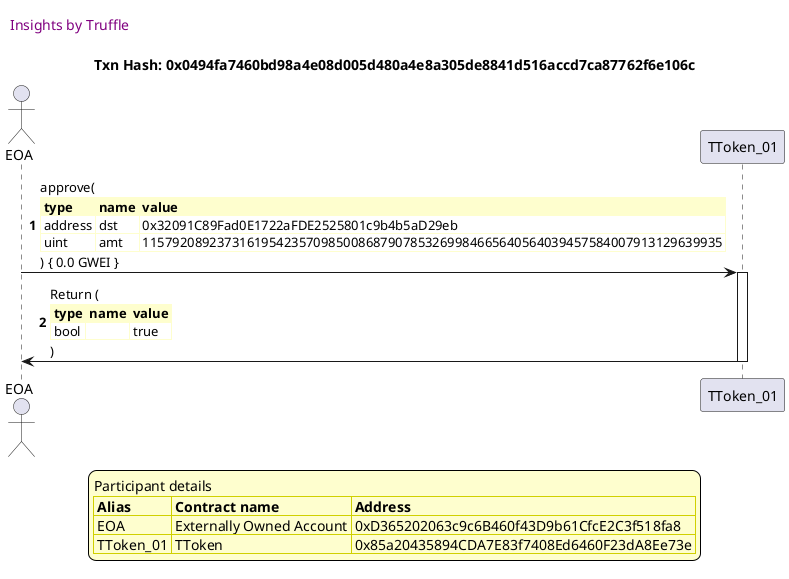
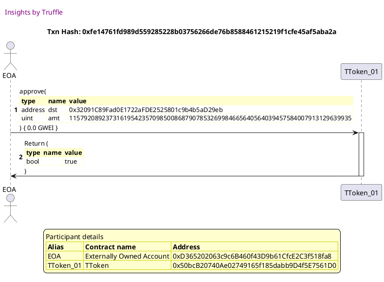
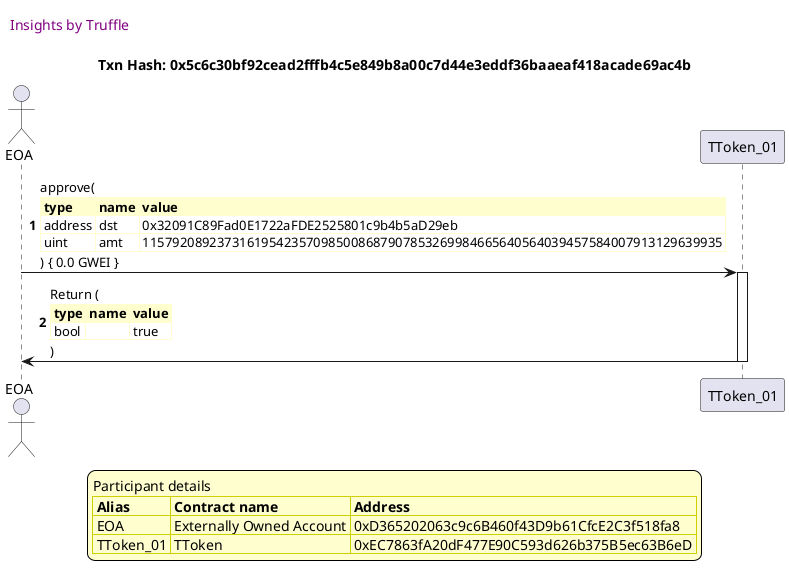
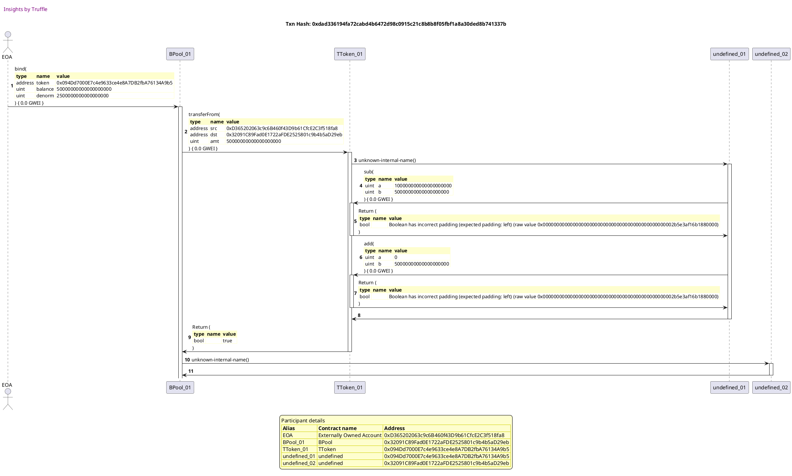
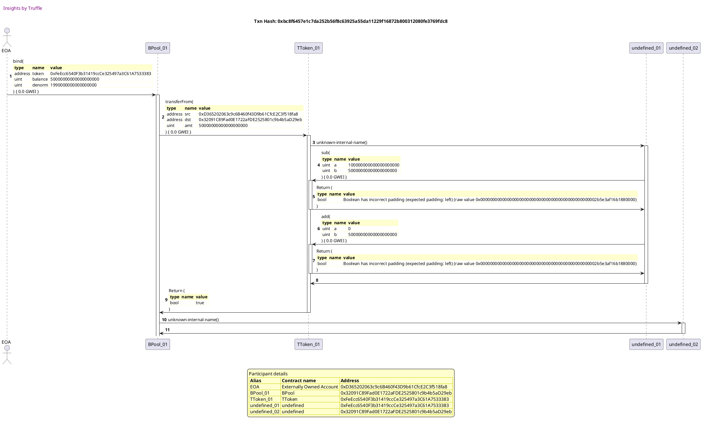
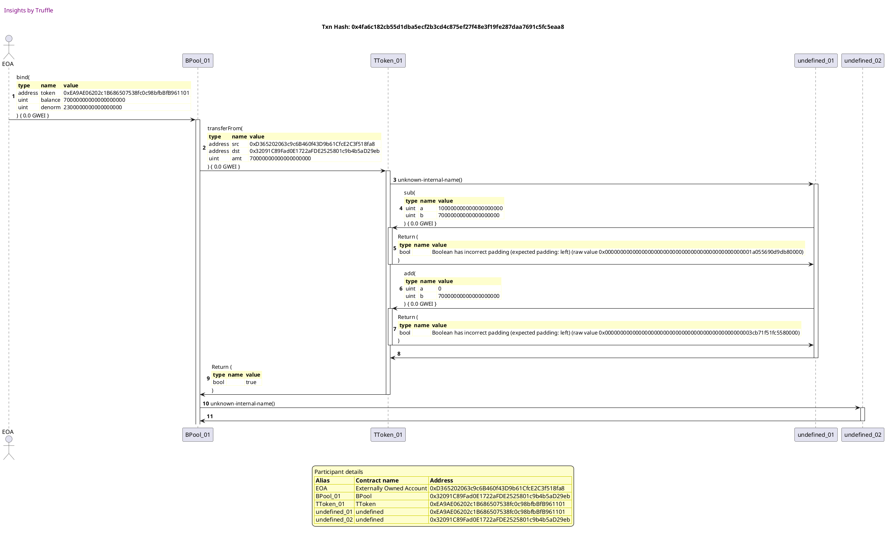
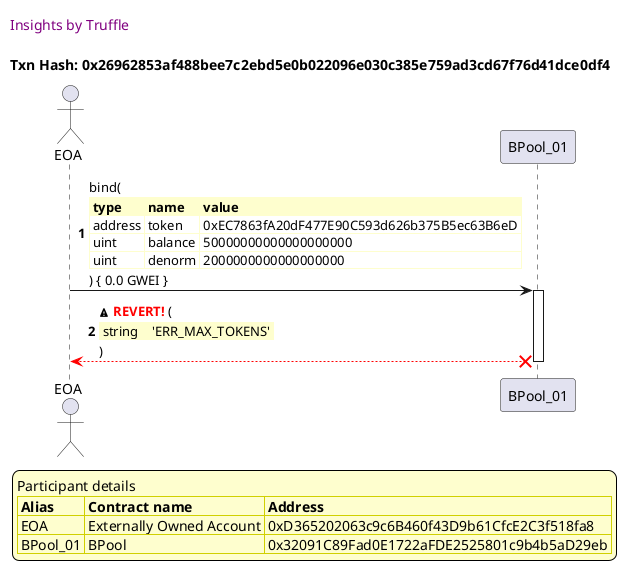
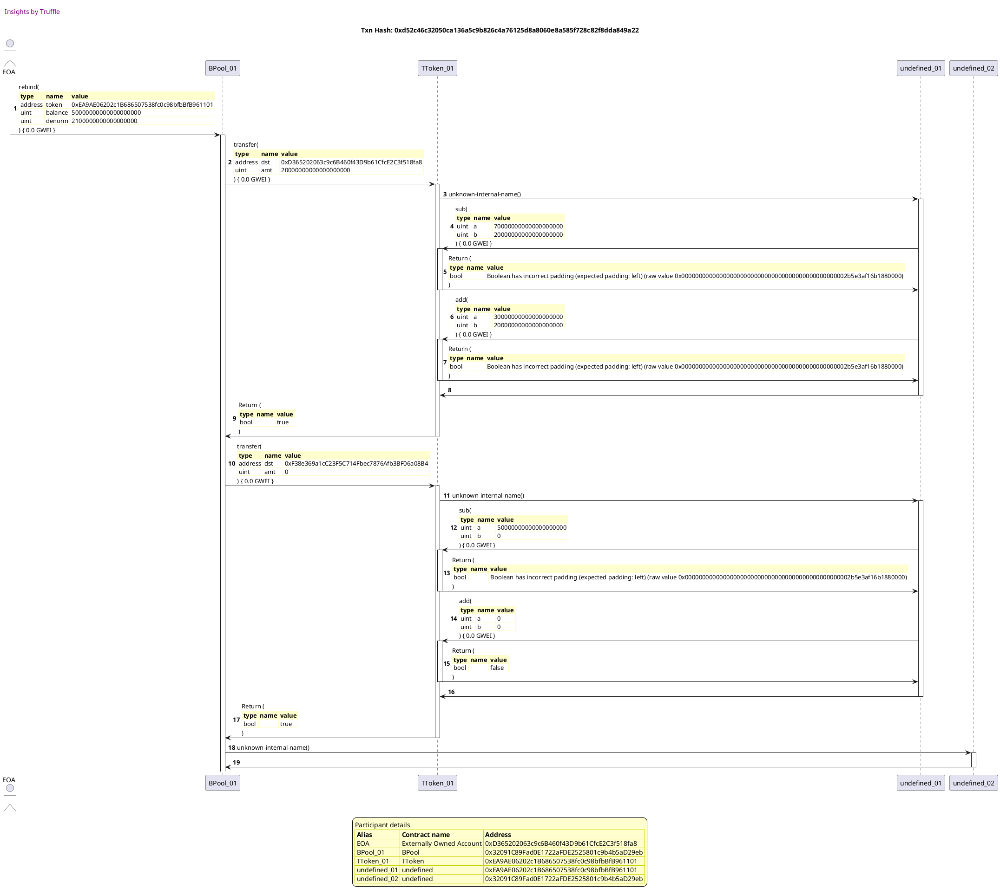
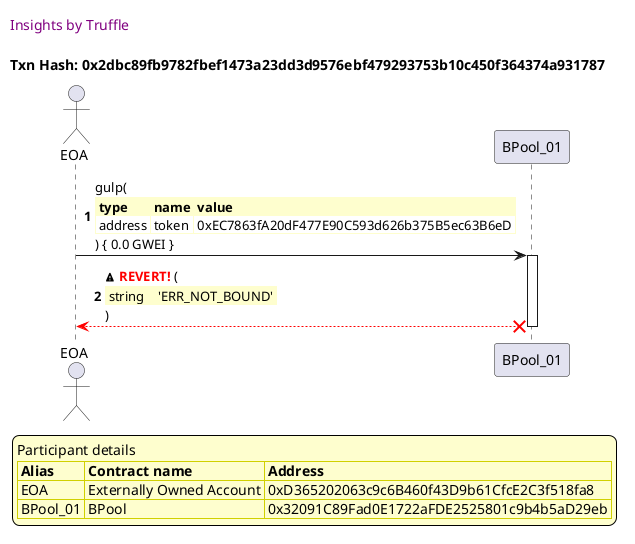

Test date: 2021 Feb 22


## Admin approves tokens
[link to test...](http://github.com/balancer-labs/balancer-core/blob/f4ed5d65362a8d6cec21662fb6eae233b0babc1f/test/pool_max_tokens.js#L65)

##### d1, tx: 0x905cd150810bfe67ca577d0a642f7c5d32281d0e37fd95f05269a0980de823da

[SVG :telescope:](https://www.planttext.com/api/plantuml/svg/dLFTRziW47_dhq3Towgksm46GzL5THndxLEhBT9UAatOuDIgWoCRTqcR_UyZpiVIrrdu3kwE-_ZTWT1DvtNh-qMDaEvzu_f5RblKFLTkgLkzmBMTMsV6kdYUjqtlJDhKJOi_JBDfbcO8NNT-NTiHmiFtPBMnBNxR7p6-RThgjN5UrqbTpTt2EXyyblveC0tAdSjbtovh-qxnetgrc4H7sOCsfd9pJ60l-ZFmwo_x9D0-_fthglcJxt2-nhEsBylW5_dArnRFLWxVwkxf2iDA0IyCuI09vAKLSQ5v71lG8g9bN733A9N4W6LnQHGlWLEXD2W9nahAZ4O1iiA7rBFx1EiEdmL-XW9ilYggfGwbpcRDitM_W0pgu-aCeS4MNuvEfVZYuWhhvR9jNkp7H_U8hlSmVzhpqUOhzkkbnO4xlHZuYwxxiDcQRt30fxLTXpVOT3vGM34AYgHIJRM1ZCIKwkaaevno2QHGUPHpFQ7AvWSFVUMs5_LYImdXiQ8W5MKn8u8e7b76um011v12nWfYoLc0HSb822uYsFvCHJpcCWA85M64Ai6KOdmNuXo_OVWC-DlFx2xqxxJyBHexM2wly7Vh-zRX_yCXRvewv1-MRm_ISuHsiumUJZfahDTLtPs4cC040BOXmiY6jeLD6cQn3Qq-1aiEE1_lZJR350IwyhPrkgxN-FwtimOdHH7UpQuR4oOu1Gg25QeGuqX06R69oWL9ooAZAIivaQMMxnt_cwB3Vd1caom9mpkEKyMaKS0odaPZGNWgasbSK96NoJYQXeHHg7fVExe9DBpslm00)


##### d2, tx: 0x0494fa7460bd98a4e08d005d480a4e8a305de8841d516accd7ca87762f6e106c

[SVG :telescope:](https://www.planttext.com/api/plantuml/svg/dLDBRzim3BxhLmZTPKNNZNfQAhgYQUAiFRNO0knIO90jEJNgo84iTqcR_VSfpwNN6JP9KV97yYE5q7KNJOZzh478zB7r_Qnm0NNFjP-RO6QuSLFdxOqfdwUXxRqTjaqRy8TnFiw7EKANNLmsxWhXpVFaZ7K1l-sM6D-seNvjVJJDeAcdVkPyJ8XLF1mOfyqjvBmFyyQzs_XHlpfC-C7tOAoj_HGJsBd-RFJbbrqIQ1V_pdVrz2bsk5ZYIUYhAk6YMCV6uSd2urlJFLrWM03Nl38Pbr1OhGnte2o0i5n1MYZ3aksKuiGA8arPsgmqAiiahQGZ84kKA2jZIZs_7s3JuPEaJr2YBTPbFJUfrCcaVNR-5v3Dzc5rWj3cB3w_ElRYixCBRERpqBwuZu_-4LtkQFwqqrUhhpWkvmudxSrierzCqoTZVNo54p_1THrUOTl59671A6WoL7fiBEGaezICHpaLL2WWfIvu8So8QbVi4VhQhtyqixKaH6IQWjAKPOn8eWMdJ6IWbG1GKcKQCYKObLehBgMG7DOVqrnaGd60J1D6g9PCQoQs8Kxn6uRFWB_zpEzI_uxBNxEnfUNy0dztiGyU_nyFHTisAV_qnh3tdYAqdMNqSDGXwwAfc-uen0X60B0EaKOsjIqPmpIB8RNw46omv_dmtzLgCmL9Bg8BtZJD4j__zixYGLccUxFjneX9GO62PAKkvKsQl8gpaIua6LPbJeUi4aHLHhq7_ZT5Uti3feIXm9bGcWz7WonNhCeugDpAX3kcp0vKxZAM4aQfwbtjw3h9TDl_0W00)




##### d3, tx: 0x36edcc8ac5f9dd2e519cd815d6083c79ecc2fe81dff1a17c727c593be4314479

[SVG :telescope:](https://www.planttext.com/api/plantuml/svg/dLDBJzmm4BxxLrZqKaHf_OnjH5SicspX16fNwWMfScndYSWwaUDG5hR_lTvdbsiZPyQU6S_Zcp40LttK8GwB1W0znDOFYz85q3_LljD1Bs3ZvixRQssUvg4Tl9sqJHlWXsanBIO509TzN3Pk1E3cUtJQkW3VTaS8RzfGlxO-wcRSr7E_S3ucZrKy64oJSkko6qBNk7UA7_MhWvWTPFVQsjhF8KOxqPyDl_ooImBiuj_wlfu_nXwMIpWBGrKblo3MiN5mzkBXZUuVBo1wePcpnaXjUAMi9OvZPQp4t6P8KYEKCuPKJc9RLLXZOGGHXYjQEaOnOqA119c9AVNYRWnr3qyIFm49jbYRkjEfrDciVNB-5y8RzU5q0i365fwFZgNmxEm2wguBxRFx-E0VmEKEvayxFbfzXN7PEPYuruiDVzRDa3PhynLC-0JNzt05RHyJJJKIfF14ggcsgC2243tD2y89bmWRLRAIwvmeL-uz3BLVNzIBDSMO2qMGL8GAYZEiE2EK2wGaHqXcKYWa9ASaKqgoBECPG-kVAiO5bmmXeJ35H6LKASgt8KxX6qIV4VpsixXD_JikVut65fRp2_ZTnI5u-7yub6tRfFpJYc4lFGLWEylW_gX3raLTD_rHY1pb2A5rY3IogMrfCqcp65Ah3y76UvmFzqQhpHGa-X9TyBffbl3kjtSMZer9xsRRZPncd222CcgKoQvPXYf6SrLcU5APWanenR6ij7pl-DyKxVSRPqYnt8gKQo4CSmbaQXnpSYpoQrALOv5XoiQgJBY3LFMkTd2LQ7hjVm40)


##### d4, tx: 0xfe14761fd989d559285228b03756266de76b8588461215219f1cfe45af5aba2a

[SVG :telescope:](https://www.planttext.com/api/plantuml/svg/dLDDRzim3BthLn3TPKNNZP8jMGgwe6dih3srs0BiKc2GRJarwiY1B7T9c_ttAPzBhpDaKYAbH_6H8kIwyzhvVjuGedlVsdwU6qUwvzekjDDpQCpCsF965yypr_Qs7BTDw-3399jauuoGgywl6ZCaiFsUZ2wDWxVz4k2sTVLhQxrkHaqzitDZVK2i_77393Xta8lUBHhppl6ZVZL0uwFjGPTbRMT0SM_wizLNN_QN8FluTxQhPq--Wtm5KzTNLS0bllQDWUdImgtkdWQ0oyhGE16qAfLK9UUAISwOp35Ak612b2OHkUHIne8ooXbL5Iqg4tDTSPrhfacWhF3Xwjdz27G7Pq6VaK2RhujweKEgqsdxREmlf5ltSNL6o7OlN0vFhN1nCG2zMBZsnNnyj8_aQa_pfxqUhh-2NoqC16trVAjVTDE7oMRx6W8_pdGThA7iV92uZ1WgEfPgealCQCAOdgGPuunBf8NAuvphb2cJ7n3wscuEwlb6KieJnL0g5YKH5LJnc4KyGIKveXGoKPX87Z6XL219S17ZvezKp1CkOyH4qOWo9IAb8huBSGvlW9yHlltCxaBzJjFViB6ZvN80tutldON_uo5lsoRSFmpl3jPpGdQzJ1vEAbGQh-kcEmcHOeg8cn2XPKFPmcGSUj65KX-3ZGuy7yyDrzik27BfZREwQLPm_zkQ4aP54TxDhXff93X3XY8gL25kOe5L7AKg5tHS5HaRHnMdijBoFV2_BZhCjs0Sy-A6OHBZo21BOaK5hwZafSvpbSOLpq8VqnG3MCXwdpkv3ZAyzhy0)




##### d5, tx: 0x76fe3b6a3707c875002b7ae770e144b6149e01b829bb069aa2a76f342726deba

[SVG :telescope:](https://www.planttext.com/api/plantuml/svg/dLDBRzim3BxhLn3TPKNNJG_h5NH1KyTPUsgn1TYbm23RSchKaGDPxf8s--zJdaklCsHI8gMFuaSAeUik61_wUOEGwKFh-dbkFUgUQxSmtioXiJFhoXjJFCzysxioRPlMmuT9DidI3A6hBgmQEqIm_PwiAQs7j_qIuBRrzMlhWcb6JJrpS-j2HAp2SSCaEdUGYzul6llEyQD-jK2Ie-t1b6NjPa3mtlHdgw--x2-1zl7lN5VFda87-Ggclg-gY8j27HeBqwM3MzCz3G0lfQWiouLX4ij2IOunpQMnKc9BaYGN9D4MarnHdUTOQ6EeYKTOGYKLfSqDYfGL8Luzkn-1wU0iwZCKQGjrKIzCJ7KwRP-j-uN9rdrSdI6qtGkNmrChN5mCm2mMldsn7n_T8xhQq_nfhuVhhn1M2mjHEpFVwXVJz76osRw6o8-tNGThABiG9LuoYZL9bPwO4cT4KcecuunooXKcXSwJd9inrJO_8FIrsnmqyuqaX4jDiTAKIKO4qJoXZ4kiLUHA2IKrbeepAhHMYH1S97ZpCvrmoLM2iTI44Qe5qvhnNOXpU0Fy6SEtdzbThDzf-XisThHS3k2x3Rrty7yyv6tRnFl74Vp1UexGhfVHmqc5IXjCtNGd8SPuZ37UX8Wj6yiM9sdiHHzBVGmsEl1yF3TSRxiWocMmtfccMS7zRsTB61L5V3UxQeoPu1HJB5YX2t6J25mbRAnZgwLLaT6KLPoeogZtmF-ww33VWb4bT5e9AeHc2cjwKtAgozHgAWgJf3WXYd5coWWMizxdZgwZZA_zBm00)


##### d6, tx: 0x84927db9a3358036eded65dec1fb6bf79b9924370a396e030acadd29d6579f4c

[SVG :telescope:](https://www.planttext.com/api/plantuml/svg/dLDBRzim3BxhLn3TPKNNJMzRGHSqTPorfnPRW5qA3B8ifqOTEP3bBccp_pxbkVGwmoPbYlf8VgGGkkw2zg6VDmZfFhIkdnVMe-wvTWljzHmQExEklD7cUURRtfLPsxGUFapoIPxb25rrOTNO8OBjysHrQJsyxNy1RbjVlxOkw6RKr3Ctjov4n2eS7IPnSmUvwFsYiUysVjIl5WW_sXvqMTPk1WJlJN-s-khBFWcqZt_dkdhs53eeLZ3rVLL5N1Jgq5YOBXtSwkvf07YPSaMJib2QCP5Y9crfIobAQqXLoA9ALA4KvIp1cYbfCSFQn0IeYaw9ghX1aJ8JOkhv_GXq1sTHdw58MwXDlT2nrEcqVRRk5oRRxUFV6K9RNxWSdbhXuc80Uh7mxOlz-EWUqTMUvazxFLn_XR1QM8ZQwVbMl-YcZukD-nfYUjvs7QoXx4AKUCaeLYHBrKINE2S9fNeopgcWiM1YLC4BeSTKsUA0qDTkSr3FDvAGM2Z5gQ8iOKGI9JXb8i4g5HYdCaqKJbB1g5GgvL8AoV7cOugBHAGSuqGHHgYIJ2acTY7EuGtmPmpVVkPtiN-dvM_OsD5oEO3lDlJUmV_nKBHj4_EFR_07wpb2krb63oSTActGTTETX1ZZCSPu4oAER6nRN6Hn5drizJ7OwC3pyTnmlPs2A9V1UgURPWNtlvqjOMHCl3UxReoP51HJB9bHHjvmYIlEnggG9AjCJZDM2P9MEdqF_6-A3kijsCJcnaZ1yOGLZ72YZCaieuAhHBDCab4Y66CfYs2nwdtjw3hAUDl_0W00)


##### d7, tx: 0x4bd383d45a1cf99858d1d5a256aedb216344c452f973ec26cdc7af95ce81e6fe

[SVG :telescope:](https://www.planttext.com/api/plantuml/svg/dLFTRziW47_dhq3Towgk6z-Og8kQEixQfrPRfBrKcZ3WrAg38uoxfCt-zv7FfQ-py1tSmU-utnq0N7THXzZF6m1q7rlVpqiNGFTS-uKEUWuRDtFUtcZpF0jjxstUDcs07oR5fCWB0Awwk6hS4C3jz-IqTG6-xPSGthQXVcrzrCsegMT-xdnCY5KyRfWavmvoqOT5uzuvVjIl3c9sj3reQsi_WnZjJN-s-khB_X9W7__ET_NiANQmNC5fwAiguO9OnyR1wTB3Mzqz3I1QijBIZ5h6DJQLKXdFBBPS4owqioN1WZ9c62ULajGP8emrKbUA6vTX9wg42RI9wUh5_GZg3fubVGOIRR4szKAdLAVJzjdvNmXltSVL6G3RlV1oU6g55nS3g1UBqBwuZu_-4LpjQVwqryFrLnXN2mUJzdg-rI-wwTDaitqD4p_1THrSGzl59D6I4gHmdgc9jgZ0aX0z6HU44vuXR5J9Igx7HBdoWD3NVdDGppSIOouLGPaYL58iiEACK2vHeWgXJ6HI8PbnIaGYZmd11KERdoh69SyOGb9XYeaIL2dATo7EuHj4dn7yzhEuI_KxJN_3newMom7yxc8VFFm_7igsRTBzquZXO3q7ODVBuE6aGjP5NJVTIOWn6YE4DY5IowQofKcUUZ6aKX-3ZGuy7yyDrzikI78PNV2wQLRm_hTt5ewCIUzcLuqn5PmWWWGroeWR9b35w5YL0kULAKXEAuwpIcVlWVzrqM6-1SjehfcIab152giBgvJ38oPb8SfKOKmvo_C9aWaiPRtF7LmdcLxxNm00)


##### d8, tx: 0xe08cb4748aacdc7cfaea04a930aad8ffa70efddac4d76fb1a08b967d845f14c6

[SVG :telescope:](https://www.planttext.com/api/plantuml/svg/dLDBRzim3BxhLmZTPKNNZR8jMIgwe7auQqyjjW2x51XeMKgDEd9WortIPlzzYlDOUfqXan8fVHG_KeJSj1uRtoqgGh3pjUiMkMb8-row9JQue9MP6rUCK3_FcxfpnRYkweP-c6RJR9mHSjtwTMK6XFRVay72DFHjlwJqjcxArzfvh8PLENSButn0jFwuOHgSEyXbromhyyxnetmrb2L7smCMHUdcbC7UzAVNrr_sbo3x-7UkBUTFlgNvciwQpjg0ItpfAqDdAqTliNsweh0o87MUf8b4r8LEjKM3aA2A0R6Grc8AnXO5wgH8XSqPWioLI0kPSCiIBKYWJFjmzUn-IB6bPq6VaK2RBtMvn93gR5O_6_SBMEy-hiu8wVVIoy6fbLvSN55SBflwnNnyT8_aUa_pfxqURBvIlruQ6hJ3HQzViEh2PBjzGmC_ZMbRkg55wuE4LHo1OcEffbX0nj8emkaaYtZ49J2jyYJdE8cKoGy8NUcs1t6nbOpnL4KWLHIdCHDCyIIAUGfASW0fPAeWbJoEX58o4OAB1BP_h1AUSfa0f8h5B58YLYhckn3dz8t2Pw3VVcPteNwdwM_PsD5oUKM_6zyrZluV3tbTL-7-OVZcO3qdPDVBvE6aGeNnM5RjIOW9J01W6oAqR2XRc8n3BpQXrCTWmmFFntE3JTy5GQwyQHnMrPhU_tQce4EjmxlPLMCI2nv112BMIejH8i0cyKJbWesjpg9nR3cJ5kLxu7zTT9ZtODbG3JCG0K-paP22GyfZQJLe9NERZ-n82SQsfqZ8UfyxkGaolFQ_)


##### d9, tx: 0x5c6c30bf92cead2fffb4c5e849b8a00c7d44e3eddf36baaeaf418acade69ac4b

[SVG :telescope:](https://www.planttext.com/api/plantuml/svg/dLDBRzim3BxhLn3TPKNNJMzRHHSqSPorfnPRW5qA3B8ifqOTEP3bBccp_pxbkVGwGoObKleeVgGGkkc2zg6VDmZfFhIkdnVMe-wvTWljzHmQExEk76dpFFDjxygiRLeF7oRv9CzoXAwxi6hi0C7sUxAwj1xUzak0szRNhwqBkXaszSpDhGiHiGh73PFet44kUhzex3l7Z_hL0k57suCkozhDWE2zwSzMNt_PNmBjuz-vhfuzXGwA5KnzNrKH5uKwD1QcImUtkdkw0hmKHXg6YqfH4y_HggeAReHDkIfIZR59IiujisLPCLbeRNN5IQfD326LDhn0aJ8JujNp-o7e3iwYFaEHjb2RUg5ZgjDf-spTBqosxkFg3A7jNhWSd5hXuk8Az6BXsnVxyT4zekizpP_sUh3-2c6ri12rq_EjVj5D7oURxMk8_7ZRTR26iWjHuYMZM94iLHDTufmabEh9EAU2YXGJemfU23scoXO7XBvscuDwlf64Y4HHd2hA4aOaKO9J9XAiKe5nAjD4uIGLZ4gbKYwba1nlVgQuI4JACKuKOOGgoPHYOXVY7Du0VyRmxMT-5-jtclw6ZHqjbrVmtORUE_W_7egsRUBzumZ-O3r7QDVBwE6aGgKDkcwwan1ZFCOORqB4berbYvCizgAFfJu66nvuFfuRhBTT4EKoMEzqqwpW_hUp9GoDYUzcLuqnau9YYYKpoiWHbxZYRAmAIRBAv3HZbI1ffTFtmF-ww33VWkLPaafM3Iak9pn9SeKpeLWfgInO8aR26ib6qeuZMCnwdpkwYJA-zhy0)





## Admin binds tokens
[link to test...](http://github.com/balancer-labs/balancer-core/blob/f4ed5d65362a8d6cec21662fb6eae233b0babc1f/test/pool_max_tokens.js#L77)

##### d1, tx: 0x9efdb8d1dc9e4ba6f5a6e057927a47a1c4d6204d3dace3aa1589cafe3f4a6c1a

[SVG :telescope:](https://www.planttext.com/api/plantuml/svg/xLPDRziu4BtpLmoobnYjjzIdfI0DQijosrE3Re2z55YCICeH8bC6HJLEw_tlErPaLxRJHTtcMC4GoU7u-SqRUeQClQaj6jiiIiQmiPLk5faohBuhz18DBg1KSwNb1CNTt5IDbabLLWR-cAMpD4aPkwpjGwck6BJFhKAf37pjbW3lAbDygRJ5SbmMSxrGsX9YRdSECzfyX5msPbcglOs_YYyA77zdkqOf2pq7XtUcVzlnybL7WdM__rxNnVpMrf0zm8rfyfnmcIrigU1cfU4TrhSNm5UnocKMIKUAMFaPXdc0eUB1A7P7w8_G4RuCNUvBJw9G7g8JHB70N7cvZw5ma95amXBrzCCOi8Op6iyOoMOBKIoHGfrSLrNv3tVQtUrYt-NcfhfJUkkpM-qxaUugBxIIMx--uRkkxg6hUyPOInA6Lpq-yEB51MI5bkUVz2TssUNsPJTUhL-3VLWge57ZeXq_OzdGPEE-1agAKNKDQx0RyZJobHgduu17ar4IUv6CkPS6YJy9dI29nhEHSCCi7q_ysGwZAOZw6Z8iKGkoGi2FdmDdgNHb5ZHnlkSwWA_0_-Jmzk_qFPsLNiIR-BzftGfW3UewLsPcgiMl2b4RqSemzSB0vIuFFH6BSEA7FFUzQPo5JfABr4syF72Y7ADZ15dR5i5pUUmaKJn3oLDdvBeucwPku0OHTqIS-Lc0KpTMsO4skB3_A-AXCZqjDjBi7QzMdKRVwUfU3mbU6OtbSAF0-O0Tk3wXQzraFoVdDfIdCtnq7BBd2tWul82FoZP6myzHp-YS4HtwJ6YcKCCj_HKBBIfZbB2mx0hPkLejQQtardBHLiS1d1kyxo3vYf_sk5b0rIftmio9eerXq4dm0yaY5h-ShD-9UUR4RA8-4gPNovvF56ksri5XjTnh8pzS4jodo3BsUAbWrxs-9PN5egnxxATyIXfjsDFTWR94auGk1OPwxYwEyRPWxhvtjMxRCRrNZxJA1_XmJsHWB0HTOEo9XRaFl6ldtVJ42js7-jRsj_CJ-sOVREzwq5i-3wHx17b2o9JcBjdi3RtfdlaV)


##### d2, tx: 0xcf66efbae4946da294cc15356e8724e59624751a9ca05f866a22932d887868e2

[SVG :telescope:](https://www.planttext.com/api/plantuml/svg/xLRVRzem47xtNt7gNa0Rc-FymAcwQXJ2sgTMMwMzJ9eSnu6emK6EizAD_Uyxqa03RRVHzd4HnFRb-FZkE-VEX7mehJ2sckM4YCeMkfh5of3oAjDpOSGCSZLHEZaHycfYYaedmo8l3BmQH-De615oLDgRN1qJgA-f4eaoyBDP0fmM9ljHQ2loGPvDz4nfYuYftJYCyU4jvBmoyrnjFVYS_L3WU1lRXKYIJ4_0eOtfLpqUlMj8aER_ptIPJQQsXFW6BasLfeXBR6Pp1PSB3QUYd1u2NSWq25GQ2-M5Nf085dfIEhxh1uhtcQVyC61UttT4A0NrKnu4Wh7GPGddVHvmnGXA9YrIZyu784eumF60e6msazbSOAWd5qMHVwDE_NIzs7Qvl2okb5xxR5RRJgYxIZEjahLVs_2eAzjrPGU4r2IXTzpY0wzV7qASwQJpLNybHqrktpJZyV8zs9kv0XorcDNZTv5NE5cvBm6JObHPmXBiYZoETC5zmQZd-ZpqXgD1F-9kslSeZvB02-YOkSc0HwhlRZ2g3Aal8HQvq1AjuDFxruvpedHXPZXn7tFjma-WRoby_1ATuLvfHRoA_qxhMW1hX2vJPSQcc3rNYDB8MeQH6_YCCXguCfJ12SQUUkueZ0DdcCg83TtKTtWg-7s4fBGrWijew0nvE1O9ZPm-Os8yYfZFV4uT6SPUx8iH2rMyeusOsJ-AkAjCIukLD5lRgrQdqbUwkDOzX5T6YxotKg3J9Jkk3-XQLl7Jv5o7Wb-7_dqxn2yNSAzt29-KhOo6fr6FSPyX7VoSu4m93LDy5JCj2sEKj31l2bb7BUQuLidQSbXNnovqZBXk8Ec2xdUns5UkI9qWTZXV6RgD1F-GB6Jnx6JzJymB9sOLzJrXMhNivKInPctjxbRBhJRopoM1FKIMaDj31RbezQr4MP7bPOlzY8vGenLxF3jWbd0on4E1mPwxYMEmBfYRtnqlwtQCzyKjhVm6pg-H30oan0ECtRCmju4txRoPxbcXsr1tRNyztxDlji6sZWUjvSj0idkGUuICQMwIJJxW7S-Plm40)


##### d3, tx: 0xdad336194fa72cabd4b6472d98c0915c21c8b8b8f05fbf1a8a30ded8b741337b

[SVG :telescope:](https://www.planttext.com/api/plantuml/svg/xLRRRjj647tVhnYuBnPIfSlbtN2Cw48rUOhH6kXBW61lb0bJIs6vZEL4_VUEQ5AXvAID4Z-M4hctqT6PCykP9UHrxRXrpQeaX3UkCirAQ4lgkyAikUKhAFLI6pNbycvfgyQeMLLM5dvPP8jibX5oMRk7KbyHQAzRpPMsyBaR0hofRF6fCewNax9OcfKs3X5pjpTOuE8ZvBgnwr8VBFnPVDBW1VkvQwvKOPRWqMxgxxQz_AqZGRh_VslgOddhQX0FS6ERF4TSuWfNQhZP67Z3wziBe1l5bUz7NXhaF6QI2nM8A8YPIXD9Ko-Kp9E9m4zEmrpa7a-uJvLMYOW3p_TZGL0owP1wzcu2l8OpRCy8okOAMQmvkZgzhgho0_NQrNvmQ79pKzrfqzliHuT6gBlE2wDLRpUS-AOfEpPbPuIq965yDU03BrvSW2YCEdzltfFBBhQ_TktLzXMuXxK6R0rVjUr7NZROsPbl0ODYTLt35joEFBPqGzDWhc9AQHRBGAUHxqiTw6GIpwSi5vCuylnWaegmnsWAfBu5mKjk9293I9zUHyPAcygkiCF2RvYEu3FGbnH-_ojxYtjbuF7E_ozQjm8uoqsTQxkmrUfdXQYjR6MO-r78AAEHBrCPJOE8ve4_JqNapNAPiPcVXrwIy-GfWgfTY-0pt8gp95rmHJClPemlvXaBMPXGJwOY426VirIB8stuolshYCVA3BJOINEmlLfr6dDdgdipHdXj3I_7EmNEH-J8z2kwretuCJbxL_3sw7zl1_5y3e_75_27Teqry6FK1Uupf8FVAVOqDt2Bhs9XP6MjbWxMNI8xrvirZhNgPoxQx3Y2SyllEqXycKwxc0YrptCl4bwIx2P6dGJV4InayTF1-ZympnoOdTTFX1daikSJnTb-TdISBG_Ao7Ud1FOrieGy7Yh8zQ1kAUruKTO3zdCwHursxF7iW572pWmF1HPhxjwFIPymzx-xshRb69-RHrhb0xoxHp8maH8FCEx4n3m4tfVphdjYXXv2VIdxVV_4kZa4EpWU38RF0ycUG9xWCeQv2pPvZKyyP_u3)




##### d4, tx: 0x04f1eff3d96bbbad8c3b7d724320488ae645ca87a63c2c6be3eb5e8ed40ab8d6

[SVG :telescope:](https://www.planttext.com/api/plantuml/svg/xLRRRjiu47tdLmpIbnXTTodgOYb8W_eYR_kKe0tGbm85RtA4o9H1KOtJUlzznuhao4wxMxTvNC8MR-FZCsUe6HBofdBSkdfP4C9hLvfwARGbrMrkLjpo9HHweOsQS7cxi6LjrBGiIWilvkaydQQ4d5Vklj0N19fsexdI5hwrKu2tfSs_biRnObpa2xFKnY5YvdO6SznyW5pLTbNelOqF-LSDNh1Rk-9AvMO17csN_cxwypzR4gJz_tUcoXSthW9n3zUspZB49IvtXORhjO6tlBev0xgcGURfBFDL4WaXk8gbBqPgn0AVqI2EkOw2KF9un2DVCXa9xMiHwbYhW78HguYWPD8XzVHo3Bo24-nF2ChcSfclEBewkIhBuZFrcjrkiczoVLtUQjFPx6RxHgYxpdAZLMVNN_YXAJiqPIU4D2HXUD7Z0ozVde78ZJhzP3wHypQsVxJznUOrkFkL1kmDNpRz5rxKEDYQRm23OdLLmGRSbZpsT1rI8IUCZW8wrfIDWiIBmioBGyM5I6P15gQZCF9cjCEeSwI-0S4BRYGYGqYVjWDZfKrfbpWO_SXq0D-0lgBmryVq7PwLdiTR_n-rRWHmbfigqtPko-Nl2b5PsSWmywEGKKRn02KocWGHpG9_beZ8csOoPLC_2xquu_5J15Mv1W6FOk9DusJE5Ksz4MDyFajPoCAOUZ8HWGZvZ2LQ76Z3b-vVHJnKfgV5LfgzuzMeKvjRKzwP8S9hQtWnt2fmEY07fj_HjQh5hydPkO9VZ_xtSH3Fv_1mU0RljQkjWL-ZBl2S8HtyJ72akO4RV1Lp8qjhjNImQXFPgLwlSAvLjtBMPCS1d5f-rq9YdZgkCKnIFi-yI7Xnl5qOj1ByHB2GnMy7w__0F7DWjbu_4QQNovvF56UxrS5Xjjmh8p-T4jZto1BoSAaWLxswfRJZUL7rsC_e33NQiiUx0qO91rEy55YikJi_nbt2tFtkOjEKOtok7sWLzt1vXsHWB2LUODoHYRaFl2ldxV383Ds7UYpxtVZ8kja7sxiUzARF0ycUG1xXCeQv3JPvWq-yP_u3)


##### d5, tx: 0xf9027c7c89237b9a6ed7cc2fa7e572f8ccd17a67a30360c9e7aa88b83e301b7f

[SVG :telescope:](https://www.planttext.com/api/plantuml/svg/xLPDRzD04BtlhnYLIoC8hDVnLrKg6YS1JbHGYGiI6g_NgLLd7QtND8NmtvcuTd1IYWZqY1LvzcFoykRDPcOPUrLPDBPU58nXRKjTBn9bM7MTwoKQN42XvagdOvJNSrFMEetBeZJmP3QTJUCfOwULlItK6OFckLAOAWFVsYd0czBaNqjjiJWlyhbUA6q9CRDRXnbjta4kQxCirCx6X_oh0cUqNRl0DCtr71pUBdrlxEcBbWHhV_-jhlBvbQqWkOLBKsSPuJARsqB1vKh36wokJe2lieYBG0OoZ8GR917wAWsa51a6oWj45agPEW7w0RhSzRcCL80OXadeAfSxIP0naanQeZvzTmvOmH7P8qQosLpcIwHGnnTbMNpcJhFRJNPTBY_BQwKxd-rirubqLrckLThvzHSUT1NxhkA8iOOa3CzwVE3fqnD8SfqUVzAVs6cRssUjFLk_17kxL41MuwAnNx2eQR1nNmCbnQYgWZNO3NcoV2L2FuepN_X-v8Oy4kFK4r4QgqZu4aSn7pcXwxcOTXXrJjJNa621MX8oUFp-i-USAbsQ1GsS1tq7y0tuSmwlFqxVqc7fXRmHuAVOZGBMeAuoPMQcNFoh4fMHZGuJr_S45zntPIJzySZdsSYTH8dln9cSYjZDF2VCCBoFa5QsGN05ZvmuZ6QOygaJ286poLHumWkv8wDab7Wu4P5AziJ1XVsjYllAzBJOIBDplXfrQdsjoniz97XbD1R3ZGB70xRd-WjTgphvEpcxK1v8yVvvI1uluE7m1DuhMniDVqSzeND6TEWpff523LVqNyorB8rHqiAohMJ7QhMakKgxbPEcF0xWsE1D2ybN_B1799voCNFyn0d3pSAWbU0FaaKi_ZbP_nFpo8dPH7rFc5ujUpnHhEbM1_lLSgUF_7594ByYozZThO9Tz1fNgYpcHTLZF-4JqcZ3dYuFb2KQn7GhCDHqjt6STmLp-xspTTEFwRswerNSmhiR8WFdKj8DnXvOcFl0stxU3W-iq7sedts_6n_OEFjWE_U3tlHn8CKzo0D2fZItoMQlw4qNpHy0)


##### d6, tx: 0xbc8f6457e1c7da252b56f8c63925a55da11229f16872b800312080fe3769fdc8

[SVG :telescope:](https://www.planttext.com/api/plantuml/svg/xLPTRzDA47tVNp7gVMa4WVs87Rig5MdY04zKt4ht1Gcjr-lKghEErckQbl3V6RjsSD9U8D17hCYp7vEJCsSsCql8wz99wwfbJeYiN66gPQmjAQypiv9MBY7N2ssISwck5xQeJ38jyiB2F_De7aqZGavBTvlhCmBDSwLbeYryQQS0RmkRtHN6oNoIPmkprCOXOkgs3dFSl8TSLNQLwvsDVxCx3MoqNRkGIPAP1J3QBdrjxEdBbWHfV_-TARF5bIiXleLBMwKfuXANkLp3vTh0MrbUdG1Tnof8_P4traoD4yaz7dj-6YXVXDoJdfT8nZWFK-O7Onu7b0h6QK1JBSP-c2Og82YPSaWzUZy1MS8HsYE2ihbCPIk9ePvV54N-YR9cjvlikbnU5jVQT3xRsQuJwgxJpEYay-il_AyhttVbHuGq965urkC3pvwTG9oPvFYZ-KXEszm-R-tPvXMusvK6j4Ok6_jPvXKEQlSDO5AiBalOWAl9ewNhkOwKyhqHdOjOi14BbPfgmRrHE9PYwhF9s1D21AB3g3Aale5Ovj8eH0QFFdpsd1Dj2hl40Gl3nrq7y0Ne2mfl_elUuLdfHLp7_rthHW1dfIbJRUUsMFwf4ALLZGmpuNkSSkeB5Ih_VEJJT2HcOUopQQeYFXMfnu9K1WyHaj8r28BJa4s3S2uJ6h4nvt8-Y_2eUW5bAen7iITdFDJndZPowNueuhuoFIrgQNQELwDEPQvDSME62A-jaVcmLk1uGFPS7z6rhEBVaxCBfSum_VbnY9ykuE7m13veLra3lqSzndE6TF1pZYCj3LpXNp4pgh1MAmUhjf0Tw_KAvphfLawQwZY0OojlMaYwfeSzMCQqa5YsOXO4zSAWbU0NaeKi_ZXPVnFpn8cfetuWJA-MFPqepdQhW_rgkTD6VhaayCV84d9_gI0NlRwLQ2UplEondz4PQbIpnxi3PWa7KxmKMEovspWcNS7SVkziqxHZVA_lQUMtyFu6oS14ARp0k0CBSnzusyxRuO4LkW_rlUrtumFxPXzivthGcpuD97y0UK38cEOssUGrll6U-Gq0)




##### d7, tx: 0x00a160bfb6edf932777bcd66a9f4857b36c3f367d933e5d9bd8ea566db9f0930

[SVG :telescope:](https://www.planttext.com/api/plantuml/svg/xLPDRziu4BtpLmoobnXTTobI7rQG3Uh8yhQd1cs0lHGeI95oXCYKGL4Rf_N-znqhaYixJLktEIvXYr_ZvpTlg1aIygfsmhfcMH8Y6bUPPYcr9VLjOLR2YYMKUg6DkXJPxS9MZL59LLOMVfkdypH92JcltNsfBmYqxKOBfIryxgO0hojRVAgC4-MqB1PcgOr3nDpj3EQu-G2vQkogr7iRxujF6Zn_jtObb2hC0ZpQBVtRzkT_T2H8z_zlJ5qiRbmDyXwkRPFdY4jSuKeDrsi3hqLzSmPqJQdmGYfp6MgLnvn5KIGp5OOYplr944aUPZpdOQHYpdMWOgacMWHXg6ISqvXJWf9b3gcdRwSWQZZ1_eIWRAx8YfL0Lo-lgghyIBrsjv_icrnVLxVQz3QxsRuHwgxpmcZLsmqNdZHbXwRiX92M98ml1dpWnOipa8LHfn_C1tBUnVRthh_O_0dkVgK1UoEMRV-FA1iSRCqtW46nkgvX0svB7dkwdl14-74KCHwpL8bKnR7sfduKfQ5a0VDuu2V9d4OzHbCWzGr8KGgJ8JBuz74xC5RQL7Q9W_0fqn5y1lgImbz_fs_mh0mytlh_HUjM06U5gNDjvxPQ_geGjSrQ6MOy31XbDEHPd8MNVaXpdyzY6Nf9dgKiuNdWJN8nUOoWQjSYS4PZBvd4Sw5ewaMCYVaiHGM32VMoMFeo43CMQtcWZLYwRufugCn0YwqqUyUhLQSnjwQwCsE4rzQ8ShnLu7H43ao_eclTo9-JitS5lnxz_d6Gp-VmU7m6xxHhh86Veoxnd24T_5pYI0i3D_Wg5YQhhDMPWrMNo4xrUeLphVgLipOxZk3KYhiESfkdZchSfq8evaaketPXr4dm0y525hyShFy3yqHZJ7hP9FCOYyGnWTbw_KYOGIvxFb6SxLT7XzbohupyS4fWNoDBoCEbWbmDwfRIJXHbFM0_epFKQCiUxmuO9HmaU2cmM7DtVapxXBdxtSMcBSVuN3_GAk_XxHsIWMcMuGN67PcOXy2xSjuDZypGGwWlPRyV7ratXs1xruF1z7aWsIF88rp6C7V19g_mYVVC_m00)


##### d8, tx: 0x4fa6c182cb55d1dba5ecf2b3cd4c875ef27f48e3f19fe287daa7691c5fc5eaa8

[SVG :telescope:](https://www.planttext.com/api/plantuml/svg/xLPDRziu4BtpLmpIIupMkoHboLAG3UeFkUsfGHkWbm8BaY8T8J9bKDJ6ITt_th4YkxBJxDPjZalOujVu-SqRQeQ4lAwySBvU58I8sfUsNaZjI7MJswLmOW65dckRZOMwcRkojjcaB4e7BsRfB9saX9nN_gxG5mIQTgr5fXryQQS0RqkNtvVMYs9Kv7ExqDOZel4xWnbkFa0kQxSizDx6n_nU0nlirYv5bkLs3eosIr-R_lpFbWHf__-ThVBvjQz0ti6Lgur1NE9pNsYuMbbuAwhhCw2hWH6HOZ5NCWmpbaaHQcMu35GsKF4mr8OFpI3MWM69qJmUPa8CeuIfqAXG2n4Jb4nvf9w-7u6eu0Jx4uAo-LpbIu6kZY_BilYRicPtEzatkRegRxJTsknc-qQekpQvrTdMhhlmf2a_DEKdX3GaeN_HuGClNvw1p6rs-jb-9kTjR5-r_SNwB_1tImtOMx5e-dz4KUDWOxu638hJLGLhy1losDDLEaf6AOquvOgDepWAwJ0COgEeIc9fvDYCauWnTAR5g7EalWOf2c4L8iEGFcu7nfcsfLlWW0TFcFRW2z0_ABpvbBx3izBnUEF_TwqR0RmJjZBQpLov-5qXAgSQ6QP15A86D0fKegBn8A9c44mJ6R69KIcV12PaiH7nOuIiyWr2m6d29d4o4nbDsP1pCPkcFEHXJ9bAv426OieJBG-q4Gl_ho8UAjFHOYFDtl5grAdjZIrlRH_XjREYw6yKEEsH0zCVw5hLyjVatBg2NqR_-pZ8vtEutp-33zhNpiAlKPTupf0EViOuqiB2DRwAkLMbSrfvMBQ9x5IlbZZNsNRbhCcEFJXruhQ5f2jwN6E2Xc6Kq2p9PBnPwBKI_4ImaCLl1-l_m3pH0YM73DzuB1_XCO7PUFr8c4ukUpvHlDkkzWwpvLuP-UcKm7z4bf27ImMvxDIjJ7kH5rM7_PHEKQCDUxmxO9HmCC5BWSEQk_DZj4sOkzzTh9joZC_L0wtY3jxV8XaOAOKN67zaOku2xyfvEpmoGtUXlfVzxVZ8kja5sxiUTARF0yaVGHxXCeQv3JPvZK-yPtu3)





## Fails binding more than 8 tokens
[link to test...](http://github.com/balancer-labs/balancer-core/blob/f4ed5d65362a8d6cec21662fb6eae233b0babc1f/test/pool_max_tokens.js#L91)

##### d1, tx: 0x26962853af488bee7c2ebd5e0b022096e030c385e759ad3cd67f76d41dce0df4

[SVG :telescope:](https://www.planttext.com/api/plantuml/svg/TLH_Jzim4FtVd-86qjZA6Cxl17KLRPeED6sWKcsJneGSsoaHgLCv3hJGVVTTqr2LJLYHxsnVdk_klOIGqyemRUfPGGYhJQdgMIergUvoDMUQpQ2GKwd4WF6xgIvh9UAoA3NiZv9H4YU4T2kpB6IFG3Dk9HDImrEx13WhTVvOAiEAVf5FrKmgWuYPsGQCy703EQ_rl90l3gxoHmcMkzsxP4BaQWeMRRV-DBPxt2P1sllFLPLFRqq5wH8ckiuon2KcDuM4oKB16QjkJu0kR3_oxT1pMEQ6OIfbm6sP2a_IbDesZNn97SgTq9E15p7XSE47MU0Brn9SKf6v15l63QQUNFI1LR27TezWsqpEypd3KWUNPLdSKAivVLxi4T94mb5lPnCE3qyWpPLuTwskIRTjy8VMzbQVm2pd4j0gDcliFIjgTDRXAy3EQ5bLi09Jtac5bYwIE0Xz9-lRL8pS84WY6dkH8tpRJvt06tYI-yx0byDdZ3h7b5UGie8fZiZWqV_7Fy52gbBFqB5V2tqFJq0_KlZy8pb7mdOgNXpzsjTI_5xtOTEGenFeldrWMY7BFUZoZTOmfjVfZ9FloNZofjFf7ZVxFNYbKr0PlLR92l0vICRZcw_zdpUJYo_9jwk3DYSY95ANtpCZNn2pKJkvtE5GICFoejgvQ4Y7MDsQ4XGrCejEZ6hLYBWbf__Cn_OzJ6oj4vmNHch5Yc895mzA2kXpZb-MQJWREhvdKvlw3e-uFt1zchdEC4fzAyvuOiTEvbbXniANm5kTjMu3vQ26hJYCHapGn0ficus6YUtPNaWj7gLkwh6X7SaKeR3cjd9oYZF-3Vu2)





## Rebind token at a smaller balance
[link to test...](http://github.com/balancer-labs/balancer-core/blob/f4ed5d65362a8d6cec21662fb6eae233b0babc1f/test/pool_max_tokens.js#L95)

##### d1, tx: 0xd52c46c32050ca136a5c9b826c4a76125d8a8060e8a585f728c82f8dda849a22

[SVG :telescope:](https://www.planttext.com/api/plantuml/svg/xLVVRzis47xdNq5aBp4wjoGbqLIG1RLiQUrJWot0NWeC54KvGcJAeAZ5QRt_VIT5TcKdmP8sBLgWXCsVv_FttP67EuHUrqvQronBX6JZAjCiKsrHVLMObRHoYKkzq2QBfBfQsAensQmgAuj_IU8adiK8dTRkfjHd27VjKijCM_onNsByfhB5XyeuMKxBOc6MsZZGcBkTG0A7jofNZLsLUk_Wp-A3njJVxPtBB2lC0bFIR_tRZQUlUX2e__-tfYuMbwx6wGs-i4sUWrxa2bTgVB4s-8siBqymMMS1KpvN7YC1KP9wN0OgJ0NZofSJJbcG2Ia89rh8G0JvX0abM2woJ0e_b8mXC9bo03r-DyMonaSm7Y4mcojKiP90DJglgl9lGhlJxM9VvEAYkj9cAxDRxGk1tNLU69rjvOOR3ugoGr5sX5074e_F1dZmYnSdsEgqCDdnU_CUdVRU_RKVppQ_ONUpqXX68vVT-8yi6vYquXiCRh6whl46knO-Z6GTJyDfJ3WZJD682nwGIU29N14LYZHFepmAEQL0fzVH501-WrDPIgD0Cmx8tNOWd6bJsILC67r0T8G_OlAIuD__Yj_2RHbmRYtmoTgT2PoLfiwr_L8ZPBNhJ33tU03y2VTKg7ZaSvBxtZnCEPtbAcOpBm-eoAKuO2MNRSyUf7_8QS2Y9RLtDJfUZRaorRKPWtfjZIp7BVxZ4JeGlSSYTPD-dZ6sLE0x-Ny_fi_7Tpm-mNzerrY3Fmzv2XS4uC0dWfcM1b_2AogCggpLok5L7uEEzNe5QvrjTqwwm3R2nrPUzoh9cZojiJJGdimfJwaGxSQeDy4ZV0KeljXNtazVVNLVjQpl66OGbvxFACvkTqVVEF8bdj0U3oLLC-ObmMn2_IJLQY8cV9gdNfGGBec8_7iZtuyPveB7FPsVx-HRnxJlq0kvB6lz0qMBlHJoqM-DtGSMeTk20fqFSjPCErcKzG3zdCpXfhJeeMw0kmgJ6HG45lBj7O_fDkpiVdUswL9nwDUtiCeR_EuQmE2fKb2yF3Kj6ohUfVBzj5C5fKD8Po9CP4PYEc5C9lEO1ImGX48fuQU1dBDGf_kgFgNys_aJC-QXihtIOB1y7fNiZiedK0Otzyv6hw676lC_)





## Fails gulp on unbound token
[link to test...](http://github.com/balancer-labs/balancer-core/blob/f4ed5d65362a8d6cec21662fb6eae233b0babc1f/test/pool_max_tokens.js#L110)

##### d1, tx: 0x2dbc89fb9782fbef1473a23dd3d9576ebf479293753b10c450f364374a931787

[SVG :telescope:](https://www.planttext.com/api/plantuml/svg/TLFVJzim47xtNt43QMnbR4wSdwYhQ9Dqy49HrsqFOq9Ex9I8rAaS1rhe_lTTqr2LXqMHppwVFt_ttPcGYzfmRPf5IGXlJAMQHIergHyAjUIQBw2KSwd4Y6SFSrqrIaHLMMau7YVZ94e8wTTcNSe1WVQxbrn83I_T4k2oqiLpfGmlXsKnLmkf32BcPXymniqTvBBHorA-sVXUF4kmdBtlXWjHg3bOj7FzRMt_IqU2TFTVgRgOtviQqZNCT9FdY4jCOKe9ivM2IrxVdmDTsIBDWZ1FGp-myrJcbkCpRZCXc0XTtvDfxlYX7JBVPQb5CyUbEVCSvZiyP9OV-0GbomnIJoP3u3KSeJqYA9ificB9CTNHJLMLTzHgTryNHuIqaN0sE732wUavp9jo-U5MtP9-9_2dpWusNy6ibnBGAhvexICl6vnimpU0ocXPrx01Kpr8XPQkaiWFF9OFRIh6Zkyd8OtSa0dFzbBCQUJAp6CZJyOxZ8_m0lGpXM-_aYiKze3PwkptiPRYpvRlZlZPEVJVFt6ji1e3w6Uxdi2OGQytJNucqzcxNg__fVKFu3yPGMtqjfeRmFyacKxlhYUpkz7antLyqb4YGgB2nICtyer-kwOaDmTI2sbuKTO7zyGqffHkbSFUmmBW9CAcqeYurt3uAjl-7FBQbXF7bP5QyR9Sm-H9IG73BCC7O5ffO-QvDhMfnx8myqQEHtE7nM7gML6U9NR4SjSASXwy1TwtGpTjePXDGoiAmZ4NDB5ys-RZEB5TsmsebOMfaxeyjaEP8XJct6LEBd34H_iF)





## Pool can gulp tokens
[link to test...](http://github.com/balancer-labs/balancer-core/blob/f4ed5d65362a8d6cec21662fb6eae233b0babc1f/test/pool_max_tokens.js#L114)

##### d1, tx: 0x06cc22a5dd63e46444a2b22d70ada19db1abde08a983511a89cd645f2c9dddf0

[SVG :telescope:](https://www.planttext.com/api/plantuml/svg/xLRVRzem47xtNt7gNa0RcvrV9AX3fI6iVMgr8UsbqkJ43aGD3dAS5Lhsl-yI0eDrazQkUvkL-EppvRFlEtm78MUbuTfKYvmGNfb2LOjOQbBUPch9DLz0BcTIYNEUtCvqKIaH5dcXuTKacaHXHCXfQTQv719esbno8JKyj5E0Yq9dzuKoF1_bsKmjf3A8c9gzmGGNjv3BIYzpURJmARkNm9ozxfeBaQaPCDgglZNoz5rx2DBkVwdAR3Ot9SHhcEegJH6NcCpa4gOh1HUyd0-0hgYN99R5NI4yMpgUupZSYYrBz2aNd0KYPZmMaleyy6sNCUu7YV0SDxMIG0YHKeAK9GQF7bsDW9TmWlA486qcIx8bHrUdq-9MgY-KDSlxsR4HaYhJJ4cnipjKd13Im49lU0W0hryFm6YkobJgYIuMdHjrGqxRiBnfvN3p7inwAG6buej6VkLvXOFQV0F8fvPb2HieTO8zNOrjpxMeHJqx2HBltF5ewjZZ8FPOc2QH5Tgfo_oK-uyHH6aQ1DkY0GlzOC85ZLWV2PwC8ykrN9-o98YTsELZAv3n3g7ALFqXNzGzeu_Rrh0B3q3VKlZmERh4k1zoKLDpn5d3JgLkLN6dUWWljU9vhsQWqoK_cVw2rxAAdqVdpXLylTywiZUBNyxVNcy07wMfj8BddJmkYXoFWyyvZYHNCCTVOgQIGckP65YsDwyZLqkSIx7J39hht8MEvdSj95wifpKhTgNDK-R5pFThHRUbu0zYXQVuwrWv_sFrpsDLU_s8c6rYUpa-ZDvfkuHi2nUvFiYqGXgUvUN15cCwHX_gBR0-8Oiu2B7mQCph-yr6knIt_swuQL8-zgjjRidNS7M7diCeIR18cYUcqaFW7oLZDsx0V3laJj3lMtPWHO978WWa6pdzVkJ5c5oPxJfXEA7zOx2Zqd8mVIea4jdIISwmntyBtm40)


```plantuml


@startuml

autonumber
skinparam legendBackgroundColor #FEFECE

<style>
      header {
        HorizontalAlignment left
        FontColor purple
        FontSize 14
        Padding 10
      }
    </style>

header Insights by Truffle

title Txn Hash: 0x06cc22a5dd63e46444a2b22d70ada19db1abde08a983511a89cd645f2c9dddf0


actor EOA as "EOA"
participant TToken_01 as "TToken_01"
participant undefined_01 as "undefined_01"

"EOA" -> "TToken_01" ++: transferFrom(\n\
<#FEFECE,#FEFECE>|= type |= name |= value |\n\
| address | src | 0xD365202063c9c6B460f43D9b61CfcE2C3f518fa8 |\n\
| address | dst | 0x32091C89Fad0E1722aFDE2525801c9b4b5aD29eb |\n\
| uint | amt | 10000000000000000000 |\n\
) { 0.0 GWEI }
"TToken_01" -> "undefined_01" ++: unknown-internal-name()
"undefined_01" -> "TToken_01" ++: sub(\n\
<#FEFECE,#FEFECE>|= type |= name |= value |\n\
| uint | a | 60000000000000000000 |\n\
| uint | b | 10000000000000000000 |\n\
) { 0.0 GWEI }
"TToken_01" -> "undefined_01" --: Return (\n\
<#FEFECE,#FEFECE>|= type |= name |= value |\n\
| bool |  | Boolean has incorrect padding (expected padding: left) (raw value 0x000000000000000000000000000000000000000000000002b5e3af16b1880000) |\n\
)
"undefined_01" -> "TToken_01" ++: add(\n\
<#FEFECE,#FEFECE>|= type |= name |= value |\n\
| uint | a | 40000000000000000000 |\n\
| uint | b | 10000000000000000000 |\n\
) { 0.0 GWEI }
"TToken_01" -> "undefined_01" --: Return (\n\
<#FEFECE,#FEFECE>|= type |= name |= value |\n\
| bool |  | Boolean has incorrect padding (expected padding: left) (raw value 0x000000000000000000000000000000000000000000000002b5e3af16b1880000) |\n\
)
"undefined_01" -> "TToken_01" --: 
"TToken_01" -> "EOA" --: Return (\n\
<#FEFECE,#FEFECE>|= type |= name |= value |\n\
| bool |  | true |\n\
)

legend
Participant details
<#FEFECE,#D0D000>|= Alias |= Contract name |= Address |
<#FEFECE>| EOA | Externally Owned Account | 0xD365202063c9c6B460f43D9b61CfcE2C3f518fa8 |
<#FEFECE>| TToken_01 | TToken | 0x83Ca49772392EdaEd99e1A477E6b2521354CCF07 |
<#FEFECE>| undefined_01 | undefined | 0x83Ca49772392EdaEd99e1A477E6b2521354CCF07 |
endlegend

@enduml
```

##### d2, tx: 0x67f850b1d1811e64ea483b5e3c4c2ecabf6b7be3fae1e90d2aff1e6932b85387

[SVG :telescope:](https://www.planttext.com/api/plantuml/svg/fLJVRzCm47xtNt4QBw0ni9tVqwZMfIdRqoQenCiaP3jE6yrrgiHXxLR-TwvfshN0oo2AV6Vx_FdBTtSXvB9nedRjt10YMbVPTYvrJPg7qYv4BUPWz5JR_4geXsbTjJPFArFLy6QSZRCq8-IYSIkZ1mIwPwP5hcjuxgS0rrLTFbNM2JCqvTJEjNM8MBXzm1Wtjv2BjbuOVRJnjNpImFpzsft8yz9EWT5-wMTdBpxs94X__urjokdCDI1NCAdRea1SuafdD4oM5gv5Cpi7kWoZ8WweP3cB6TEXhuKVUpBGdl8Lrqh88fIHr5uXDDC9pRae2enBF2xZm8iZWf8fXzIpso681axGdX2KpPMgN0ZyrAkxgZBVAUjsTvFZaCcaUj1s5xEVdH3ImS7PuE0ad9wUmxGrYxVtzfvSz5butzl1-XEurK83MYlcdVqXJ8lE9dmDA5-jcmRMu3RNeANBs4k5dqGHznAUvIBBaqIpeHz5MIXvm9aN-6awfj4Munqy0_r0uVEtx0RLFs2suVd2lYCgXH5MwTlYVza-pgfvHzRZD65fd8n5JZCMSIx6emnP1Z5bAf6-3CI89rh-dUm1lMDLpyxEuOjsRMtXtwYs9MPo3VW6zC-dP_ExMjlqujM4R9kCt1tKHQwTA4rpm6L4HmYsuOAzXCM2JefDKcCDxbaDTvhjpmtMNNdYk7IwjiAO5Tm-Mft3K2biQDS9E_B2W5DEGqybAhpoGrhutYYH8KiBbV7KAm8M5o8-1jwNT---CaU7K2zjiFDVMPq41Unb99SuuX_j5m00)


```plantuml


@startuml

autonumber
skinparam legendBackgroundColor #FEFECE

<style>
      header {
        HorizontalAlignment left
        FontColor purple
        FontSize 14
        Padding 10
      }
    </style>

header Insights by Truffle

title Txn Hash: 0x67f850b1d1811e64ea483b5e3c4c2ecabf6b7be3fae1e90d2aff1e6932b85387


actor EOA as "EOA"
participant BPool_01 as "BPool_01"
participant TToken_01 as "TToken_01"

"EOA" -> "BPool_01" ++: gulp(\n\
<#FEFECE,#FEFECE>|= type |= name |= value |\n\
| address | token | 0x83Ca49772392EdaEd99e1A477E6b2521354CCF07 |\n\
) { 0.0 GWEI }
"BPool_01" -> "TToken_01" ++: balanceOf(\n\
<#FEFECE,#FEFECE>|= type |= name |= value |\n\
| address | whom | 0x32091C89Fad0E1722aFDE2525801c9b4b5aD29eb |\n\
) { 0.0 GWEI }
"TToken_01" -> "BPool_01" --: Return (\n\
<#FEFECE,#FEFECE>|= type |= name |= value |\n\
| uint |  | 50000000000000000000 |\n\
)
"BPool_01" -> "EOA" --: 

legend
Participant details
<#FEFECE,#D0D000>|= Alias |= Contract name |= Address |
<#FEFECE>| EOA | Externally Owned Account | 0xD365202063c9c6B460f43D9b61CfcE2C3f518fa8 |
<#FEFECE>| BPool_01 | BPool | 0x32091C89Fad0E1722aFDE2525801c9b4b5aD29eb |
<#FEFECE>| TToken_01 | TToken | 0x83Ca49772392EdaEd99e1A477E6b2521354CCF07 |
endlegend

@enduml
```


## Fails swapExactAmountIn with limits
[link to test...](http://github.com/balancer-labs/balancer-core/blob/f4ed5d65362a8d6cec21662fb6eae233b0babc1f/test/pool_max_tokens.js#L122)

##### d1, tx: 0xf087e042508777b4e8178dcddf38279e6daa585572284594939484b4b2813965

[SVG :telescope:](https://www.planttext.com/api/plantuml/svg/LLFBRjim4BppAnRkfKMQbg9UbE4QiMMvoIa64g2N004bKhOGcX8egh4Jzz-xbXN3qO6xvAo6ixCI8JUj4zPrMqs8w5njkcskB6bVAjC8AxQWrLePEHV5ozhMdP5fhMiBNvRPCaipGYQjssir9T0_6oMail0-R05kQrkzrSO9FTFLscoLSSXOkdF14i4JPTFPHgjFm4Frfi0BpcSh8MLbrk3HuUXV7oS_1n5akF_EjDLwurh8z_1ekx94Nk8gfnKyxWpSYdOp1hehAOyL3LY8COxpG74lvhAGilGvYnCLII527eOnOpm8ao3nau07UP0pxlb951Aqh70eFRkVWMXXX754q3PN5LKZiDNvggxrC_Lwz6Cp8gIlXElfnI5SNOsXLMxLvReg7bv5y_N9F979uFJt8KuFly3j6mKOZTZsyQ_G7IR7yWFao0S7TFD8yuoPin_WDtW7-eF2xp_P7LftSVTHoKdIzHW8ESsSh2uwaSg9IhSNUXPqGIazwi7HOd-Of3WpYvQSbSsajAf5xFpUzD2xXUlEAMk4rdkuVpLAmgmeyFjo2D7Tmez2HXcD_28fedaGqJBm5qaUUMbPP2proz3ZfU2VYSzk3sbFvJEQU2bFbaBIpCDHYkKYOo4BEVMA18SPYWLBL8vKsFFGERd15V-9_m00)


```plantuml


@startuml

autonumber
skinparam legendBackgroundColor #FEFECE

<style>
      header {
        HorizontalAlignment left
        FontColor purple
        FontSize 14
        Padding 10
      }
    </style>

header Insights by Truffle

title Txn Hash: 0xf087e042508777b4e8178dcddf38279e6daa585572284594939484b4b2813965


actor EOA as "EOA"
participant BPool_01 as "BPool_01"

"EOA" -> "BPool_01" ++: setPublicSwap(\n\
<#FEFECE,#FEFECE>|= type |= name |= value |\n\
| bool | public_ | true |\n\
) { 0.0 GWEI }
"BPool_01" -> "EOA" --: 

legend
Participant details
<#FEFECE,#D0D000>|= Alias |= Contract name |= Address |
<#FEFECE>| EOA | Externally Owned Account | 0xD365202063c9c6B460f43D9b61CfcE2C3f518fa8 |
<#FEFECE>| BPool_01 | BPool | 0x32091C89Fad0E1722aFDE2525801c9b4b5aD29eb |
endlegend

@enduml
```

##### d2, tx: 0xfb3b5bcd3af50fd76d5755b4060cc674503246dd6672f42707538cd9e63e153f

[SVG :telescope:](https://www.planttext.com/api/plantuml/svg/dLHjRzis4FxENt5BWRLDbvKIHRq4db5Pfbi37MAumVPX7GnAf1mXCcLGLEAqwN_lML4CzoKVDaBGaKVokUSUt96GDwsJrdMRcX3PkSPqcrnRqbvNPYkjt42jrzgeYIokrxRfZCgQkh7mR2Pc8XE4Z5ftL-inWNvSQQcqXS_34k1TOwjFZN6oJkjgRJRQE4GitU7033SV8BUTtTRwcuqFrISDNd3mBQHIbLc3HmVNbzwENWyao11_RjfgVULQoE_WqdPbYRZ4LQxMSBapy4wsL-T0TsNESfuNYicIqr95eU8Hvtb0GreKOHHmolmWL2eC8xyC_8X6dCM5IdJ8jCTPIL2omY5rSP62RE44xGb1sLnLL5k9gKuMJLElgDVlFYvE2EbFmjduo0clNfr3UoktOeUWwGQrTdFpugFvI4Q3shyDTdp_1xYxhGQqHcvwUoFh3YVxu_U0CbdTjd0FhhdMPcvmHdSw5IcdyIJA4XQhX3B1is0IUZoBqrbK-65UffDWTa3fAinWW7ZaWskF_Z2UY7lHkJvmpALF0yRZ9CYcQIHYLaO1ZOKAWv3EVARIMEY8VHzuKmrX1vplj-LkOQi2Rq7o1AENy1dexnJU_YtcM2j7Olye_Gh3kRtdmvMq-l_fFZ2JFUkVInKa-y7_0zNTsJ_Fh5R_xYa_bCtPEOn-lPNMO2-COLGyT2IU6P-UBiLVOddvo-dfw7Nl7yCJgK3hxBwNxW6_vsAvN4tIwUhz_C_vvMgnd6VY-K2CA8q5MTr8fuzh-ETUyl1SaCLH4oZjP5MtHnocT8g9x-N4Lm5R0oSPjhj5n8EmwMCj7UuXvtsZuN_dj3Mohk_WujPe1MbH38hJtPI5tAS-3LcH5E44AwmCs3J9Goyh2-5dhEHUNChuM-13emxJ7ehvDF6oE9b9HOKN-RwSJONFVHvJhqZo8ETowYSwHoZCUSYSlC4_FgTV0G00)


```plantuml


@startuml

autonumber
skinparam legendBackgroundColor #FEFECE

<style>
      header {
        HorizontalAlignment left
        FontColor purple
        FontSize 14
        Padding 10
      }
    </style>

header Insights by Truffle

title Txn Hash: 0xfb3b5bcd3af50fd76d5755b4060cc674503246dd6672f42707538cd9e63e153f


actor EOA as "EOA"
participant BPool_01 as "BPool_01"

"EOA" -> "BPool_01" ++: swapExactAmountIn(\n\
<#FEFECE,#FEFECE>|= type |= name |= value |\n\
| address | tokenIn | 0xeAEA508B7C938d903E5C4B615C8AF7c26bfAB4Fe |\n\
| uint | tokenAmountIn | 1000000000000000000 |\n\
| address | tokenOut | 0x85a20435894CDA7E83f7408Ed6460F23dA8Ee73e |\n\
| uint | minAmountOut | 0 |\n\
| uint | maxPrice | 900000000000000000 |\n\
) { 0.0 GWEI }
"BPool_01" -> "BPool_01" ++: _mintPoolShare(\n\
<#FEFECE,#FEFECE>|= type |= name |= value |\n\
| uint | amount | 1000000000000000000499999500000000000 |\n\
) { 0.0 GWEI }
"BPool_01" x-[#red]-> "EOA" --: <&warning> <color #red>**REVERT!**</color> (\n\
<#FEFECE,#FEFECE>| string |  | 'ERR_BAD_LIMIT_PRICE' |\n\
)
deactivate "BPool_01"
deactivate "BPool_01"

legend
Participant details
<#FEFECE,#D0D000>|= Alias |= Contract name |= Address |
<#FEFECE>| EOA | Externally Owned Account | 0xD365202063c9c6B460f43D9b61CfcE2C3f518fa8 |
<#FEFECE>| BPool_01 | BPool | 0x32091C89Fad0E1722aFDE2525801c9b4b5aD29eb |
endlegend

@enduml
```

##### d3, tx: 0xa77c3f06bfdfe0bb4df4342ef40c2741b7caf21a4a6573d7e11754d24264c790

[SVG :telescope:](https://www.planttext.com/api/plantuml/svg/pLPjRzis4FxENy6bGDkboqfHr5lW6fLbgJNG8e7hhH_Q8Q0eoXOYKmP59KwR_VUUPDbpadb3sY_b1_7j-DpnkUET47fT6wvDiomHuesfLBDCfKRrPQ5MNFCbBkLSgcp4nULSLutAeggiD7wIn4aSnGWDQdDJoY72NLj8dacDl_PJZDzMklXIASFBi2pcQYcL0SJSx0GIsDn0hXgzAkMTZG_55uajjbixvrbMg3csIB_qTzSFNlP6e5x_HDN5V65gdDxWcMxo772HAKmfyMojy5jUBqunMNFF4tPEt3JFSadIb6KvincLEIE2UinAFS5pQd76NSUpCqzQbkUmZ3BgCk45105bme3fyLc8UOsFe3z2G9ifHB7YSDNHULML5yJgThUJUoBlkLdiHFh94K8T63uPxft3BrwSulgQh-8rw0sNu0upKSy_gyzeq3lajxuVthx2vcObCVIABxl-YfSD35hnMmnCQbdN-1QRwbAgYO8HMSim3XtYZxmeiFqi87RiH6paMaxaXuadA50LZbYoGsaAk44FiRK7vXPvq0xeFMjCfzXtE2NCTlo0HUFGYtqxznZnuynbBacedOL-B3txlk9bqQlTuD33UhS7-FfS5m9miEqS4FuLVyNaTuBVV8md465x_3_qnWLOODgL3mkkvVUveZUDTnVvT_POq3RdfpFr8ONK-KvRjv7VsIfuAIRgJN7LHSWFsTg5sOYNN0dvVy6vV-IZR5F8OqxqIlgGFepv7mBxmNnVe7tuYPJ_x3mWT4VXNUUVd9pYgJIDLlY7c6oPw3NlUszzykc9bjbVhT9DpW9zWwVNN2l8rKCy49kA0JB3u-Df_6SydVroV3nusQqF3zc4QwFRND_fVHPFfnVl9kydiukpFsRFjbPa4l9WSSMDtC-kZrb5c_A6plSoSYODByfwpwOn6OFFMvwWYa6UXa44vKa3uewnS9lOTkVW3crXWE_QIAruMTxWisibCnmAqJyWiXxRhaC99Quj0k6E8Dr14He7gMj5kOXfPEUEvUVSlmkyAopzi8EoAGcio0yIdf7OyYZboJYc3dLyOeaWPQd3npIGwJseRG7gXu-50lfw4j5h-CAVn3S0)


```plantuml


@startuml

autonumber
skinparam legendBackgroundColor #FEFECE

<style>
      header {
        HorizontalAlignment left
        FontColor purple
        FontSize 14
        Padding 10
      }
    </style>

header Insights by Truffle

title Txn Hash: 0xa77c3f06bfdfe0bb4df4342ef40c2741b7caf21a4a6573d7e11754d24264c790


actor EOA as "EOA"
participant BPool_01 as "BPool_01"
participant BMath_01 as "BMath_01"

"EOA" -> "BPool_01" ++: swapExactAmountIn(\n\
<#FEFECE,#FEFECE>|= type |= name |= value |\n\
| address | tokenIn | 0xeAEA508B7C938d903E5C4B615C8AF7c26bfAB4Fe |\n\
| uint | tokenAmountIn | 1000000000000000000 |\n\
| address | tokenOut | 0x85a20435894CDA7E83f7408Ed6460F23dA8Ee73e |\n\
| uint | minAmountOut | 2000000000000000000 |\n\
| uint | maxPrice | 3500000000000000000 |\n\
) { 0.0 GWEI }
"BPool_01" -> "BPool_01" ++: _mintPoolShare(\n\
<#FEFECE,#FEFECE>|= type |= name |= value |\n\
| uint | amount | 1000000000000000000499999500000000000 |\n\
) { 0.0 GWEI }
"BPool_01" -> "BPool_01" ++: _mintPoolShare(\n\
<#FEFECE,#FEFECE>|= type |= name |= value |\n\
| uint | amount | 50000000000000000025499999500000000000 |\n\
) { 0.0 GWEI }
"BPool_01" -> "BMath_01" ++: calcInGivenOut(\n\
<#FEFECE,#FEFECE>|= type |= name |= value |\n\
| uint | tokenBalanceIn | 1000000000000000000 |\n\
| uint | tokenWeightIn | 1000000000000000000 |\n\
| uint | tokenBalanceOut | 0 |\n\
| uint | tokenWeightOut | 0 |\n\
| uint | tokenAmountOut | 0 |\n\
| uint | swapFee | 0 |\n\
) { 0.0 GWEI }
"BMath_01" -> "BPool_01" --: Return (\n\
<#FEFECE,#FEFECE>|= type |= name |= value |\n\
| uint |  | 1 |\n\
)
"BPool_01" x-[#red]-> "EOA" --: <&warning> <color #red>**REVERT!**</color> (\n\
<#FEFECE,#FEFECE>| string |  | 'ERR_LIMIT_OUT' |\n\
)
deactivate "BPool_01"
deactivate "BPool_01"
deactivate "BPool_01"

legend
Participant details
<#FEFECE,#D0D000>|= Alias |= Contract name |= Address |
<#FEFECE>| EOA | Externally Owned Account | 0xD365202063c9c6B460f43D9b61CfcE2C3f518fa8 |
<#FEFECE>| BPool_01 | BPool | 0x32091C89Fad0E1722aFDE2525801c9b4b5aD29eb |
<#FEFECE>| BMath_01 | BMath | 0x32091C89Fad0E1722aFDE2525801c9b4b5aD29eb |
endlegend

@enduml
```

##### d4, tx: 0x6fdcc3ebefda3e26c4d150cd3ba6388b3d0d578858f3b1af4dc73eb5ef286d82

[SVG :telescope:](https://www.planttext.com/api/plantuml/svg/rLPRRzis57xdh-1IO6tJPQMkfWBFg2nJhO4LCToWVLY7W28fMuXC6HILE6twttUaoAvpQOSsBniVnDlXTpvzF3f72BsgBJUsMPK8ySPMkbbbog3wlD1hRlWAbsgXj1npSRumLQDbKfMLmKzIbhA48JIixLMfHWXtRQcuL0P_xgSOlwbCyQdIbfTnMIpqIcaBYBdT6QImUGEvRiowLBSstXMV57RytTgCIrde1NP8l_IbwuSlUnAezp_LTR5OsXfdL_ZKD7aEkCWMjbJuTAFn6rulZp7PXBaKmbEPoYNtb1iANpe14TBBUEXHcdcIo610QK1pBtDuxain0FD0vIuD9NKHI2OiK6SdCUOrFe3-085ijX35ciEhZcTLLPuHfzlTJkwOlELskJFf9mS8TM3uQBHt3hzuSOphIxvc6_0Rh-0wx5G_-wW_ec5_8R_r_UZw3solrWf3h_cgwozusS2WDR_6eAHHTOsliQtEbPvg696DYbaS43eU9957PKGy5YJ-E7I2XCRfGBXXbiTZFzsXD0MyGG-nvGDpXznht_1xqjZECGsuItmle96VJE81eru-y0bbClH3ahgUZ2bJ8FuTnwkYTzlZtDtccvaf19p2Nal2UO3IS_mPazy9Vls1JI6UzjI-h_qP-BFjohibD-hdXE-fyOxsmrhvKTk2_npLu1vJD_X9hjiuxxWANegfVbrSTF7mAAvTK8rvoRLG_nQA-qS-g3PX_CY9tid3WRU7-Hs3xuLk-vcdIdtTkIVeJiBRbtzqT8pdoZP6uqSfsIhHU_wVVXIRex-U62N_RYdV95EGPlZh9JSQYiW83yLDAGERqU7XdBrdyzDV3W-7BxlrqRVamxKrRH7g97hAvlEpFwTlfwTdi_aqOK-taaa5ARguu5Rj9_x7hwARUencUoL4AikBijxZEY4J4AYL7Sek51OO951F3I3kBY3UPkBTENYtjfB1SsELqRmih_39fLOInqBqDqCs4oyCNEAIq1EH2CUGdtFVcqHPw2IvO6xYvO53Sqvl0-ygOJ_ie3oNH4v2evHBmfo1w_9qmjp03IXnH9JvMS0dRgIoEr3RYjaFVnGAvEj5HA_W2Ry-_m00)


```plantuml


@startuml

autonumber
skinparam legendBackgroundColor #FEFECE

<style>
      header {
        HorizontalAlignment left
        FontColor purple
        FontSize 14
        Padding 10
      }
    </style>

header Insights by Truffle

title Txn Hash: 0x6fdcc3ebefda3e26c4d150cd3ba6388b3d0d578858f3b1af4dc73eb5ef286d82


actor EOA as "EOA"
participant BPool_01 as "BPool_01"
participant BMath_01 as "BMath_01"

"EOA" -> "BPool_01" ++: swapExactAmountIn(\n\
<#FEFECE,#FEFECE>|= type |= name |= value |\n\
| address | tokenIn | 0xeAEA508B7C938d903E5C4B615C8AF7c26bfAB4Fe |\n\
| uint | tokenAmountIn | 1000000000000000000 |\n\
| address | tokenOut | 0x85a20435894CDA7E83f7408Ed6460F23dA8Ee73e |\n\
| uint | minAmountOut | 0 |\n\
| uint | maxPrice | 3000010000000000000 |\n\
) { 0.0 GWEI }
"BPool_01" -> "BPool_01" ++: _mintPoolShare(\n\
<#FEFECE,#FEFECE>|= type |= name |= value |\n\
| uint | amount | 1000000000000000000499999500000000000 |\n\
) { 0.0 GWEI }
"BPool_01" -> "BPool_01" ++: _mintPoolShare(\n\
<#FEFECE,#FEFECE>|= type |= name |= value |\n\
| uint | amount | 50000000000000000025499999500000000000 |\n\
) { 0.0 GWEI }
"BPool_01" -> "BMath_01" ++: calcInGivenOut(\n\
<#FEFECE,#FEFECE>|= type |= name |= value |\n\
| uint | tokenBalanceIn | 1000000000000000000 |\n\
| uint | tokenWeightIn | 1000000000000000000 |\n\
| uint | tokenBalanceOut | 0 |\n\
| uint | tokenWeightOut | 0 |\n\
| uint | tokenAmountOut | 0 |\n\
| uint | swapFee | 0 |\n\
) { 0.0 GWEI }
"BMath_01" -> "BPool_01" --: Return (\n\
<#FEFECE,#FEFECE>|= type |= name |= value |\n\
| uint |  | 1 |\n\
)
"BPool_01" -> "BPool_01" ++: _mintPoolShare(\n\
<#FEFECE,#FEFECE>|= type |= name |= value |\n\
| uint | amount | 1000000000000000000499999500000000000 |\n\
) { 0.0 GWEI }
"BPool_01" x-[#red]-> "EOA" --: <&warning> <color #red>**REVERT!**</color> (\n\
<#FEFECE,#FEFECE>| string |  | 'ERR_LIMIT_PRICE' |\n\
)
deactivate "BPool_01"
deactivate "BPool_01"
deactivate "BPool_01"
deactivate "BPool_01"

legend
Participant details
<#FEFECE,#D0D000>|= Alias |= Contract name |= Address |
<#FEFECE>| EOA | Externally Owned Account | 0xD365202063c9c6B460f43D9b61CfcE2C3f518fa8 |
<#FEFECE>| BPool_01 | BPool | 0x32091C89Fad0E1722aFDE2525801c9b4b5aD29eb |
<#FEFECE>| BMath_01 | BMath | 0x32091C89Fad0E1722aFDE2525801c9b4b5aD29eb |
endlegend

@enduml
```


## Fails swapExactAmountOut with limits
[link to test...](http://github.com/balancer-labs/balancer-core/blob/f4ed5d65362a8d6cec21662fb6eae233b0babc1f/test/pool_max_tokens.js#L156)

##### d1, tx: 0x25fb7e4a02c70dcf364295a3cf346345d774d41b019b43dfd788a94488ba12bf

[SVG :telescope:](https://www.planttext.com/api/plantuml/svg/TLHjJzim4FxkNt43QMmmDYTntb1NaQRkuCDKr7KlqfYG4pib8dMgn84Mkl--Qnews8GLvSxdotDlZqF8QMr4PPfvGOXeJAcRUQ8gKj_aUY4gCOT2pPIM0v7UpAgoqJ8kYxA2_H4VyPWJqglDgb1z0kswLaAg2XwwBS1PMUNtfJQYY8fyfkTA6qJCpCvXX8TRo4LJBGhrxE1BVg_0OZlRXP0orpEmQ6VwtShUXou9qiK_rtK-kpOr92kOLasM8IunkIaKJ9SQpaHzVG9qQRjPuYicg9twLAQPup4xT8M36lCSvahVPv9P2RN2X3aoatuGY92n84Y4PISPmPQb1bFdumX43NiezmYspUHflX1Owk2YB8ihQhMdZvizGbfFEEu_CSBHqGdKTsB1bmWQpR7NPjoODvVwalIwTh_hP7_z4SngeG2b5lDMtegYGMNZlWRiKwNg6jPWoXkbppLgTAaY7haq6FXnw0Gof0vtOpRmB3SEef6VsbwIHGCssg4qEPQmXhbORjDfOLoB_hTU28lfjt43LzYKEMuGidWO-JnmCf_HW4kFUNHaEp8AkFATV-Es6Bj6e87HbqF_pVMYobErIVGbvxVm0FGzXK_V-JaowCa8biS_zoibVsq6ivtGyGdqNj-9IYFj-j1Bj-H7d_xXuOH_uvFfgyF3teVMteSNXWMrgJQqNGC-1tmokVeS_RWQVvrUJQBf-VYWIuj8XPFFRuLHpyYolO7auWclf38YB-ediOPqY0LkY84N3Tc6Iemtg4B47KMYn_7iliFSDjp5zzAeIekYMC7uJYi9KPfk6j_ER-XuharjwZbfc7e375h6d66OU5QSfToEdSorWam4pu5ttE_K5ignQMZ5GJWIadBBjsqn6dBRjTs0MYdUiiGLGpjK2K9XpLtbv1JV-8Vw0m00)


```plantuml


@startuml

autonumber
skinparam legendBackgroundColor #FEFECE

<style>
      header {
        HorizontalAlignment left
        FontColor purple
        FontSize 14
        Padding 10
      }
    </style>

header Insights by Truffle

title Txn Hash: 0x25fb7e4a02c70dcf364295a3cf346345d774d41b019b43dfd788a94488ba12bf


actor EOA as "EOA"
participant BPool_01 as "BPool_01"

"EOA" -> "BPool_01" ++: swapExactAmountOut(\n\
<#FEFECE,#FEFECE>|= type |= name |= value |\n\
| address | tokenIn | 0xeAEA508B7C938d903E5C4B615C8AF7c26bfAB4Fe |\n\
| uint | maxAmountIn | 51000000000000000000 |\n\
| address | tokenOut | 0x85a20435894CDA7E83f7408Ed6460F23dA8Ee73e |\n\
| uint | tokenAmountOut | 40000000000000000000 |\n\
| uint | maxPrice | 5000000000000000000 |\n\
) { 0.0 GWEI }
"BPool_01" x-[#red]-> "EOA" --: <&warning> <color #red>**REVERT!**</color> (\n\
<#FEFECE,#FEFECE>| string |  | 'ERR_MAX_OUT_RATIO' |\n\
)
deactivate "BPool_01"

legend
Participant details
<#FEFECE,#D0D000>|= Alias |= Contract name |= Address |
<#FEFECE>| EOA | Externally Owned Account | 0xD365202063c9c6B460f43D9b61CfcE2C3f518fa8 |
<#FEFECE>| BPool_01 | BPool | 0x32091C89Fad0E1722aFDE2525801c9b4b5aD29eb |
endlegend

@enduml
```

##### d2, tx: 0xfb387f4137297aa6ae917ca542305cbc829ddfbeb27bc8d347c55d5931182785

[SVG :telescope:](https://www.planttext.com/api/plantuml/svg/VLHjRzCm4FxkNt4CYS76m77Yl4obMfgwK0cqgapmWQ79YPqkMkfKYSCwAF-TQnhA1XfMb3kVBy-zFGuXPusLjMsN9I6ojPLfbwckINDJc9MivH9AlT16ZMHsiwYhrgYaAgiQdax4H2I2a45Zxqez9D2jQosLhk57lmLuLzN5zyfOMSPbiJ1BRImYvdRlCC737UIghLUbVd3miVYkmV7sjfbKgZ0BS6Xl-jd9mUi-2TB7dvgcM5pR1j8xkAZRF4TSOWjRQhXO6tWdc-jJeEiyTSCWznmtO54WfIzrv0IPv1vpAS_IB6IHKdcgKnRWHhbUa76kUEGwJiY2a1DiMMOnTN4UWspW0EK1mRRP8YjM4aiTpQgglA9ET_fxSq18vmadmtj6E3u-XUPMhiGQGUCbzjgUj_RvfRaaWxxTBtivtBm1UxVIWDB8PIU_oR95PUk-0UnJhPi6Dc2h6ssc1ZMwrh68EGr7GHAveOgeAtZYZNo79s4y2JBcftayyYPxbBR04ZQmbEjTEXqCf_-iHw9YzbtOa4j6FPU7aPUCuq24RXvuD1JAztmwOQwAGw43z--m7SQ-3sXm7e_y9zDPNMJwVyulu0VGLnJUVXPJvC-z0QnFlZojjVgw7SjkFYUdC7XsAsk3f1l28DjH7ts6HqTpyKdCBvuS7GrUT_OXF38gQ6oz9Uq6y3aKy_dLA1vVlPz-c5vSpURJH1psYH6bSVB5Dsdr0xBiRY2PtUELqbOMPNClsfYEiSGjCV2Y8TjGIV06rOYufqZyUpxxxp2xBNVnlRQwDh8ix-3yrcW5SPPjEzyDSEpwd556VJUBCd-4KyizTnoblfFacM29ctCdp6Nu47ZF_Lxje5n68oS9eubKL3W1Ot8o5emp7b8dYr8lvNBC8fqY5DRSLqxEy8r_g5y0)


```plantuml


@startuml

autonumber
skinparam legendBackgroundColor #FEFECE

<style>
      header {
        HorizontalAlignment left
        FontColor purple
        FontSize 14
        Padding 10
      }
    </style>

header Insights by Truffle

title Txn Hash: 0xfb387f4137297aa6ae917ca542305cbc829ddfbeb27bc8d347c55d5931182785


actor EOA as "EOA"
participant BPool_01 as "BPool_01"

"EOA" -> "BPool_01" ++: swapExactAmountOut(\n\
<#FEFECE,#FEFECE>|= type |= name |= value |\n\
| address | tokenIn | 0xeAEA508B7C938d903E5C4B615C8AF7c26bfAB4Fe |\n\
| uint | maxAmountIn | 5000000000000000000 |\n\
| address | tokenOut | 0x85a20435894CDA7E83f7408Ed6460F23dA8Ee73e |\n\
| uint | tokenAmountOut | 1000000000000000000 |\n\
| uint | maxPrice | 1000000000000000000 |\n\
) { 0.0 GWEI }
"BPool_01" x-[#red]-> "EOA" --: <&warning> <color #red>**REVERT!**</color> (\n\
<#FEFECE,#FEFECE>| string |  | 'ERR_BAD_LIMIT_PRICE' |\n\
)
deactivate "BPool_01"

legend
Participant details
<#FEFECE,#D0D000>|= Alias |= Contract name |= Address |
<#FEFECE>| EOA | Externally Owned Account | 0xD365202063c9c6B460f43D9b61CfcE2C3f518fa8 |
<#FEFECE>| BPool_01 | BPool | 0x32091C89Fad0E1722aFDE2525801c9b4b5aD29eb |
endlegend

@enduml
```

##### d3, tx: 0x0442ec1503801089c297721f43bf5db6dd6cdb639f773bb189d5fc4bfbebe0ba

[SVG :telescope:](https://www.planttext.com/api/plantuml/svg/VLHjRzCm4FxkNt5i4eEECUSzcKgrD7LP9M1LgU03GvCJErsqrAaIPsktyj-vfbdfGCEAScVxyjpRSo7alDAyrFKy9uJNkb3rF9ObgMupjU0bdqCkPrA9FazkPsLHAn4LUL72uP0DMSG8wLPwbSiUWMRTI2va2O_j5k2YABE7GccUXtasKtEfD2AcUcSmnCijvA8k5xbyTl4rUv1WsBkpCHSYKpCmQ7lqgv7TqpO8qleVgIgRtUWAuXLCopfD4PVeJESIfai55xowEGEwfBPjoiHmgELJW_f1OWQUPngfRSMf8s9N23T1OGMfvrbnRFY1SDB4ZjDOnfB6d6394esXiyiGU0K7A0y8bardIRRWc6f_N1JvDJMQswVD0I6D9PpqzWxX-FWCgdk-O4i43UTOQtrPwpTNwefqstA_QsLl_G7qQY41fUBpHjxnl4PbOxu6h5CfgmhMe8jRgKOADRgK8GiTwlUzAB1y4L2BEP7TTmqdyiEXbvXkd8PzUxX3gJDCOGrpljo6qy0Oz9_rWbUCld7hEzoajkNuWHqDGe_vLkhPr6V2jLqwD2qH-anwrjzk6unT7Vxl-K-aup9B40cSbupVmYFGznG-VcSZvCzU0vOdFmvBANvkshBjpyaPT5_Vyr8XwNhGJRRKHvjUfpDXtzXa-ghJwPusvprueLLGwN93sZNWSyGca-jFey-ZwVNeor4R4H4IMvxTSIsViMGxUcIyHoWXDS_oQi_DW0umjmqZSCAGPgX4E3eb8kwu4JurPlSTXhKXBRwNMfQAv_aABk-L510coQRaJUS6bkkOrAIkbGI9syTsuMmCWjWreZHXPcIbZk6dt7yEl2DzgpPGbaa38_A38HUK6Pvfyk60cOxfuEWbGMp73X-OWOmH2dDkCoVd-CPVqsy0)


```plantuml


@startuml

autonumber
skinparam legendBackgroundColor #FEFECE

<style>
      header {
        HorizontalAlignment left
        FontColor purple
        FontSize 14
        Padding 10
      }
    </style>

header Insights by Truffle

title Txn Hash: 0x0442ec1503801089c297721f43bf5db6dd6cdb639f773bb189d5fc4bfbebe0ba


actor EOA as "EOA"
participant BPool_01 as "BPool_01"

"EOA" -> "BPool_01" ++: swapExactAmountOut(\n\
<#FEFECE,#FEFECE>|= type |= name |= value |\n\
| address | tokenIn | 0xeAEA508B7C938d903E5C4B615C8AF7c26bfAB4Fe |\n\
| uint | maxAmountIn | 1000000000000000000 |\n\
| address | tokenOut | 0x85a20435894CDA7E83f7408Ed6460F23dA8Ee73e |\n\
| uint | tokenAmountOut | 1000000000000000000 |\n\
| uint | maxPrice | 5000000000000000000 |\n\
) { 0.0 GWEI }
"BPool_01" x-[#red]-> "EOA" --: <&warning> <color #red>**REVERT!**</color> (\n\
<#FEFECE,#FEFECE>| string |  | 'ERR_LIMIT_IN' |\n\
)
deactivate "BPool_01"

legend
Participant details
<#FEFECE,#D0D000>|= Alias |= Contract name |= Address |
<#FEFECE>| EOA | Externally Owned Account | 0xD365202063c9c6B460f43D9b61CfcE2C3f518fa8 |
<#FEFECE>| BPool_01 | BPool | 0x32091C89Fad0E1722aFDE2525801c9b4b5aD29eb |
endlegend

@enduml
```

##### d4, tx: 0xa3a5983571ba719b906e519add27ad5c4c9db21ac3162950742621f5ec6b2df1

[SVG :telescope:](https://www.planttext.com/api/plantuml/svg/dLHjRzis4FxENt5BWNLBbvMaHBq4db5PfbS3AsAumVPX7G9AeXmXCcLGLEEqtd_VMLPTjqq-T8J08u-dvvuxtf6GLwrJrdNhcX3LkSPqwqnRqjvLPgEiMaEjLzeK4vNVhMpJcI9jwiR2ivcSoLGICchTGwt71FfngrMXBNmSjW2l6rjzQ8nJTL9NAxFMnY5YwOu6CpmyG6uwkwdr5mTlgmyQc7_KBLHHL6O5Z0wgVtivUZcG88F_kMchrQrh8Nk0QzkL9U8ILxbQm_NMm6lLtbu2tIfFYJZoHCWo5R8uYscW1OlH2GzL8N8_ZukCCvLxBE2neA7F0yvAeVCWuqN92AOiTqXTNYMWMZX3UKOmRQxAgut2K2UBfgblAEjFFstE2EajuM9yeeGNBowXlLSRkKNGP8svTbUT--cTUKT6Gxf_6UHuznkuXuq6b4QjU_bUrHqkzkOxm12iRblOWMlkj9aRND6jJcGYQ3G9qzYBYfXwKgJ-960YZP9PcFCWAvE9FpkYT1M6i8ErsXxez322VZEUy8hiUxUHK9pwdeXYFvqceOoyClHf98l03-YCUqKIIHrwNxljCOvvG0LxslDdfWjRvOW4tlwOFMByCtm4-Yk5t_-ISwoVamluzZfkreYxrxozLLR_lwiOgAa-aCUZyEFz4Dz1TNlnzpEhYt_sb0-bT749en_lbJNO7sCOvOSkHPln-VbI_YcNrp-SduzUzlenF14AjCxk-si7-3sNo-ND7_Cty-kRnNAUokS3AL9eBD3glNBwjAOVrvB3yq4M9qrHQAUgkZtnFwLJ37gVIdmbi5LmaMBxMqGy9ZNvL5p7_v3lll5mtZfjZQhh1xYwDxg09C-7RDFjr0i4fvm6NXxdmGHBhlIzQPm5B2rpoLEl52mgLVGbyB5nXsKFvN4QipIAPwgWaeMSgzbKSi55H5aUPtucr9J7EaCeZ7c8dBp26P_N_m00)


```plantuml


@startuml

autonumber
skinparam legendBackgroundColor #FEFECE

<style>
      header {
        HorizontalAlignment left
        FontColor purple
        FontSize 14
        Padding 10
      }
    </style>

header Insights by Truffle

title Txn Hash: 0xa3a5983571ba719b906e519add27ad5c4c9db21ac3162950742621f5ec6b2df1


actor EOA as "EOA"
participant BPool_01 as "BPool_01"

"EOA" -> "BPool_01" ++: swapExactAmountOut(\n\
<#FEFECE,#FEFECE>|= type |= name |= value |\n\
| address | tokenIn | 0xeAEA508B7C938d903E5C4B615C8AF7c26bfAB4Fe |\n\
| uint | maxAmountIn | 5000000000000000000 |\n\
| address | tokenOut | 0x85a20435894CDA7E83f7408Ed6460F23dA8Ee73e |\n\
| uint | tokenAmountOut | 1000000000000000000 |\n\
| uint | maxPrice | 3000010000000000000 |\n\
) { 0.0 GWEI }
"BPool_01" -> "BPool_01" ++: _mintPoolShare(\n\
<#FEFECE,#FEFECE>|= type |= name |= value |\n\
| uint | amount | 1000000000000000000499999500000000000 |\n\
) { 0.0 GWEI }
"BPool_01" x-[#red]-> "EOA" --: <&warning> <color #red>**REVERT!**</color> (\n\
<#FEFECE,#FEFECE>| string |  | 'ERR_LIMIT_PRICE' |\n\
)
deactivate "BPool_01"
deactivate "BPool_01"

legend
Participant details
<#FEFECE,#D0D000>|= Alias |= Contract name |= Address |
<#FEFECE>| EOA | Externally Owned Account | 0xD365202063c9c6B460f43D9b61CfcE2C3f518fa8 |
<#FEFECE>| BPool_01 | BPool | 0x32091C89Fad0E1722aFDE2525801c9b4b5aD29eb |
endlegend

@enduml
```

